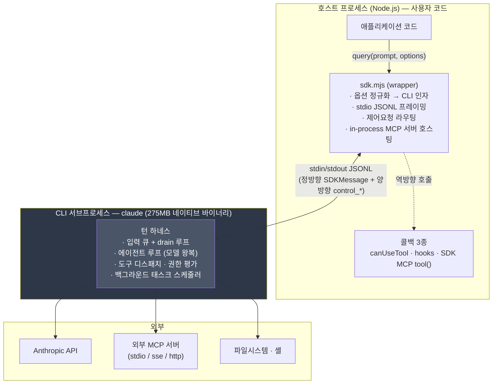

# 1. 패키지 구조와 프로세스 모델

> 근거: `app/node_modules/@anthropic-ai/claude-agent-sdk@0.3.220` 실물. 인용 표기는 `<파일>:<라인>`.

## 1.1 실물 인벤토리

`npm install` 이 푸는 것은 **두 개의 패키지**다 — wrapper 패키지 하나 + 플랫폼별 바이너리 패키지 하나(optionalDependency 8종 중 현재 플랫폼 것).

| 파일 | 크기 | 성격 | 정독 가능? |
|---|---:|---|---|
| `sdk.d.ts` | 307 KB | **타입 선언 + JSDoc** — 프로토콜·옵션·메시지 전체 계약 | ✅ **완전** |
| `sdk-tools.d.ts` | 149 KB | 도구 입출력 JSON Schema 생성물 (`json-schema-to-typescript`, `sdk-tools.d.ts:1-9`) | ✅ **완전** |
| `sdk.mjs` | 1.22 MB | 메인 엔트리 — **번들 + 미니파이** ESM 래퍼 (140줄, 최대 줄 길이 171,205자) | ⚠️ 식별자 grep 만 |
| `bridge.mjs` / `bridge.d.ts` | 1.32 MB / 13 KB | `./bridge` 서브 엔트리 | ⚠️ / ✅ |
| `browser-sdk.js` / `.d.ts` | 1.21 MB / 3.5 KB | `./browser` 서브 엔트리 | ⚠️ / ✅ |
| `extractFromBunfs.js` | 6.6 KB | `./extract` — Bun 단일파일 번들에서 바이너리 추출 | ✅ |
| `manifest.json` | 2 KB | 플랫폼 바이너리 매니페스트(버전·commit·checksum·size) | ✅ |
| `agentSdkTypes.d.ts` | 25 B | 재export stub | ✅ |

플랫폼 패키지(`@anthropic-ai/claude-agent-sdk-linux-x64@0.3.220`)는 사실상 파일 하나다:

```
claude   275,012,592 bytes  (실행 권한, 컴파일된 네이티브 바이너리)
```

`manifest.json` 이 8개 플랫폼 전부의 바이너리 이름·checksum·size 를 싣는다 — `darwin-{arm64,x64}` · `linux-{arm64,x64}` · `linux-{arm64,x64}-musl` · `win32-{x64,arm64}`. Windows 만 `claude.exe`, 나머지는 `claude`.

### 미니파이·컴파일 경계 (본 분석의 근거 한계)

`sdk.mjs` 헤더가 스스로 밝힌다:

```js
// Version: 0.3.220
// Want to see the unminified source? We're hiring!
```

즉 **래퍼는 미니파이 번들**이고 **CLI 는 275 MB 컴파일 바이너리**다. 따라서 이 분석 세트의 근거 등급은 3층으로 갈린다:

| 층 | 근거 등급 | 다루는 챕터 |
|---|---|---|
| `sdk.d.ts` / `sdk-tools.d.ts` | **1급** — 라인 인용 가능한 공식 계약 + JSDoc | 2·3·4·5·7장 |
| `sdk.mjs` | **2급** — 클래스/메서드 식별자는 살아 있어 grep 가능, 라인 번호는 무의미(140줄) | 6장 |
| `claude` 바이너리 | **3급** — 문자열만 grep 가능, 제어 흐름은 **관측 불가** | 6·7장에서 "코드에서 확인 안 됨" 표기 |

> 본 세트는 3급 구간을 추측으로 메우지 않는다. `sdk.d.ts` 의 JSDoc 은 예외적으로 상세해서(예: `sdk.d.ts:3487` 한 필드에 1,300자 규약 설명) 바이너리를 못 읽어도 **wire 규약 자체는 1급 근거로 재구성된다** — 이것이 본 분석이 성립하는 이유다.

## 1.2 버전 좌표: SDK ↔ CLI

wrapper 와 CLI 는 **별도로 버전이 매겨지고 매니페스트로 묶인다**.

| 항목 | 값 | 근거 |
|---|---|---|
| wrapper 버전 | `0.3.220` | `package.json:3` |
| CLI 버전 | `2.1.220` | `package.json` 의 `claudeCodeVersion` 필드 · `manifest.json:2` |
| CLI commit | `4073f59596e272f39393db4f96abc5f4b10eff21` | `manifest.json:3` |
| CLI buildDate | `2026-07-24T22:28:51Z` | `manifest.json:4` |
| harness 스키마 | `1` | `manifest.json` `sdkCompat.harnessSchema` |

**하위 번호가 대응한다** — wrapper `0.3.N` ↔ CLI `2.1.N`. 다만 1:1 고정은 아니다: `manifest.json` 의 `sdkCompat.testedWrapperVersions` 가 이 CLI 바이너리와 **호환 검증된 wrapper 버전 25종**을 나열한다(`0.3.181` ~ `0.3.218`). 즉 wrapper 와 CLI 는 **느슨하게 결합된 독립 릴리스 트레인**이며, 프로토콜 호환성은 버전 일치가 아니라 이 목록 + 런타임 capability 협상(2장)이 담보한다.

## 1.3 프로세스 모델 — `query()` 는 무엇을 여는가

진입점은 함수 하나다:

```ts
export declare function query(_params: {
  prompt: string | AsyncIterable<SDKUserMessage>;
  options?: Options;
}): Query;
```
— `sdk.d.ts:2587-2590`

이 시그니처가 **본 세트 전체의 전제**를 이미 담고 있다:

1. **`prompt` 가 `AsyncIterable` 을 받는다.** 문자열 하나가 아니라 *스트림* 을 받으므로, 호출자는 프로세스를 살려둔 채 입력을 나중에 더 밀어 넣을 수 있다. 이것이 "한 번 요청 → 한 번 응답" 이 아닌 **장수명 세션 채널**의 근거다.
2. **반환값이 `Promise` 가 아니라 `Query` 객체다.** `Query` 는 `AsyncGenerator<SDKMessage>` 이면서 동시에 제어 메서드(`interrupt` · `setPermissionMode` · `stopTask` · `backgroundTasks` · `close` …)를 갖는다. 즉 **출력 스트림과 제어 채널이 하나의 핸들에 얹혀 있다**.
3. **상태 비저장 API 가 아니다.** `query()` 는 HTTP 호출이 아니라 **서브프로세스를 spawn 하고 stdio 로 JSONL 을 주고받는다**.

### 3-프로세스 계층



**경계의 의미**:

- **wrapper 는 얇다.** 에이전트 루프도, 도구 구현도, 권한 규칙도 wrapper 에 없다. wrapper 가 소유하는 것은 (a) 옵션 → CLI 인자·설정 변환 (b) JSONL 프레이밍 (c) 제어요청을 호스트 콜백으로 라우팅 (d) `type:'sdk'` MCP 서버를 **호스트 프로세스 안에서** 실행하는 것 뿐이다.
- **CLI 가 하네스를 소유한다.** 모델 왕복, 도구 실행, 권한 결정, 그리고 **턴을 언제 시작하고 끝낼지**가 전부 바이너리 안에 있다. 5장의 "서버 주도 대화 재개"가 가능한 이유가 여기다 — 턴 개시 권한이 호출자가 아니라 CLI 에 있다.
- **호출자 콜백은 역방향 RPC 로만 도달한다.** `canUseTool` 은 호스트 프로세스의 함수지만 CLI 가 그것을 "호출"하려면 stdout 으로 `control_request` 를 보내고 stdin 으로 `control_response` 를 받아야 한다(2·3장).

### 바이너리 해석 경로

wrapper 는 실행할 `claude` 를 찾아야 한다. 확인된 표면:

- `Options.pathToClaudeCodeExecutable` — 호출자가 경로를 명시하면 그것을 쓴다(`sdk.mjs` 에 동일 식별자 존재).
- 미지정이면 wrapper 가 플랫폼 optionalDependency 패키지에서 해석한다. `manifest.json` 의 `platforms.<플랫폼>.binary` 가 파일명을, `checksum`/`size` 가 무결성 기대값을 준다.
- `./extract` 서브엔트리(`extractFromBunfs.js`)는 Bun 단일파일 번들 안에 SDK 가 임베드된 배포 형태에서 바이너리를 꺼내는 보조 경로다.

> **코드에서 확인 안 됨**: 해석 우선순위의 정확한 순서(PATH 탐색이 optionalDependency 보다 앞서는지), checksum 검증을 실제 런타임에 수행하는지. `sdk.mjs` 가 미니파이라 분기를 따라가지 못했다.

## 1.4 왜 "장수명 + 열린 스트림"이 이후 모든 것의 전제인가

세 가지가 이 모델에서만 성립한다.

| 능력 | 필요한 전제 | 다루는 곳 |
|---|---|---|
| 호스트 콜백(`canUseTool`·hooks·SDK MCP 도구) | CLI → 호스트 **역방향** 호출 채널이 상시 열려 있어야 한다 | 2·3장 |
| 턴 중간 입력 주입(steering) | 입력이 `AsyncIterable` 이라 프로세스 수명 내내 push 가능해야 한다 | 2장 |
| **서버 주도 턴 재개** | 턴이 끝나도 프로세스와 stdout 이 살아 있어야 CLI 가 새 턴을 밀어 넣을 수 있다 | **5장** |

세 번째가 핵심이다. 요청/응답 API 였다면 "메인 턴이 끝났다" = "연결이 끝났다" 이므로, 백그라운드 태스크 완료를 알리려면 호출자가 **다시 물어보는 수밖에**(polling) 없다. 장수명 스트림 모델에서는 턴 종료가 연결 종료와 분리되어 있어, CLI 가 **자기 판단으로 다음 턴을 열고 그 결과를 같은 스트림에 흘려보낼 수 있다**. 5장이 이 전환을 다룬다.

---

← [README](README.md) · [2장 — 제어 프로토콜과 턴 큐](02-제어-프로토콜과-턴-큐.md) →
