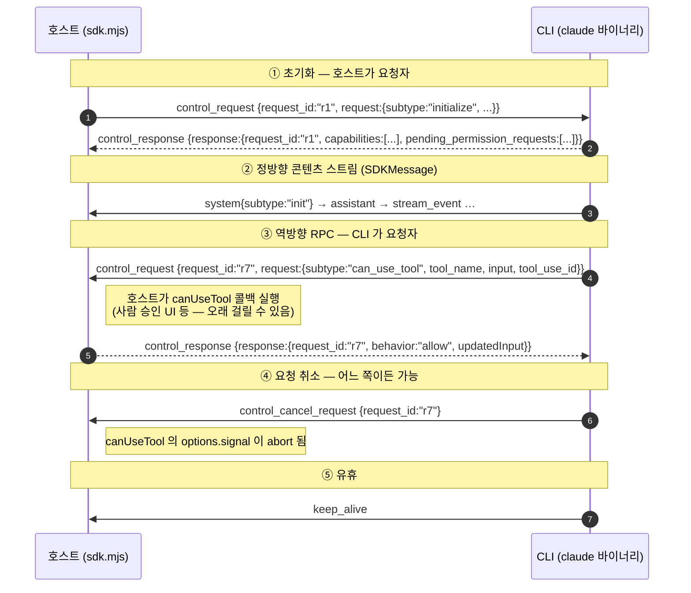
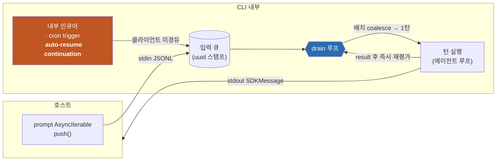

# 2. 제어 프로토콜과 턴 큐

> 근거: `sdk.d.ts` (0.3.220). tool calling(3장) · subagent(4장) · 비동기 턴 전환(5장) 이 전부 이 장의 토대 위에 선다.

## 2.1 wire 는 한 줄 = 한 JSON (JSONL), 양방향

stdout 으로 흐르는 프레임의 **전체 유니언**이 타입 하나로 못박혀 있다:

```ts
declare type StdoutMessage =
    coreTypes.SDKMessage
  | coreTypes.SDKActiveGoalMessage
  | SDKControlResponse
  | SDKControlRequest
  | SDKControlCancelRequest
  | SDKKeepAliveMessage;
```
— `sdk.d.ts:6762`

여기서 읽어야 할 사실은 **`control_request` 가 stdout 유니언에 들어 있다**는 것이다. 즉 제어 채널은 호스트→CLI 단방향이 아니라 **양쪽 다 요청자가 될 수 있는 대칭 채널**이다. CLI 가 호스트에게 무언가를 물어보는 경로(권한·훅·SDK MCP 도구 실행)가 여기서 나온다.

### 프레임 5종

| `type` | 방향 | 역할 | 근거 |
|---|---|---|---|
| *(SDKMessage 계열)* | CLI → 호스트 | 대화 콘텐츠 스트림 — `assistant`·`user`·`system`·`stream_event`·`result` | `sdk.d.ts:4019` |
| `control_request` | **양방향** | RPC 요청 (`request_id` + `request` 내부 유니언) | `sdk.d.ts:3723-3727` |
| `control_response` | **양방향** | RPC 응답 (`ControlResponse \| ControlErrorResponse`) | `sdk.d.ts:3766-3769` |
| `control_cancel_request` | **양방향** | 진행 중 요청 취소 (`request_id` 만) | `sdk.d.ts` `SDKControlCancelRequest` |
| `keep_alive` | CLI → 호스트 | `{ type: 'keep_alive' }` — 필드 없음, 유휴 스트림 유지용 | `sdk.d.ts` `SDKKeepAliveMessage` |

`keep_alive` 의 존재 자체가 방증이다: **턴 사이 유휴 구간에도 스트림이 살아 있어야 한다**는 설계 의도. 요청/응답 모델이라면 필요 없는 프레임이다.

### RPC 상관 규약



- `request_id` 하나당 **응답은 정확히 하나**. `sdk.d.ts:3504` 는 `mcp_call` 규약에서 이를 명시한다 — *"a redelivered request_id supersedes the in-flight run (it is aborted and its response suppressed — exactly one response per request_id)"*.
- 취소는 별도 프레임(`control_cancel_request`)이며 **응답을 대체하지 않는다**. `canUseTool` 콜백이 `options.signal` 을 받는 이유가 이것이다(3장).
- 응답을 아예 보내지 않는 것은 **버그가 아니라 상태 고착**이다. `sdk.d.ts:201-203` 이 경고한다: *"accidental null means no control_response is sent and the tool stays [pending]"*.

## 2.2 호스트 → CLI 요청 (36종)

`SDKControlRequestInner` 유니언이 36개 subtype 을 나열한다(`sdk.d.ts:3729`). 성격별로 묶으면:

| 묶음 | subtype (발췌) | 성격 |
|---|---|---|
| 세션 수명 | `initialize` · `interrupt` | 핸드셰이크 / 턴 중단 |
| 런타임 설정 | `set_permission_mode` · `set_model` · `set_max_thinking_tokens` · `set_color` · `rename_session` · `apply_flag_settings` · `get_settings` | 세션 중 변경 |
| **태스크 제어** | **`stop_task`** · **`background_tasks`** | 5장의 핵심 |
| MCP | `mcp_status` · `mcp_call` · `mcp_message` · `mcp_set_servers` · `mcp_reconnect` · `mcp_toggle` | 3장 |
| 조회 | `get_context_usage` · `get_session_cost` · `list_models` · `get_usage` · `get_binary_version` · `get_plan` · `get_workspace_diff` | 텔레메트리 |
| 파일/워크스페이스 | `read_file` · `rewind_files` · `seed_read_state` · `register_repo_root` · `file_suggestions` | — |
| 확장 재적재 | `reload_plugins` · `reload_skills` | — |
| **역방향(CLI가 요청자)** | **`can_use_tool`** · **`hook_callback`** · `elicitation` · `request_user_dialog` | 3장 |
| 큐 제어 | `cancel_async_message` | 2.3절 |

`Query` 인터페이스의 메서드가 이 subtype 들의 타입 안전 래퍼다 — `interrupt()`(`sdk.d.ts:2293`) · `setPermissionMode()`(`:2300`) · `stopTask()`(`:2562`) · `backgroundTasks()`(`:2575`) · `streamInput()` · `close()`.

### capability 협상 — 버전 스니핑 대신

`initialize` 응답이 `capabilities?: string[]` 를 싣는다:

> *"Protocol capabilities this CLI supports, so SDK consumers can **feature-detect instead of version-sniffing**. Open set — ignore unknown values… `'interrupt_receipt_v1'` = the interrupt control_response success payload carries `still_queued`… `'interrupt_cancel_queued_v1'` = the interrupt control_request honors `cancel_queued:true`… **Absent on older CLIs**."*
> — `sdk.d.ts:4447` (`SDKSystemMessage` init)

wrapper 와 CLI 가 독립 릴리스 트레인이므로(1.2절) 프로토콜 호환은 **버전 비교가 아니라 capability 문자열 검사**로 한다는 설계 결정이다.

### 재접속 복원

`initialize` 응답은 진행 중이던 역방향 요청을 되돌려준다:

- `pending_permission_requests?: SDKControlRequest[]` (`sdk.d.ts:286`)
- `pending_user_dialog_requests?: SDKControlRequest[]` (`sdk.d.ts:290`) — *"Sent on the `initialize` response … so a client joining an already-initialized session can **re-arm in-flight dialogs**. Receivers must tolerate the same request_id also arriving as a live or replayed control_request frame and **render it once**."*

즉 세션은 클라이언트보다 오래 살 수 있고, 미응답 권한 요청은 재접속 시 재무장된다. **중복 배달을 클라이언트가 멱등 처리해야 한다**는 요구가 명시되어 있다.

## 2.3 입력 큐와 drain 루프 — 5장의 기반

`query()` 의 `prompt` 가 `AsyncIterable` 이라는 것(1.3절)은 **CLI 쪽에 입력 큐가 있다**는 뜻이다. 호스트가 push 한 메시지는 즉시 턴이 되지 않고 큐에 들어가며, **drain 루프**가 큐에서 꺼내 턴을 연다.

이 구조가 가장 선명하게 드러나는 곳은 `interrupt` 응답의 `still_queued` 필드 설명이다 — 본 세트에서 가장 정보 밀도가 높은 JSDoc 한 덩어리다(`sdk.d.ts:3487`):

> *"Uuids of async user messages that survive this interrupt: **commands still in the queue**, plus any **batch already dequeued for the imminent turn** but not yet reachable by the abort. … Cancellation granularity: uuids still in the queue are individually cancellable via `cancel_async_message`; **once a batch is dequeued and coalesced into one turn**, cancelling a NON-representative member uuid is a no-op (its content still runs), while cancelling the batch-representative uuid drops the WHOLE coalesced batch. … the list may include **internally-enqueued uuids the client never sent (cron triggers, auto-resume continuations)** — ignore unknown uuids rather than treating them as an error. … Snapshot is taken synchronously with abort processing — probing the queue after the interrupted result instead always loses the race against **the drain loop, which starts the next queued turn immediately**."*

여기서 확정되는 것 4가지:

1. **큐가 존재한다.** 입력은 "전송 = 즉시 실행" 이 아니라 큐잉된다.
2. **배치 coalescing 이 있다.** drain 루프는 큐에서 **여러 메시지를 한 턴으로 합친다**. 그래서 취소 단위가 개별 uuid 가 아니라 "배치 대표 uuid" 다.
3. **drain 루프는 즉시 다음 턴을 연다.** 턴이 끝나고 큐에 뭔가 있으면 **호출자 개입 없이** 다음 턴이 시작된다.
4. **★ 클라이언트가 보내지 않은 항목이 큐에 들어온다.** 명시된 예가 두 개 — **cron triggers** 와 **auto-resume continuations**. 후자가 5장의 정체다: 백그라운드 태스크 완료 알림이 CLI **내부에서** 큐에 주입되고, drain 루프가 그것을 새 턴으로 연다.



**설계상의 함의**: 턴을 여는 권한이 호출자에게 없다. 호출자는 큐에 넣을 뿐이고, *언제 몇 개를 묶어 턴으로 만들지* 는 drain 루프가 정한다. 그래서 5장의 "서버 주도 대화 재개"는 새 메커니즘이 아니라 **이미 있던 큐/drain 구조에 내부 인큐어를 하나 더 붙인 것**이다.

## 2.4 관측 신호: edge 와 level

CLI 는 같은 사실을 **두 가지 신호 형태**로 내보낸다. 이 구분이 소비자 구현의 정확도를 가른다.

`SDKBackgroundTasksChangedMessage` 의 JSDoc(`sdk.d.ts:2913`):

> *"The full set of live background tasks, emitted whenever membership changes… **A level signal, unlike the `task_started`/`task_notification` edge bookends**: consumers that only need 'is background work running' should **replace their set with each payload rather than pairing edges**, so a missed bookend cannot wedge a stale running indicator. Ordering relative to the bookends for the same transition is **unspecified**… the payload carries **ids only**, so do not correlate it with the edge stream. The level is **per-process**: nothing is emitted at startup, so consumers must **reset to the empty set whenever the session's CLI process (re)starts**."*

| 신호 | 형태 | 쓰임 | 함정 |
|---|---|---|---|
| `task_started` / `task_notification` | **edge**(시작/종료 북엔드) | 개별 태스크의 라이프사이클 추적 | 하나 놓치면 "실행 중" 표시가 영구 고착 |
| `background_tasks_changed` | **level**(전체 집합 스냅샷) | "백그라운드 작업이 도는가" 불린 | 순서 미보장 · id 만 실림 · 프로세스 재시작 시 리셋 필요 |
| `task_progress` | edge(중간) | 진행 텔레메트리 | — |

이는 하드웨어 인터럽트 설계의 edge-triggered vs level-triggered 와 같은 문제다. **엣지 유실이 상태를 고착시킬 수 있는 곳에는 레벨 신호를 병행 제공**한다는 것이 이 프로토콜의 방어 설계다.

---

← [1장 — 패키지 구조와 프로세스 모델](01-패키지-구조와-프로세스-모델.md) · [3장 — tool calling 규약](03-tool-calling-규약.md) →
