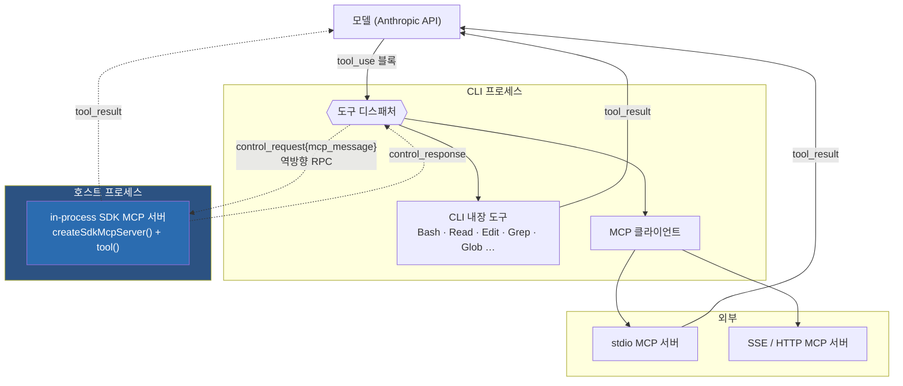
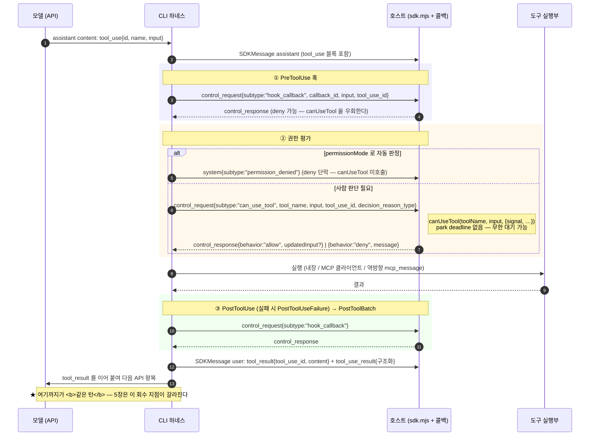

# 3. tool calling 규약 (동기 기준선)

> 이 장은 **동기 도구 호출**을 다룬다 — 모델이 `tool_use` 를 내면 같은 턴 안에서 `tool_result` 로 회수되는 경로. 5장의 비동기 전환은 이 기준선에서 갈라져 나온 **변형**이므로, 먼저 여기를 확정한다.
>
> 근거: `sdk.d.ts` · `sdk-tools.d.ts` (0.3.220).

## 3.1 블록 shape — `tool_use` / `tool_result`

wire 형태는 Anthropic Messages API 의 content block 을 그대로 따른다. SDK 가 덧붙이는 것은 **부모 상관 필드** 하나다.

`SDKAssistantMessage` · `SDKUserMessage` 양쪽에 공통으로 실린다:

```ts
parent_tool_use_id: string | null;
```
— `sdk.d.ts:2857` (assistant) · `sdk.d.ts:4153` (user)

| 값 | 의미 |
|---|---|
| `null` | 메인 스레드의 메시지 |
| `"toolu_…"` | **서브에이전트 내부**에서 발생한 메시지. 값은 그 서브에이전트를 띄운 부모 `Agent` tool_use 블록의 id (4장) |

즉 부모/자식 대화가 **같은 하나의 스트림에 인터리브되어** 흐르고, 소비자는 `parent_tool_use_id` 로 갈라 읽는다. 별도 채널이 아니다.

### 구조화 출력의 별도 경로 — `tool_use_result`

도구 결과는 **두 군데**에 실린다:

| 위치 | 내용 | 대상 |
|---|---|---|
| `message.content[].tool_result.content` | 모델에게 보낼 **텍스트** | 모델 |
| 메시지의 별도 필드 `tool_use_result` | **구조화 객체** (`ToolOutputSchemas` 유니언) | SDK 소비자 |

`sdk-tools.d.ts:56-90` 의 `ToolOutputSchemas` 유니언이 그 구조화 타입 카탈로그다 — `AgentOutput` · `BashOutput` · `FileReadOutput` · `GrepOutput` … 31종.

**이 이중 경로가 5장에서 결정적이 된다.** 백그라운드 런치 영수증의 `status: "async_launched"` 는 wire `content` 텍스트가 아니라 **`tool_use_result` 쪽에만** 구조화되어 오기 때문에, `content` 만 읽는 소비자는 "실행 중"과 "완료"를 구분하지 못한다.

## 3.2 도구 3계열 — 등록과 디스패치 경로가 다르다

| 계열 | 어디서 실행되나 | 등록 방법 | 호출 경로 |
|---|---|---|---|
| **CLI 내장** | CLI 프로세스 | 기본 제공 | 바이너리 내부 직결 |
| **외부 MCP** | 별도 프로세스/원격 | `McpStdioServerConfig` · `McpSSEServerConfig` · `McpHttpServerConfig` | CLI → MCP 클라이언트 → 서버 |
| **in-process SDK MCP** | **호스트 프로세스** | `createSdkMcpServer()` + `tool()` | CLI → `control_request{mcp_message}` → 호스트 |

`McpServerConfig` 유니언(`sdk.d.ts:1068`)이 넷을 묶는다. 세 번째가 구조적으로 특이하다:

```ts
export declare type McpSdkServerConfig = {
    type: 'sdk';
    name: string;
};
/** MCP SDK server config with an actual McpServer instance.
 *  Not serializable - contains a live McpServer object. */
export declare type McpSdkServerConfigWithInstance = McpSdkServerConfig & { … };
```
— `sdk.d.ts:1052-1063`

**"Not serializable"** 이 핵심이다. `type:'sdk'` 서버는 CLI 로 넘길 수 없다 — 살아 있는 객체가 호스트 프로세스에 있기 때문이다. 그래서 CLI 가 이 도구를 실행하려면 **역방향 `control_request` 로 호스트에 되물어야** 한다. `sdk.d.ts:3504` 의 `mcp_call` 설명이 이 비대칭을 명시한다:

> *"SDK-type MCP servers (`config.type === "sdk"`) are **rejected** — they are caller-provided, so **the caller can invoke them directly** without the subprocess round-trip."*

정의 API 는 두 개다 — `createSdkMcpServer()`(`sdk.d.ts:482`) 와 zod 스키마 기반 `tool()`(`sdk.d.ts:6940`).



## 3.3 `canUseTool` — 제어 프로토콜 왕복

권한 게이트는 호스트 콜백이지만 **물리적으로는 CLI 발 역방향 RPC** 다.

### CLI → 호스트: `can_use_tool`

```ts
declare type SDKControlPermissionRequest = {
    subtype: 'can_use_tool';
    tool_name: string;
    input: Record<string, unknown>;
    permission_suggestions?: PermissionUpdate[];
    blocked_path?: string;
    decision_reason?: string;
    decision_reason_type?: 'rule' | 'mode' | 'subcommandResults' | 'permissionPromptTool'
                         | 'hook' | 'asyncAgent' | 'sandboxOverride' | 'workingDir'
                         | 'safetyCheck' | 'classifier' | 'other';
    classifier_approvable?: boolean;
    suppress_always_allow_rule?: boolean;
    matched_ask_rule?: { source: string; tool_name: string; rule_content?: string };
    title?: string;
    display_name?: string;
    tool_use_id: string;
    agent_id?: string;
    description?: string;
    requires_user_interaction?: boolean;
};
```
— `sdk.d.ts:3597-3634`

주목할 필드:

- **`decision_reason_type`** — *왜* 승인이 필요해졌는지의 구조화 판별자. JSDoc: *"Lets SDK hosts make policy (e.g. auto-deny safetyCheck) **without parsing decision_reason text**."* 값 중 **`asyncAgent`** 가 있다는 사실 자체가 비동기 에이전트 경로에 고유한 권한 판정이 존재함을 알려준다(5장).
- **`agent_id`** — 서브에이전트 내부에서 난 요청의 라우팅 키.
- **`decision_reason`** — *"May carry ANSI escapes; **sanitize before rendering**."* 즉 렌더 unsafe.
- **`requires_user_interaction`** — 원탭 Approve/Deny 를 제공하면 안 되는 경우(도구의 승인 카드 자체가 상호작용 표면인 경우).

### 호스트 콜백 시그니처

```ts
export declare type CanUseTool = (
  toolName: string,
  input: Record<string, unknown>,
  options: {
    signal: AbortSignal;
    suggestions?: PermissionUpdate[];
    blockedPath?: string;
    decisionReason?: string;
    title?: string;
    displayName?: string;
    …
  }
) => Promise<PermissionResult | null>;
```
— `sdk.d.ts:206-235`

**`signal` 을 무시하면 안 된다.** CLI 가 `control_cancel_request` 로 이 권한 요청을 취소하면 signal 이 abort 되는데, 콜백이 그것을 안 보면 영영 await 에 걸린다.

**`null` 반환은 위험한 탈출구다.** JSDoc(`sdk.d.ts:196-205`):

> *"Return `null` ONLY after the consumer has already sent the `control_response` **out-of-band**… **Fail-closed**: an accidental null means no control_response is sent and the tool stays **blocked indefinitely** — permission prompts have **no park deadline**."*

타임아웃이 없다는 설계 결정이다. 사람의 승인을 무한정 기다린다.

### 호스트 → CLI: `PermissionResult`

```ts
export declare type PermissionResult =
  | { behavior: 'allow';
      updatedInput?: Record<string, unknown>;
      updatedPermissions?: PermissionUpdate[];
      toolUseID?: string;
      decisionClassification?: PermissionDecisionClassification; }
  | { behavior: 'deny';
      message: string;
      interrupt?: boolean;
      toolUseID?: string;
      decisionClassification?: PermissionDecisionClassification; };
```
— `sdk.d.ts:2114-2126`

| 필드 | 의미 |
|---|---|
| `allow.updatedInput` | **입력을 고쳐서 통과**시킬 수 있다 — 호스트가 인자를 재작성하는 훅 지점 |
| `allow.updatedPermissions` | "항상 허용" 을 세션 규칙으로 승격 (`PermissionUpdate` 6종 — `addRules`/`replaceRules`/`removeRules`/`setMode`/`addDirectories`/`removeDirectories`, `sdk.d.ts:2133-2160`) |
| `deny.message` | **모델에게 전달되는 거부 사유** — 모델은 이걸 읽고 다른 경로를 모색한다 |
| `deny.interrupt` | 거부를 넘어 턴 자체를 중단 |

### `permissionMode` 와의 관계

```ts
export declare type PermissionMode =
  'default' | 'acceptEdits' | 'bypassPermissions' | 'plan' | 'dontAsk' | 'auto';
```
— `sdk.d.ts:2092`

모드는 **`can_use_tool` 이 발화할지 여부를 CLI 쪽에서 먼저 거른다**. 모드에 걸려 자동 거부되면 `canUseTool` 은 호출되지 않고, 대신 별도 이벤트가 온다:

> *"Emitted when a tool call is **auto-denied without an interactive permission prompt** (e.g. auto-mode classifier, `dontAsk` mode, headless-agent auto-deny, or a deny rule). The 'ask' path surfaces via a `can_use_tool` control_request; **this event covers the 'deny' short-circuit** in canUseTool so SDK hosts can render the denial instead of only seeing an `is_error` tool_result. **PreToolUse hook denies bypass canUseTool and are not covered here.**"*
> — `SDKPermissionDeniedMessage`, `sdk.d.ts:4166`

여기서 **평가 순서**가 드러난다.

## 3.4 hook 개입 지점

훅도 역방향 RPC 다:

```ts
declare type SDKHookCallbackRequest = {
    subtype: 'hook_callback';
    callback_id: string;
    input: coreTypes.HookInput;
    tool_use_id?: string;
};
```
— `sdk.d.ts:3894-3899`

`HookEvent` 는 **31종**(`sdk.d.ts:835`):

```
PreToolUse · PostToolUse · PostToolUseFailure · PostToolBatch · Notification
UserPromptSubmit · UserPromptExpansion · SessionStart · SessionEnd · Stop · StopFailure
SubagentStart · SubagentStop · PreCompact · PostCompact · PermissionRequest · PermissionDenied
Setup · TeammateIdle · TaskCreated · TaskCompleted · Elicitation · ElicitationResult
ConfigChange · WorktreeCreate · WorktreeRemove · InstructionsLoaded · CwdChanged
FileChanged · DirectoryAdded · MessageDisplay
```

도구/에이전트 수명에 걸리는 것만 추리면: `PreToolUse` → (권한) → 실행 → `PostToolUse` / `PostToolUseFailure` → `PostToolBatch`. 서브에이전트는 `SubagentStart` / `SubagentStop`, 태스크는 `TaskCreated` / `TaskCompleted` 를 별도로 갖는다 — **4·5장의 라이프사이클에 훅 대응물이 있다**는 뜻.

### 동기 도구 1회 호출 — 전 구간 시퀀스



## 3.5 평가 순서 (근거로 확정되는 부분만)

`sdk.d.ts:4166` 의 서술에서 **부분 순서**가 확정된다:

1. **`PreToolUse` 훅** — deny 하면 **`canUseTool` 을 아예 우회**한다("PreToolUse hook denies bypass canUseTool").
2. **규칙/모드 평가** — deny rule · `dontAsk` · auto-mode classifier 등에 걸리면 **단락**되어 `canUseTool` 미호출, `SDKPermissionDeniedMessage` 만 발화.
3. **`canUseTool`** — 위 둘을 통과하고 *ask* 로 escalate 된 경우에만 호출.
4. 실행 → `PostToolUse`.

> **코드에서 확인 안 됨**: 규칙과 모드 사이의 세부 우선순위(예: allow rule 이 `plan` 모드를 이기는지), `permissionPromptTool` 경로가 `canUseTool` 과 어떻게 배타적인지. `decision_reason_type` 유니언이 판정자 종류를 열거하지만 그들 사이의 순서는 타입 선언에 없고, 판정 로직은 CLI 바이너리 안에 있다.

---

← [2장 — 제어 프로토콜과 턴 큐](02-제어-프로토콜과-턴-큐.md) · [4장 — subagent 호출 규약](04-subagent-호출-규약.md) →
