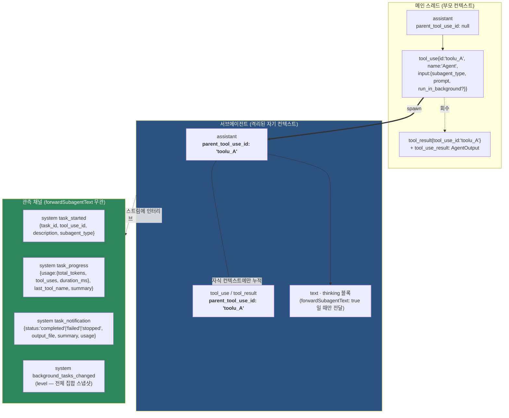

# 4. subagent 호출 규약

> 근거: `sdk-tools.d.ts` (도구 스키마) · `sdk.d.ts` (정의·메시지 타입), 0.3.220.
> 이 장은 **정의 · 호출 스키마 · 컨텍스트 격리 · 관측 채널**까지 다룬다. 백그라운드 전환과 턴 라이프사이클은 [5장](05-비동기-턴-전환-listen-모델.md).

## 4.1 호출 도구 이름 — 0.3.220 기준

**정본은 `Agent`** 다. 근거는 타입 선언의 명명과 JSDoc 양쪽:

| 근거 | 표기 |
|---|---|
| 입력 스키마 타입 이름 | `AgentInput` (`sdk-tools.d.ts:484`) |
| 출력 스키마 타입 이름 | `AgentOutput` (`sdk-tools.d.ts:99`) |
| `AgentDefinition` JSDoc | *"Definition for a custom subagent that can be invoked via the **Agent tool**."* (`sdk.d.ts:35-37`) |
| `Options.agents` JSDoc | *"Programmatically define custom subagents that can be invoked via the **Agent tool**."* (`sdk.d.ts:1352-1353`) |

동시에 **`Task` 표기가 같은 파일에 잔존**한다:

| 잔존 위치 | 표기 |
|---|---|
| `AgentInfo` JSDoc | *"Information about an available subagent that can be invoked via the **Task tool**."* (`sdk.d.ts:101-103`) |
| `SDKTaskStartedMessage.subagent_type` | *"Subagent type for **Task tool** subagents."* (`sdk.d.ts:4505`) |
| `SDKTaskProgressMessage.subagent_type` | 동일 문구 (`sdk.d.ts:4483`) |

**판정**: 0.3.220 에서 도구/정의 API 의 1급 명칭은 `Agent` 이고, `Task` 는 (a) 구 명칭이 남은 JSDoc 과 (b) `task_*` 이벤트 계열의 이름에 살아 있다. 이벤트 이름은 `task_started`/`task_progress`/`task_notification` 으로 **`task_` 접두사가 정본**이며 도구 이름과 별개 어휘다 — 태스크는 서브에이전트보다 넓은 개념이기 때문이다(`task_type` 필드에 `local_workflow` 같은 값이 온다, `sdk.d.ts:4509-4513`).

> **코드에서 확인 안 됨**: 모델에게 실제로 노출되는 wire 도구 이름 문자열이 `Agent` 단독인지 `Task` 별칭을 함께 받는지. CLI 바이너리(275 MB)에서 도구 설명 문자열(`"Launch a new agent to handle complex, multi-step tasks."`)은 grep 되지만 이름 바인딩 지점은 컴파일되어 있어 확정하지 못했다. 두 이름을 모두 수용하는 소비자 구현이 안전하다.

## 4.2 서브에이전트 정의 — `AgentDefinition`

`Options.agents?: Record<string, AgentDefinition>` (`sdk.d.ts:1367`) — 키가 에이전트 타입 이름, 값이 정의다.

| 필드 | 타입 | 의미 |
|---|---|---|
| `description` | `string` | **언제 이 에이전트를 쓸지**의 자연어 설명 — 모델의 선택 근거 |
| `prompt` | `string` | 에이전트의 시스템 프롬프트 |
| `tools?` | `string[]` | 허용 도구 화이트리스트. **생략 시 부모의 모든 도구 상속** |
| `disallowedTools?` | `string[]` | 블랙리스트. MCP 는 서버 단위 지정 가능(`mcp__server`·`mcp__server__*`·`mcp__*`) |
| `model?` | `string` | 별칭(`fable`·`opus`·`sonnet`·`haiku`) 또는 전체 ID. 생략/`'inherit'` 이면 메인 모델 |
| `mcpServers?` | `AgentMcpServerSpec[]` | 이 에이전트 전용 MCP |
| `skills?` | `string[]` | 컨텍스트에 미리 적재할 스킬 |
| `initialPrompt?` | `string` | 이 에이전트가 **메인 스레드 에이전트일 때** 첫 유저 턴으로 자동 제출 |
| `maxTurns?` | `number` | API 왕복 상한 |
| **`background?`** | `boolean` | *"Run this agent as a **background task (non-blocking, fire-and-forget)** when invoked"* — **정의 레벨의 백그라운드 고정**(5장) |
| `memory?` | `'user'\|'project'\|'local'` | 에이전트 메모리 파일 자동 적재 스코프 |
| `effort?` | 레벨 또는 정수 | 추론 강도 |
| `permissionMode?` | `PermissionMode` | 이 에이전트의 권한 모드 |
| `observer?` | `string` | **이 에이전트가 돌 때 자동 spawn 되는 백그라운드 관찰자** 에이전트 타입. 읽기전용 활동 다이제스트를 받아 `ObserverReport` 도구로 보고하며 *"never participates in the task"* |
| `observerMessage?` | `string` | 관찰자에게 가는 다이제스트의 보충 postamble |
| `criticalSystemReminder_EXPERIMENTAL?` | `string` | 실험적 — 시스템 프롬프트에 붙는 강조 리마인더 |

— `sdk.d.ts:38-102`

주목: **`background`(정의 레벨)와 `run_in_background`(호출 레벨)가 별개 표면**이다. 그리고 `observer` 는 *에이전트가 에이전트를 자동으로 낳는* 3자 구조를 만든다 — 사용자가 요청하지 않은 백그라운드 태스크가 존재할 수 있다는 뜻이고, 이는 2.4절의 level 신호(`background_tasks_changed`)가 필요한 이유 중 하나다.

읽기 전용 카탈로그 타입도 있다 — `AgentInfo { name, description, model? }` (`sdk.d.ts:99-113`), 사용 가능한 에이전트 목록 조회용.

## 4.3 호출 스키마 — `AgentInput`

```ts
export interface AgentInput {
  /** A short (3-5 word) description of the task */
  description: string;
  /** The task for the agent to perform */
  prompt: string;
  /** The type of specialized agent to use for this task */
  subagent_type?: string;
  /** Optional model override … Ignored for subagent_type: "fork" — forks always inherit the parent model. */
  model?: "sonnet" | "opus" | "haiku" | "fable";
  /** Agents run in the background by default; you will be notified when one completes.
   *  Set to false to run this agent synchronously when you need its result before continuing. */
  run_in_background?: boolean;
  /** Name for the spawned agent. Makes it addressable via SendMessage({to: name}) while running. */
  name?: string;
  /** Deprecated; ignored. The session has a single implicit team. */
  team_name?: string;
  /** Deprecated; ignored. Subagents inherit the parent session's permission mode;
   *  agent-definition frontmatter may override it. */
  mode?: "acceptEdits" | "auto" | "bypassPermissions" | "default" | "dontAsk" | "plan";
  /** Isolation mode. "worktree" creates a temporary git worktree …
   *  "remote" launches the agent in a remote cloud environment (always runs in background; availability is gated). */
  isolation?: "worktree" | "remote";
}
```
— `sdk-tools.d.ts:484-521`

| 필드 | 규약상 의미 |
|---|---|
| `subagent_type` | `Options.agents` 의 키 또는 내장 타입. **`"fork"` 는 특수값** — 모델 오버라이드를 무시하고 부모 모델을 상속 |
| **`run_in_background`** | **기본 true** (5장의 축) |
| `name` | 실행 중인 에이전트를 `SendMessage({to: name})` 로 **주소 지정 가능**하게 만든다 — 부모↔자식 메시지 채널 |
| `isolation: "worktree"` | 임시 git worktree 에서 격리 실행 |
| `isolation: "remote"` | 원격 클라우드 실행 — **"always runs in background"**, 게이트됨 |
| `mode` · `team_name` | **deprecated, 무시됨.** 서브에이전트는 부모 세션의 권한 모드를 상속하고, 에이전트 정의 frontmatter 만 오버라이드 가능 |

`mode` 가 deprecated 라는 사실은 보안상 중요하다 — **호출 시점에 모델이 권한 모드를 올릴 수 없다**. 권한 상승은 정의(신뢰된 구성)에서만 가능하다.

## 4.4 결과 스키마 — `AgentOutput` 3-variant

```ts
export type AgentOutput =
  | { status: "completed";   … }   // 동기 완료
  | { status: "async_launched"; … }   // 백그라운드 런치 영수증 → 5장
  | { status: "remote_launched"; … }; // 원격 런치 영수증
```
— `sdk-tools.d.ts:99-200`

### `completed` — 동기 실행의 결과

```ts
{
  agentId: string;
  agentType?: string;
  content: { type: "text"; text: string; citations?: unknown[] | null }[];
  resolvedModel?: string;
  modelsUsed?: string[];          // 길이>1 이면 중간 모델 스왑 발생
  totalToolUseCount: number;
  totalDurationMs: number;
  totalTokens: number;
  usage: { input_tokens; output_tokens; cache_creation_input_tokens; cache_read_input_tokens;
           server_tool_use: { web_search_requests; web_fetch_requests } | null;
           service_tier; cache_creation: { ephemeral_1h_input_tokens; ephemeral_5m_input_tokens } | null;
           inference_geo?; speed?; iterations? };
  toolStats?: { readCount; searchCount; bashCount; editFileCount;
                linesAdded; linesRemoved; otherToolCount; frameCount? };
  status: "completed";
  prompt: string;
  worktreePath?: string; worktreeBranch?: string;
}
```
— `sdk-tools.d.ts:100-145`

**동기 완료 결과만이 실제 산출물(`content`)과 전체 회계(`usage`·`toolStats`)를 담는다.** 백그라운드 런치 영수증에는 이것이 없다 — 아직 아무것도 끝나지 않았기 때문이다. 이 비대칭이 5장의 출발점이다.

## 4.5 컨텍스트 격리와 관측 채널

서브에이전트는 **자기 컨텍스트 윈도우**를 갖는다. 부모는 자식의 전체 대화를 자기 컨텍스트에 싣지 않고, 최종 결과(`content`)만 `tool_result` 로 회수한다 — 이것이 서브에이전트의 존재 이유(컨텍스트 절약)다.

그런데 **소비자(SDK 호스트)** 는 자식 대화를 보고 싶을 수 있다. 그래서 별도 옵션이 있다:

```ts
/**
 * Forward subagent text and thinking blocks as assistant/user messages with
 * `parent_tool_use_id` set. By default, only tool_use/tool_result blocks from
 * subagents are emitted (enough for a heartbeat counter). When true, the full
 * subagent conversation is forwarded so consumers can render a nested transcript.
 * @default false
 */
forwardSubagentText?: boolean;
```
— `sdk.d.ts:1631-1638`

| `forwardSubagentText` | 소비자가 받는 것 |
|---|---|
| `false` (기본) | 자식의 `tool_use`/`tool_result` 블록만 — *"enough for a heartbeat counter"* |
| `true` | 자식의 **text·thinking 포함 전체 대화** |

**중요**: 이 옵션은 *모델의* 컨텍스트가 아니라 *소비자의* 스트림 가시성만 바꾼다. 격리는 그대로다.

세 관측 채널을 정리하면:

| 채널 | 무엇을 주나 | `forwardSubagentText` 의존 |
|---|---|---|
| `parent_tool_use_id` 붙은 assistant/user 메시지 | 자식 대화 콘텐츠 | ✅ (text/thinking 은 true 필요) |
| `system` `task_started`/`task_progress`/`task_notification` | 라이프사이클 + 텔레메트리(시간·토큰·도구수) | ❌ **무관하게 온다** |
| `system` `background_tasks_changed` | 살아 있는 백그라운드 태스크 **전체 집합**(level, 2.4절) | ❌ |



## 4.6 태스크 라이프사이클 메시지 필드

```ts
SDKTaskStartedMessage = {
  type: 'system'; subtype: 'task_started';
  task_id: string; tool_use_id?: string;
  description: string;
  subagent_type?: string;          // Task tool 서브에이전트일 때
  task_type?: string;              // 예: 'local_workflow'
  workflow_name?: string;          // task_type === 'local_workflow' 일 때만
  prompt?: string;
  skip_transcript?: boolean;       // ambient/housekeeping — 인라인 트랜스크립트에서 숨길 것
  uuid: UUID; session_id: string;
};
```
— `sdk.d.ts:4498-4520`

```ts
SDKTaskProgressMessage = {
  type: 'system'; subtype: 'task_progress';
  task_id: string; tool_use_id?: string;
  description: string; subagent_type?: string;
  usage: { total_tokens: number; tool_uses: number; duration_ms: number };
  last_tool_name?: string;         // 지금 무슨 도구를 쓰고 있는지
  summary?: string;
  uuid: UUID; session_id: string;
};
```
— `sdk.d.ts:4476-4496`

```ts
SDKTaskNotificationMessage = {
  type: 'system'; subtype: 'task_notification';
  task_id: string; tool_use_id?: string;
  status: 'completed' | 'failed' | 'stopped';   // ← 권위 정착
  output_file: string;
  summary: string;
  usage?: { total_tokens: number; tool_uses: number; duration_ms: number };
  skip_transcript?: boolean;
  uuid: UUID; session_id: string;
};
```
— `sdk.d.ts:4458-4474`

추가로 `SDKTaskUpdatedMessage`(`subtype:'task_updated'`)가 부분 패치를 보낸다 — *"Wire-safe subset of TaskState fields that changed. Excludes abortController, messages, result. **Clients merge into their local task map.**"* (`sdk.d.ts:4522-4534`). 상태값은 `'pending'|'running'|'completed'|'failed'|'killed'|'paused'`.

**`tool_use_id` 가 상관 키다.** `task_*` 이벤트를 부모의 어느 `Agent` tool_use 블록에 붙일지가 이 필드로 결정된다. `skip_transcript` 는 사용자에게 보이면 안 되는 ambient 태스크(예: 4.2절의 `observer`)를 걸러내는 플래그다.

## 4.7 태스크 제어 API

`Query` 인터페이스가 서브에이전트/태스크를 직접 제어하는 메서드 두 개를 노출한다:

```ts
/** Stop a running task. A task_notification with status 'stopped' will be emitted.
 *  @param taskId - The task ID from task_notification events */
stopTask(taskId: string): Promise<void>;
```
— `sdk.d.ts:2559-2562`

```ts
/** Background in-flight foreground tasks (Bash commands and subagents). … */
backgroundTasks(toolUseId?: string): Promise<boolean>;
```
— `sdk.d.ts:2563-2575` (5장에서 상세)

모델 쪽에도 대응 도구가 있다 — `TaskStopInput`(`sdk-tools.d.ts` `ToolInputSchemas` 유니언) · `TaskOutputInput` (5.5절).

---

← [3장 — tool calling 규약](03-tool-calling-규약.md) · [★ 5장 — 비동기 턴 전환 (listen 모델)](05-비동기-턴-전환-listen-모델.md) →
