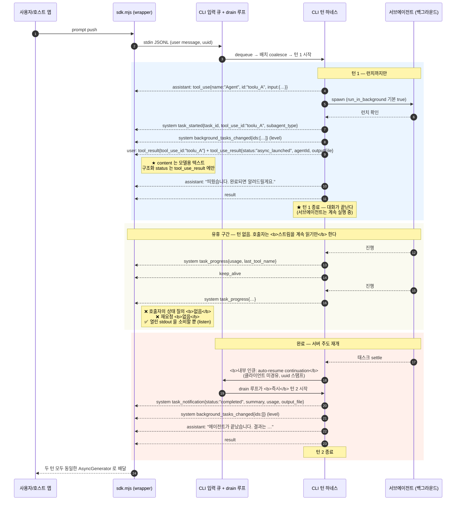
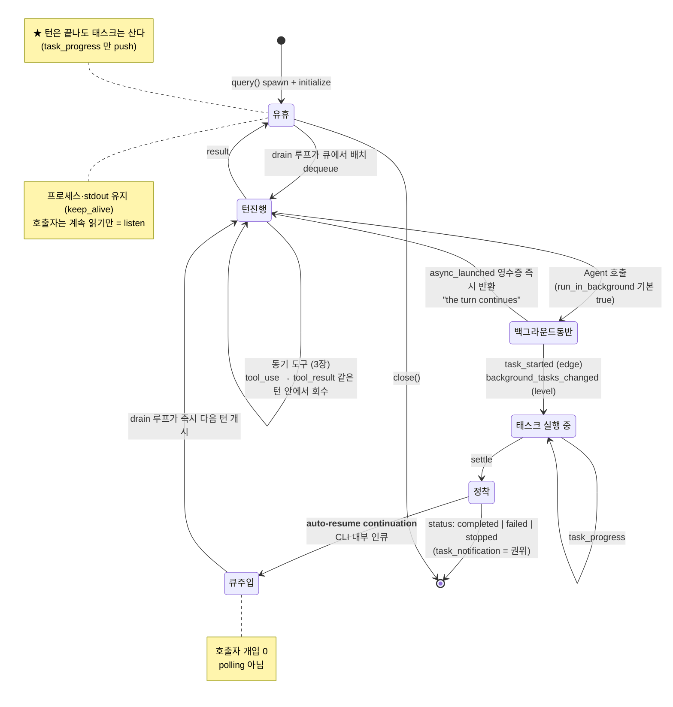

# ★ 5. 비동기 턴 전환 — listen 모델

> **본 분석 세트의 핵심 챕터.** 3장의 동기 도구 루프에서 무엇이 갈라져 나왔는지, 그리고 그 결과 **호출자의 계약이 어떻게 바뀌었는지**를 확정한다.
>
> 근거: `sdk-tools.d.ts` · `sdk.d.ts` (0.3.220) + Claude Code CHANGELOG.

## 5.0 한 문단 요약

서브에이전트는 **기본이 백그라운드**다. `Agent` 도구는 결과를 기다리지 않고 **런치 영수증**(`status:"async_launched"`)을 즉시 `tool_result` 로 돌려주며, **메인 턴은 그대로 `result` 로 종결된다.** 태스크가 실제로 끝나면 CLI 는 완료 알림을 **자기 내부 입력 큐에 주입**하고, drain 루프가 **호출자 개입 없이 다음 턴을 연다**(auto-resume continuation). 따라서 호출자는 상태를 되묻지 **않는다** — 이미 열려 있는 stdout 스트림을 **계속 소비(listen)** 하기만 하면, 종료됐던 대화가 서버 주도로 재개되어 완결된 새 턴이 흘러나온다.

## 5.1 (a) 기본값 전환 — 언제, 무엇이 바뀌었나

**타입 선언이 기본값을 직접 말한다:**

```ts
/**
 * Agents run in the background by default; you will be notified when one completes.
 * Set to false to run this agent synchronously when you need its result before continuing.
 */
run_in_background?: boolean;
```
— `sdk-tools.d.ts:501-504` (`AgentInput`)

**전환 시점**은 CLI CHANGELOG §2.1.198:

> *"Subagents now run in the background by default, so Claude keeps working while they run and is notified when they finish (previously a gradual rollout)"*
> — https://raw.githubusercontent.com/anthropics/claude-code/main/CHANGELOG.md §2.1.198

`0.3.220` (= CLI 2.1.220, [1.2절](01-패키지-구조와-프로세스-모델.md#12-버전-좌표-sdk--cli))은 그 이후 버전이므로 기본 백그라운드가 적용된다.

백그라운드로 가는 경로는 **네 갈래**이며 서로 층이 다르다:

| 경로 | 표면 | 근거 |
|---|---|---|
| 아무것도 지정 안 함 | **기본값** | `sdk-tools.d.ts:501-504` |
| 모델이 `run_in_background: true` 명시 | 호출 인자 | `sdk-tools.d.ts:504` |
| 에이전트 정의의 `background: true` | 정의 — *"non-blocking, fire-and-forget"* | `sdk.d.ts` `AgentDefinition.background` |
| `isolation: "remote"` | *"always runs in background"* — 강제 | `sdk-tools.d.ts:517-520` |

여기에 **런타임 승격** 경로가 하나 더 있다 — 이미 foreground 로 돌고 있는 것을 사후에 백그라운드로 미는 것(5.6절).

## 5.2 (b) 런치 영수증 — `async_launched`

동기 완료(`status:"completed"`)가 산출물과 전체 회계를 담는 것과 대조적으로([4.4절](04-subagent-호출-규약.md#44-결과-스키마--agentoutput-3-variant)), 백그라운드 런치는 **접수증**만 돌려준다:

```ts
{
  status: "async_launched";
  isAsync?: true;
  /** The ID of the async agent */
  agentId: string;
  /** The description of the task */
  description: string;
  /** Model in use at the backgrounding transition (a pre-background swap is reflected here) */
  resolvedModel?: string;
  /** Ordered distinct models used before backgrounding (length > 1 means a mid-run swap) */
  modelsUsed?: string[];
  /** The prompt for the agent */
  prompt: string;
  /** Path to the output file for checking agent progress */
  outputFile: string;
  /** Whether the calling agent has Read/Bash tools to check progress */
  canReadOutputFile?: boolean;
}
```
— `sdk-tools.d.ts:146-177` (`AgentOutput` 유니언의 2번째 variant)

세 번째 variant 도 있다 — `status:"remote_launched"` `{ taskId, sessionUrl, description, prompt, outputFile }` (`sdk-tools.d.ts:178-200`), 원격 실행용.

### 소비자가 빠지는 함정: 영수증이 "완료"로 보인다

[3.1절](03-tool-calling-규약.md#31-블록-shape--tool_use--tool_result)의 이중 경로가 여기서 결정적이다:

| 위치 | 백그라운드 런치 시 내용 |
|---|---|
| `tool_result.content` | **모델용 텍스트** — 자연어 안내문 |
| `tool_use_result` (별도 필드) | **`{status:"async_launched", agentId, outputFile, …}` 구조화 객체** |

`content` 만 읽는 소비자에게는 *"`tool_use` 가 나갔고 `tool_result` 가 돌아왔다"* 로 보인다 — 즉 **정상 완료와 구분되지 않는다.** 실행 중임을 알려면 **`tool_use_result` 를 열어 `status` 를 봐야** 한다.

> 판별식: `tool_result` 블록 + 같은 메시지의 `tool_use_result.status === "async_launched"` → **아직 실행 중**. `status === "completed"` → 진짜 완료.

`outputFile` + `canReadOutputFile` 은 **모델을 위한** 진행 확인 경로다(모델이 Read/Bash 로 그 파일을 볼 수 있는지). SDK 소비자를 위한 경로가 아니다 — 소비자용은 `task_*` 이벤트다.

## 5.3 (c) 메인 턴이 종결된다

`backgroundTasks` 제어요청의 JSDoc 이 이 경계를 가장 명시적으로 쓴다:

> *"Each blocking tool call **returns immediately** with a "running in the background" tool_result **and the turn continues**; the task keeps running and **emits a `task_notification` when it settles**."*
> — `sdk.d.ts:2986` (`SDKControlBackgroundTasksRequest`) · 동일 문구 `sdk.d.ts:2566-2571` (`Query.backgroundTasks()`)

"the turn continues" 는 *턴이 서브에이전트를 기다리며 멈춰 있지 않다* 는 뜻이다. 모델은 영수증을 받고 계속 작업하다가, 더 할 일이 없으면 **평범하게 `result` 를 내고 턴을 끝낸다.**

그 결과 타임라인은 이렇게 된다:

```
[턴 1]  user prompt
        → assistant: tool_use{Agent, …}
        → user: tool_result + tool_use_result{status:"async_launched"}   ← 즉시
        → assistant: "에이전트를 띄웠습니다. 완료되면 알려드릴게요."
        → result                                                          ← ★ 턴 종료
                                                                              (서브에이전트는 계속 실행 중)
[유휴]  keep_alive … task_progress … task_progress …                       ← push 만 흐름
[턴 2]  ← CLI 가 자기 큐에 완료 알림 주입 → drain 루프가 연 턴
        → system: task_notification{status:"completed", summary, usage}
        → assistant: "에이전트가 끝났습니다. 결과는 …"
        → result
```

**턴 1의 `result` 는 대화의 끝이 아니다.** 이것이 사용자가 관찰한 *"main 대화가 끝나는 형태"* 의 정확한 정체다.

## 5.4 (d) 진행 통지는 push 된다

호출자가 아무것도 요청하지 않아도 CLI 가 밀어 보내는 신호가 **네 종류**다([4.6절](04-subagent-호출-규약.md#46-태스크-라이프사이클-메시지-필드) 상세):

| 메시지 | 신호형 | 언제 |
|---|---|---|
| `system` `task_started` | edge | 태스크 시작 |
| `system` `task_progress` | edge | 진행 중 (`usage` · `last_tool_name` · `summary`) |
| `system` `task_notification` | edge | **권위 정착** — `status: 'completed' \| 'failed' \| 'stopped'` |
| `system` `background_tasks_changed` | **level** | 살아 있는 백그라운드 태스크 **전체 집합** |

추가로 `forwardSubagentText: true` 면 자식의 assistant/user 메시지가 `parent_tool_use_id` 를 달고 같은 스트림에 인터리브된다.

edge/level 이중화의 이유는 [2.4절](02-제어-프로토콜과-턴-큐.md#24-관측-신호-edge-와-level) 그대로다 — 북엔드 하나를 놓치면 "실행 중" 표시가 영구 고착되므로, 레벨 스냅샷으로 복구 가능하게 만들어 둔 것.

## 5.5 (e) auto-resume continuation — 서버가 새 턴을 연다

**이 절이 "polling 이 아니다"의 근거다.**

[2.3절](02-제어-프로토콜과-턴-큐.md#23-입력-큐와-drain-루프--5장의-기반)에서 세운 큐/drain 구조에, `interrupt` 응답의 `still_queued` JSDoc 이 결정적 문장 두 개를 준다(`sdk.d.ts:3487`):

> *"…the list may include **internally-enqueued uuids the client never sent (cron triggers, auto-resume continuations)** — ignore unknown uuids rather than treating them as an error."*

> *"…probing the queue after the interrupted result instead always loses the race against **the drain loop, which starts the next queued turn immediately**."*

여기서 확정되는 것:

1. **`auto-resume continuations` 라는 이름의 항목이 CLI 내부에서 큐에 인큐된다.** 클라이언트가 보내지 않은 것이며, `still_queued` 목록에 uuid 로 나타난다.
2. **drain 루프가 그것을 즉시 다음 턴으로 만든다.**

즉 완료 알림은 "이벤트 한 줄"로 끝나지 않는다. **큐에 들어가 새 턴을 촉발**하고, 그 턴에서 모델이 결과를 읽고 사용자에게 답한다. 이것이 사용자가 관찰한 *"대화 재개가 가능한 형태"* 다.

CHANGELOG 의 표현과도 정확히 맞물린다 — *"Claude keeps working while they run and **is notified when they finish**"*. "notified" 의 수신자는 SDK 호출자가 아니라 **모델**이다.

### 전체 시퀀스



### 턴/태스크 상태 전이



## 5.6 (f) 호출자 계약: listen — polling 이 아니다

`Query` 인터페이스(`sdk.d.ts:2280-2585`)에는 **"태스크 상태를 조회하는 메서드가 없다."** `stopTask(taskId)` 와 `backgroundTasks(toolUseId?)` 는 *제어* 이지 조회가 아니고, `SDKControlRequestInner` 36 subtype(`sdk.d.ts:3729`) 중에도 태스크 상태 질의는 없다. 조회 API 가 없다는 사실 자체가 설계 의도다 — **상태는 push 되므로 물어볼 필요가 없다.**

호출자가 해야 하는 일의 전부:

```ts
for await (const msg of handle) {
  // 그냥 계속 읽는다. 턴 1의 result 이후에도 멈추지 않는다.
  // task_progress / task_notification / 턴 2의 assistant·result 가 여기로 온다.
}
```

**멈추면 놓친다.** 턴 1의 `result` 를 보고 루프를 빠져나가면 auto-resume continuation 이 열 턴 2를 영영 받지 못한다. `result` 는 *턴* 의 끝이지 *스트림* 의 끝이 아니다.

### 다만 — "polling 이 아니다"의 예외 두 곳

정확성을 위해 구분해 둔다. 폴링은 **호출자↔CLI 경계에는 없지만**, 다른 두 경계에는 존재한다.

**① 모델 쪽에는 블로킹 조회 도구가 있다.**

```ts
export interface TaskOutputInput {
  /** The task ID to get output from */
  task_id: string;
  /** Whether to wait for completion */
  block: boolean;
  /** Max wait time in ms */
  timeout: number;
}
```
— `sdk-tools.d.ts:554-567`

즉 **모델은** 결과가 지금 필요하면 `TaskOutput({block:true, timeout})` 으로 기다릴 수 있다. 이건 SDK 호출자의 API 가 아니라 모델용 도구다. 호출자 계약(listen)과 모델 계약(필요 시 block-read)은 서로 다른 층이다.

**② MCP 태스크 확장은 폴링 기반이다 — 그러나 다른 메커니즘이다.**

`sdk.mjs` 안에 `handleAutomaticTaskPolling` 이라는 메서드가 존재한다. 문맥을 보면 이것은 **번들된 `@modelcontextprotocol/sdk` 의 task augmentation** 코드다 — `taskStore` · `createTask` · `pollInterval ?? 5000` 으로 `status !== "completed" && status !== "failed"` 인 동안 도는 루프이며, MCP 도구의 `taskSupport` 메타데이터에 반응한다. **Claude 의 서브에이전트/백그라운드 태스크 경로와 무관하다.**

> 두 태스크 모델이 같은 패키지 안에 공존하며 **정반대 전략을 쓴다**는 점이 흥미롭다: MCP 사양의 태스크는 5초 간격 **폴링**, Claude 자체 백그라운드 태스크는 큐 주입 + **push**. 이름이 비슷하다고 섞어 읽으면 안 된다.

## 5.7 (g) 동기 ↔ 비동기 경계 대조표

| 축 | **동기 도구** (3장) | **동기 서브에이전트** (`run_in_background:false`) | **비동기 서브에이전트** (기본) |
|---|---|---|---|
| `tool_result` 도착 시점 | 실행 완료 후 | 에이전트 완료 후 | **즉시 (런치 직후)** |
| `tool_use_result` 내용 | 도구별 출력 스키마 | `AgentOutput{status:"completed", content, usage, toolStats}` | `AgentOutput{status:"async_launched", agentId, outputFile}` |
| 산출물(`content`) 포함 | ✅ | ✅ | ❌ (아직 없음) |
| 메인 턴 | 결과를 기다림 | 결과를 기다림 | **기다리지 않고 종결** |
| 결과 도착 경로 | 같은 턴 | 같은 턴 | **다음 턴 (auto-resume)** |
| 진행 관측 | (없음) | `task_*` 이벤트 | `task_*` 이벤트 |
| 권위 정착 신호 | `tool_result` | `tool_result` | **`task_notification.status`** |
| 호출자가 할 일 | 스트림 읽기 | 스트림 읽기 | **스트림 계속 읽기 (턴 경계 넘어서)** |
| 취소 | `control_cancel_request` / `interrupt` | `interrupt` | **`stopTask(taskId)`** |

**대칭이 깨지는 지점이 하나뿐**이라는 게 이 설계의 요점이다: *결과가 같은 턴에 오느냐 다음 턴에 오느냐.* 나머지(권한·훅·블록 shape·스트림)는 전부 3장 그대로다.

## 5.8 (h) 동기 opt-out 과 런타임 승격

### 동기로 되돌리기

```ts
/** … Set to false to run this agent synchronously when you need its result before continuing. */
run_in_background?: boolean;
```
— `sdk-tools.d.ts:501-504`

`false` 명시가 **문서화된 공식 opt-out** 이다. 다만 이는 **모델이 채우는 도구 입력 필드**라는 점에 유의해야 한다 — SDK 옵션이 아니다. 호스트가 강제하려면 `canUseTool` 의 `allow.updatedInput` 으로 입력을 재작성해야 하는데([3.3절](03-tool-calling-규약.md#33-canusetool--제어-프로토콜-왕복)), 그 방식의 실효는 **본 분석 범위(정적 타입 근거)로는 확정할 수 없다**.

> **코드에서 확인 안 됨**: `canUseTool` 이 주입한 `run_in_background:false` 를 CLI 가 실제로 준수하는지, 그리고 `AgentDefinition.background:true` 나 `isolation:"remote"`(항상 백그라운드) 와 충돌할 때의 우선순위. 판정 로직은 CLI 바이너리 안에 있다.

### 반대 방향 — foreground 를 사후에 백그라운드로 밀기

```ts
/**
 * Background in-flight foreground tasks (Bash commands and subagents).
 * With `toolUseId`, targets the single task started by that tool_use block;
 * without it, backgrounds all foreground tasks — equivalent to pressing Ctrl+B in the terminal.
 * @returns true when at least one task was backgrounded; false only when `toolUseId`
 *   was given and it matched no foreground task
 */
backgroundTasks(toolUseId?: string): Promise<boolean>;
```
— `sdk.d.ts:2563-2575`

**"Bash commands and subagents"** — 서브에이전트만이 아니라 **Bash 도 백그라운드 대상**이다. `BashInput` 도 자체 `run_in_background?: boolean` 을 갖는다(*"Set to true to run this command in the background."*, `sdk-tools.d.ts:545-548`). 다만 기본값이 반대다 — **Bash 는 기본 foreground(명시 opt-in), 서브에이전트는 기본 background(명시 opt-out)**.

이 메서드는 터미널의 Ctrl+B 를 SDK 로 노출한 것이며, 호출 즉시 해당 도구 호출이 *"running in the background"* tool_result 로 조기 반환되고 턴이 계속된다 — **5.3절의 경계를 런타임에 만들어내는 API** 다.

### 중단

```ts
/** Stop a running task. A task_notification with status 'stopped' will be emitted. */
stopTask(taskId: string): Promise<void>;
```
— `sdk.d.ts:2559-2562`

중단도 `task_notification` 으로 정착한다(`status:'stopped'`) — 즉 **정상 완료·실패·중단이 같은 채널로 수렴**한다. 소비자는 세 경우를 하나의 정착 핸들러로 처리하면 된다.

## 5.9 소비자 구현 체크리스트

본 장의 규약에서 직접 따라오는 요구사항:

- [ ] 턴 1의 `result` 에서 스트림 소비를 **중단하지 않는다**.
- [ ] `tool_result` 의 완료 판정은 `content` 가 아니라 **`tool_use_result.status`** 로 한다 (`async_launched` = 실행 중).
- [ ] 권위 정착은 **`task_notification.status`** 로 판정한다 (`completed`/`failed`/`stopped`).
- [ ] "백그라운드 작업이 도는가" 불린은 edge 페어링이 아니라 **`background_tasks_changed` level 스냅샷으로 교체**한다.
- [ ] `background_tasks_changed` 는 **프로세스 재시작 시 빈 집합으로 리셋**한다(startup 에 아무것도 안 옴).
- [ ] `skip_transcript: true` 인 `task_*` 는 인라인 트랜스크립트에서 숨긴다(ambient/observer 태스크).
- [ ] `task_*` ↔ 부모 tool_use 상관은 **`tool_use_id`** 로 한다.
- [ ] 자식 대화 렌더가 필요하면 `forwardSubagentText: true` 를 켠다(기본 false 는 tool_use/tool_result 만).
- [ ] 유휴 구간의 `keep_alive` 프레임을 무시하되 **연결 종료로 오해하지 않는다**.

---

← [4장 — subagent 호출 규약](04-subagent-호출-규약.md) · [6장 — 콜스택 딥다이브](06-콜스택-딥다이브.md) →
