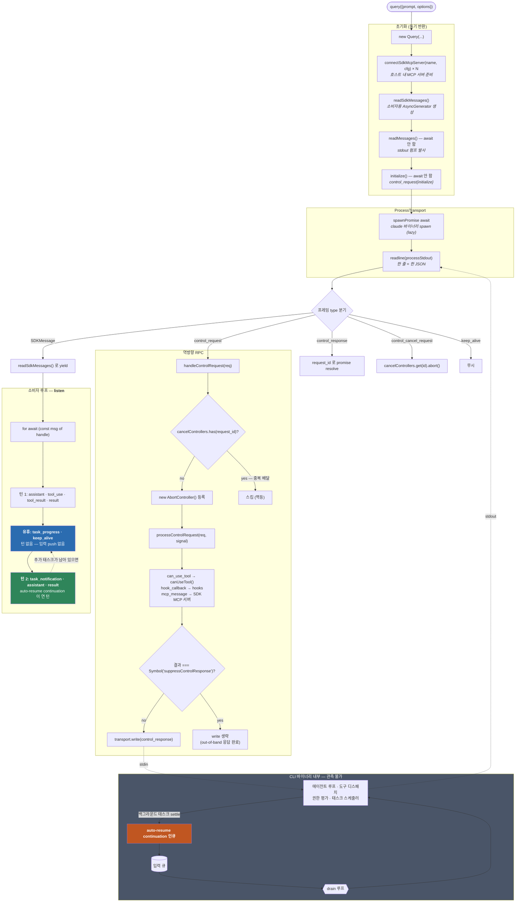

# 6. 콜스택 딥다이브

> **근거 등급 주의.** 이 장의 1차 소재는 `sdk.mjs` — **미니파이 번들**(140줄, 최대 줄 길이 171,205자)이다. 라인 번호 인용은 무의미하므로 **클래스·메서드 식별자와 원문 문자열**로 인용한다. 식별자는 미니파이를 견디고 살아남았고(`class` 필드명·메서드명·로그 태그·에러 메시지), 이를 통해 제어 흐름의 골격을 복원했다. **CLI 바이너리 내부는 관측 불가**이며 그 구간은 명시적으로 표시한다.
>
> 인용 표기: `sdk.mjs::<메서드명>` 또는 `sdk.mjs "<원문 문자열>"`.

## 6.1 두 클래스 — `Query` 와 `ProcessTransport`

미니파이를 통과해 남은 로그 태그가 클래스 경계를 알려준다:

| 태그/문자열 | 소속 | 근거 |
|---|---|---|
| `[Query.handleControlRequest]` | **`Query`** — 프로토콜 계층 | `sdk.mjs` 로그 문자열 |
| `[ProcessTransport] stdin write failed (child likely exited)` | **`ProcessTransport`** — 프로세스/스트림 계층 | `sdk.mjs` 로그 문자열 |
| `ProcessTransport output stream not available` | `ProcessTransport` | `sdk.mjs` 에러 메시지 |
| `ProcessTransport is not ready for writing` | `ProcessTransport` | `sdk.mjs` 에러 메시지 |

책임 분리가 깔끔하다 — `ProcessTransport` 는 바이트(spawn·stdin write·stdout readline·exit)만 알고, `Query` 는 프레임 의미(control RPC 상관·콜백 라우팅·SDKMessage 배달)만 안다.

## 6.2 초기화 — `query()` 호출 직후 일어나는 일

`Query` 생성자의 마지막 네 줄이 미니파이 상태에서도 그대로 읽힌다:

```js
for (let [m, g] of i) this.connectSdkMcpServer(m, g);
this.sdkMessages   = this.readSdkMessages();
this.readMessages();
this.initialization = this.initialize();
this.initialization.catch(() => {});
```
— `sdk.mjs` (`Query` 생성자)

순서의 의미:

1. **`connectSdkMcpServer(name, config)`** — `type:'sdk'` MCP 서버를 **호스트 프로세스 안에서 먼저 연결**한다([3.2절](03-tool-calling-규약.md#32-도구-3계열--등록과-디스패치-경로가-다르다)). CLI 가 나중에 역방향으로 이 도구를 부를 수 있으려면 그 전에 준비돼 있어야 한다.
2. **`readSdkMessages()`** — 소비자에게 넘길 `AsyncGenerator<SDKMessage>` 를 만든다. `for await (const msg of handle)` 가 소비하는 것이 이 제너레이터다.
3. **`readMessages()`** — stdout 읽기 루프를 **await 하지 않고 발사**한다(fire-and-forget). 백그라운드에서 계속 도는 펌프.
4. **`initialize()`** — `initialize` control_request 를 보낸다. 역시 await 하지 않고 `.catch(()=>{})` 로 unhandled rejection 만 막는다.

**3·4 를 await 하지 않는다는 점이 중요하다.** `query()` 는 즉시 반환하고, 실제 핸드셰이크는 소비자가 첫 메시지를 pull 할 때 자연스럽게 완료된다.

## 6.3 stdout 펌프 — `readMessages()`

```js
async *readMessages() {
  if (this.spawnPromise) { await this.spawnPromise; this.spawnPromise = void 0; }
  if (!this.processStdout) throw Error("ProcessTransport output stream not available");
  if (this.exitError) throw this.exitError;
  let e = uxe({ input: this.processStdout });   // readline 인터페이스 (한 줄 = 한 JSON)
  …
}
```
— `sdk.mjs::readMessages` (`ProcessTransport`)

- **spawn 은 lazy 하다.** `spawnPromise` 를 먼저 await 하므로, 프로세스 기동은 첫 읽기 시점에 완료된다.
- **readline 으로 줄 단위 분해** → JSONL 프레이밍([2.1절](02-제어-프로토콜과-턴-큐.md#21-wire-는-한-줄--한-json-jsonl-양방향)).
- 프로세스 `exit` 에 readline 을 `close` 하는 핸들러가 붙는다.

## 6.4 프레임 디스패치 — 정방향/역방향 분기

읽어들인 각 프레임은 `type` 으로 갈린다([2.1절](02-제어-프로토콜과-턴-큐.md#21-wire-는-한-줄--한-json-jsonl-양방향)의 `StdoutMessage` 유니언):

| `type` | 처리 |
|---|---|
| SDKMessage 계열 | `readSdkMessages()` 제너레이터로 yield → 소비자 |
| `control_response` | `request_id` 로 대기 중 promise resolve |
| **`control_request`** | **`handleControlRequest()`** → 역방향 콜백 |
| `control_cancel_request` | 해당 `request_id` 의 `AbortController` abort |
| `keep_alive` | 무시 |

### `handleControlRequest` — 멱등 가드 + 취소 배선

```js
async handleControlRequest(e) {
  if (this.cancelControllers.has(e.request_id)) {
    ce(`[Query.handleControlRequest] Duplicate delivery of in-flight request ${e.request_id} (${e.request.subtype}) — skipping`);
    return;
  }
  let t = new AbortController();
  this.cancelControllers.set(e.request_id, t);
  try {
    let r = await this.processControlRequest(e, t.signal);
    if (this.cleanupPerformed) return;
    if (r === zw) return;                       // zw = Symbol("suppressControlResponse")
    let n = { type: "control_response",
              response: { subtype: "success", request_id: e.request_id, response: r } };
    await Promise.resolve(this.transport.write(Re(n) + …
```
— `sdk.mjs::handleControlRequest`

세 가지 방어가 한 함수에 모여 있다:

1. **중복 배달 가드** — `cancelControllers` 에 이미 있는 `request_id` 는 스킵. [2.2절](02-제어-프로토콜과-턴-큐.md#22-호스트--cli-요청-36종)의 *"Receivers must tolerate the same request_id also arriving as a live or replayed control_request frame and render it once"* 요구를 구현한 지점이다.
2. **취소 배선** — 요청마다 `AbortController` 를 만들어 `signal` 을 콜백에 넘긴다. `control_cancel_request` 가 오면 이 컨트롤러가 abort 된다.
3. **응답 억제 센티널** — `zw = Symbol("suppressControlResponse")`. 콜백이 `null` 을 반환했을 때(=out-of-band 로 이미 응답을 보냈을 때) 쓰이는 값으로, 이 경우 wrapper 는 **자기 transport write 를 건너뛴다**. [3.3절](03-tool-calling-규약.md#33-canusetool--제어-프로토콜-왕복)의 *"the SDK will skip its own transport write"* 가 이 심볼이다.

### `processControlRequest` — subtype 라우팅

```js
async processControlRequest(e, t) {
  if (e.request.subtype === "can_use_tool") {
    if (!this.canUseTool) throw Error("canUseTool callback is not provided.");
    let r = await this.canUseTool(
      e.request.tool_name,
      e.request.input,
      { signal: t,
        suggestions:    e.request.permission_suggestions,
        blockedPath:    e.request.blocked_path,
        decisionReason: e.request.decision_reason,
        title:          e.request.title,
        displayName:    … }
    );
    …
```
— `sdk.mjs::processControlRequest`

**wire 필드(snake_case) → 콜백 옵션(camelCase) 매핑이 여기서 일어난다.** `permission_suggestions`→`suggestions`, `blocked_path`→`blockedPath`, `decision_reason`→`decisionReason`. [3.3절](03-tool-calling-규약.md#33-canusetool--제어-프로토콜-왕복)의 두 타입(`SDKControlPermissionRequest` ↔ `CanUseTool`)이 다른 이름을 쓰는 이유가 이 어댑팅 층이다.

확인된 역방향 subtype 3종: `can_use_tool` · `hook_callback` · `mcp_message` (각각 `subtype==="…"` 분기가 `sdk.mjs` 에 존재).

### 재접속 시 미해결 요청 재무장

```js
processPendingPermissionRequests(e) {
  for (let t of e) if (t.request.subtype === "can_use_tool") this.handleControlRequest(t).catch(() => {});
}
processPendingUserDialogRequests(e) {
  for (let t of e) if (t.request.subtype === "request_user_dialog") this.handleControlRequest(t).catch(() => {});
}
```
— `sdk.mjs`

`initialize` 응답의 `pending_permission_requests` / `pending_user_dialog_requests`([2.2절](02-제어-프로토콜과-턴-큐.md#재접속-복원))를 **일반 요청과 동일한 경로로 재생**한다 — 그래서 6.4절의 중복 가드가 반드시 필요하다.

## 6.5 호스트 → CLI 요청 — `request()`

```js
request(e) {
  let t = Math.random().toString(36).substring(2, 15);
  this.transport.expectControlResponse?.(t);
  let r = { request_…
```
— `sdk.mjs::request`

- `request_id` 는 로컬 랜덤 문자열.
- `transport.expectControlResponse(id)` 로 **응답 수신을 미리 예약**한다. `sdk.d.ts:6991` 의 설명과 대응: *"Register a request_id whose control_response the caller will await … control_responses matching this id — only the worker may answer."*

`Query` 의 공개 제어 메서드는 전부 이 `request()` 의 얇은 래퍼다:

```js
async stopTask(e) {
  await this.request({ subtype: "stop_task", task_id: e });
}
async backgroundTasks(e) {
  return (await this.request({ subtype: "background_tasks", tool_use_id: e })).response.backgrounded;
}
```
— `sdk.mjs::stopTask` · `sdk.mjs::backgroundTasks`

[4.7절](04-subagent-호출-규약.md#47-태스크-제어-api)·[5.8절](05-비동기-턴-전환-listen-모델.md#58-h-동기-opt-out-과-런타임-승격)의 타입 계약이 wire subtype 으로 그대로 내려가는 것이 확인된다.

## 6.6 종료 — `close()`

```js
setTimeout((u) => { if (u.exitCode === null) u.kill("SIGKILL") }, 5000, a).unref();
…
s.once("exit", () => Lp.delete(s));
this.ready = false;
```
— `sdk.mjs::close` (`ProcessTransport`)

- 정상 종료를 기다리다 **5초 후 `SIGKILL`** 로 강제 종료.
- `.unref()` 로 이 타이머가 Node 이벤트 루프를 붙잡지 않게 한다.
- `Lp` 는 살아 있는 프로세스 집합(전역 레지스트리) — exit 시 제거.
- `onExit` 콜백은 throw 해도 삼킨다: `"[ProcessTransport] onExit callback threw during close()"`.

## 6.7 전체 콜스택 — 그리고 비동기 경로가 갈라지는 지점



### ★ 분기 지점의 정확한 위치

**비동기 경로는 wrapper 의 콜스택에서 갈라지지 않는다.** 이것이 이 장의 결론이다.

| 층 | 동기 도구 경로 | 비동기 서브에이전트 경로 | 차이 |
|---|---|---|---|
| `ProcessTransport.readMessages` | 줄 읽기 | 줄 읽기 | **없음** |
| 프레임 디스패치 | `type` 분기 | `type` 분기 | **없음** |
| `readSdkMessages` yield | SDKMessage 배달 | SDKMessage 배달 | **없음** |
| 소비자 루프 | `for await` | `for await` | **없음** |
| **CLI 큐/drain** | 호스트 push 만 인큐 | **+ 내부 auto-resume 인큐** | **★ 여기** |

wrapper 에는 "백그라운드 태스크를 기다리는 코드"가 **존재하지 않는다**. 대기 로직이 없는 이유는 대기할 것이 없기 때문이다 — 턴 2는 호출자가 요청해서 열리는 게 아니라 CLI 가 자기 큐를 drain 하다가 여는 것이고, wrapper 입장에서는 **턴 1의 프레임과 완전히 동일한 모양의 프레임**이 계속 흘러올 뿐이다.

그래서 "listen 상태"에 해당하는 wrapper 코드도 없다. **소비자가 `for await` 루프를 빠져나가지 않는 것** — 그것이 listen 의 전부다([5.6절](05-비동기-턴-전환-listen-모델.md#56-f-호출자-계약-listen--polling-이-아니다)).

유휴 구간에 wrapper 가 실제로 하는 일:

- `readMessages` 펌프는 계속 돈다 (`processStdout` 이 열려 있음).
- `keep_alive` 프레임이 와도 SDKMessage 로 yield 하지 않고 무시.
- **입력 stdin 에 아무것도 쓰지 않는다.** push 없이 읽기만.

## 6.8 관측 불가 구간 (코드에서 확인 안 됨)

정직하게 분리한다. 아래는 **`claude` 275 MB 컴파일 바이너리 안에 있어 이 분석으로 도달하지 못한 것**들이다:

| 항목 | 왜 못 봤나 |
|---|---|
| drain 루프의 배치 coalescing 규칙 (몇 개를 언제 묶나) | 바이너리 내부. `sdk.d.ts:3487` JSDoc 이 존재와 취소 세만틱스만 서술 |
| auto-resume continuation 의 인큐 시점·우선순위(사용자 메시지와의 순서) | 동일 |
| 권한 판정자들(rule/mode/classifier/safetyCheck)의 정확한 우선순위 | 동일. `decision_reason_type` 이 종류만 열거 |
| `run_in_background:false` 를 `canUseTool.updatedInput` 으로 주입했을 때의 실효 | 동일 |
| 에이전트 루프의 종료 조건(maxTurns 외) | 동일 |
| `pathToClaudeCodeExecutable` 미지정 시 해석 우선순위 | `sdk.mjs` 미니파이 — 식별자는 있으나 분기 추적 실패 |
| checksum 검증의 런타임 수행 여부 | 동일 |

**바이너리에서 문자열 grep 은 된다.** 예를 들어 서브에이전트 도구 설명 원문이 나온다:

```
$ grep -a 'Launch a new agent to handle complex' claude
… `Launch a new agent to handle complex, multi-step tasks. …
```

하지만 이는 *데이터* 이지 *제어 흐름* 이 아니다. 위 항목들은 문자열이 아니라 분기 로직이므로 이 방법으로 복원되지 않는다. 재현·관측으로 좁히는 방법은 [7장](07-버전-델타와-한계.md)에 정리한다.

---

← [★ 5장 — 비동기 턴 전환 (listen 모델)](05-비동기-턴-전환-listen-모델.md) · [7장 — 버전 델타와 한계](07-버전-델타와-한계.md) →
