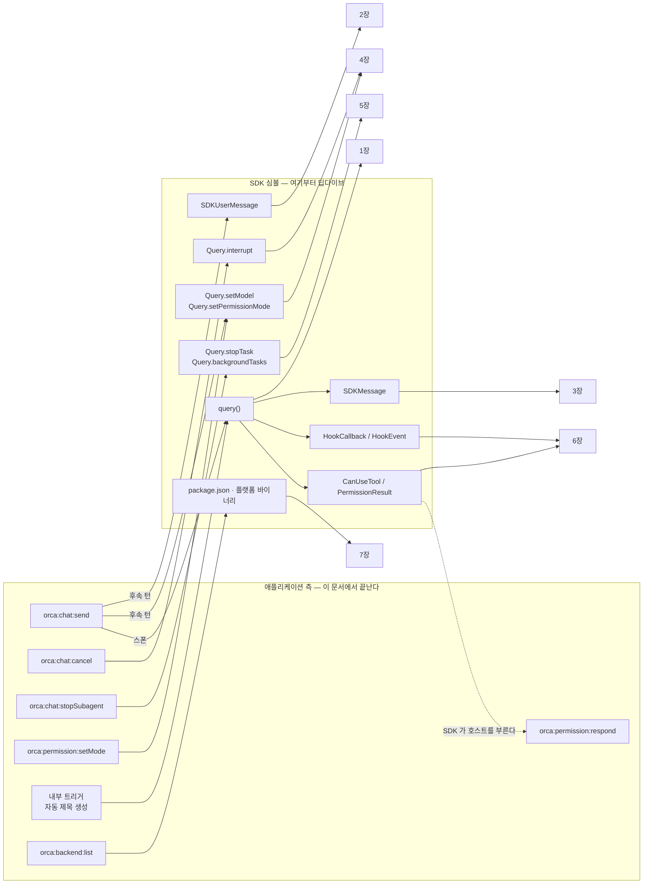

# 0. 진입점 분류 — 경계 문서

> **이 세트에서 애플리케이션 코드를 언급하는 문서는 이 파일 하나다.**
> 여기서는 "어떤 진입점이 **어느 SDK 심볼로 들어가는가**" 까지만 적는다. 그 심볼이 SDK 안에서 무엇을 하는지는 **한 줄도 쓰지 않고** 해당 딥다이브 문서로 넘긴다.
> 근거: 애플리케이션 측은 `파일:라인`(1급 — 소스가 완전히 읽힌다). SDK 측 심볼명은 `sdk.d.ts` 라인.

## 0.1 분류 기준

**진입점** = 애플리케이션 코드가 SDK 심볼에 **처음 닿는 지점**. "닿는다"를 함수 호출로만 좁히면 전수가 정직하지 않으므로(타입 계약만 쓰는 곳, 패키지 경로만 읽는 곳이 빠진다) **4계열**로 나눈다.

| 계열 | 이름 | 방향 | 정의 |
|---|---|---|---|
| **A** | 정방향 호출 | host → SDK | 애플리케이션이 SDK 함수/메서드를 **부른다** |
| **B** | 역방향 콜백 | SDK → host | 애플리케이션이 **콜백을 등록**하고, 실행 중 SDK 가 그것을 **부른다** |
| **C** | 스트림 | 양방향 | 애플리케이션이 SDK 에 넘기거나(입력) SDK 에서 받는(출력) **AsyncIterable 요소 타입** |
| **D** | 비호출 표면 | — | SDK **함수를 부르지 않고** 패키지 자체를 파일시스템/모듈 해석 대상으로만 쓴다 |

계열 D 를 따로 두는 이유: 버전 read 와 실행 파일 경로 해석은 SDK 의 *동작*이 아니라 *배포 형상*에 의존한다. 같은 표에 섞으면 "SDK 를 호출한다"는 서술이 부정확해진다.

## 0.2 진입점 → SDK 심볼 매핑

### 계열 A — 정방향 호출

| 진입점 | 애플리케이션 경로 | 도달 SDK 심볼 | 딥다이브 |
|---|---|---|---|
| `orca:chat:send` (스폰) | `app/chat-turn.ts:965` → `features/sessions/session-runtime.ts:186` → `:249` → `adapters/claude.ts:322` | **`query()`** (`sdk.d.ts:2587`) | [1장](01-query-호출-생명주기.md) |
| 자동 제목 생성 *(IPC 아님 — 턴 종료 후 내부 트리거)* | `features/chat/title-generation.ts:53` → `adapters/claude.ts:216` → `:248` | **`query()`** — 1-shot(string prompt) 형태 | [1장](01-query-호출-생명주기.md) |
| `orca:chat:send` (후속 턴) | `session-runtime.ts:224` → `adapters/claude.ts:444-452` | **`Query.setModel`**(`:2327`) · **`Query.setPermissionMode`**(`:2300`) → 입력 스트림 push | [4장](04-제어-메서드-setModel-setPermissionMode-interrupt.md) · [2장](02-입력-경로-SDKUserMessage.md) |
| `orca:permission:setMode` | `features/approvals/coordinator.ts:85-94` → `session-runtime.ts:474` → `adapters/claude.ts:455` | **`Query.setPermissionMode`** (`sdk.d.ts:2300`) | [4장](04-제어-메서드-setModel-setPermissionMode-interrupt.md) |
| `orca:chat:cancel` | `app/chat-turn.ts:981` → `session-runtime.ts:462` → `adapters/claude.ts:457-459` | **`Query.interrupt`** (`sdk.d.ts:2293`) + `AbortController` | [4장](04-제어-메서드-setModel-setPermissionMode-interrupt.md) |
| `orca:chat:stopSubagent` | `app/chat-turn.ts:1013` → `features/chat/settle.ts:73` → `adapters/claude.ts:466` | **`Query.backgroundTasks`** (`sdk.d.ts:2575`) | [5장](05-태스크-제어-stopTask-backgroundTasks.md) |
| `orca:chat:stopSubagent` (이어서) | `features/chat/settle.ts:76` → `adapters/claude.ts:464` | **`Query.stopTask`** (`sdk.d.ts:2562`) | [5장](05-태스크-제어-stopTask-backgroundTasks.md) |

> 세션 종료·LRU 축출·에러 경로는 입력 스트림 generator 를 `return` 시켜 닫는다(`adapters/claude.ts:393`) — `Query.close()` 를 직접 부르지 않는다. 그 두 경로의 차이는 [1장 §1.6](01-query-호출-생명주기.md#16-종료--두-가지-닫는-법).

### 계열 B — 역방향 콜백 (SDK 가 호스트를 부른다)

| 등록 지점 | 애플리케이션 경로 | SDK 심볼 | 응답을 만드는 진입점 | 딥다이브 |
|---|---|---|---|---|
| `options.canUseTool` | `adapters/claude.ts:97-180`(`makeCanUseTool`) · `:379-385` | **`CanUseTool`**(`sdk.d.ts:206`) → **`PermissionResult`**(`:2114`) | `orca:permission:respond` (`features/approvals/coordinator.ts:77`) | [6장](06-역방향-콜백-canUseTool-hooks.md) |
| `options.hooks` | `adapters/claude-adapt.ts:120-217`(`adaptHooks`·`makeSteerGateHook`·`withPostCompactHook`) · `adapters/workspace-guard.ts:116`(`makeWorkspaceGuardHook`) | **`HookCallback`**(`sdk.d.ts:821`) · **`HookEvent`**(`:835`) · **`HookJSONOutput`**(`:839`) · **`SyncHookJSONOutput`**(`:6839`) · **`PreToolUseHookSpecificOutput`**(`:2255`) 외 3종 | (콜백 내부에서 동기 결정) | [6장](06-역방향-콜백-canUseTool-hooks.md) |

**화살표 방향에 주의한다.** `orca:permission:respond` 는 SDK 를 *부르지* 않는다 — 이미 진행 중인 SDK→호스트 요청의 **응답을 채워 넣는다**. 계열 A 와 반대다.

### 계열 C — 스트림

| 방향 | 애플리케이션 경로 | SDK 심볼 | 딥다이브 |
|---|---|---|---|
| 입력 (host → SDK) | `adapters/streaming-input.ts:11,18` — `query({ prompt })` 에 넘기는 `AsyncIterable` 의 요소 | **`SDKUserMessage`** (`sdk.d.ts:4583`) | [2장](02-입력-경로-SDKUserMessage.md) |
| 입력 content | `adapters/streaming-input.ts:12` · `adapters/claude.ts:24` | base SDK `@anthropic-ai/sdk` 의 **`MessageParam`** · **`Base64ImageSource`** | [2장 §2.2](02-입력-경로-SDKUserMessage.md#22-content--base-sdk-타입을-그대로-쓴다) |
| 출력 (SDK → host) | `adapters/claude-map.ts:10` — `for await (const msg of handle)` 로 소비 | **`SDKMessage`** (`sdk.d.ts:4019`, 39 variant) | [3장](03-출력-경로-SDKMessage.md) |

### 계열 D — 비호출 표면

| 진입점 | 애플리케이션 경로 | 대상 | 딥다이브 |
|---|---|---|---|
| `orca:backend:list` | `app/handlers/misc.ts:65` → `adapters/registry.ts:27` → `adapters/claude.ts:197` | `@anthropic-ai/claude-agent-sdk/package.json` 의 `version` (`require`) | [7장 §7.5](07-Options-표면과-실행파일-해석.md#75-패키지-자체를-읽는-표면) |
| 부팅 1회 실행파일 해석 | `adapters/claude-executable.ts:16,19-21` → `adapters/claude.ts:53-56` | `require.resolve` 로 찾은 플랫폼 바이너리 패키지 경로 → `Options.pathToClaudeCodeExecutable` | [7장 §7.4](07-Options-표면과-실행파일-해석.md#74-실행-파일-해석--native-바이너리인가-js-엔트리인가) |
| `orca:install:start` | `app/handlers/misc.ts:86` → `adapters/claude.ts:207-209` | **없음** — 즉시 `done:true`. `optionalDependencies` 가 바이너리를 해소하므로 설치 절차 자체가 없다 | — |

### 옵션 조립 (계열 A 의 인자)

`query()` 에 넘기는 **`Options`**(`sdk.d.ts:1322`)는 여러 순수 변환 함수가 조각으로 만들어 spread 합성한다 — `adapters/claude-adapt.ts:38-217`(`adaptPlugins`·`adaptSystemPrompt`·`adaptSkills`·`adaptSettings`·`adaptSettingSources`·`adaptEnv`·`adaptHooks`·`mergeHooks`·`withPostCompactHook`), `adapters/claude.ts:230-244`(1-shot 경로) · `:323-390`(세션 경로).

어떤 필드가 CLI 플래그가 되고 어떤 필드가 `initialize` 제어 요청으로 가는지는 **[7장](07-Options-표면과-실행파일-해석.md)**.

## 0.3 SDK 에 도달하지 않는 채널

"모든 API 를 확인했다"는 주장은 **닿지 않는 경계**를 함께 그어야 성립한다. 아래 채널은 SDK 심볼을 전혀 거치지 않는다.

| 채널군 | 실제 도달 대상 | 왜 SDK 를 안 타는가 |
|---|---|---|
| `orca:chat:steerCancel` | 프로세스 내 pending 큐 | 주입 *전* 항목의 로컬 취소. stdin 에 나간 적이 없다 |
| `orca:session:*` (7) · `orca:project:*` (6) · `orca:search:messages` | SQLite | 메시지 SSOT 는 로컬 DB. SDK 의 `resume` 은 컨텍스트 유지용일 뿐 출처가 아니다 |
| `orca:skills:*` (7) · `orca:mcp:*` (4) · `orca:engine:*` (5) | 파일시스템 (`sources/`·`dist/`) | 배포 시점 산출물. 세션 시작 시 `Options` 로 **경로만** 전달된다 |
| `orca:update:*` (6) | electron-updater | 앱 자체 업데이트 |
| `orca:cost:*` (5) · `orca:concurrency:event` | DB 집계 + 이벤트 | SDK 가 보고한 usage 를 **사후 집계**할 뿐 |
| `orca:settings:*` (2) · `orca:files:*` (5) · `orca:window:*` (3) · `orca:notify:show` · `orca:log:emit` · `orca:sso:*` (3) · `orca:boot:*` (2) · `orca:debug:*` (2) · `orca:agent:list` | electron-store · OS · 파일시스템 | SDK 무관 |

72 채널 중 SDK 에 도달하는 것은 **5개**(`chat:send` · `chat:cancel` · `chat:stopSubagent` · `permission:setMode` · `permission:respond`) + 계열 D 의 2개(`backend:list` · `install:start`) 뿐이다. 채널 계약의 정본은 [`docs/IPC_CONTRACT.md`](../../../../IPC_CONTRACT.md) — 여기서 재서술하지 않는다.

또한 **mock 어댑터**(`adapters/mock.ts`)는 SDK 를 import 조차 하지 않는다. 위 표는 claude 어댑터 한정이다.

## 0.4 경계 선언

점선(`B1 -.-> C5`)만 **SDK → 호스트** 방향이다. 나머지 실선은 전부 호스트 → SDK.

**이 문서 이후의 모든 문서(1~7장)는 SDK 만 다룬다.** 애플리케이션 코드 인용도, IPC 채널명도, 어댑터 어휘도 등장하지 않는다. 위 표의 오른쪽 열이 그 문서들로 들어가는 유일한 입구다.

---

← [api/ 인덱스](README.md) · [1장 — `query()` 호출 생명주기](01-query-호출-생명주기.md) →
