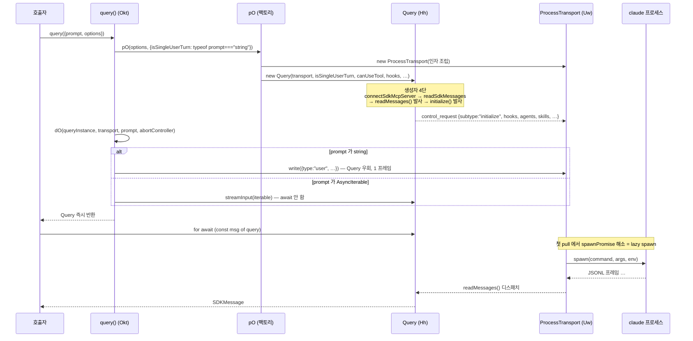

# 1. `query()` — 호출 생명주기

> **근거 등급.** ①③ 은 `sdk.d.ts` **1급**. ②④ 는 `sdk.mjs` **2급**(미니파이 번들 — 라인 인용이 무의미하므로 함수/클래스 식별자와 원문 로그 문자열로 인용한다). ⑥ 은 CLI 바이너리 내부라 **3급 = 관측 불가**.
> 배경(패키지 형상·프로세스 계층)은 [1부 1장](../01-패키지-구조와-프로세스-모델.md), 프레임 규약 일반론은 [1부 2장](../02-제어-프로토콜과-턴-큐.md). 여기서는 **`query()` 라는 심볼 하나**가 호출 순간부터 CLI 경계까지 무엇을 하는지만 본다.

## 1.1 ① 시그니처

```ts
export declare function query(_params: {
    prompt: string | AsyncIterable<SDKUserMessage>;
    options?: Options;
}): Query;
```
— `sdk.d.ts:2587`

반환 타입이 핵심이다:

```ts
export declare interface Query extends AsyncGenerator<SDKMessage, void> { … }
```
— `sdk.d.ts:2279`

**`query()` 는 Promise 를 반환하지 않는다.** 동기적으로 `Query` 를 돌려주고, 소비자가 `for await` 로 pull 하기 시작할 때 비로소 실제 I/O 가 진행된다. `Query` 는 AsyncGenerator 이면서 동시에 제어 메서드(4·5장)를 가진 객체다.

## 1.2 ② 콜스택 — 호출 직후 일어나는 일

미니파이 후에도 엔트리 함수 셋이 그대로 읽힌다:

```js
function Okt({prompt:e,options:t}){
  if((t?.resume||t?.continue)&&t?.sessionStore) return bUe(e,t);
  let{queryInstance:r,transport:n,abortController:o}=pO(t,{isSingleUserTurn:typeof e==="string"});
  return dO(r,n,e,o),r
}
```
— `sdk.mjs` (`export{… Okt as query}`)

3단이다:

| 단 | 함수 | 하는 일 |
|---|---|---|
| 1 | `pO(options, {isSingleUserTurn})` | 옵션 해체 → CLI 인자 조립 → `ProcessTransport` + `Query` 생성 |
| 2 | `dO(query, transport, prompt, abortController)` | **prompt 타입에 따라 입력을 배선** |
| 3 | `return queryInstance` | 즉시 반환 (await 없음) |

`bUe` 는 `sessionStore` 를 함께 준 재개 경로(원격 스토리지 미러링)로 갈라진다 — `deferSpawn:!0` 로 spawn 을 미룬다.

### `isSingleUserTurn` — 이 분기가 모든 것을 가른다

```js
pO(t, { isSingleUserTurn: typeof e === "string" })
```

`prompt` 가 **string 이냐 AsyncIterable 이냐** 가 여기서 boolean 하나로 접힌다. 이 값이 나중에 stdin 을 언제 닫을지를 결정한다(§1.5).

### `dO` — 입력 배선의 두 갈래

```js
function dO(e,t,r,n){
  if(typeof r==="string")
    t.write(Re({type:"user",session_id:"",message:{role:"user",content:[{type:"text",text:r}]},parent_tool_use_id:null})+`\n`);
  else
    e.streamInput(r).catch((o)=>n.abort(o))
}
```
— `sdk.mjs::dO`

| prompt | 배선 | 결과 |
|---|---|---|
| `string` | **transport 에 직접 1 프레임 write** — `Query` 를 거치지 않는다 | 한 번 쓰고 끝. `session_id:""`, `content` 는 text 블록 1개로 감싼다 |
| `AsyncIterable` | `Query.streamInput(iterable)` 을 **await 하지 않고** 발사, 실패 시 abortController 로 전파 | 백그라운드 펌프가 iterable 을 계속 drain([2장](02-입력-경로-SDKUserMessage.md)) |

string 경로가 `Query` 를 우회한다는 점이 중요하다 — 그래서 1-shot 호출에는 입력 큐도, 재진입도 없다.

### `Query` 생성자 — 네 줄

```js
for(let[m,g]of i) this.connectSdkMcpServer(m,g);
this.sdkMessages=this.readSdkMessages(),
this.readMessages(),
this.initialization=this.initialize(),
this.initialization.catch(()=>{})
```
— `sdk.mjs` (`class Hh` 생성자)

| 순서 | 호출 | 성질 |
|---|---|---|
| 1 | `connectSdkMcpServer(name, cfg)` | in-process MCP 서버를 **먼저** 연결 — CLI 가 역방향으로 부를 때 준비돼 있어야 한다 |
| 2 | `readSdkMessages()` | 소비자가 pull 할 제너레이터 생성 |
| 3 | `readMessages()` | stdout 펌프를 **await 없이 발사** (fire-and-forget) |
| 4 | `initialize()` | `initialize` 제어 요청을 **await 없이 발사**, `.catch(()=>{})` 로 unhandled rejection 만 봉인 |

3·4 를 await 하지 않으므로 `query()` 는 즉시 반환한다. 핸드셰이크는 소비자가 첫 메시지를 pull 할 때 자연스럽게 완료된다.

### `initialize()` 가 싣는 것 — 플래그가 아닌 옵션들

```js
let t={subtype:"initialize",hooks:this.initHooksPayload,sdkMcpServers:e,jsonSchema:this.jsonSchema,
  systemPrompt:…,appendSystemPrompt:…,planModeInstructions:…,appendSubagentSystemPrompt:…,
  toolAliases:…,excludeDynamicSections:…,agents:…,title:…,skills:…,
  webSearchIsolationExemptMcpServers:…,promptSuggestions:…,agentProgressSummaries:…,
  forwardSubagentText:this.initConfig?.forwardSubagentText,supportedDialogKinds:…};
return (await this.request(t)).response
```
— `sdk.mjs::initialize`

**`Options` 의 상당수가 CLI 플래그가 아니라 이 제어 요청으로 간다.** `systemPrompt`·`agents`·`skills`·`forwardSubagentText`·`hooks` 가 그렇다. 두 경로의 전체 분배표는 [7장](07-Options-표면과-실행파일-해석.md).

훅은 여기서 **콜백 ID 로 치환**된다 — `hook_${this.nextCallbackId++}` 를 만들어 `hookCallbacks` 맵에 넣고, wire 에는 ID 만 보낸다([6장 §6.6](06-역방향-콜백-canUseTool-hooks.md#66-hooks--콜백-id-로-치환된다)).

## 1.3 ③ wire — spawn 시 확정되는 것

`ProcessTransport`(`class Uw`)가 만드는 기본 인자는 고정 4개로 시작한다:

```js
let H=["--output-format","stream-json","--verbose","--input-format","stream-json"];
```
— `sdk.mjs` (`Uw` spawn 준비부)

즉 **양방향 JSONL 이 협상 대상이 아니라 전제**다. 그 위에 옵션별 플래그가 쌓이고([7장](07-Options-표면과-실행파일-해석.md)), 마지막에 프로세스가 뜬다:

```js
let Ye=hxe(a), yr=Ye?a:o, nt=Ye?[...i,...H]:[...i,a,...H],
    W={command:yr,args:nt,cwd:n,env:c,signal:this.forwardedAbort.signal};
… Nt(`Spawning Claude Code: ${yr} ${nt.join(" ")}`), this.process=this.spawnLocalProcess(W);
```
— `sdk.mjs` (`Uw`)

환경변수도 이 지점에서 손본다:

| 처리 | 코드 | 의미 |
|---|---|---|
| 진입점 표식 | `if(!c.CLAUDE_CODE_ENTRYPOINT) c.CLAUDE_CODE_ENTRYPOINT="sdk-ts"` | CLI 가 호출자를 식별 |
| `NODE_OPTIONS` 제거 | `delete c.NODE_OPTIONS` | 호스트의 node 플래그가 자식에 새는 것을 차단 |
| DEBUG 정규화 | `ge(c.DEBUG_CLAUDE_AGENT_SDK)?c.DEBUG="1":delete c.DEBUG` | SDK 전용 스위치로만 켠다 |

## 1.4 ④ 구현 디테일

### spawn 은 lazy 하다

`readMessages()`(ProcessTransport 쪽)는 `spawnPromise` 를 먼저 await 한다 — 실제 기동은 **첫 읽기 시점**에 완료된다([1부 6.3](../06-콜스택-딥다이브.md#63-stdout-펌프--readmessages)). `deferSpawn` 옵션(위 `bUe` 경로)은 이 지연을 더 늘린다.

### 소비자 스트림은 큐 한 겹을 거친다

`Query` 는 `inputStream = new Np` 를 갖는다. 이름과 달리 **CLI → 소비자** 방향 버퍼다:

```js
class Np{ queue=[]; readResolve; isDone=!1; started=!1;
  [Symbol.asyncIterator](){ if(this.started) throw Error("Stream can only be iterated once"); … }
  next(){ if(this.queue.length>0) return Promise.resolve({done:!1,value:this.queue.shift()}); … }
  enqueue(e){ if(this.readResolve){…} else this.queue.push(e) } … }
```
— `sdk.mjs::Np`

- **1회 소비 강제** — `"Stream can only be iterated once"`. 같은 `Query` 를 두 곳에서 `for await` 하면 던진다.
- **push/pull 브리지** — 대기 중인 reader 가 있으면 즉시 resolve, 없으면 큐에 쌓는다. 소비자가 느려도 프레임이 유실되지 않는다(무한 버퍼).

### 프로세스 정리 훅

```js
function gxe(e){ if(Lp.add(e), !$U) $U=!0, process.on("exit",mxe) }
function mxe(){ for(let e of Lp) if(!e.killed) if(process.platform==="win32") try{e.stdin.end()}catch{} else e.kill("SIGTERM") }
```
— `sdk.mjs`

spawn 된 자식은 전역 `Set` 에 등록되고 호스트 `process.on("exit")` 에서 일괄 정리된다. **win32 만 `stdin.end()`, 그 외는 `SIGTERM`** 으로 갈린다.

### stdin write 실패는 조용히 ready 를 내린다

```js
this.processStdin.on("error",(V)=>{ Nt(`[ProcessTransport] stdin write failed (child likely exited): ${V.code??V.message}`), this.ready=!1 })
```
— `sdk.mjs` (`Uw`)

던지지 않고 `ready=false` 로 떨어뜨린다 — 이후 write 는 `"ProcessTransport is not ready for writing"` 으로 거절된다.

## 1.5 ⑤ 다이어그램



### 1.6 종료 — 두 가지 닫는 법

`result` 도착 시 무엇이 일어나는지가 §1.2 의 `isSingleUserTurn` 으로 갈린다:

```js
if(this.isSingleUserTurn)
  ce("[Query.readMessages] First result received for single-turn query, closing stdin"),
  this.transport.endInput()
```
— `sdk.mjs::readMessages`

| prompt 형태 | `result` 수신 시 | 세션 수명 |
|---|---|---|
| `string` | **stdin 을 즉시 닫는다** | 1턴으로 끝 |
| `AsyncIterable` | 아무것도 안 한다 | 입력이 열려 있는 한 유지 — 후속 턴 가능 |

AsyncIterable 경로에서 stdin 이 닫히는 지점은 따로 있다:

```js
if(t>0&&this.hasBidirectionalNeeds()) … await this.waitForFirstResult();
ce("[Query] Calling transport.endInput() to close stdin to CLI process"), this.transport.endInput()
```
— `sdk.mjs::streamInput`

**입력 제너레이터가 `return` 되어 `for await` 루프가 끝날 때** 비로소 `endInput()` 이 불린다. 다만 역방향 콜백이 하나라도 등록돼 있으면(`hasBidirectionalNeeds()`) 첫 `result` 를 기다린 뒤에 닫는다:

```js
hasBidirectionalNeeds(){return this.sdkMcpTransports.size>0
  ||this.hooks!==void 0&&Object.keys(this.hooks).length>0
  ||this.canUseTool!==void 0||this.onElicitation!==void 0||this.onUserDialog!==void 0
  ||this.getOAuthToken!==void 0||this.getHostAuthToken!==void 0}
```
— `sdk.mjs::hasBidirectionalNeeds`

이유는 자명하다 — stdin 을 먼저 닫으면 CLI 가 되묻는 역방향 RPC 에 답할 통로가 사라진다.

`Query.close()`(`sdk.d.ts:2578` 부근)는 이와 별개로 `cleanup()` 을 직접 부르는 강제 종료 경로다(`close(){this.cleanup()}`). 입력 제너레이터 종료가 **협조적 종료**라면 `close()` 는 **즉시 종료**다.

## 1.7 ⑥ 관측 불가 구간 (코드에서 확인 안 됨)

| 항목 | 왜 확정 못 하나 |
|---|---|
| CLI 가 `initialize` 요청을 받아 hooks/agents/skills 를 **실제로 어떤 순서로 등록**하는지 | 응답 shape 만 타입으로 보인다. 등록 로직은 바이너리 안 |
| `--output-format stream-json` 이 켜는 CLI 내부 렌더 경로 | 플래그 전달까지만 관측된다 |
| lazy spawn 시점에 CLI 가 수행하는 설정 캐스케이드 해석 순서 | `resolveSettings` 의 JSDoc 으로 *결과* 규약만 알 수 있고 실행 순서는 미관측 |
| `bUe`(sessionStore 재개) 경로에서 CLI 가 미러 데이터를 어떻게 흡수하는지 | wrapper 는 로드/타임아웃만 담당, 흡수는 바이너리 |
| 핸드셰이크 실패 시 CLI 측 재시도 유무 | wrapper 는 `.catch(()=>{})` 로 삼킨다 — 이후 동작은 관측 불가 |

---

← [0장 — 진입점 분류](00-진입점-분류.md) · [2장 — 입력 경로 `SDKUserMessage`](02-입력-경로-SDKUserMessage.md) →
