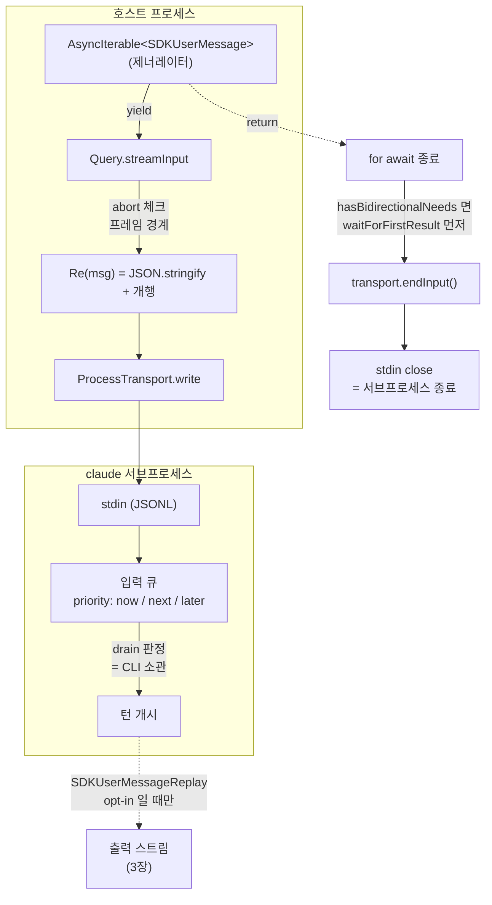

# 2. 입력 경로 — `SDKUserMessage`

> **근거 등급.** ①③ 은 `sdk.d.ts` **1급**. ②④ 는 `sdk.mjs` **2급**(식별자·로그 문자열 인용). ⑥ 은 CLI 내부 **3급 = 관측 불가**.
> 큐 admission·drain 루프의 일반론은 [1부 2.3](../02-제어-프로토콜과-턴-큐.md#23-입력-큐와-drain-루프--5장의-기반). 여기서는 **입력 요소 타입 하나**가 write 되기까지의 경로만 본다.

## 2.1 ① 시그니처

```ts
export declare type SDKUserMessage = {
    type: 'user';
    message: MessageParam;
    parent_tool_use_id: string | null;
    isSynthetic?: boolean;
    tool_use_result?: unknown;
    priority?: 'now' | 'next' | 'later';
    origin?: SDKMessageOrigin;
    shouldQuery?: boolean;
    timestamp?: string;
    uuid?: UUID;
    session_id?: string;
    subagent_type?: string;
    …
};
```
— `sdk.d.ts:4583`

`query({ prompt })` 의 두 번째 형태가 이 타입의 스트림이다:

```ts
prompt: string | AsyncIterable<SDKUserMessage>;
```
— `sdk.d.ts:2588`

필드 중 **필수는 셋**(`type`·`message`·`parent_tool_use_id`)뿐이다. 나머지는 전부 optional 이며, 각자 다른 층에서 해석된다:

| 필드 | 해석 주체 | 의미 |
|---|---|---|
| `message` | 모델 | 실제 content (base SDK `MessageParam`) |
| `parent_tool_use_id` | CLI | 서브에이전트 트리에서의 소속. 메인 스레드는 `null` |
| `priority` | CLI 입력 큐 | drain 클래스 — `'now'` / `'next'` / `'later'` |
| `uuid` | CLI 큐 + 호스트 | 상관키. **취소·영수증 목록에 이 값이 실린다** |
| `shouldQuery` | CLI | `false` 면 transcript 에만 붙이고 **assistant 턴을 열지 않는다**. 다음 질의 메시지에 병합된다 |
| `isSynthetic` | CLI | 사람이 친 것이 아님 |
| `origin` | 신뢰 게이트 | `{kind:'human'}` 을 **명시하지 않으면** unattributed 로 취급되어 strict `isHuman()` 에서 fail-closed (`sdk.d.ts:4022` JSDoc) |
| `session_id` | CLI | 생략 가능 — string prompt 경로는 `""` 를 싣는다([1장 §1.2](01-query-호출-생명주기.md#do--입력-배선의-두-갈래)) |

`uuid` 의 무게는 [4장 §4.4](04-제어-메서드-setModel-setPermissionMode-interrupt.md#44--구현-디테일)에서 드러난다 — `interrupt` 영수증의 `still_queued` / `cancelled` 목록은 **uuid 가 찍힌 메시지만** 열거한다. uuid 없이 넣은 메시지는 그대로 실행되지만 목록에는 영영 안 나온다.

### `SDKUserMessageReplay` — 되돌아오는 쌍둥이

```ts
export declare type SDKUserMessageReplay = { type: 'user'; message: MessageParam; … priority?: 'now'|'next'|'later'; … };
```
— `sdk.d.ts:4629`

필드 구성이 `SDKUserMessage` 와 사실상 같다. 차이는 **방향**이다 — 이쪽은 `SDKMessage` 유니언의 멤버로 CLI 가 **출력 스트림에 되돌려주는** variant다([3장](03-출력-경로-SDKMessage.md)). 호스트가 넣은 입력이 실제로 소비됐음을 관측하는 유일한 신호이며, 기본적으로는 방출되지 않는다(§7.3 의 bare flag 참조).

## 2.2 content — base SDK 타입을 그대로 쓴다

`message` 는 Claude Agent SDK 고유 타입이 아니라 **base SDK(`@anthropic-ai/sdk`) 의 `MessageParam`** 이다. 따라서 content 는 두 형태를 취한다:

| 형태 | 언제 |
|---|---|
| `string` | 순수 텍스트 |
| content block 배열 | 이미지 등 비텍스트가 섞일 때 — `{type:'image', source: Base64ImageSource}` |

즉 이미지 첨부는 Agent SDK 층에 별도 API 가 없고, base SDK 의 블록 스키마를 그대로 실어 보내는 것이 유일한 경로다.

## 2.3 ② 콜스택 — iterable 에서 stdin 까지

```js
async streamInput(e){
  ce("[Query.streamInput] Starting to process input stream");
  try{
    let t=0;
    for await(let r of e){
      if(t++, ce(`[Query.streamInput] Processing message ${t}: ${r.type}`), this.abortController?.signal.aborted) break;
      await Promise.resolve(this.transport.write(Re(r)+`\n`))
    }
    if(ce(`[Query.streamInput] Finished processing ${t} messages from input stream`),
       t>0&&this.hasBidirectionalNeeds())
      ce("[Query.streamInput] Has bidirectional needs, waiting for first result"), await this.waitForFirstResult();
    ce("[Query] Calling transport.endInput() to close stdin to CLI process"), this.transport.endInput()
  }catch(t){ if(!(t instanceof It)) throw t }
}
```
— `sdk.mjs::streamInput`

스택은 짧다:

```
소비자 iterable ──for await──▶ Query.streamInput
                                 └─ JSON.stringify + "\n"  (Re)
                                     └─ ProcessTransport.write
                                         └─ child.stdin
```

**변환이 거의 없다.** `SDKUserMessage` 객체는 직렬화 외의 가공 없이 한 줄 JSON 으로 stdin 에 나간다 — 필드 이름도 그대로다. 이것이 3장의 출력 경로(프레임 타입별 분기·필드 리네이밍이 있는)와 대조되는 지점이다.

## 2.4 ③ wire

한 줄 = 한 JSON. 호스트가 쓰는 프레임은 객체를 그대로 옮긴 형태다:

```jsonl
{"type":"user","message":{"role":"user","content":"…"},"parent_tool_use_id":null,"priority":"next","uuid":"…"}
```

string prompt 경로만 예외적으로 wrapper 가 프레임을 **합성**한다([1장 §1.2](01-query-호출-생명주기.md#do--입력-배선의-두-갈래)):

```jsonl
{"type":"user","session_id":"","message":{"role":"user","content":[{"type":"text","text":"…"}]},"parent_tool_use_id":null}
```

차이 둘: `session_id:""` 가 붙고, content 가 **항상 배열로 감싸진다**. 그래서 1-shot 경로에는 `priority`·`uuid` 가 원천적으로 없다.

## 2.5 ④ 구현 디테일

### eager drain — pull 은 소비가 아니다

`streamInput` 은 `for await` 로 iterable 을 **가능한 한 빨리** 끝까지 빨아들인다. 소비자가 `yield` 하는 순간 곧바로 stdin 으로 나간다. 즉:

> **제너레이터에서 값이 pull 됐다는 사실은 CLI 가 그 메시지를 처리했다는 뜻이 아니다.** stdin 버퍼에 들어갔다는 뜻일 뿐이다.

CLI 가 언제 그것을 턴으로 접수하는지는 `priority` 와 큐 상태가 정한다([1부 2.3](../02-제어-프로토콜과-턴-큐.md#23-입력-큐와-drain-루프--5장의-기반)). 실제 소비를 관측하려면 출력 스트림의 replay variant 를 봐야 한다(§2.1).

### abort 는 루프를 깬다 (프레임 경계에서)

```js
if(t++, …, this.abortController?.signal.aborted) break;
```

abort 확인은 **각 메시지 write 직전**에 한 번씩만 일어난다. 이미 write 에 들어간 프레임은 끝까지 나간다 — 프레임 중간에서 잘리지 않는다.

### 제너레이터 종료 = 세션 종료

`for await` 가 정상 종료하면(iterable 이 `return` 되면) 그 아래로 `endInput()` 이 이어진다(§2.3 코드). **stdin 이 닫히면 CLI 서브프로세스가 내려간다.** 그러므로 장수명 세션을 유지하려면 입력 제너레이터를 **끝내지 않아야** 한다.

역방향 콜백이 등록돼 있으면 `waitForFirstResult()` 를 먼저 기다린다 — stdin 을 먼저 닫아 되묻는 RPC 의 응답 통로를 잃는 것을 막는다([1장 §1.6](01-query-호출-생명주기.md#16-종료--두-가지-닫는-법)).

### 에러 삼킴

```js
catch(t){ if(!(t instanceof It)) throw t }
```

특정 내부 에러 타입(`It`)만 조용히 흡수하고 나머지는 다시 던진다. 던져진 예외는 `dO` 의 `.catch((o)=>n.abort(o))` 로 잡혀 **abortController 로 승격**된다([1장 §1.2](01-query-호출-생명주기.md#do--입력-배선의-두-갈래)) — 입력 실패가 곧 질의 전체의 중단이 된다.

## 2.6 ⑤ 다이어그램



## 2.7 ⑥ 관측 불가 구간 (코드에서 확인 안 됨)

| 항목 | 왜 확정 못 하나 |
|---|---|
| `priority` 세 값의 **실제 drain 규칙** — `'now'`/`'next'`/`'later'` 가 각각 큐 어디에 놓이는지 | 타입에 열거만 있고 JSDoc 이 없다. 판정은 바이너리 안 |
| 여러 메시지가 한 턴으로 **coalesce 되는 조건** | `interrupt` 영수증 JSDoc 이 "batch already dequeued and coalesced" 라는 *결과*만 알려준다(`sdk.d.ts:3487`) |
| `shouldQuery:false` 메시지가 다음 질의 메시지에 **병합되는 정확한 시점** | JSDoc 이 "merged into the next user message that does query" 까지만 서술 |
| `origin` 신뢰 게이트가 어떤 도구/경로에서 강제되는지 | fail-closed 라는 서술만 있고 강제 지점은 미관측 |
| stdin backpressure 시 CLI 측 동작 | wrapper 는 write 결과를 await 만 한다 |

---

← [1장 — `query()` 호출 생명주기](01-query-호출-생명주기.md) · [3장 — 출력 경로 `SDKMessage`](03-출력-경로-SDKMessage.md) →
