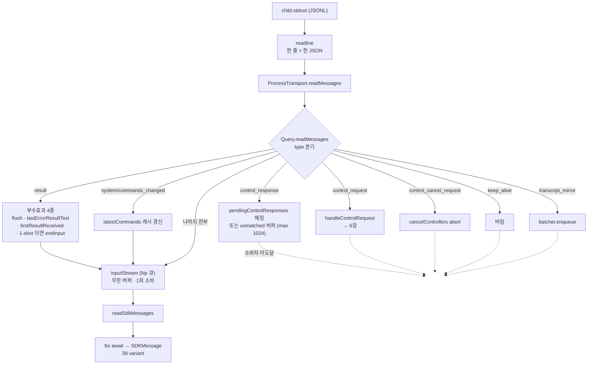

# 3. 출력 경로 — `SDKMessage`

> **근거 등급.** ①③ 은 `sdk.d.ts` **1급**. ②④ 는 `sdk.mjs` **2급**. ⑥ 은 CLI 내부 **3급 = 관측 불가**.
> 프레임 5종 분류·제어 채널 일반론은 [1부 2.1](../02-제어-프로토콜과-턴-큐.md#21-wire-는-한-줄--한-json-jsonl-양방향), 펌프 골격은 [1부 6.3~6.4](../06-콜스택-딥다이브.md#63-stdout-펌프--readmessages). 여기서는 **소비자가 실제로 받는 타입**과 그 앞에서 무엇이 걸러지는지를 본다.

## 3.1 ① 시그니처

`Query` 자체가 이 타입의 AsyncGenerator 다:

```ts
export declare interface Query extends AsyncGenerator<SDKMessage, void> { … }
```
— `sdk.d.ts:2279`

유니언은 **39 variant** 다:

```ts
export declare type SDKMessage = SDKAssistantMessage | SDKUserMessage | SDKUserMessageReplay
  | SDKResultMessage | SDKSystemMessage | SDKPartialAssistantMessage | SDKCompactBoundaryMessage
  | SDKStatusMessage | SDKAPIRetryMessage | SDKControlRequestProgressMessage
  | SDKModelRefusalFallbackMessage | SDKModelRefusalNoFallbackMessage | SDKLocalCommandOutputMessage
  | SDKHookStartedMessage | SDKHookProgressMessage | SDKHookResponseMessage | SDKPluginInstallMessage
  | SDKToolProgressMessage | SDKAuthStatusMessage | SDKTaskNotificationMessage | SDKTaskStartedMessage
  | SDKTaskUpdatedMessage | SDKTaskProgressMessage | SDKBackgroundTasksChangedMessage
  | SDKThinkingTokensMessage | SDKSessionStateChangedMessage | SDKWorkerShuttingDownMessage
  | SDKCommandsChangedMessage | SDKNotificationMessage | SDKFilesPersistedEvent
  | SDKToolUseSummaryMessage | SDKMemoryRecallMessage | SDKRateLimitEvent
  | SDKElicitationCompleteMessage | SDKPermissionDeniedMessage | SDKPromptSuggestionMessage
  | SDKMirrorErrorMessage | SDKInformationalMessage | SDKConversationResetMessage;
```
— `sdk.d.ts:4019`

**판별 방식이 균일하지 않다.** 대부분은 `type` + `subtype` 2단이고, 일부는 `type` 하나로 끝난다:

| 판별 | variant 예 |
|---|---|
| `type` 단독 | `assistant` · `user` · `result` · `stream_event` · `active_goal` |
| `type:'system'` + `subtype` | `init` · `task_started` · `task_progress` · `task_notification` · `compact_boundary` · `commands_changed` · `background_tasks_changed` · `session_state_changed` · `post_turn_summary` · `task_summary` · `mirror_error` … |

소비자가 `msg.type === 'system'` 만 보고 분기하면 20종 가까이가 한 갈래에 뭉친다 — `subtype` 을 함께 봐야 한다.

## 3.2 ② 콜스택 — stdout 에서 소비자까지

```
child.stdout ─readline─▶ ProcessTransport.readMessages
                            └─▶ Query.readMessages   ← 프레임 디스패치 (여기서 걸러진다)
                                  └─▶ Query.inputStream (Np 큐)
                                        └─▶ Query.readSdkMessages
                                              └─▶ for await (const msg of query)
```

중간 두 단이 핵심이다.

### `Query.readMessages` — 무엇이 소비자에게 안 가는가

```js
async readMessages(){try{for await(let e of this.transport.readMessages()){
  if(e.type==="control_response"){ …pendingControlResponses 매칭 또는 unmatched 보관…; continue }
  else if(e.type==="control_request"){ this.handleControlRequest(e); continue }
  else if(e.type==="control_cancel_request"){ this.handleControlCancelRequest(e); continue }
  else if(e.type==="keep_alive") continue;
  else if(e.type==="transcript_mirror"){ this.transcriptMirrorBatcher?.enqueue(e.filePath,e.entries); continue }
  …
  this.inputStream.enqueue(e)}
```
— `sdk.mjs::readMessages`

`continue` 가 붙은 다섯 종류는 **소비자에게 도달하지 않는다**:

| 프레임 | 처리 | 이유 |
|---|---|---|
| `control_response` | pending 맵에서 request_id 매칭 → resolve | 제어 RPC 응답([4장](04-제어-메서드-setModel-setPermissionMode-interrupt.md)) |
| `control_request` | `handleControlRequest` 로 역방향 처리 | SDK→호스트 콜백([6장](06-역방향-콜백-canUseTool-hooks.md)) |
| `control_cancel_request` | 해당 AbortController abort | 역방향 요청 취소 |
| `keep_alive` | 버린다 | 연결 유지용 |
| `transcript_mirror` | batcher 에 enqueue | 미러링 부수 채널 |

즉 **`SDKMessage` 유니언은 stdout 프레임의 부분집합**이다. 유니언에 없는 프레임이 wire 에는 더 있다.

### 곁가지로 새는 상태

```js
if(e.type==="system"&&e.subtype==="commands_changed"&&Array.isArray(e.commands)) this.latestCommands=e.commands;
```
— `sdk.mjs::readMessages`

`commands_changed` 는 소비자에게도 가고, 동시에 wrapper 내부 캐시(`latestCommands`)도 갱신한다. `SDKCommandsChangedMessage` JSDoc 이 *"Clients should REPLACE their cached command list with this payload"* 라고 요구하는 것과 짝을 이룬다(`sdk.d.ts:2933`).

### `result` 프레임의 특별 취급

```js
if(e.type==="result"){
  if(this.transcriptMirrorBatcher) await this.transcriptMirrorBatcher.flush();
  let t=e.is_error? (e.subtype==="success"? e.result : e.errors.map(…).join("; ")) : void 0;
  if(this.lastErrorResultText=t||void 0, this.firstResultReceived=!0, this.firstResultReceivedResolve) this.firstResultReceivedResolve();
  if(this.isSingleUserTurn) ce("[Query.readMessages] First result received for single-turn query, closing stdin"), this.transport.endInput()
}
```
— `sdk.mjs::readMessages`

`result` 는 소비자에게 전달되면서 동시에 네 가지 부수효과를 낸다: 미러 flush · 에러 텍스트 보관 · `waitForFirstResult()` 해소 · **1-shot 이면 stdin 닫기**([1장 §1.6](01-query-호출-생명주기.md#16-종료--두-가지-닫는-법)).

## 3.3 ③ wire — `tool_use_result` 라는 두 번째 경로

도구 결과는 **두 곳**에 실린다. 이것이 출력 경로에서 가장 놓치기 쉬운 지점이다.

| 경로 | 위치 | 내용 |
|---|---|---|
| ① content 블록 | `message.content[]` 안의 `tool_result` 블록 | **모델에게 보낸 문자열** |
| ② 별도 필드 | `SDKUserMessage.tool_use_result` (`sdk.d.ts:4591`) | **구조화 Output 객체** — 도구별 shape |

JSDoc 이 이 분리를 명시한다(`sdk.d.ts:4589`):

> Structured tool output — the tool's full Output object, **not the string content sent to the model**. […] For the Agent/Task tool the completed shape is the subagent's final report without the model-directed agentId/usage trailer, plus run totals — **render from it instead of parsing the tool_result text**.

즉 도구 결과를 정확히 다루려면 텍스트를 파싱하지 말고 `tool_use_result` 를 읽어야 한다. 필드 타입이 `unknown` 인 이유는 MCP·동적 도구가 각자 shape 를 갖기 때문이다.

메시지당 `tool_use_result` 는 **하나**뿐이므로, 한 프레임에 `tool_result` 블록이 여럿이면 구조화 출력과 블록의 1:1 대응이 성립하지 않는다.

### `includePartialMessages` 가 켜는 것

`Options.includePartialMessages` 는 `--include-partial-messages` 플래그로 내려간다(`sdk.mjs`, [7장](07-Options-표면과-실행파일-해석.md)). 켜면 `SDKPartialAssistantMessage`(wire 상 `type:"stream_event"`)가 스트림에 합류해 토큰 단위 증분을 받는다. 끄면 완성된 `assistant` 프레임만 온다.

## 3.4 ④ 구현 디테일

### unmatched control_response 는 유실 대신 버퍼된다

```js
if(this.unmatchedControlResponses.size>=Hh.UNMATCHED_CONTROL_RESPONSES_MAX){
  let r=this.unmatchedControlResponses.keys().next().value;
  if(r!==void 0) this.unmatchedControlResponses.delete(r)
}
this.unmatchedControlResponses.set(e.response.request_id,e.response)
```
— `sdk.mjs::readMessages`, `static UNMATCHED_CONTROL_RESPONSES_MAX=1024`

응답이 요청 등록보다 **먼저** 도착할 수 있으므로(경합), 짝을 못 찾은 응답을 1024개까지 보관하고 초과 시 **가장 오래된 것부터 버린다**(FIFO). `awaitControlResponse` 는 등록 시 이 맵을 먼저 뒤진다.

### 스트림 종료와 에러 승격

```js
this.inputStream.done(), this.cleanup()
```
— `sdk.mjs::readMessages` 정상 종료부

```js
if(this.lastErrorResultText!==void 0&&!(e instanceof It)&&e?.name!=="SSEHttpError"){
  let t=Error(`Claude Code returned an error result: ${this.lastErrorResultText}`); …
```
— 예외 경로

펌프가 예외로 끝날 때, 직전에 본 **에러 `result` 텍스트를 예외 메시지로 승격**한다. 그래서 소비자가 받는 예외에 CLI 가 준 진짜 사유가 실린다.

### 큐는 무한, 소비는 1회

전달 버퍼 `Np` 는 크기 제한이 없고 `"Stream can only be iterated once"` 로 재소비를 막는다([1장 §1.4](01-query-호출-생명주기.md#소비자-스트림은-큐-한-겹을-거친다)). 소비자가 느리면 메모리에 쌓이지 backpressure 가 걸리지 않는다.

## 3.5 ⑤ 다이어그램



## 3.6 ⑥ 관측 불가 구간 (코드에서 확인 안 됨)

| 항목 | 왜 확정 못 하나 |
|---|---|
| 39 variant 각각의 **방출 조건** — 어떤 상황에서 CLI 가 무엇을 내보내는지 | 타입 shape 만 1급으로 읽힌다. 방출 판정은 바이너리 안 |
| `system` 계열 subtype 의 **전수 목록** | 유니언 멤버로 역산할 수 있으나, 타입에 없는 subtype 이 wire 로 올 가능성은 배제 못 함 |
| `tool_use_result` 의 **도구별 정확한 shape** | 타입이 `unknown`. `sdk-tools.d.ts` 의 `*Output` 타입이 힌트지만 MCP/동적 도구는 런타임 결정 |
| 프레임 **순서 보장** 범위 — 어떤 쌍이 순서를 지키는지 | `interrupt` 영수증에 대해서만 JSDoc 이 순서를 언급한다(`sdk.d.ts:3487`). 일반 규칙은 미서술 |
| `stream_event` 증분과 완성 `assistant` 프레임의 **중복 관계** | 두 경로가 모두 오는지, 배타인지 타입으로는 미확정 |

---

← [2장 — 입력 경로 `SDKUserMessage`](02-입력-경로-SDKUserMessage.md) · [4장 — 제어 메서드](04-제어-메서드-setModel-setPermissionMode-interrupt.md) →
