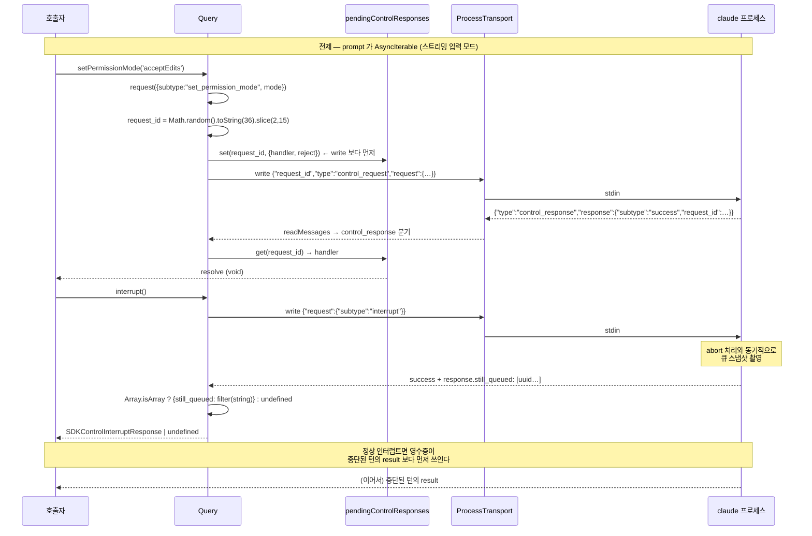

# 4. 제어 메서드 — `setModel` · `setPermissionMode` · `interrupt`

> **근거 등급.** ①③ 은 `sdk.d.ts` **1급**. ②④ 는 `sdk.mjs` **2급**. ⑥ 은 CLI 내부 **3급 = 관측 불가**.
> 제어 프로토콜 일반론(프레임 5종·capability 협상·재접속 재무장)은 [1부 2장](../02-제어-프로토콜과-턴-큐.md), 큐/drain 구조는 [1부 2.3](../02-제어-프로토콜과-턴-큐.md#23-입력-큐와-drain-루프--5장의-기반). 여기서는 **이 세 메서드**가 각각 어떤 프레임을 만들고 무엇을 되받는지만 본다.

## 4.0 공통 전제 — 스트리밍 입력 모드

```ts
/**
 * Control Requests
 * The following methods are control requests, and are only supported when
 * streaming input/output is used.
 */
```
— `sdk.d.ts:2280-2284`

세 메서드 모두 **`prompt` 가 `AsyncIterable` 일 때만** 의미가 있다. string prompt 경로는 `result` 도착 즉시 stdin 을 닫으므로([1장 §1.6](01-query-호출-생명주기.md#16-종료--두-가지-닫는-법)) 제어 요청을 써 넣을 통로가 남지 않는다.

## 4.1 ① 시그니처

```ts
interrupt(): Promise<SDKControlInterruptResponse | undefined>;   // sdk.d.ts:2293
setPermissionMode(mode: PermissionMode): Promise<void>;          // sdk.d.ts:2300
setModel(model?: string): Promise<void>;                         // sdk.d.ts:2327
```

```ts
export declare type PermissionMode = 'default' | 'acceptEdits' | 'bypassPermissions' | 'plan' | 'dontAsk' | 'auto';
```
— `sdk.d.ts:2092`

`setModel(model?)` 의 인자가 optional 인 것에 유의 — **생략하면 기본 모델로 되돌린다**(JSDoc: *"or undefined to use the default"*, `sdk.d.ts:2325`).

`interrupt()` 만 반환값이 있고, 그마저 `| undefined` 다. 이유는 capability 협상이다(§4.3).

## 4.2 ② 콜스택 — 세 메서드 모두 `request()` 한 겹

```js
async setModel(e){ await this.request({subtype:"set_model",model:e}) }
async setPermissionMode(e){ await this.request({subtype:"set_permission_mode",mode:e}) }
async interrupt(){ return Ir("sdk_interrupt",async()=>{
  let t=(await this.request({subtype:"interrupt"})).response?.still_queued;
  return Array.isArray(t)?{still_queued:t.filter((r)=>typeof r==="string")}:void 0 }) }
```
— `sdk.mjs` (`class Hh`)

스택이 얕다:

```
Query.setModel / setPermissionMode / interrupt
  └─ Query.request({subtype, …})          ← request_id 발급 + pending 등록
       └─ ProcessTransport.write(JSON + "\n")
            └─ child.stdin
… (비동기) …
child.stdout ─▶ Query.readMessages ─control_response─▶ pendingControlResponses 매칭 ─▶ Promise resolve
```

`setModel`·`setPermissionMode` 는 그야말로 한 줄 위임이다. `interrupt` 만 두 겹이 더 있다: 텔레메트리 래퍼 `Ir("sdk_interrupt", …)` 와 응답 정규화.

### `request()` — 상관 규약의 실체

```js
request(e){
  let t=Math.random().toString(36).substring(2,15);
  this.transport.expectControlResponse?.(t);
  let r={request_id:t,type:"control_request",request:e},
      n=e.subtype==="initialize";
  return new Promise((o,i)=>{
    this.pendingControlResponses.set(t,{handler:(s)=>{
      if(this.pendingControlResponses.delete(t), s.subtype==="success") o(s); else i(Error(s.error));
      if(!n&&(s.pending_permission_requests||s.pending_user_dialog_requests))
        ce(`[Query] Ignoring prompt-redelivery fields on non-initialize response (subtype=${e.subtype})`);
      else{ if(s.pending_permission_requests) this.processPendingPermissionRequests(s.pending_permission_requests);
            if(s.pending_user_dialog_requests) this.processPendingUserDialogRequests(s.pending_user_dialog_requests) }
    },reject:i}),
    Promise.resolve(this.transport.write(Re(r)+"\n"))…
```
— `sdk.mjs::request`

| 요소 | 값 |
|---|---|
| request_id 생성 | `Math.random().toString(36).substring(2,15)` — 최대 13자 base36. **UUID 가 아니다** |
| 등록 순서 | pending 맵 등록이 **write 보다 먼저** — 응답이 즉시 와도 놓치지 않는다 |
| 성공/실패 | `subtype==="success"` → resolve, 그 외 → `Error(s.error)` 로 reject |
| 재무장 필드 | `pending_permission_requests` / `pending_user_dialog_requests` 는 **`initialize` 응답에서만** 처리하고, 다른 subtype 에 실려 오면 로그만 남기고 무시 |

마지막 항목이 중요하다 — 재접속 시 미해결 권한 요청을 되살리는 경로([1부 6.4](../06-콜스택-딥다이브.md#재접속-시-미해결-요청-재무장))는 `initialize` 전용이며, `set_model` 응답에 그 필드가 붙어도 **재생하지 않는다**.

## 4.3 ③ wire

### 요청

```jsonl
{"request_id":"k3f9d2a1b7c","type":"control_request","request":{"subtype":"set_model","model":"claude-sonnet-5"}}
{"request_id":"…","type":"control_request","request":{"subtype":"set_permission_mode","mode":"acceptEdits"}}
{"request_id":"…","type":"control_request","request":{"subtype":"interrupt"}}
```

subtype 은 **snake_case**, 페이로드 필드는 메서드 인자명 그대로(`model`·`mode`)다.

### 응답

```jsonl
{"type":"control_response","response":{"subtype":"success","request_id":"…","response":{…}}}
{"type":"control_response","response":{"subtype":"error","request_id":"…","error":"…"}}
```

`setModel`·`setPermissionMode` 는 `response` 본문을 쓰지 않고 성공 여부만 본다(`await this.request(…)` — 반환값 폐기).

### `interrupt` 만 영수증을 되받는다

```ts
export declare type SDKControlInterruptResponse = {
    still_queued: string[];
    cancelled?: string[];
};
```
— `sdk.d.ts:3485`

`still_queued` 는 **"이 인터럽트에서 살아남아 여전히 실행될" 비동기 사용자 메시지의 uuid 목록**이다. JSDoc(`sdk.d.ts:3487`)이 규약을 직접 서술한다:

| 규약 | 내용 |
|---|---|
| 커버리지 | **uuid 가 찍힌** 메인 스레드 메시지만 열거. `[]` 가 "아무것도 안 돈다"는 뜻이 **아니다** |
| 이물질 | 클라이언트가 보낸 적 없는 내부 uuid(cron 트리거, auto-resume continuation)가 섞일 수 있다 — 모르는 uuid 는 에러가 아니라 **무시** |
| 취소 입도 | 큐에 남은 uuid 는 `cancel_async_message` 로 개별 취소 가능. 배치로 coalesce 된 뒤에는 **대표 uuid 취소만** 배치 전체를 떨어뜨리고, 비대표 uuid 취소는 no-op |
| 순서 | 정상 인터럽트면 영수증이 **중단된 턴의 result 보다 먼저** 쓰인다. 인터럽트 처리 중 크래시한 턴은 직접 write 경로로 에러 result 를 내보내 영수증을 앞지를 수 있다 |
| 스냅샷 시점 | abort 처리와 **동기적으로** 촬영. 나중에 큐를 조회하면 drain 루프에 항상 진다 |

### capability 협상 — 버전이 아니라 기능으로 판정

```
'interrupt_receipt_v1'        → 성공 응답에 still_queued 가 실린다
'interrupt_cancel_queued_v1'  → 요청의 cancel_queued:true 를 존중한다
```
— `sdk.d.ts:4448` (system/init `capabilities` JSDoc)

구형 CLI 는 `still_queued` 없는 빈 성공 응답을 보낸다 — 그래서 반환 타입이 `| undefined` 이고, wrapper 가 그것을 `Array.isArray(t)?…:void 0` 로 흡수한다(§4.2). **소비자는 버전을 스니핑하지 말고 `capabilities` 배열을 봐야 한다.**

`cancel_queued:true` 는 별도 옵션이다(`SDKControlInterruptRequest.cancel_queued`, `sdk.d.ts:3477`):

| `cancel_queued` | 결과 |
|---|---|
| `false` / 생략 | 큐 항목이 **살아남고** `still_queued` 에 나열된다 |
| `true` | 살아남았을 모든 uuid 를 제거하고 terminal `cancelled` 를 동기 방출. `still_queued` 는 **항상 빈 배열**, 목록은 `cancelled` 로 이동 |

JSDoc 이 용도까지 못박는다 — *"A Stop-means-stop-everything client (a remote UI's Stop button) sets this true so one round-trip halts the session; a wrapper that wants per-uuid control leaves it false and follows up with cancel_async_message."*

**주의**: `cancel_queued:true` 는 auto-resume continuation 처럼 클라이언트가 넣지 않은 내부 큐 항목도 함께 날린다(위 "이물질" 항목). 취소 의미가 넓다.

## 4.4 ④ 구현 디테일

### `Ir` — 성공/실패를 계측하는 래퍼

```js
function Ir(e,t,r){ try{ let n=await t(); return $w(e),n }catch(n){ throw jw(e,r?.(n)??"error"),n } }
```
— `sdk.mjs::Ir`

이름표(`"sdk_interrupt"`)를 달고 성공은 `$w`, 실패는 `jw` 로 보고한 뒤 **예외를 그대로 다시 던진다**. `setModel`·`setPermissionMode` 에는 이 래퍼가 없다 — 계측 대상이 아니다.

### 응답 억제와 무관

이 세 메서드는 **호스트 → CLI** 방향이므로, 역방향 요청에서 쓰는 응답 억제 센티널(`zw = Symbol("suppressControlResponse")`)이나 중복 배달 가드는 관여하지 않는다. 그 장치들은 [6장](06-역방향-콜백-canUseTool-hooks.md) 소관이다.

### 실패 모드

| 상황 | 결과 |
|---|---|
| 세션이 이미 닫힘 | `awaitControlResponse` 가 `Error("Query closed before response received")` 로 reject |
| CLI 가 error verdict | `Error(s.error)` 로 reject — 메시지는 CLI 가 준 문자열 |
| stdin 이 죽어 있음 | transport write 가 `"ProcessTransport is not ready for writing"` 으로 실패 |
| 응답이 요청 등록보다 먼저 도착 | unmatched 버퍼(최대 1024)에서 회수 — 유실되지 않는다([3장 §3.4](03-출력-경로-SDKMessage.md#unmatched-control_response-는-유실-대신-버퍼된다)) |

### 적용 시점

`setModel`·`setPermissionMode` 의 Promise 는 **CLI 가 요청을 접수했다**는 것만 보증한다. 이미 진행 중인 도구 호출에 소급 적용되는지는 관측 불가(§4.6).

## 4.5 ⑤ 다이어그램



## 4.6 ⑥ 관측 불가 구간 (코드에서 확인 안 됨)

| 항목 | 왜 확정 못 하나 |
|---|---|
| `set_permission_mode` 가 **진행 중인 도구 호출**에 소급 적용되는지, 다음 도구부터인지 | wrapper 는 요청을 보내고 성공만 확인한다. 적용 경계는 바이너리 안 |
| `set_model` 이 **진행 중인 어시스턴트 응답**에 미치는 영향 | 동일 |
| `PermissionMode` 6종 각각이 CLI 내부 판정에서 갖는 **우선순위** | 값 목록만 1급. 판정 로직 미관측 |
| `interrupt` 가 abort 를 전파하는 **내부 순서** — 도구 취소 → 턴 중단 → 큐 스냅샷의 실제 배열 | JSDoc 이 "synchronously with abort processing" 까지만 서술 |
| `cancel_queued:true` 에서 uuid-less 큐 항목이 "dequeued 되지만 나열 불가" 라고 할 때, 실제로 실행되는지 | JSDoc 이 prewait 창의 uuid-less 항목은 *"still runs"* 라고만 명시. 그 외 경계는 미서술 |
| 구형 CLI 가 `cancel_queued` 를 무시할 때 남는 상태 | *"older CLIs ignore the field and behave as if false"* 라는 서술만 있고 검증 불가 |

---

← [3장 — 출력 경로 `SDKMessage`](03-출력-경로-SDKMessage.md) · [5장 — 태스크 제어](05-태스크-제어-stopTask-backgroundTasks.md) →
