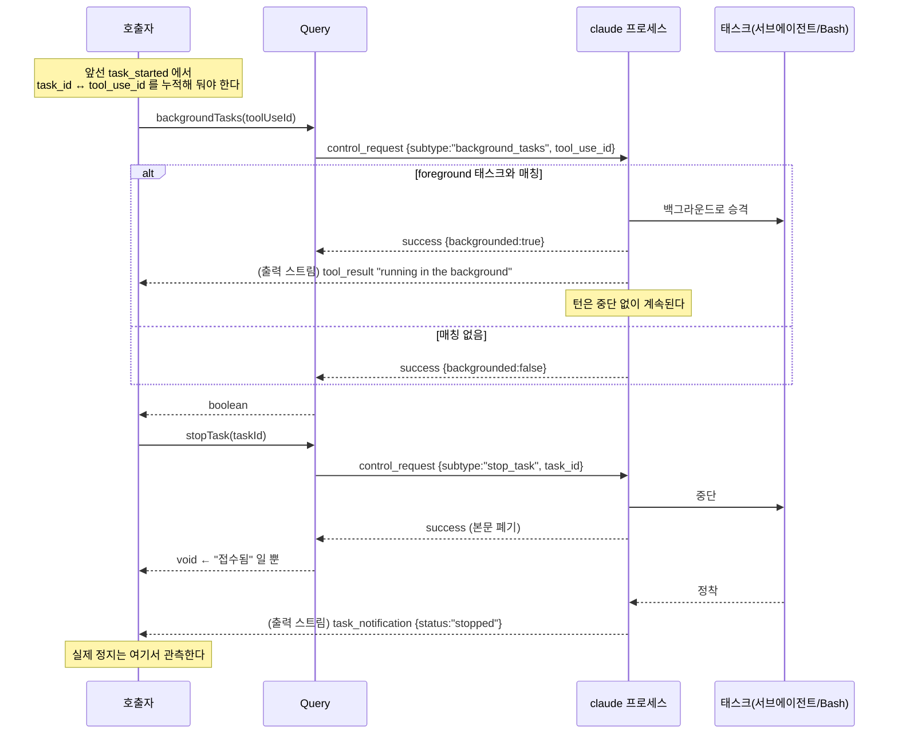
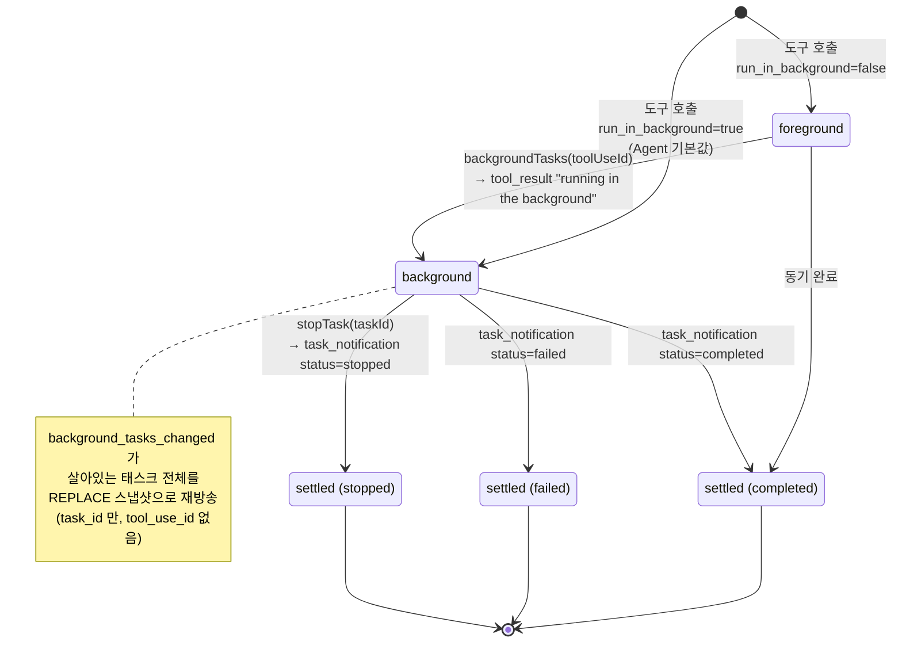

# 5. 태스크 제어 — `stopTask` · `backgroundTasks`

> **근거 등급.** ①③ 은 `sdk.d.ts` / `sdk-tools.d.ts` **1급**. ②④ 는 `sdk.mjs` **2급**. ⑥ 은 CLI 내부 **3급 = 관측 불가**.
> 왜 서브에이전트가 기본으로 백그라운드가 되고 메인 턴이 먼저 끝나는지(런치 영수증 → auto-resume continuation)는 [1부 5장](../05-비동기-턴-전환-listen-모델.md)이 정본이다. 여기서는 **그 상태를 밖에서 건드리는 두 메서드**만 본다.

## 5.1 ① 시그니처

```ts
/**
 * Stop a running task. A task_notification with status 'stopped' will be emitted.
 * @param taskId - The task ID from task_notification events
 */
stopTask(taskId: string): Promise<void>;
```
— `sdk.d.ts:2558-2562`

```ts
/**
 * Background in-flight foreground tasks (Bash commands and subagents).
 * With `toolUseId`, targets the single task started by that tool_use
 * block; without it, backgrounds all foreground tasks — equivalent to
 * pressing Ctrl+B in the terminal. Each blocking tool call returns
 * immediately with a "running in the background" tool_result and the
 * turn continues; the task keeps running and emits a task_notification
 * when it settles.
 * @param toolUseId - Optional tool_use block id to target a single task
 * @returns true when at least one task was backgrounded; false only
 *   when `toolUseId` was given and it matched no foreground task
 */
backgroundTasks(toolUseId?: string): Promise<boolean>;
```
— `sdk.d.ts:2563-2575`

두 메서드의 **인자 종류가 다르다**. 이것이 이 장에서 가장 중요한 사실이다.

## 5.2 두 식별자 체계 — `task_id` vs `tool_use_id`

| 식별자 | 무엇을 가리키나 | 어디서 얻나 | 쓰는 메서드 |
|---|---|---|---|
| `task_id` | **실행 중인 태스크** | `task_started` · `task_progress` · `task_notification` 의 `task_id` | `stopTask(taskId)` |
| `tool_use_id` | 그 태스크를 **띄운 도구 호출 블록** | `assistant` 메시지의 `tool_use` 블록 `id` (태스크 메시지에도 optional 로 실림) | `backgroundTasks(toolUseId)` |

라이프사이클 메시지들이 둘을 함께 싣는데, **`task_id` 만 필수이고 `tool_use_id` 는 optional** 이다:

```ts
export declare type SDKTaskStartedMessage = {
    type: 'system'; subtype: 'task_started';
    task_id: string;
    tool_use_id?: string;          // ← optional
    description: string;
    subagent_type?: string; task_type?: string; workflow_name?: string; prompt?: string;
    skip_transcript?: boolean;
    uuid: UUID; session_id: string;
};
```
— `sdk.d.ts:4498`

```ts
export declare type SDKTaskNotificationMessage = {
    type: 'system'; subtype: 'task_notification';
    task_id: string;
    tool_use_id?: string;          // ← optional
    status: 'completed' | 'failed' | 'stopped';
    output_file: string; summary: string;
    usage?: { total_tokens: number; tool_uses: number; duration_ms: number };
    skip_transcript?: boolean;
    uuid: UUID; session_id: string;
};
```
— `sdk.d.ts:4458`

**결과**: `tool_use_id` 로만 알고 있는 태스크는 `stopTask` 를 부를 수 없고, `task_id` 로만 아는 태스크는 `backgroundTasks` 로 지목할 수 없다. 두 방향의 매핑은 앞선 라이프사이클 메시지에서 **소비자가 직접 누적**해 둬야 한다 — 조회 API 가 없다.

같은 이유로 `stopTask` 의 JSDoc 이 `taskId` 출처를 *"The task ID from task_notification events"* 라고 못박는다.

### 레벨 스냅샷 — 놓친 매핑을 복구하는 유일한 채널

```ts
export declare type SDKBackgroundTasksChangedMessage = {
    type: 'system'; subtype: 'background_tasks_changed';
    /** Every live background task after the change. REPLACE semantics: swap your set for this payload. */
    tasks: { task_id: string; task_type: string; description: string }[];
    uuid: UUID; session_id: string;
};
```
— `sdk.d.ts:2915`

edge 신호(`task_started`/`task_notification`)를 하나 놓치면 "실행 중" 표시가 영구 고착되므로, **레벨 스냅샷**으로 복구 가능하게 만들어 둔 것이다(edge/level 이중화의 배경은 [1부 2.4](../02-제어-프로토콜과-턴-큐.md#24-관측-신호-edge-와-level)). 다만 이 payload 에는 `tool_use_id` 가 **없다** — 스냅샷으로는 `backgroundTasks` 대상을 복구할 수 없다.

## 5.3 ② 콜스택

```js
async stopTask(e){ await this.request({subtype:"stop_task",task_id:e}) }
async backgroundTasks(e){ return (await this.request({subtype:"background_tasks",tool_use_id:e})).response.backgrounded??!0 }
```
— `sdk.mjs` (`class Hh`)

4장의 세 메서드와 동일하게 `request()` 한 겹이다:

```
Query.stopTask / backgroundTasks
  └─ Query.request({subtype, task_id | tool_use_id})
       └─ ProcessTransport.write(JSON + "\n") ─▶ child.stdin
… (비동기) …
control_response ─▶ pendingControlResponses 매칭 ─▶ resolve
```

차이는 반환값 처리다:

- `stopTask` — 응답 본문을 버린다. **성공 = "요청이 접수됐다"** 일 뿐, 태스크가 실제로 멈췄다는 뜻이 아니다. 실제 정지는 `task_notification status:'stopped'` 로 관측한다.
- `backgroundTasks` — `response.backgrounded` 를 읽되 **`?? true` 로 기본값을 채운다**. 필드가 없는(구형) 응답은 성공으로 해석된다.

`interrupt` 와 달리 두 메서드에는 텔레메트리 래퍼 `Ir(…)` 이 없다.

## 5.4 ③ wire

### 요청

```jsonl
{"request_id":"…","type":"control_request","request":{"subtype":"stop_task","task_id":"…"}}
{"request_id":"…","type":"control_request","request":{"subtype":"background_tasks","tool_use_id":"toolu_…"}}
```

`backgroundTasks()` 를 인자 없이 부르면 `tool_use_id` 가 `undefined` 가 되어 **직렬화에서 필드째 사라진다** — 그것이 곧 "모든 foreground 태스크" 를 뜻하는 wire 형태다(Ctrl+B 등가).

### 응답

```jsonl
{"type":"control_response","response":{"subtype":"success","request_id":"…","response":{"backgrounded":true}}}
```

### 후속 이벤트 — 진짜 결과는 여기로 온다

| 메서드 | 뒤따르는 출력 프레임 |
|---|---|
| `stopTask` | `task_notification` `status:'stopped'` (JSDoc 이 명시) |
| `backgroundTasks` | 대상 도구 호출이 **즉시** *"running in the background"* `tool_result` 로 반환되고 턴이 계속된다. 태스크가 정착하면 `task_notification` |

두 메서드 모두 **요청-응답이 결과를 담지 않는다**. 결과는 출력 스트림([3장](03-출력-경로-SDKMessage.md))으로 온다.

## 5.5 ④ 구현 디테일

### `backgrounded ?? true` 의 의미

```js
(await this.request({subtype:"background_tasks",tool_use_id:e})).response.backgrounded??!0
```

`??` 는 `null`/`undefined` 에만 반응하므로, CLI 가 `backgrounded:false` 를 명시하면 그대로 `false` 가 나간다. 타입 JSDoc 이 `false` 의 조건을 하나로 좁힌다:

> *"false only when `toolUseId` was given and it matched no foreground task"*

즉 `false` 는 **"그 tool_use_id 로 지목한 foreground 태스크가 없다"** 는 뜻이지, 실패가 아니다. 이미 백그라운드로 돌고 있는 태스크를 다시 지목해도 매칭되지 않는다.

### foreground 만 대상이다

메서드 이름과 JSDoc 이 *"Background **in-flight foreground** tasks"* 로 대상을 한정한다. 백그라운드 태스크를 백그라운드로 보내는 것은 무의미하므로, 이미 비동기로 뜬 서브에이전트에는 `backgroundTasks` 가 효과가 없다.

여기서 기본값 방향을 함께 봐야 한다:

| 도구 | `run_in_background` 기본값 | 근거 |
|---|---|---|
| Agent(서브에이전트) | **true** — *"Agents run in the background by default; you will be notified when one completes. Set to false to run this agent synchronously"* | `sdk-tools.d.ts:502-504` |
| Bash | **false** — *"Set to true to run this command in the background."* | `sdk-tools.d.ts:545-548` |

**두 도구의 기본값이 반대다.** 그래서 서브에이전트는 대개 이미 백그라운드라 `backgroundTasks` 의 대상이 아니고, Bash 는 기본 foreground 라 대상이 된다.

또한 이 필드는 **모델이 채우는 도구 입력**이지 SDK 옵션이 아니다 — 호스트가 강제하려면 `canUseTool` 의 `updatedInput` 으로 입력을 재작성해야 한다([6장](06-역방향-콜백-canUseTool-hooks.md)).

### 조회 API 가 없다

`Query` 인터페이스 전체를 통틀어 **태스크 상태를 조회하는 메서드는 없다**(`sdk.d.ts:2279-2585`). `stopTask` 를 부른 뒤 "멈췄나?" 를 물을 방법이 없고, 오직 출력 스트림을 계속 소비해야 한다. 이것이 [1부 5.6](../05-비동기-턴-전환-listen-모델.md#56-f-호출자-계약-listen--polling-이-아니다)이 말한 **listen 계약**이 태스크 제어에도 그대로 적용되는 이유다.

### 실패 모드

| 상황 | 결과 |
|---|---|
| 존재하지 않는 `task_id` | `stopTask` 는 응답을 버리므로 호출자에게 구별되지 않는다 — CLI 가 error verdict 를 주면 reject, 아니면 조용히 성공 |
| 매칭 없는 `tool_use_id` | `backgroundTasks` → `false` |
| 스트리밍 입력 모드가 아님 | 제어 요청 자체가 불가([4장 §4.0](04-제어-메서드-setModel-setPermissionMode-interrupt.md#40-공통-전제--스트리밍-입력-모드)) |

## 5.6 ⑤ 다이어그램

### 호출 시퀀스



### 태스크 상태 전이



## 5.7 ⑥ 관측 불가 구간 (코드에서 확인 안 됨)

| 항목 | 왜 확정 못 하나 |
|---|---|
| `stop_task` 가 태스크를 **어떻게 중단**하는지 — 협조적 취소인지 강제 종료인지 | 요청 전달까지만 관측된다 |
| 존재하지 않는 `task_id` 에 대해 CLI 가 **error verdict 를 주는지 성공을 주는지** | wrapper 가 응답 본문을 버려 구별 불가 |
| `backgroundTasks()` 무인자 호출이 **어떤 태스크 집합**을 foreground 로 판정하는지 | "Ctrl+B 등가" 라는 서술만 있고 판정 로직은 바이너리 안 |
| `tool_use_id` 가 `task_started` 에 **실리지 않는 조건** (optional 인 이유) | 타입이 optional 이라는 사실만 1급 |
| 백그라운드 승격 후 `tool_result` 문자열의 **정확한 형식** | *"running in the background"* 라는 JSDoc 서술만 |
| `stopTask` 직후 이미 완료된 태스크의 최종 status (`stopped` vs `completed`) 경합 해소 | 미서술 |

---

← [4장 — 제어 메서드](04-제어-메서드-setModel-setPermissionMode-interrupt.md) · [6장 — 역방향 콜백](06-역방향-콜백-canUseTool-hooks.md) →
