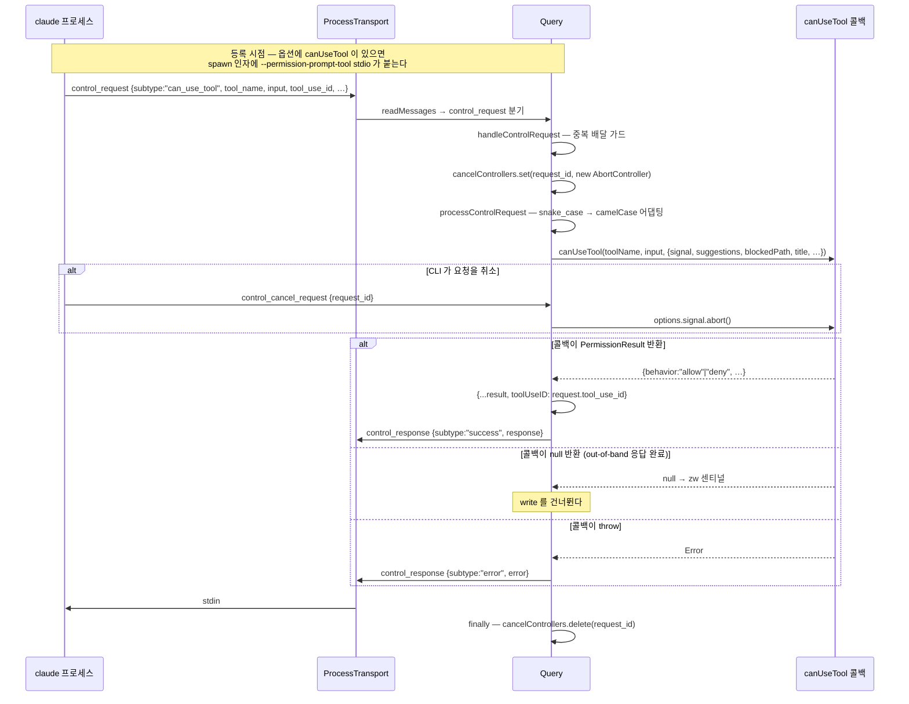
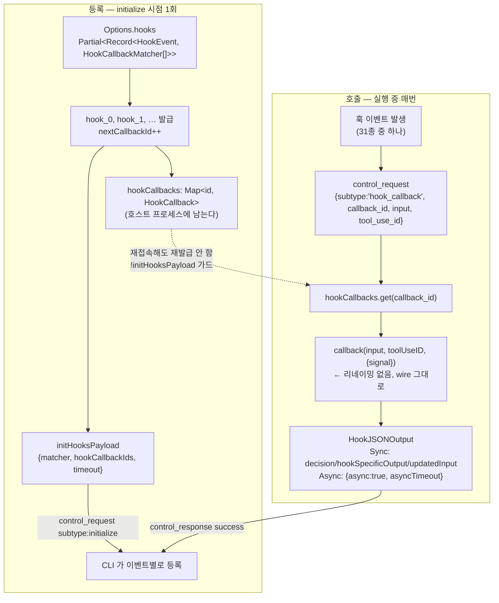

# 6. 역방향 콜백 — `canUseTool` · `hooks`

> **근거 등급.** ①③ 은 `sdk.d.ts` **1급**. ②④ 는 `sdk.mjs` **2급**. ⑥ 은 CLI 내부 **3급 = 관측 불가**.
> tool calling 규약 전반(블록 shape · 도구 3계열 · 훅 개입 지점)은 [1부 3장](../03-tool-calling-규약.md)이 정본이다. 여기서는 **콜백이라는 심볼 두 개**가 등록에서 응답까지 어떤 프레임을 타는지만 본다.

## 6.0 방향이 반대다

앞선 1~5장은 전부 **호스트 → SDK** 였다. 이 두 심볼만 반대다:

```
호스트가 옵션으로 콜백을 등록 → CLI 가 실행 중 control_request 를 보냄 → 호스트가 응답 프레임을 씀
```

호스트 입장에서 이것은 *호출*이 아니라 **서버 역할**이다. 그래서 요청 중복 배달·취소·응답 억제 같은, 앞 장들에 없던 장치가 전부 여기에 있다.

## 6.1 ① 시그니처

```ts
export declare type CanUseTool = (toolName: string, input: Record<string, unknown>, options: {
    signal: AbortSignal;
    suggestions?: PermissionUpdate[];
    blockedPath?: string;
    decisionReason?: string;
    title?: string;
    displayName?: string;
    description?: string;
    toolUseID?: string;
    agentID?: string;
    requestId?: string;
    matchedAskRule?: { source: …; toolName: string; ruleContent?: string };
}) => Promise<PermissionResult>;
```
— `sdk.d.ts:206`

```ts
export declare type PermissionResult = {
    behavior: 'allow';
    updatedInput?: Record<string, unknown>;
    updatedPermissions?: PermissionUpdate[];
    toolUseID?: string;
    decisionClassification?: PermissionDecisionClassification;
} | {
    behavior: 'deny';
    message: string;
    interrupt?: boolean;
    toolUseID?: string;
    decisionClassification?: PermissionDecisionClassification;
};
```
— `sdk.d.ts:2114`

```ts
export declare type HookCallback = (input: HookInput, toolUseID: string | undefined, options: {
    signal: AbortSignal;
}) => Promise<HookJSONOutput>;

export declare interface HookCallbackMatcher {
    matcher?: string;
    hooks: HookCallback[];
    /** Timeout in seconds for all hooks in this matcher */
    timeout?: number;
}
```
— `sdk.d.ts:821`, `:828`

```ts
hooks?: Partial<Record<HookEvent, HookCallbackMatcher[]>>;
```
— `sdk.d.ts:1521`

### 비대칭 하나 — `deny` 만 `message` 가 필수다

`allow` 는 모든 필드가 optional 이지만 `deny` 는 `message: string` 이 **필수**다. 거부에는 반드시 모델에게 전달할 사유가 붙는다.

`deny` 의 `interrupt?: boolean` 이 두 번째 갈림길이다 — 거부만 하고 모델이 계속 진행하게 둘지, 턴 자체를 끊을지가 이 한 필드로 갈린다.

### `HookEvent` 는 31종

```ts
export declare type HookEvent = 'PreToolUse' | 'PostToolUse' | 'PostToolUseFailure' | 'PostToolBatch'
  | 'Notification' | 'UserPromptSubmit' | 'UserPromptExpansion' | 'SessionStart' | 'SessionEnd'
  | 'Stop' | 'StopFailure' | 'SubagentStart' | 'SubagentStop' | 'PreCompact' | 'PostCompact'
  | 'PermissionRequest' | 'PermissionDenied' | 'Setup' | 'TeammateIdle' | 'TaskCreated'
  | 'TaskCompleted' | 'Elicitation' | 'ElicitationResult' | 'ConfigChange' | 'WorktreeCreate'
  | 'WorktreeRemove' | 'InstructionsLoaded' | 'CwdChanged' | 'FileChanged' | 'DirectoryAdded'
  | 'MessageDisplay';
```
— `sdk.d.ts:835`

### `HookJSONOutput` — 동기/비동기 두 형태

```ts
export declare type HookJSONOutput = AsyncHookJSONOutput | SyncHookJSONOutput;
export declare type AsyncHookJSONOutput = { async: true; asyncTimeout?: number };
export declare type SyncHookJSONOutput = {
    continue?: boolean; suppressOutput?: boolean; stopReason?: string;
    decision?: 'approve' | 'block'; systemMessage?: string;
    terminalSequence?: string; reason?: string;
    hookSpecificOutput?: PreToolUseHookSpecificOutput | UserPromptSubmitHookSpecificOutput
      | UserPromptExpansionHookSpecificOutput | SessionStartHookSpecificOutput | SetupHookSpecificOutput
      | SubagentStartHookSpecificOutput | PostToolUseHookSpecificOutput | PostToolUseFailureHookSpecificOutput
      | PostToolBatchHookSpecificOutput | StopHookSpecificOutput | SubagentStopHookSpecificOutput
      | PermissionDeniedHookSpecificOutput | NotificationHookSpecificOutput | PermissionRequestHookSpecificOutput
      | ElicitationHookSpecificOutput | ElicitationResultHookSpecificOutput | CwdChangedHookSpecificOutput
      | FileChangedHookSpecificOutput | WorktreeCreateHookSpecificOutput | MessageDisplayHookSpecificOutput;
};
```
— `sdk.d.ts:839`, `:6839`

`{async:true}` 를 반환하면 그 자리에서 결정하지 않고 나중에 응답한다는 뜻이다.

`hookSpecificOutput` 은 **이벤트 전용 페이로드 20종**의 유니언이며, 각 멤버가 `hookEventName` 리터럴로 자기를 판별한다. 대표 셋:

```ts
export declare type PreToolUseHookSpecificOutput = {
    hookEventName: 'PreToolUse';
    permissionDecision?: HookPermissionDecision;
    permissionDecisionReason?: string;
    updatedInput?: Record<string, unknown>;
    additionalContext?: string;
};
```
— `sdk.d.ts:2255`

| 타입 | `hookEventName` | 고유 필드 |
|---|---|---|
| `PreToolUseHookSpecificOutput` (`sdk.d.ts:2255`) | `'PreToolUse'` | `permissionDecision` · `permissionDecisionReason` · **`updatedInput`** — 도구 **입력**을 재작성 |
| `PostToolUseHookSpecificOutput` (`sdk.d.ts:2229`) | `'PostToolUse'` | **`updatedToolOutput`** — *"Replaces the tool output before it is sent to the model"* |
| `UserPromptSubmitHookSpecificOutput` (`sdk.d.ts:7102`) | `'UserPromptSubmit'` | `sessionTitle` · `suppressOriginalPrompt` (block 시 원문 프롬프트 생략) |

세 타입 모두 `additionalContext?: string` 을 공유한다. 재작성 지점은 **단계별로 다르다** — 실행 전에는 입력(`updatedInput`), 실행 후에는 **모델에 전달되기 직전의 출력**(`updatedToolOutput`). 즉 훅은 도구 호출의 양쪽 끝을 모두 가로챌 수 있다.

**훅도 `updatedInput` 으로 도구 입력을 재작성할 수 있다** — `canUseTool` 의 전유물이 아니다.

## 6.2 ② 콜스택 — 요청이 들어오는 경로

```
child.stdout ─▶ ProcessTransport.readMessages
                  └─▶ Query.readMessages
                        └─ type==="control_request" ─▶ Query.handleControlRequest   ← 멱등 가드 + 취소 배선
                              └─▶ Query.processControlRequest                        ← subtype 라우팅
                                    ├─ "can_use_tool"  ─▶ this.canUseTool(…)
                                    └─ "hook_callback" ─▶ this.handleHookCallbacks(…)
                                          └─▶ hookCallbacks.get(callback_id)(input, toolUseID, {signal})
                        ◀── 결과 ──┘
                  ProcessTransport.write(control_response)
```

### `handleControlRequest` — 가드 세 겹

```js
async handleControlRequest(e){
  if(this.cancelControllers.has(e.request_id)){
    ce(`[Query.handleControlRequest] Duplicate delivery of in-flight request ${e.request_id} (${e.request.subtype}) — skipping`); return }
  let t=new AbortController; this.cancelControllers.set(e.request_id,t);
  try{
    let r=await this.processControlRequest(e,t.signal);
    if(this.cleanupPerformed) return;
    if(r===zw) return;
    let n={type:"control_response",response:{subtype:"success",request_id:e.request_id,response:r}};
    await Promise.resolve(this.transport.write(Re(n)+"\n"))
  }catch(r){
    if(this.cleanupPerformed) return;
    let n={type:"control_response",response:{subtype:"error",request_id:e.request_id,error:Ui(r)}};
    try{ await Promise.resolve(this.transport.write(Re(n)+"\n")) }
    catch(o){ ce(`[Query.handleControlRequest] Error-response write failed: ${Ui(o)}`,{level:"error"}) }
  }finally{ this.cancelControllers.delete(e.request_id) }
}
```
— `sdk.mjs::handleControlRequest`

| 가드 | 코드 | 이유 |
|---|---|---|
| **중복 배달** | `if(this.cancelControllers.has(request_id)) … skipping` | 같은 request_id 가 live 프레임으로도, replay 로도 올 수 있다. 한 번만 처리한다 |
| **정리 후 무응답** | `if(this.cleanupPerformed) return` (성공·에러 양쪽) | 세션이 닫힌 뒤 write 를 시도하지 않는다 |
| **응답 억제 센티널** | `if(r===zw) return` | 콜백이 out-of-band 로 이미 응답했음을 알리는 신호 — wrapper 는 자기 write 를 건너뛴다 |

```js
zw=Symbol("suppressControlResponse")
```
— `sdk.mjs`

콜백이 `null` 을 반환하면 `processControlRequest` 가 이 심볼로 바꿔 돌려주고, 그러면 응답 프레임이 나가지 않는다.

### 취소 배선

```js
handleControlCancelRequest(e){ let t=this.cancelControllers.get(e.request_id); if(t) t.abort(), this.cancelControllers.delete(e.request_id) }
```
— `sdk.mjs::handleControlCancelRequest`

CLI 가 `control_cancel_request` 를 보내면 **콜백에 넘긴 `options.signal` 이 abort 된다**. 콜백이 이 신호를 무시하고 사용자 응답만 기다리면 영영 await 에 걸린다.

## 6.3 ③ wire — `can_use_tool` 요청과 필드 리네이밍

```js
if(e.request.subtype==="can_use_tool"){
  if(!this.canUseTool) throw Error("canUseTool callback is not provided.");
  let r=await this.canUseTool(e.request.tool_name, e.request.input, {
    signal:t,
    suggestions:e.request.permission_suggestions,
    blockedPath:e.request.blocked_path,
    decisionReason:e.request.decision_reason,
    title:e.request.title, displayName:e.request.display_name, description:e.request.description,
    toolUseID:e.request.tool_use_id, agentID:e.request.agent_id, requestId:e.request_id,
    ...e.request.matched_ask_rule&&{matchedAskRule:{source:…, toolName:e.request.matched_ask_rule.tool_name, …}}});
  if(r===null) return zw;
  return {...r, toolUseID:e.request.tool_use_id}
}
```
— `sdk.mjs::processControlRequest`

**wire 는 snake_case, 콜백 인자는 camelCase** 다. 이 어댑팅 층이 두 이름 체계의 경계다:

| wire 필드 | 콜백 옵션 |
|---|---|
| `tool_name` | (1번 인자 `toolName`) |
| `permission_suggestions` | `suggestions` |
| `blocked_path` | `blockedPath` |
| `decision_reason` | `decisionReason` |
| `display_name` | `displayName` |
| `tool_use_id` | `toolUseID` |
| `agent_id` | `agentID` |
| `request_id` | `requestId` |
| `matched_ask_rule.tool_name` | `matchedAskRule.toolName` |

반환 시 wrapper 가 **`toolUseID` 를 덧씌운다**(`{...r, toolUseID:e.request.tool_use_id}`) — 콜백이 채우지 않아도 상관키가 보존된다.

`title` 은 그대로 통과하는데, JSDoc 이 용법을 지정한다(`sdk.d.ts:226-228`, 필드는 `:230`): *"Full permission prompt sentence rendered by the bridge […] Use this as the primary prompt text when present instead of reconstructing from toolName+input."*

### 프레임 예시

```jsonl
← {"type":"control_request","request_id":"…","request":{"subtype":"can_use_tool","tool_name":"Write","input":{…},"tool_use_id":"toolu_…","permission_suggestions":[…],"title":"Claude wants to …"}}
→ {"type":"control_response","response":{"subtype":"success","request_id":"…","response":{"behavior":"allow","updatedInput":{…},"toolUseID":"toolu_…"}}}
```

거부:

```jsonl
→ {"type":"control_response","response":{"subtype":"success","request_id":"…","response":{"behavior":"deny","message":"…","interrupt":true}}}
```

`behavior:"deny"` 도 **control_response 로는 success** 다 — `subtype:"error"` 는 콜백이 던졌을 때만 쓴다.

## 6.4 ③ wire — `hook_callback` 요청

```js
else if(e.request.subtype==="hook_callback")
  return await this.handleHookCallbacks(e.request.callback_id, e.request.input, e.request.tool_use_id, t);
```

```js
handleHookCallbacks(e,t,r,n){
  let o=this.hookCallbacks.get(e);
  if(!o) throw Error(`No hook callback found for ID: ${e}`);
  return o(t,r,{signal:n})
}
```
— `sdk.mjs::handleHookCallbacks`

`can_use_tool` 과 달리 **필드 리네이밍이 없다** — `input` 을 그대로 콜백에 넘긴다. 그래서 훅 입력은 wire 그대로 snake_case(`hook_event_name`·`tool_name` 등)로 콜백에 도착한다.

## 6.5 `canUseTool` 은 CLI 플래그를 바꾼다

```js
if(xt){ if(T) throw Error("canUseTool callback cannot be used with permissionPromptToolName. Please use one or the other.");
        H.push("--permission-prompt-tool","stdio") }
else if(T) H.push("--permission-prompt-tool",T)
```
— `sdk.mjs` (`Uw` 인자 조립부, `xt`=canUseTool · `T`=permissionPromptToolName)

콜백을 주면 **`--permission-prompt-tool stdio`** 가 붙는다 — 즉 "권한 판정을 stdio 저편에 물어라" 가 CLI 에게 전달되는 방식이다. `permissionPromptToolName` 과는 **상호 배타**이며, 둘을 함께 주면 옵션 조립 단계에서 즉시 throw 한다.

## 6.6 `hooks` — 콜백 ID 로 치환된다

```js
if(this.hooks&&!this.initHooksPayload){
  this.initHooksPayload={};
  for(let[n,o]of Object.entries(this.hooks)) if(o.length>0)
    this.initHooksPayload[n]=o.map((i)=>{
      let s=[];
      for(let a of i.hooks){ let c=`hook_${this.nextCallbackId++}`; this.hookCallbacks.set(c,a), s.push(c) }
      return {matcher:i.matcher, hookCallbackIds:s, timeout:i.timeout}
    })
}
```
— `sdk.mjs::initialize`

**함수는 wire 를 건너지 못하므로 ID 로 바꾼다.** `hook_0`, `hook_1`, … 을 만들어 `hookCallbacks` 맵에 담고, `initialize` 제어 요청에는 `{matcher, hookCallbackIds, timeout}` 만 싣는다. 나중에 CLI 가 `hook_callback` 요청에 `callback_id` 를 실어 보내면 맵에서 되찾는다.

세부 사항 셋:

- **`!this.initHooksPayload` 가드** — 재접속으로 `initialize` 가 다시 불려도 **ID 를 재발급하지 않는다**. 기존 매핑이 유지된다.
- **빈 배열 이벤트는 생략** — `if(o.length>0)` 로 걸러 payload 를 줄인다.
- **matcher 단위 timeout** — 개별 훅이 아니라 matcher 전체에 붙는다(`HookCallbackMatcher.timeout`, 단위는 초).

## 6.7 ④ 구현 디테일

### 등록 여부가 stdin 수명을 바꾼다

```js
hasBidirectionalNeeds(){return this.sdkMcpTransports.size>0
  ||this.hooks!==void 0&&Object.keys(this.hooks).length>0
  ||this.canUseTool!==void 0||this.onElicitation!==void 0||this.onUserDialog!==void 0
  ||this.getOAuthToken!==void 0||this.getHostAuthToken!==void 0}
```
— `sdk.mjs::hasBidirectionalNeeds`

이 둘 중 하나라도 등록돼 있으면 입력 스트림이 끝나도 **첫 `result` 를 기다린 뒤에** stdin 을 닫는다([1장 §1.6](01-query-호출-생명주기.md#16-종료--두-가지-닫는-법)). 역방향 응답 통로를 먼저 잃지 않기 위해서다.

### 콜백 미등록은 throw 로 드러난다

| 상황 | 결과 |
|---|---|
| `can_use_tool` 이 왔는데 `canUseTool` 미등록 | `Error("canUseTool callback is not provided.")` → **error verdict 응답** |
| `hook_callback` 의 `callback_id` 를 못 찾음 | `Error("No hook callback found for ID: …")` → error verdict |

던진 예외는 `handleControlRequest` 의 catch 가 `subtype:"error"` 응답으로 바꿔 CLI 에 돌려준다 — 조용히 묻히지 않는다.

### 재접속 시 미해결 요청 재생

```js
processPendingPermissionRequests(e){ for(let t of e) if(t.request.subtype==="can_use_tool") this.handleControlRequest(t).catch(()=>{}) }
```
— `sdk.mjs`

`initialize` 응답의 `pending_permission_requests` 를 **일반 요청과 같은 경로로 재생**한다. 그래서 §6.2 의 중복 배달 가드가 반드시 필요하다 — live 프레임과 replay 가 겹칠 수 있다.

이 재생은 `initialize` 응답에서만 일어난다. 다른 subtype 응답에 같은 필드가 붙으면 로그만 남기고 무시한다([4장 §4.2](04-제어-메서드-setModel-setPermissionMode-interrupt.md#request--상관-규약의-실체)).

## 6.8 ⑤ 다이어그램

### `canUseTool` 왕복



### `hooks` 등록과 호출



## 6.9 ⑥ 관측 불가 구간 (코드에서 확인 안 됨)

| 항목 | 왜 확정 못 하나 |
|---|---|
| **평가 순서** — 훅 · `canUseTool` · `permissionMode` · 설정 규칙이 충돌할 때 누가 이기는지 | 판정은 전부 CLI 바이너리 안. wrapper 는 요청을 받아 콜백을 부르는 배달부일 뿐 |
| CLI 가 `can_use_tool` 을 **언제 보내기로 결정**하는지 (어떤 도구가 물어보고 어떤 도구가 안 물어보는지) | 요청이 온 뒤부터만 관측된다 |
| 같은 이벤트에 여러 훅이 걸렸을 때 **결과 병합 규칙** | `hookCallbackIds` 가 배열이라는 것만 1급. 병합은 CLI |
| `matcher` 문자열의 **매칭 문법** | 타입이 `string` 일 뿐 |
| `timeout` 초과 시 동작 (거부인가 통과인가) | 값 전달까지만 관측 |
| `AsyncHookJSONOutput` (`{async:true}`) 의 **후속 응답 채널** | 타입만 존재. 나중에 어떻게 결과를 주는지 미관측 |
| `updatedInput` 을 훅과 `canUseTool` 이 **모두** 재작성할 때의 우선순위 | 미서술 |
| `decisionClassification` 이 CLI 판정에 미치는 영향 | 필드 존재만 확인 |

---

← [5장 — 태스크 제어](05-태스크-제어-stopTask-backgroundTasks.md) · [7장 — `Options` 표면과 실행 파일 해석](07-Options-표면과-실행파일-해석.md) →
