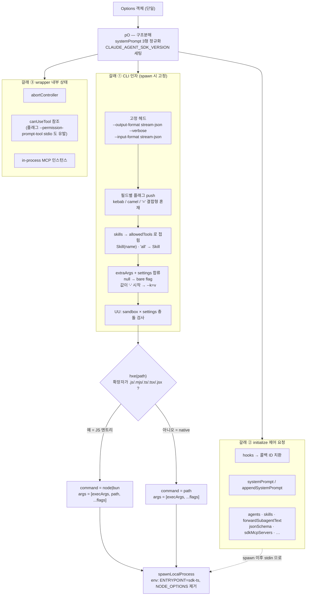

# 7. `Options` 표면과 실행 파일 해석

> **근거 등급.** ①③ 은 `sdk.d.ts` **1급**. ②④ 는 `sdk.mjs` **2급**. ⑥ 은 CLI 내부 **3급 = 관측 불가**.
> 패키지 형상·플랫폼 바이너리 인벤토리는 [1부 1.1](../01-패키지-구조와-프로세스-모델.md#11-실물-인벤토리). 여기서는 **`Options` 한 덩어리가 어디로 흩어지는지**와 **어떤 실행 파일이 뜨는지**만 본다.

## 7.1 ① 시그니처

```ts
export declare type Options = { … };   // sdk.d.ts:1322
```

필드가 수십 개이므로 열거 대신 **행선지**로 분류한다. 이것이 이 장의 핵심 관찰이다:

> **`Options` 는 하나의 객체지만 세 갈래로 흩어진다** — CLI 인자, `initialize` 제어 요청, wrapper 내부 상태.

## 7.2 ② 콜스택 — 옵션이 갈라지는 지점

```
query(params)
  └─ pO(options, {isSingleUserTurn})          ← 옵션 해체 (구조분해 1회)
       ├─ new ProcessTransport({…})           ← ①번 갈래: spawn 인자로
       │    └─ 인자 배열 H 조립 → spawnLocalProcess
       └─ new Query(transport, …, initConfig) ← ②③번 갈래
            └─ initialize()                   ← ②번 갈래: control_request 로
```

`pO` 의 구조분해가 분기의 시작이다:

```js
function pO(e,t){
  let{isSingleUserTurn:r,resumeConfigDir:n,deferSpawn:o}=t,
      {systemPrompt:i,settings:s,managedSettings:a,settingSources:c,sandbox:u,...d}=e??{},f,m,g;
  if(i===void 0) f="";
  else if(typeof i==="string") f=i;
  else if(Array.isArray(i)) f=i;
  else if(i.type==="preset") m=i.append, g=i.excludeDynamicSections;
  process.env.CLAUDE_AGENT_SDK_VERSION="0.3.220";
  let{abortController:h=Jc(), additionalDirectories:_=[], … } = d;
```
— `sdk.mjs::pO`

`systemPrompt` 가 여기서 **세 형태로 정규화**된다: 문자열이면 그대로, 배열이면 그대로, `{type:'preset', append}` 면 `append` 만 뽑아 별도 변수(`m`)로 보관한다. 이 셋이 `initialize` 페이로드의 `systemPrompt` / `appendSystemPrompt` 로 나뉘어 실린다([1장 §1.2](01-query-호출-생명주기.md#initialize-가-싣는-것--플래그가-아닌-옵션들)).

`process.env.CLAUDE_AGENT_SDK_VERSION="0.3.220"` 이 이 함수에서 세팅되는 것도 확인된다 — 버전 문자열이 번들에 상수로 박혀 있다.

## 7.3 ③ 갈래 ① — CLI 인자

### 고정 헤드

```js
let H=["--output-format","stream-json","--verbose","--input-format","stream-json"];
```
— `sdk.mjs` (`class Uw` 인자 조립부)

양방향 JSONL 은 **협상 대상이 아니라 전제**다.

### 옵션 → 플래그 매핑 (확인된 것)

| `Options` 필드 | 플래그 | 형태 |
|---|---|---|
| `maxTurns` | `--max-turns` | 값 |
| `maxBudgetUsd` | `--max-budget-usd` | 값 |
| `taskBudget` | `--task-budget` | `total` 만 |
| `model` | `--model` | 값 |
| `agent` | `--agent` | 값 |
| `betas` | `--betas` | 쉼표 join |
| `effort` | `--effort` | 값 |
| `thinking` | `--thinking` / `--max-thinking-tokens` / `--thinking-display` | `type` 에 따라 분기 |
| `fallbackModel` | `--fallback-model` | 값. **main model 과 같으면 throw** |
| `outputFormat`(jsonSchema) | `--json-schema` | JSON 직렬화 |
| `continue` | `--continue` | bare |
| `resume` | `--resume=<id>` | **`=` 결합형** |
| `resumeSessionAt` | `--resume-session-at=<v>` | `=` 결합형 |
| `sessionId` | `--session-id=<v>` | `=` 결합형 |
| `forkSession` | `--fork-session` | bare |
| `allowedTools` | `--allowedTools` | 쉼표 join (**camelCase 플래그**) |
| `disallowedTools` | `--disallowedTools` | 쉼표 join (**camelCase 플래그**) |
| `tools` | `--tools` | 배열이면 join(빈 배열이면 `""`), 아니면 `"default"` |
| `mcpServers` | `--mcp-config` | `{mcpServers:…}` JSON |
| `settingSources` | `--setting-sources=<a,b>` | `=` 결합형 |
| `strictMcpConfig` | `--strict-mcp-config` | bare |
| `permissionMode` | `--permission-mode` | 값 |
| `allowDangerouslySkipPermissions` | `--allow-dangerously-skip-permissions` | bare |
| `canUseTool` | `--permission-prompt-tool stdio` | **콜백 존재가 플래그를 만든다**([6장 §6.5](06-역방향-콜백-canUseTool-hooks.md#65-canusetool-은-cli-플래그를-바꾼다)) |
| `permissionPromptToolName` | `--permission-prompt-tool` | 값. `canUseTool` 과 **상호 배타** |
| `includeHookEvents` | `--include-hook-events` | bare |
| `includePartialMessages` | `--include-partial-messages` | bare |
| `additionalDirectories` | `--add-dir` | **항목마다 반복** |
| `plugins` | `--plugin-dir` / `--plugin-dir-no-mcp` | 항목마다. `type` 이 `'local'` 이 아니면 throw |
| `persistSession: false` | `--no-session-persistence` | bare |
| `managedSettings` | `--managed-settings` | 값 |
| `debug` / `debugFile` | `--debug` / `--debug-file` | `debugFile` 우선 |
| `sessionMirror` | `--session-mirror` | bare |

플래그 이름이 **kebab-case 와 camelCase 가 섞여 있다** — `--allowedTools`·`--disallowedTools` 만 camelCase다.

### `skills` — 플래그가 아니라 `allowedTools` 로 접힌다

```js
if(te!==void 0){
  let V=te==="all"?["Skill"]:te.map((me)=>`Skill(${me})`),
      ve=new Set(Lr);
  Lr=[...Lr,...V.filter((me)=>!ve.has(me))]
}
```
— `sdk.mjs` (`Uw`, `te`=skills · `Lr`=allowedTools)

```ts
skills?: string[] | 'all';   // sdk.d.ts:1933
```

`skills: ['foo','bar']` → `allowedTools` 에 `Skill(foo)`·`Skill(bar)` 가 **덧붙는다**. `'all'` 이면 `Skill` 하나. 중복은 `Set` 으로 걸러 이미 있는 항목을 두 번 넣지 않는다.

즉 skills 는 **권한 어휘로 번역**된다. (동시에 skill 목록 자체는 `initialize` 페이로드에도 실린다 — §7.4.)

### `extraArgs` — 타입 계약 밖으로 나가는 문

```ts
/**
 * Additional CLI arguments to pass to Claude Code.
 * Keys are argument names (without --), values are argument values.
 * Use `null` for boolean flags.
 */
extraArgs?: Record<string, string | null>;
```
— `sdk.d.ts:1463-1468`

구현이 이것을 `settings` 와 **한 통에 섞는다**:

```js
let Nr={...s??{}};
if(this.options.settings) Nr.settings=this.options.settings;
let Vt=UU(Nr,St);
for(let[V,ve]of Object.entries(Vt))
  if(ve===null) H.push(`--${V}`);
  else Lw(H,V,ve);
```
— `sdk.mjs` (`Uw`, `s`=extraArgs · `St`=sandbox)

세 가지가 확정된다:

1. **`settings` 는 `extraArgs` 와 같은 경로로 나간다** — 결국 `--settings <값>` 이다. 전용 분기가 없다.
2. **`null` 값 = bare flag** — `H.push("--"+key)`. JSDoc 의 *"Use `null` for boolean flags"* 가 이 줄이다.
3. `extraArgs` 에 `settings` 키를 직접 넣으면 `Options.settings` 가 **덮어쓴다**(뒤에서 대입).

값 push 는 한 번 더 감싼다:

```js
function Lw(e,t,r){ let n=String(r); if(n.length>1&&n.startsWith("-")) e.push(`--${t}=${n}`); else e.push(`--${t}`,n) }
```
— `sdk.mjs::Lw`

**값이 `-` 로 시작하면 `--key=value` 결합형**으로 바꾼다 — 그러지 않으면 다음 인자가 플래그로 오인된다.

### `sandbox` 와 `settings` 의 충돌 규칙

```js
function UU(e,t){
  let r={...e}; if(!t) return r;
  let n=t.enabled===!0&&t.failIfUnavailable===void 0?{...t,failIfUnavailable:!0}:t,
      o=r.settings;
  if(o&&!axe(o)) throw Error("Cannot use both a settings file path and the sandbox option. Include the sandbox configuration in your settings file instead.");
  let i={sandbox:n};
  if(o) try{ i={...yt(o),sandbox:n} }catch{}
  return r.settings=Re(i), r
}
function axe(e){ let t=e.trim(); return t.startsWith("{")&&t.endsWith("}") }
```
— `sdk.mjs::UU`

- `settings` 가 **파일 경로**(`{…}` 로 감싸이지 않은 문자열)인데 `sandbox` 도 주면 **throw**.
- 인라인 JSON 이면 파싱해 `sandbox` 를 병합한다(파싱 실패는 조용히 무시하고 sandbox 만 남긴다).
- `sandbox.enabled === true` 인데 `failIfUnavailable` 이 없으면 **`true` 로 강제**한다 — 샌드박스를 켜 놓고 조용히 비활성으로 도는 것을 막는다.

## 7.4 갈래 ② — `initialize` 제어 요청

플래그가 아니라 핸드셰이크로 가는 필드들:

| `Options` 필드 | `initialize` 페이로드 키 |
|---|---|
| `hooks` | `hooks` (**콜백 ID 로 치환** — [6장 §6.6](06-역방향-콜백-canUseTool-hooks.md#66-hooks--콜백-id-로-치환된다)) |
| `systemPrompt` (string/array) | `systemPrompt` |
| `systemPrompt` (`{type:'preset', append}`) | `appendSystemPrompt` + `excludeDynamicSections` |
| `agents` | `agents` |
| `skills` | `skills` (플래그 갈래와 **중복 전달**) |
| `forwardSubagentText` | `forwardSubagentText` |
| `outputFormat` (json_schema) | `jsonSchema` |
| in-process MCP 서버 이름 | `sdkMcpServers` |
| `planModeInstructions` · `appendSubagentSystemPrompt` · `toolAliases` · `title` · `promptSuggestions` · `agentProgressSummaries` · `webSearchIsolationExemptMcpServers` · `supportedDialogKinds` | 동명 키 |

— `sdk.mjs::initialize`

**왜 두 갈래인가**: 프로세스 인자는 spawn 시점에 고정되지만 제어 요청은 세션 중에도 다시 보낼 수 있다. 콜백처럼 문자열로 못 옮기는 것(`hooks`)과 재협상 여지가 있는 것이 후자로 간다.

## 7.5 실행 파일 해석 — native 바이너리인가 JS 엔트리인가

```ts
/**
 * Path to the Claude Code executable. Uses the built-in executable if not specified.
 */
pathToClaudeCodeExecutable?: string;
```
— `sdk.d.ts:1728-1730`

```js
let Ye=hxe(a), yr=Ye?a:o, nt=Ye?[...i,...H]:[...i,a,...H],
    W={command:yr,args:nt,cwd:n,env:c,signal:this.forwardedAbort.signal};
```
— `sdk.mjs` (`Uw`, `a`=pathToClaudeCodeExecutable · `o`=executable · `i`=executableArgs)

```js
function hxe(e){ return ![".js",".mjs",".tsx",".ts",".jsx"].some((r)=>e.endsWith(r)) }
```
— `sdk.mjs::hxe`

**확장자 하나로 spawn 형태가 바뀐다**:

| `pathToClaudeCodeExecutable` | `hxe` | command | args |
|---|---|---|---|
| `.js`/`.mjs`/`.ts`/`.tsx`/`.jsx` 로 끝남 | `false` | JS 런타임 (`executable`, 기본 `node` 또는 bun) | `[...executableArgs, <경로>, ...플래그]` |
| 그 외 (확장자 없음, `.exe` 등) | `true` | **경로 자체** | `[...executableArgs, ...플래그]` |

기본 런타임은 `executable:Ft=Cs()?"bun":"node"` — 실행 환경이 bun 이면 bun, 아니면 node 다.

### 실패 진단이 libc 를 지목한다

```js
function _xe(e,t){ if(lxe(e)) return t?`Claude Code native binary at ${e} exists but failed to launch. This usually means the binary does not match this system's libc — e.g. spawning a musl-linked binary on a glibc Linux host fails because the musl dynamic loader (/lib/ld-musl-*) is missing. Specify a matching binary with options.pathToClaudeCodeE…
```
— `sdk.mjs::_xe`

**파일이 존재하는데 spawn 이 실패하는 경우**를 별도 메시지로 구분한다. 배포 형태가 플랫폼별 바이너리 패키지(`@anthropic-ai/claude-agent-sdk-<platform>-<arch>`)이므로, glibc/musl 불일치가 대표적 실패다.

### 환경변수 손질

| 처리 | 코드 |
|---|---|
| 진입점 표식 | `if(!c.CLAUDE_CODE_ENTRYPOINT) c.CLAUDE_CODE_ENTRYPOINT="sdk-ts"` |
| `NODE_OPTIONS` 제거 | `delete c.NODE_OPTIONS` — 호스트의 node 플래그가 자식에 새지 않게 |
| DEBUG 정규화 | `ge(c.DEBUG_CLAUDE_AGENT_SDK) ? c.DEBUG="1" : delete c.DEBUG` |

`env` 옵션의 기본값은 `{...process.env}` 이므로, 명시하지 않으면 호스트 환경이 통째로 상속된다.

## 7.6 패키지 자체를 읽는 표면

SDK 함수를 부르지 않고 패키지를 **모듈 해석 대상**으로만 쓰는 경로가 둘 있다:

| 대상 | 성질 |
|---|---|
| `@anthropic-ai/claude-agent-sdk/package.json` 의 `version` | 순수 파일 read. 설치 여부·버전 확인 |
| `@anthropic-ai/claude-agent-sdk-<platform>-<arch>` 의 `claude` / `claude.exe` | `optionalDependencies` 로 플랫폼에 맞는 것만 설치된다. `require.resolve` 로 실경로를 얻어 `pathToClaudeCodeExecutable` 에 넘긴다 |

`package.json` 의 `optionalDependencies` 가 플랫폼 바이너리를 자동 해소하므로 **별도 설치 절차가 없다** — 이것이 [0장](00-진입점-분류.md#계열-d--비호출-표면) 계열 D 의 실체다.

## 7.7 ④ 구현 디테일

### 조립 순서가 곧 우선순위는 아니다

플래그는 배열 `H` 에 **순차 push** 되지만, 같은 플래그가 두 번 들어가는 경로는 `extraArgs` 뿐이다(사용자가 이미 있는 키를 넣는 경우). 그때 CLI 가 앞을 쓰는지 뒤를 쓰는지는 **관측 불가**(§7.9).

### throw 하는 조합 셋

| 조합 | 메시지 |
|---|---|
| `canUseTool` + `permissionPromptToolName` | `"canUseTool callback cannot be used with permissionPromptToolName. Please use one or the other."` |
| `fallbackModel === model` | `"Fallback model cannot be the same as the main model. …"` |
| `settings`(파일 경로) + `sandbox` | `"Cannot use both a settings file path and the sandbox option. …"` |
| `sessionStore` + `persistSession:false` | `"sessionStore cannot be used with persistSession: false -- the storage adapter requires local writes to mirror from. …"` |
| `plugins[].type !== 'local'` | `` `Unsupported plugin type: ${type}` `` |

전부 **spawn 전 옵션 조립 단계**에서 던진다 — 프로세스가 뜨기 전에 실패한다.

### `settingSources` 생략과 `[]` 는 다르다

```ts
/**
 * Control which filesystem settings to load.
 * …
 * When omitted, all sources are loaded (matches CLI defaults).
 * Pass `[]` to disable filesystem settings (SDK isolation mode).
 * Must include `'project'` to load CLAUDE.md files.
 */
settingSources?: SettingSource[];
```
— `sdk.d.ts:1900-1910`

구현이 이를 뒷받침한다 — `if(P!==void 0) H.push(`--setting-sources=${P.join(",")}`)`. **`undefined` 면 플래그 자체를 안 붙여** CLI 기본값(전부 로드)에 맡기고, `[]` 면 `--setting-sources=` 라는 빈 값 플래그가 나가 아무 소스도 안 읽는다.

`'project'` 를 빼면 **CLAUDE.md 가 로드되지 않는다**는 것도 JSDoc 이 명시한다.

## 7.8 ⑤ 다이어그램



## 7.9 ⑥ 관측 불가 구간 (코드에서 확인 안 됨)

| 항목 | 왜 확정 못 하나 |
|---|---|
| CLI 가 같은 플래그를 **중복으로 받았을 때** 앞/뒤 중 무엇을 쓰는지 | 인자 배열 조립까지만 관측 |
| `--settings` 인라인 JSON 과 파일 소스(`--setting-sources`)의 **병합 우선순위** | `resolveSettings` 의 결과 타입(`ResolvedSettings.provenance`)으로 *결과*는 조회 가능하나 규칙 자체는 바이너리 안 |
| `--resume` + `--fork-session` 조합에서 새 session_id 발급 시점 | 플래그 전달만 관측. 발급은 CLI |
| `--tools "default"` 와 명시 목록의 **실제 차이** | 문자열 전달까지만 |
| `--no-session-persistence` 가 무엇을 안 쓰는지 (transcript? 인덱스?) | 미서술 |
| `skills` 가 `allowedTools` 와 `initialize` **양쪽으로 가는 이유** — 두 경로가 각각 무엇을 켜는지 | 두 전달 모두 관측되나 CLI 측 소비가 다른지 동일한지 미확정 |
| `effort` 값이 CLI/모델 단에서 어떻게 해석되는지 | 플래그 값 전달만 |
| 플랫폼 바이너리 선택 실패 시 **폴백 유무** | wrapper 는 진단 메시지만 제공 |

---

← [6장 — 역방향 콜백](06-역방향-콜백-canUseTool-hooks.md) · [api/ 인덱스](README.md) →
