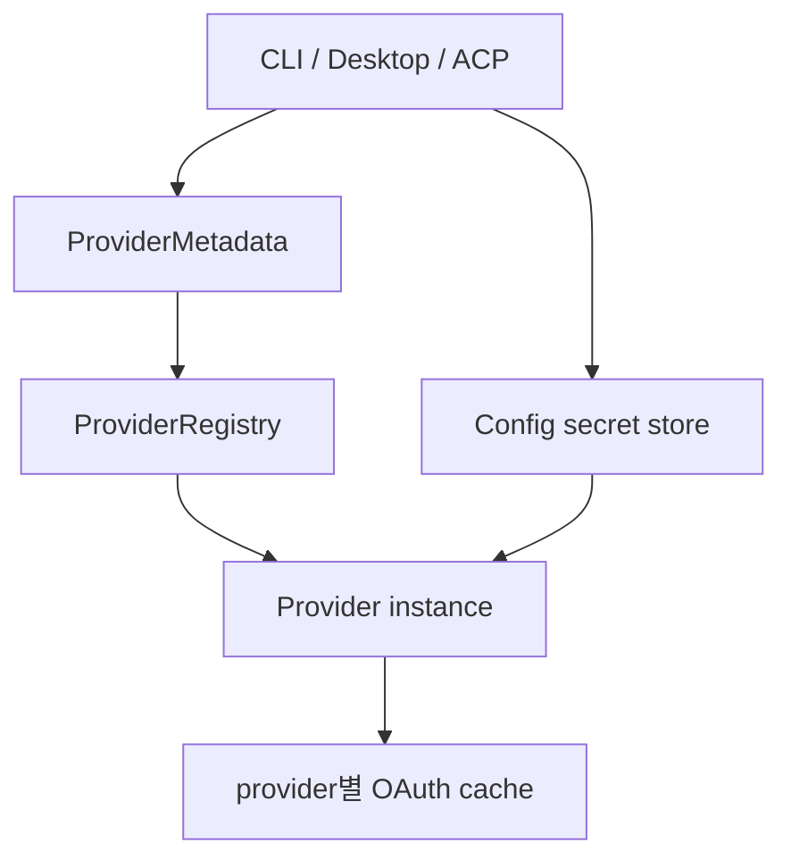

# goose 인증 브로커 분석

> 조사일: 2026-07-31
> 대상 저장소: `aaif-goose/goose`
> 기준 브랜치/커밋: `main` / `6789d4af438d215f1e43cd158ff040e5cbd21766`
> 조사 범위: 비밀 저장소, provider 메타데이터·레지스트리, OAuth hook, 선언형 custom provider,
> provider secret 관리 API, MCP OAuth 저장

## 결론

goose의 핵심은 단일한 “인증 플러그인 ABI”보다 **중앙 Config 비밀 저장소 +
ProviderMetadata + Provider trait/registry**의 결합이다. 세 조사 대상 중 OS keyring 사용과
secret field 메타데이터가 가장 잘 정리돼 있다.

다만 OAuth 구현과 토큰 캐시는 provider별 코드·파일로 흩어져 있고, 이를 UI에 모아 보여주기
위해 별도 하드코딩 목록을 유지한다. keyring이 사용할 수 없을 때는 경고 후 평문 파일로 자동
fallback한다. Orca는 goose의 **secret/metadata 분리와 cleanup 계약**을 차용하되, 조용한 저장
등급 하향과 provider별 cache 분산은 피해야 한다.

## 구조 요약

| 계층 | goose 구현 | 책임 |
|---|---|---|
| 저장 | `Config` + system keyring/file fallback | secret CRUD, env 우선순위, 캐시 |
| 선언 | `ProviderMetadata.config_keys` | 필수·secret·OAuth·device-code 여부 |
| 동작 | `Provider` trait | 요청, OAuth 구성, refresh |
| 등록 | `ProviderRegistry` | metadata, constructor, inventory, cleanup |
| 사용자 확장 | `custom_providers/*.json` | OpenAI/Ollama/Anthropic 호환 Backend 선언 |
| 제어면 | ACP provider handlers | 설정·인증·secret 열거/삭제 |

## 중앙 비밀 저장소

[`crates/goose/src/config/base.rs`](https://github.com/aaif-goose/goose/blob/6789d4af438d215f1e43cd158ff040e5cbd21766/crates/goose/src/config/base.rs#L84-L102)는
비밀의 우선순위를 명시한다.

| 우선순위 | 출처 | 비고 |
|---|---|---|
| 1 | 정확한 이름의 환경변수 | 키를 uppercase해 조회 |
| 2 | system keyring | 기본 경로 |
| 3 | `secrets.yaml` | keyring 비활성/사용 불가 시 fallback |

keyring 모드에서는 모든 secret map을 하나의 JSON 객체로 직렬화해 service `goose`,
username `secrets`의 password 한 건으로 저장한다.
[`all_secrets`](https://github.com/aaif-goose/goose/blob/6789d4af438d215f1e43cd158ff040e5cbd21766/crates/goose/src/config/base.rs#L622-L660)와
[`write_all_secrets`](https://github.com/aaif-goose/goose/blob/6789d4af438d215f1e43cd158ff040e5cbd21766/crates/goose/src/config/base.rs#L889-L912)가
그 단위를 읽고 쓴다.

`set_secret_values`와 `delete_secret_values`는 여러 필드를 한 번의 storage read/write로
처리한다. 여러 자격증명 필드를 함께 저장하는 setup flow에서 부분 저장과 keychain 왕복을 줄이는
좋은 선례다.

### fallback의 보안 등급

keyring availability 오류가 감지되면
[`handle_keyring_fallback_error`](https://github.com/aaif-goose/goose/blob/6789d4af438d215f1e43cd158ff040e5cbd21766/crates/goose/src/config/base.rs#L1037-L1073)가
`GOOSE_DISABLE_KEYRING=1`을 설정하고 파일 저장으로 전환한다.

[`write_secrets_file`](https://github.com/aaif-goose/goose/blob/6789d4af438d215f1e43cd158ff040e5cbd21766/crates/goose/src/config/base.rs#L19-L39)은
Unix에서 파일을 `0600`으로 강제하지만 내용은 평문 YAML이다. 비 Unix 경로는 일반
`std::fs::write`를 사용하므로 플랫폼 ACL에 의존한다.

즉 “keyring을 기본 사용”과 “keyring이 없으면 저장 거부”는 다르다. goose는 가용성을 위해
자동 하향을 선택한다.

## provider 메타데이터와 인증 UI

[`ProviderMetadata`](https://github.com/aaif-goose/goose/blob/6789d4af438d215f1e43cd158ff040e5cbd21766/crates/goose-provider-types/src/base.rs#L22-L49)는
provider의 `config_keys`를 함께 선언한다.
[`ConfigKey`](https://github.com/aaif-goose/goose/blob/6789d4af438d215f1e43cd158ff040e5cbd21766/crates/goose-provider-types/src/base.rs#L132-L218)는
다음 정보를 제공한다.

| 필드 | 의미 |
|---|---|
| `required` | 구성 완료 판정 |
| `secret` | 일반 config가 아니라 비밀 저장소 사용 |
| `oauth_flow` | 수기 입력 대신 `configure_oauth()` 호출 |
| `device_code_flow` | OAuth device code UX 표시 |
| `primary` | setup UI에서 강조할 대표 필드 |

[`Provider` trait](https://github.com/aaif-goose/goose/blob/6789d4af438d215f1e43cd158ff040e5cbd21766/crates/goose-provider-types/src/base.rs#L422-L623)은
`configure_oauth`와 `refresh_credentials`를 optional 동작으로 둔다. 기본 구현은 명시적인
unsupported 오류이므로 OAuth를 지원하는 provider만 override한다.

이 구조 덕분에 UI/ACP는 구체 provider를 몰라도 metadata로 입력 필드를 만들고 OAuth 버튼을
분기할 수 있다. 반대로 실제 OAuth 프로토콜과 토큰 저장 위치는 각 provider 구현 책임이다.

## registry와 프레임워크화

[`ProviderEntry`](https://github.com/aaif-goose/goose/blob/6789d4af438d215f1e43cd158ff040e5cbd21766/crates/goose/src/providers/provider_registry.rs#L12-L97)는
metadata, constructor, model inventory, cleanup, provider type을 한 항목으로 묶는다.
[`ProviderRegistry`](https://github.com/aaif-goose/goose/blob/6789d4af438d215f1e43cd158ff040e5cbd21766/crates/goose/src/providers/provider_registry.rs#L99-L160)는
`ProviderDef`로부터 항목을 등록하고 런타임에 인스턴스를 만든다.

내장 provider는
[`init.rs`](https://github.com/aaif-goose/goose/blob/6789d4af438d215f1e43cd158ff040e5cbd21766/crates/goose/src/providers/init.rs#L54-L224)의
composition root에서 명시적으로 등록된다. OAuth cache를 가진 provider에는 cleanup 함수도
별도로 연결된다. 이는 런타임 arbitrary code plugin보다 **컴파일 타임 registry**에 가깝다.

## 선언형 custom provider

[`DeclarativeProviderConfig`](https://github.com/aaif-goose/goose/blob/6789d4af438d215f1e43cd158ff040e5cbd21766/crates/goose-providers/src/declarative.rs#L71-L148)는
OpenAI/Ollama/Anthropic 호환 엔진, base URL, API key 이름, 모델, header, 추가 env field를
JSON으로 선언한다.

사용자 정의는 `~/.config/goose/custom_providers/*.json`에 저장된다.
[`create_custom_provider`](https://github.com/aaif-goose/goose/blob/6789d4af438d215f1e43cd158ff040e5cbd21766/crates/goose/src/config/declarative_providers.rs#L166-L228)는
API key 값은 중앙 secret store에 넣고, JSON에는 생성된 key 이름만 남긴다.
[`register_declarative_providers`](https://github.com/aaif-goose/goose/blob/6789d4af438d215f1e43cd158ff040e5cbd21766/crates/goose/src/config/declarative_providers.rs#L349-L364)가
파일을 읽어 registry에 추가한다.

이 경로는 단순 API-key 호환 Backend에 강하지만, 임의 OAuth handshake나 refresh 로직을
JSON만으로 추가하는 플러그인 ABI는 아니다.

## OAuth 저장의 분산

중앙 Config에 저장되는 secret 외에도 여러 OAuth provider가 자체 cache 파일을 가진다.
[`provider_secrets.rs`](https://github.com/aaif-goose/goose/blob/6789d4af438d215f1e43cd158ff040e5cbd21766/crates/goose/src/providers/provider_secrets.rs#L101-L180)는
Gemini, ChatGPT Codex, Kimi, GitHub Copilot, xAI, Databricks cache 경로를 정적 표로 관리한다.

제어면은 두 저장 계열을 합쳐 하나의 목록으로 보여준다.

- 중앙 secret store 항목:
  [`build_secret_store_secrets`](https://github.com/aaif-goose/goose/blob/6789d4af438d215f1e43cd158ff040e5cbd21766/crates/goose/src/providers/provider_secrets.rs#L301-L345)
- provider cache 항목:
  [`list_provider_secrets`](https://github.com/aaif-goose/goose/blob/6789d4af438d215f1e43cd158ff040e5cbd21766/crates/goose/src/providers/provider_secrets.rs#L386-L422)
- 삭제와 cleanup:
  [`delete_provider_secret`](https://github.com/aaif-goose/goose/blob/6789d4af438d215f1e43cd158ff040e5cbd21766/crates/goose/src/providers/provider_secrets.rs#L424-L460)

신규 OAuth provider를 추가할 때 trait/metadata 외에 cache inventory 표도 갱신해야 할 수 있다는
점은 프레임워크화가 완결되지 않았음을 보여준다.

예외적으로 MCP OAuth는 rmcp의 `CredentialStore`를
[`GooseCredentialStore`](https://github.com/aaif-goose/goose/blob/6789d4af438d215f1e43cd158ff040e5cbd21766/crates/goose/src/oauth/persist.rs#L1-L53)로
어댑트해 중앙 Config 저장소를 그대로 재사용한다. 외부 프로토콜의 저장 포트를 중앙 vault에
연결하는 좋은 사례다.

## 평가

| 관점 | 평가 | 근거 |
|---|---|---|
| 저장 안전성 | 강함, 단 fallback 주의 | 기본 OS keyring, 불가 시 평문 파일 자동 하향 |
| secret 메타데이터 | 강함 | field별 required/secret/OAuth/device-code 선언 |
| 전체 OAuth 일관성 | 제한적 | provider별 cache와 hardcoded inventory |
| full-code 확장 | 제한적 | Rust trait/registry는 컴파일 타임 중심 |
| 선언형 확장 | 강함 | 호환 Backend는 JSON + 중앙 secret store |
| 삭제 수명주기 | 강함 | secret 삭제와 provider cleanup/unconfigure 연결 |

## Orca에 가져갈 것

| 채택 판단 | 항목 | 이유 |
|---|---|---|
| 채택 | secret 값과 설정 metadata 분리 | 파일에는 참조/필드 정의만, 값은 safeStorage에 유지 |
| 채택 | field별 `secret`·`required`·auth method 메타데이터 | UI와 저장 정책을 같은 선언에서 파생 |
| 채택 | batch set/delete + cleanup hook | 다중 토큰 저장의 원자성과 로그아웃 후 잔여물 제거 |
| 채택 | 외부 `CredentialStore` 포트를 중앙 vault에 어댑트 | MCP/OAuth 라이브러리별 별도 저장소 방지 |
| 비채택 | keychain 장애 시 자동 평문 fallback | Orca의 `isEncryptionAvailable=false` 저장 거부 정책 유지 |
| 비채택 | provider별 OAuth cache 목록 하드코딩 | 모듈이 저장 key와 cleanup을 스스로 선언해야 함 |
| 조건부 채택 | 선언형 custom Backend | API key 기반 단순 Backend에 한정, OAuth 코드는 명시 모듈 |
