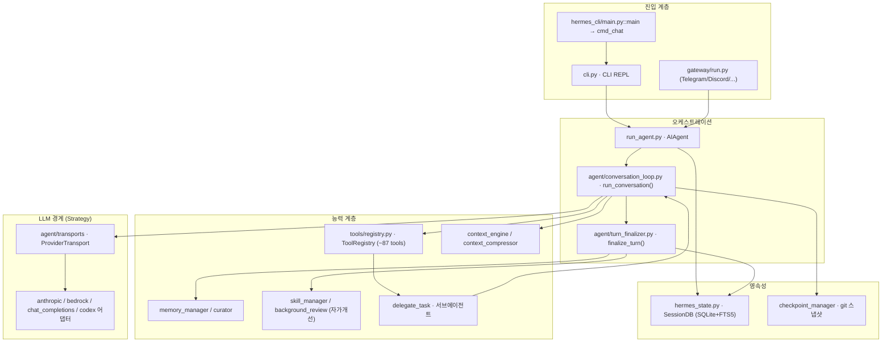

# 2. 전체 아키텍처

[← 1. 개요](01-개요.md) · [목차](README.md) · [다음: 3. 콜스택 →](03-콜스택-실행흐름.md)

---

계층은 위에서 아래로 **진입(Entry) → 오케스트레이션(AIAgent + 루프) → 능력(툴/메모리/스킬) →
LLM 경계(Transport) → 영속성** 으로 흐르며, 의존 방향은 위→아래 단방향에 가깝다.

- **진입 계층**: `hermes` 런처 → `hermes_cli/main.py::main`(argparse 서브커맨드). 대화는
  `cmd_chat` → `CLI` 클래스(`cli.py`)의 REPL. 게이트웨이는 `gateway/run.py`가 별도 진입점으로
  같은 `AIAgent`를 구동. ACP 어댑터(`acp_adapter.entry:main`)와 직접 실행(`run_agent:main`)도 있음.
- **오케스트레이션**: `run_agent.py`의 `AIAgent`(약 5000줄, L320~). 모델/프로바이더 상태, 세션,
  메시지 히스토리, 예산(budget), 콜백을 보유. 턴 실행은 `agent/conversation_loop.py::run_conversation`
  이 담당(메서드 `AIAgent.run_conversation`은 forwarder, run_agent.py:5227).
- **능력 계층**: 툴 레지스트리(`tools/registry.py`, ~87개 툴 파일), 토큰 예산/컨텍스트 엔진
  (`agent/context_engine.py`, `context_compressor`), 메모리(`agent/memory_manager.py`,
  `curator.py`), 스킬(`tools/skill_manager_tool.py`, 자가개선은 `agent/background_review.py`).
- **LLM 경계**: `agent/transports/`의 `ProviderTransport` 추상화 + `agent/*_adapter.py`. api_mode별로
  `chat_completions` / `anthropic_messages` / `bedrock_converse` / `codex_responses` 전송체가 갈림.
- **영속성**: `hermes_state.py`의 `SessionDB`(SQLite + FTS5), `tools/checkpoint_manager.py`(git 스냅샷).

