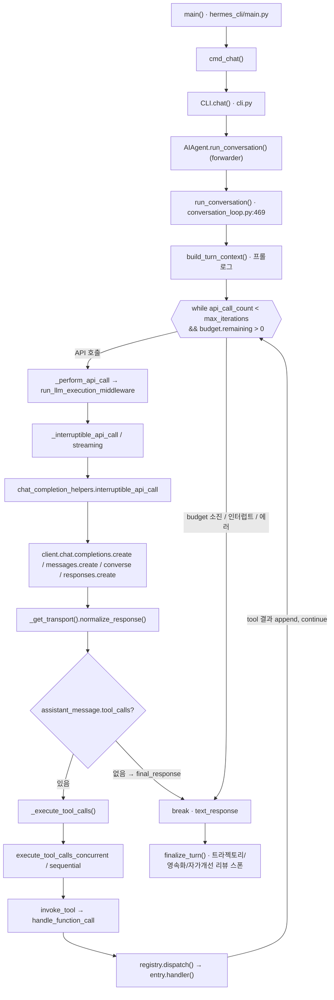
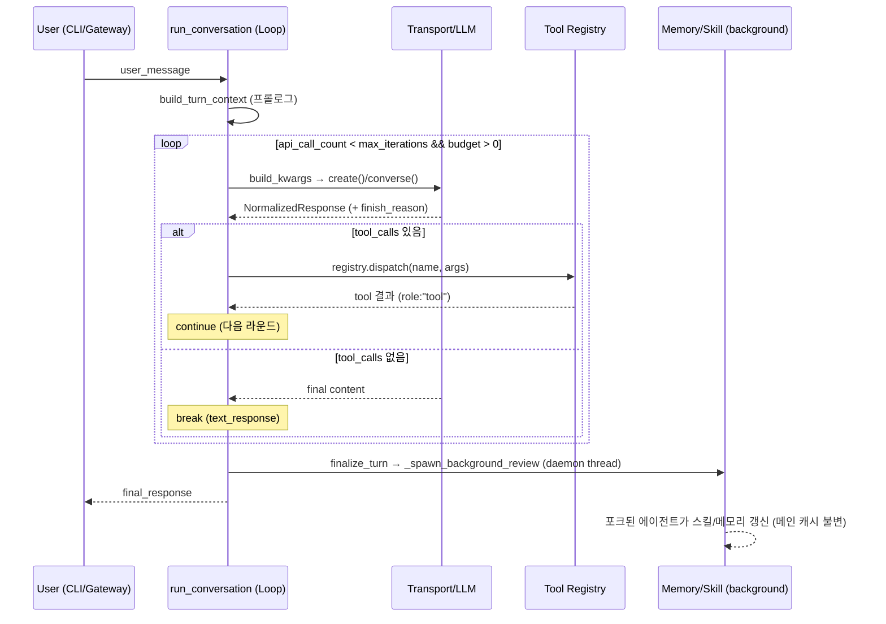

# 3. 콜스택 · 실행 흐름

[← 2. 전체 아키텍처](02-전체-아키텍처.md) · [목차](README.md) · [다음: 4. 핵심 모듈 →](04-핵심-모듈.md)

---

## 진입점 → 루프

정적 호출 경로(함수명은 모두 코드에서 확인):

1. `hermes_cli/main.py::main` → argparse → `cmd_chat`(main.py:2135) → `CLI.chat`(cli.py:9976)
   → `self.agent.run_conversation(...)`(cli.py:10245).
2. `AIAgent.run_conversation`(run_agent.py:5227)은 forwarder로 `agent.conversation_loop.run_conversation`
   (conversation_loop.py:469)을 호출.
3. 턴 프롤로그 `build_turn_context(...)`(conversation_loop.py:508)가 stdio 가드, 시스템 프롬프트
   복원/생성, 메시지 새너타이즈, 사전 압축, 메모리 프리페치 등 1회성 설정을 수행.
4. **메인 루프**: `while (api_call_count < agent.max_iterations and agent.iteration_budget.remaining > 0) or agent._budget_grace_call:`
   (conversation_loop.py:563).
5. 루프 내부에서 LLM 호출: `_perform_api_call`(L1110) → `run_llm_execution_middleware`(L1119) →
   `agent._interruptible_api_call` / `_interruptible_streaming_api_call`(run_agent.py:4081/4252) →
   `agent.chat_completion_helpers.interruptible_api_call` → **실제 SDK 호출**
   `client.chat.completions.create(...)` / `client.messages.create` / `client.converse` /
   `client.responses.create`(chat_completion_helpers.py:239/224/1831, codex_runtime.py:612).
6. 응답 정규화: `agent._get_transport()`(run_agent.py:4465) → `transport.validate_response` /
   `normalize_response` / `map_finish_reason`.
7. 분기:
   - `assistant_message.tool_calls`가 있으면(conversation_loop.py:3712) →
     `agent._execute_tool_calls`(run_agent.py:5125) → 병렬/순차 선택(`_should_parallelize_tool_batch`)
     → `execute_tool_calls_concurrent/sequential`(tool_executor.py:243/770) → `invoke_tool`
     (agent_runtime_helpers.py:1713) → `handle_function_call`(model_tools.py:876) →
     `registry.dispatch`(tools/registry.py:390) → `entry.handler(args)` → 결과를 `role:"tool"`
     메시지로 append → `continue`(L4063).
   - tool_calls가 없으면(L4065 `else`) → `final_response = assistant_message.content` → `break`(L4399).
8. 루프 종료 후 `finalize_turn`(turn_finalizer.py:30): 트라젝토리 저장, 세션 영속화,
   그리고 **자가개선 백그라운드 리뷰** 스폰(`_spawn_background_review`, turn_finalizer.py:395).

## 종료 조건 (실제 코드 인용)

루프는 다음 `break`로 끝난다(모두 `_turn_exit_reason`으로 진단 라벨링):

- **정상 종료(tool_call 없음)** — conversation_loop.py:4396-4399
  ```python
  _turn_exit_reason = f"text_response(finish_reason={finish_reason})"
  if not agent.quiet_mode:
      agent._safe_print(f"🎉 Conversation completed after {api_call_count} ... API call(s)")
  break
  ```
- **예산 소진** — L584-588 `elif not agent.iteration_budget.consume(): _turn_exit_reason="budget_exhausted"; break`
  (루프 조건 자체도 `api_call_count < agent.max_iterations and iteration_budget.remaining > 0`).
- **사용자 인터럽트** — L568-573 `if agent._interrupt_requested: interrupted=True; ...; break`.
- **툴 가드레일 정지** — L3968-3971 `_turn_exit_reason="guardrail_halt"; final_response=...; break`.
- **반복 에러 한계** — L4450-4456 `if api_call_count >= agent.max_iterations - 1: ...; break`.

`max_iterations` 기본값은 `init_agent`에서 90(agent/agent_init.py:166). 즉 "최종 답변(빈 tool_call)"
신호가 1차 종료 조건이고, 반복 예산이 안전망이다.

## 3a. 콜스택 — 정적 호출 관계



## 3b. 에이전트 루프 — 런타임 라운드트립


