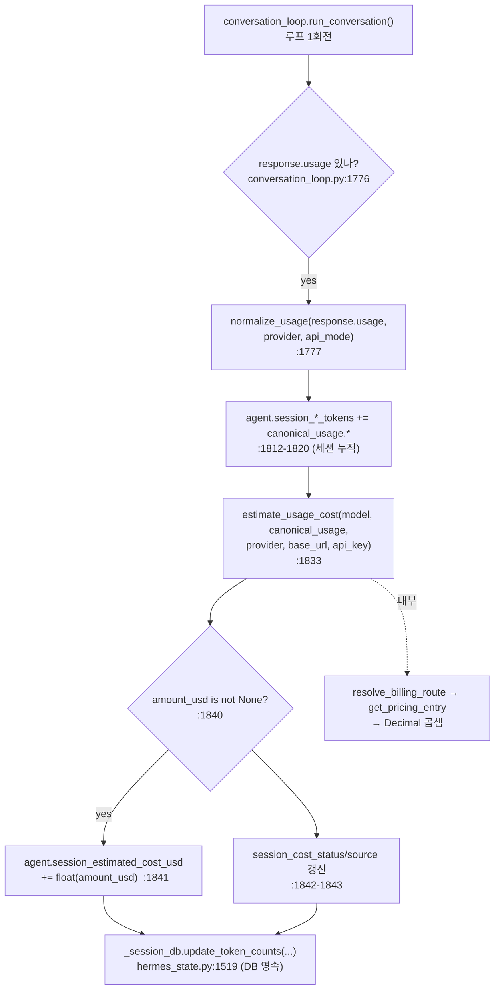

# Hermes Agent ☤ — 비용(토큰) 계산 모듈 분석

> 범위: 이 문서는 **비용/토큰 계산 모듈 한 곳만** 깊게 본다(스킬의 "narrow" 모드).
> 전체 아키텍처는 [README.md](README.md)의 01~08 챕터 참조.
> 핵심 파일: **`agent/usage_pricing.py`** (908줄). 가격 데이터·정규화·계산이 모두 여기 있다.
> 런타임 결선: `agent/conversation_loop.py`(루프에서 호출/누적), `run_agent.py`(세션 카운터),
> `hermes_state.py`(DB 영속화), `tools/delegate_tool.py`(서브에이전트 비용 롤업), `cli.py`(표시).
> 모든 주장은 grep/파일 읽기로 확인. 확인 못 한 부분은 명시한다.

---

## 1. 한눈에 보기

비용 계산은 **단일 모듈 `agent/usage_pricing.py`** 에 응집돼 있고, 4개의 순수 함수와
4개의 frozen dataclass로 구성된 **파이프라인**이다.

```
원본 API usage  ──normalize_usage()──▶  CanonicalUsage  ──estimate_usage_cost()──▶  CostResult
(프로바이더별 제각각)      (토큰 버킷 통일)         (provider 무관 표준형)    (가격×토큰)      (금액+출처+상태)
                                                          │
                                  resolve_billing_route() │ get_pricing_entry()
                                  (모델→과금 경로 판별)     ▼ (가격표/동적조회)
                                                      PricingEntry
```

설계의 핵심 결정 세 가지:

1. **토큰 정규화와 가격 적용을 분리한다.** 프로바이더마다 usage 필드 이름이 다른 문제
   (`normalize_usage`)와, 모델별 단가를 곱하는 문제(`estimate_usage_cost`)는 별개다.
2. **금액은 `Decimal`로만 계산한다.** `float` 누적 오차를 원천 차단(`usage_pricing.py:6,14-15`).
3. **"모른다"를 1급 시민으로 둔다.** 가격을 모르면 `0`을 쓰지 않고 `status="unknown"`,
   `amount_usd=None` 을 반환한다(`usage_pricing.py:796`). 추정을 사실로 위장하지 않는다.

---

## 2. 자료구조 — 4개의 frozen dataclass

`agent/usage_pricing.py:30-78`. 전부 `frozen=True`(불변) — 비용 데이터는 한 번 만들어지면
바뀌지 않는다는 계약.

### 2.1 `CanonicalUsage` (30-46) — 프로바이더 무관 토큰 버킷

```python
@dataclass(frozen=True)
class CanonicalUsage:
    input_tokens: int = 0          # 캐시 미적용 신규 입력
    output_tokens: int = 0
    cache_read_tokens: int = 0     # 캐시 히트(저렴)
    cache_write_tokens: int = 0    # 캐시 생성(비쌈)
    reasoning_tokens: int = 0      # output_tokens의 부분집합
    request_count: int = 1
    raw_usage: Optional[dict] = None

    @property
    def prompt_tokens(self) -> int:                       # 41-42
        return self.input_tokens + self.cache_read_tokens + self.cache_write_tokens
    @property
    def total_tokens(self) -> int:                        # 45-46
        return self.prompt_tokens + self.output_tokens
```

캐시 읽기/쓰기를 **별도 버킷**으로 둔 게 핵심. 캐시 읽기는 입력의 1/10 단가, 캐시 쓰기는
1.25배 단가라 따로 곱해야 정확하다(아래 §5 예시 참조).

### 2.2 `BillingRoute` (49-54) — "이 모델을 어디서 어떻게 과금하나"

`provider` / `model` / `base_url` / `billing_mode`. `billing_mode`가 분기의 축:
`subscription_included`(정액 포함=$0), `official_models_api`(동적 조회),
`official_docs_snapshot`(코드 내장 가격표), `unknown`.

### 2.3 `PricingEntry` (57-67) — 백만 토큰당 단가

`input/output/cache_read/cache_write_cost_per_million`(전부 `Optional[Decimal]`),
`request_cost`, 그리고 출처 추적 필드(`source`, `source_url`, `pricing_version`, `fetched_at`).
**단가가 `None`이면 "그 항목 가격을 모른다"** 는 뜻 — 0과 구별된다.

### 2.4 `CostResult` (70-78) — 계산 결과 + 출처 메타

`amount_usd: Optional[Decimal]`, `status`(`actual`/`estimated`/`included`/`unknown`),
`source`, `label`(`"~$0.16"` 같은 표시용), `notes`. 금액만이 아니라 **그 금액을 얼마나 믿어도
되는지**(status)와 **어디서 왔는지**(source)를 함께 반환한다.

---

## 3. 정규화 — `normalize_usage()` (703-773)

프로바이더 3종의 제각각인 usage 필드를 `CanonicalUsage`로 통일한다. 분기는
`api_mode`/`provider` 기준(726, 731, 740):

| 모드 | 입력 토큰 해석 | 캐시 분리 방식 |
|---|---|---|
| `anthropic_messages` (726-730) | `input_tokens` 그대로 = 순수 신규 입력 | `cache_read_input_tokens`, `cache_creation_input_tokens`가 **별도 필드** |
| `codex_responses` (731-739) | `input_tokens`가 캐시 **포함** → 빼서 분리 | `input_tokens_details.cached_tokens` |
| 기타 OpenAI Chat (740-760) | `prompt_tokens`가 캐시 **포함** → 빼서 분리 | `prompt_tokens_details.cached_tokens` |

Anthropic과 OpenAI의 결정적 차이가 여기서 흡수된다:

```python
# Anthropic: input_tokens는 이미 캐시를 뺀 순수 신규 입력
input_tokens = _to_int(getattr(response_usage, "input_tokens", 0))          # 727
# OpenAI/Codex: prompt_tokens는 캐시를 포함 → 차감해야 신규 입력이 나옴
input_tokens = max(0, prompt_total - cache_read_tokens - cache_write_tokens) # 760
```

OpenAI 호환 프록시(OpenRouter, Cline)가 Claude 모델을 라우팅할 때 캐시 필드를
top-level로만 노출하는 케이스까지 fallback으로 처리한다(744-759, `cline/cline#10266` 포팅).
이런 실전 호환 패치가 들어있다는 게 이 모듈이 단순한 곱셈기가 아님을 보여준다.

`max(0, ...)`로 음수를 막는 방어가 들어있다(739, 760).

---

## 4. 가격 조회 — 3단 폴백

### 4.1 `resolve_billing_route()` (556-584) — 모델명 → 과금 경로

문자열 모델명 + provider + base_url을 보고 `BillingRoute`를 만든다. 규칙(우선순위 순):

- `provider`가 비었고 모델명에 `/`가 있으면 `anthropic/claude-...` 처럼 **프리픽스에서
  provider 추론**(564-568).
- `openai-codex` → `subscription_included`(정액제, 토큰 과금 없음, 570-571).
- `openrouter` / `nous` → `official_models_api`(동적 조회, 572-575).
- `anthropic` / `openai` / `minimax` → `official_docs_snapshot`(내장 가격표, 576-581).
- `custom`/`local`/`localhost` → `unknown`(582-583).

### 4.2 `get_pricing_entry()` (673-700) — 3단 폴백

```
1) billing_mode == subscription_included  →  전부 $0 PricingEntry (정액 포함)  [680-688]
2) provider == openrouter                 →  OpenRouter models API 동적 조회   [689-690]
3) base_url 있음                          →  해당 엔드포인트 /models 조회       [691-699]
4) 위 모두 실패                           →  _lookup_official_docs_pricing()    [700]
                                             (코드 내장 가격표)
```

동적 조회(`_pricing_entry_from_metadata`, 629-670)는 OpenRouter/엔드포인트의 `/models`
응답에서 per-token 단가를 읽어 **백만 토큰당 단가로 환산**한다(655-658:
`value * _ONE_MILLION`).

### 4.3 내장 가격표 `_OFFICIAL_DOCS_PRICING` (86-535)

`(provider, model) → PricingEntry` 딕셔너리. Anthropic Claude(4~4.8), OpenAI(gpt-4o/4.1/o3
계열), MiniMax 등을 **출처 URL과 버전 태그까지** 박아둔 스냅샷. 예 — 이 에이전트(및 Claude
Code)를 돌리는 `claude-opus-4-8`(91-102):

```python
("anthropic", "claude-opus-4-8"): PricingEntry(
    input_cost_per_million=Decimal("5.00"),
    output_cost_per_million=Decimal("25.00"),
    cache_read_cost_per_million=Decimal("0.50"),
    cache_write_cost_per_million=Decimal("6.25"),
    source="official_docs_snapshot",
    source_url="https://platform.claude.com/docs/en/about-claude/pricing",
    pricing_version="anthropic-pricing-2026-05",
)
```

`_normalize_anthropic_model_name()`(587-601)이 `claude-opus-4.8` ↔ `claude-opus-4-8`,
`anthropic/` 프리픽스 등 표기 변형을 흡수해 룩업한다(604-617).

### 4.4 단가 출처 — 어떻게 "측정"하나

이 모듈은 단가를 **토큰에서 추론·측정하지 않는다.** 세 경로 중 하나에서 **가져오거나
코드에 박아둔** 값을 쓰고, 그 출처를 결과에 항상 기록한다. `CostSource` 타입(`19-27`)이
가능한 출처를 enum으로 못박고, `CostResult.source`(`74`)로 반환되어
`cli.py:8332`의 `Cost source:`에 그대로 표시된다.

| 경로 | source 값 | 단가를 어떻게 얻나 | 근거 |
|---|---|---|---|
| **① 내장 정적 스냅샷** | `official_docs_snapshot` | 사람이 **공식 가격 페이지를 보고 코드에 하드코딩**. `source_url`·`pricing_version`으로 출처·버전 추적 | `_OFFICIAL_DOCS_PRICING` (86-535) |
| **② 동적 API 조회** | `provider_models_api` | 프로바이더 `/models` API의 **per-token 단가를 런타임에 받아** 백만 토큰당으로 환산 | `_pricing_entry_from_metadata` (629-670) |
| **③ 정액 포함** | `none` (label=`included`) | 단가 자체가 없음 → 전부 `$0` | `get_pricing_entry` (680-688) |

**① 내장 정적 스냅샷** — Anthropic·OpenAI·MiniMax 직결이 해당. 단가는 "측정"되는 게 아니라
공식 문서에서 옮겨 적은 값이며, 어디서·언제 가져왔는지가 항목마다 박혀 있다.

```python
("anthropic", "claude-opus-4-8"): PricingEntry(
    input_cost_per_million=Decimal("5.00"), output_cost_per_million=Decimal("25.00"),
    source="official_docs_snapshot",
    source_url="https://platform.claude.com/docs/en/about-claude/pricing",  # 출처
    pricing_version="anthropic-pricing-2026-05",                            # 스냅샷 버전
)
```
→ 한계: 가격이 바뀌면 **코드를 고쳐야 한다**(`pricing_version` 태그가 이 수동성을 자인).

**② 동적 API 조회** — OpenRouter / Nous / 커스텀 엔드포인트가 해당. `/models` API는
**토큰당** 단가를 주므로 환산한다(`655-658`):

```python
def _per_token_to_per_million(value):
    return value * _ONE_MILLION    # 0.000005 → 5.00
```
소스 데이터는 `agent/model_metadata.py`의 `fetch_model_metadata()` /
`fetch_endpoint_model_metadata()`가 가져오며, **메모리 캐시(OpenRouter TTL 3600초
`model_metadata.py:110`, 엔드포인트 TTL 300초 `:113`) + 디스크 캐시(`:116-164`)** 로
매 호출 네트워크를 때리지 않는다.

**③ 정액 포함** — `openai-codex` 등은 `resolve_billing_route`에서
`billing_mode="subscription_included"`로 분류(`570-571`)되어 단가 룩업 없이 `$0`.

> `CostSource`에는 `provider_cost_api`·`provider_generation_api`·`user_override`·
> `custom_contract`도 정의돼 있으나(`19-27`), **이 모듈 안에서 실제로 그 값을 채우는
> 코드 경로는 확인되지 않았다** — 실청구액 정산은 모듈 외부일 가능성(본 분석 범위 밖).

---

## 5. 계산 — `estimate_usage_cost()` (776-852)

순서:

1. **정액 포함이면 즉시 `$0 / included`** 반환(785-792). 토큰을 곱하지도 않는다.
2. `get_pricing_entry()`로 단가 조회. **없으면 `unknown / None`**(794-796).
3. **부분 가격 누락 방어(801-822)**: 토큰은 있는데 그 항목 단가가 `None`이면
   "절반만 계산해 과소청구"하지 않고 통째로 `unknown`을 반환한다. 캐시 읽기/쓰기 단가가
   없으면 그 사유를 `notes`에 남긴다(812, 821).
4. **곱셈(824-833)** — 각 버킷 × 단가 ÷ 백만, `Decimal` 누적:

```python
amount += Decimal(usage.input_tokens)       * entry.input_cost_per_million       / _ONE_MILLION
amount += Decimal(usage.output_tokens)      * entry.output_cost_per_million      / _ONE_MILLION
amount += Decimal(usage.cache_read_tokens)  * entry.cache_read_cost_per_million  / _ONE_MILLION
amount += Decimal(usage.cache_write_tokens) * entry.cache_write_cost_per_million / _ONE_MILLION
amount += Decimal(usage.request_count)      * entry.request_cost                          # 정액 요청비
```

5. **상태 라벨링(835-839)**: 기본 `estimated`, 라벨은 `f"~${amount:.2f}"`. 단가 출처가
   `none`이고 금액이 0이면 `included`로 강등.

> 주의: `reasoning_tokens`는 `output_tokens`의 **부분집합**이라(주석 36) 곱셈에서
> 별도로 더하지 않는다 — 이미 output에 포함. 표시용으로만 분리 추적된다(cli.py:8325).

---

## 6. 런타임 결선 — 에이전트 루프 안에서 어떻게 불리나

정적 호출 경로(전부 grep로 확인):



런타임 라운드트립:

```mermaid
sequenceDiagram
    participant Loop as conversation_loop
    participant LLM as Provider API
    participant UP as usage_pricing
    participant Agent as AIAgent(세션 카운터)
    participant DB as hermes_state(SQLite)

    Loop->>LLM: messages.create / chat.completions
    LLM-->>Loop: response (+usage)
    Loop->>UP: normalize_usage(usage, provider, api_mode)
    UP-->>Loop: CanonicalUsage (토큰 버킷)
    Loop->>Agent: session_*_tokens += 버킷 (1812-1820)
    Loop->>UP: estimate_usage_cost(model, usage, ...)
    UP-->>Loop: CostResult(amount, status, source)
    Loop->>Agent: session_estimated_cost_usd += amount (1841)
    Loop->>DB: update_token_counts(session_id, ...) (1862)
    Note over Loop,DB: 매 API 호출마다 1회. /usage 시 cli.py:8304에서<br/>세션 누적치로 estimate_usage_cost 재호출해 표시
```

### 호출 지점 정리

| 위치 | 역할 | 근거 |
|---|---|---|
| `conversation_loop.py:1777` | 매 응답 토큰 정규화 | `normalize_usage(...)` |
| `conversation_loop.py:1812-1820` | 세션 토큰 카운터 누적 | `session_input_tokens += ...` |
| `conversation_loop.py:1833-1843` | 매 호출 비용 추정·누적 | `estimate_usage_cost(...)`, `session_estimated_cost_usd += ...` |
| `conversation_loop.py:1862` | DB 영속화 | `_session_db.update_token_counts(...)` |
| `run_agent.py:631-640` | 세션 카운터 초기화 | `self.session_*_tokens = 0` |
| `run_agent.py:1941` | 플러그인 훅용 usage 요약 | `normalize_usage(...)` |
| `cli.py:8304` | `/usage` 표시용 재계산 | `estimate_usage_cost(...)` |
| `hermes_state.py:1519` | SQLite 누적 UPDATE | `update_token_counts(...)` |
| `tools/delegate_tool.py:2542-2543` | **서브에이전트 비용 부모로 롤업** | `parent.session_estimated_cost_usd = current + _children_cost_total` |

서브에이전트(델리게이트)는 자식이 자기 `session_estimated_cost_usd`를 쌓고,
종료 시 부모에 **합산**해 올린다(`delegate_tool.py:2535-2543`). 중첩 오케스트레이터 트리도
각 층이 직속 자식을 접어 올리는 방식으로 자연 누적된다(주석 2535-2539).

---

## 7. 예시 — Claude Code(`claude-opus-4-8`) 한 턴의 비용 계산

> "클로드코드 에이전트 호출 예시": Claude Code를 구동하는 모델 `claude-opus-4-8`로 한 번
> API를 호출했을 때, 이 모듈이 원본 usage를 받아 비용을 내는 전 과정을 **실제 코드 경로와
> 실제 가격표 숫자**로 재현한다.

### 7.1 시나리오

Claude Code가 대화 한 턴에서 Anthropic Messages API를 호출했고 응답 usage가 이렇다고 하자
(프롬프트 캐싱 사용 중):

| 항목 | 값 | Anthropic usage 필드명 |
|---|---|---|
| 신규 입력 | 12,000 | `input_tokens` |
| 캐시 읽기(히트) | 30,000 | `cache_read_input_tokens` |
| 캐시 쓰기(생성) | 8,000 | `cache_creation_input_tokens` |
| 출력 | 1,500 | `output_tokens` |

### 7.2 모듈을 직접 호출하는 코드

```python
from agent.usage_pricing import CanonicalUsage, normalize_usage, estimate_usage_cost

# ── 1) Anthropic SDK 응답의 usage 객체 (형태만 모사) ─────────────────
class _Usage:
    input_tokens = 12_000
    output_tokens = 1_500
    cache_read_input_tokens = 30_000
    cache_creation_input_tokens = 8_000

# ── 2) 정규화: 프로바이더별 필드 → CanonicalUsage 버킷 ───────────────
#    (런타임에선 conversation_loop.py:1777 가 이걸 한다)
usage = normalize_usage(_Usage(), provider="anthropic", api_mode="anthropic_messages")
#   usage.input_tokens       == 12000   (727: Anthropic은 input_tokens가 이미 캐시 제외)
#   usage.cache_read_tokens  == 30000   (729)
#   usage.cache_write_tokens == 8000    (730)
#   usage.output_tokens      == 1500    (728)
#   usage.prompt_tokens      == 50000   (= 12000+30000+8000, property 41-42)
#   usage.total_tokens       == 51500   (property 45-46)

# ── 3) 비용 추정 (런타임에선 conversation_loop.py:1833) ──────────────
cost = estimate_usage_cost("claude-opus-4-8", usage, provider="anthropic")
#   resolve_billing_route → provider=anthropic, billing_mode=official_docs_snapshot (577)
#   get_pricing_entry     → _OFFICIAL_DOCS_PRICING[("anthropic","claude-opus-4-8")] (700, 91-102)

print(cost.amount_usd)  # Decimal('0.1625')
print(cost.status)      # 'estimated'
print(cost.source)      # 'official_docs_snapshot'
print(cost.label)       # '~$0.16'
```

### 7.3 손계산 검증 (estimate_usage_cost 824-831 그대로)

`claude-opus-4-8` 단가(백만 토큰당, §4.3): 입력 $5 / 출력 $25 / 캐시읽기 $0.50 / 캐시쓰기 $6.25.

| 버킷 | 토큰 | × 단가 ÷ 1e6 | 비용(USD) |
|---|---|---|---|
| 입력 | 12,000 | × 5.00 / 1e6 | 0.0600 |
| 캐시 읽기 | 30,000 | × 0.50 / 1e6 | 0.0150 |
| 캐시 쓰기 | 8,000 | × 6.25 / 1e6 | 0.0500 |
| 출력 | 1,500 | × 25.00 / 1e6 | 0.0375 |
| **합계** | | | **0.1625** → 라벨 `~$0.16` |

캐시를 한 버킷으로 뭉뚱그렸다면(입력 50,000 × $5) $0.25로 **54% 과다청구**됐을 것이다.
버킷 분리(§2.1)가 정확도에 직결되는 이유.

### 7.4 만약 정액제(`openai-codex`)였다면

```python
cost = estimate_usage_cost("gpt-5.4-codex", usage, provider="openai-codex")
#   resolve_billing_route → billing_mode="subscription_included" (570-571)
#   estimate_usage_cost   → 785-792 즉시 반환, 곱셈 생략
print(cost.amount_usd, cost.status)   # Decimal('0'), 'included'
```

### 7.5 만약 가격을 모르는 로컬 모델이었다면

```python
cost = estimate_usage_cost("my-llama", usage, provider="local", base_url="http://localhost:8000")
#   route.billing_mode="unknown", get_pricing_entry → None (700에서 내장표 미스)
print(cost.amount_usd, cost.status, cost.label)   # None, 'unknown', 'n/a'  (796)
```

→ `/usage`에서 `cli.py:8338`이 이를 받아 `Total cost: n/a`로 표시. **0원으로 둔갑하지 않는다.**

---

## 8. 특장점 (각 항목 코드 근거 있음)

1. **`Decimal` 전용 금융 계산** — `float` 누적 오차 차단. 작은 단가×큰 토큰을 수백 번
   누적해도 정확(`usage_pricing.py:6,14-15,824-833`).
2. **"모름"의 정직한 전파** — 가격 미상이면 0이 아니라 `unknown/None`. 부분 단가 누락 시에도
   절반만 계산하지 않고 통째 unknown(`796, 801-822`). 추정을 사실로 위장하지 않음.
3. **출처·버전 추적** — 모든 `PricingEntry`/`CostResult`가 `source`, `source_url`,
   `pricing_version`, `fetched_at`를 들고 다님(`57-67, 70-78`). 비용이 코드 스냅샷에서
   왔는지 동적 API에서 왔는지 UI가 구분 표시(`cli.py:8331-8332`).
4. **캐시 토큰 4-버킷 분리** — 캐시 읽기/쓰기를 입력과 별도 단가로 계산해 정확
   (`30-46, 828-831`). §7.3에서 보듯 뭉치면 50%대 오차.
5. **3단 가격 폴백** — 정액 → 동적 models API → 엔드포인트 → 내장 스냅샷
   (`get_pricing_entry 673-700`). 오프라인/신규 모델/커스텀 엔드포인트 모두 대응.
6. **프로바이더 usage 형태 흡수 + 실전 프록시 패치** — Anthropic/Codex/OpenAI 3종 정규화에
   더해 OpenRouter·Cline 프록시의 캐시 필드 누락 fallback까지(`740-760`, cline#10266 포팅).
7. **서브에이전트 비용 롤업** — 델리게이트 트리의 자식 비용이 부모로 자연 누적
   (`delegate_tool.py:2535-2543`, kilocode#9448 포팅).
8. **정규화/계산 분리로 테스트 용이** — 순수 함수라 입출력만으로 단위 테스트 가능
   (`tests/agent/test_usage_pricing.py`에 Anthropic 캐시 버킷·정액 included·DeepSeek 등 케이스 존재).

---

## 9. 종합 평가 / 한계

- **강점**: 비용 계산이라는 부수 기능치고 드물게 엄격하다 — Decimal, unknown 전파,
  출처 추적, 캐시 버킷 분리는 "청구 정확성"을 1급 요구사항으로 다뤘다는 신호.
- **트레이드오프**: 내장 가격표(`86-535`)는 **수동 스냅샷**이라 모델 가격 변동 시 코드 수정이
  필요하다(`pricing_version="anthropic-pricing-2026-05"` 태그가 이를 자인). OpenRouter/Nous는
  동적이지만 Anthropic/OpenAI 직결은 스냅샷 의존.
- **추정 vs 실제**: 이름이 `estimate_*`이고 status가 대부분 `estimated`다. 프로바이더가
  주는 실청구액(`actual`)과의 사후 정산(reconcile)은 OpenRouter에 대해 "추정"이라고만
  명시(`841-842`)할 뿐, **이 모듈 안에는 실제 정산 로직이 없다**(코드에서 확인된 범위).
- **확인 못 한 부분**: `actual` status를 실제로 채우는 경로가 있는지는 이 모듈만으로는
  단정 불가 — `CostStatus`에 `"actual"`이 정의돼 있으나(18) `estimate_usage_cost`는
  `estimated/included/unknown`만 반환한다. 실제 청구 동기화는 모듈 외부(프로바이더 API
  레이어)에서 일어날 가능성이 있으며, 본 분석 범위(usage_pricing.py)에서는 미확인.

---

### 부록 — 빠른 참조

| 함수 | 줄 | 역할 |
|---|---|---|
| `normalize_usage` | 703-773 | 원본 usage → `CanonicalUsage` |
| `resolve_billing_route` | 556-584 | 모델명 → `BillingRoute` |
| `get_pricing_entry` | 673-700 | 3단 폴백 가격 조회 |
| `_lookup_official_docs_pricing` | 604-617 | 내장 가격표 룩업(+이름 정규화) |
| `_pricing_entry_from_metadata` | 629-670 | 동적 /models 응답 → per-million 환산 |
| `estimate_usage_cost` | 776-852 | 토큰×단가 → `CostResult` |
| `has_known_pricing` | 855-870 | 가격 존재 여부만 빠르게 확인 |
| `format_token_count_compact` | 888-908 | `12345 → "12.3K"` 표시 포맷 |
