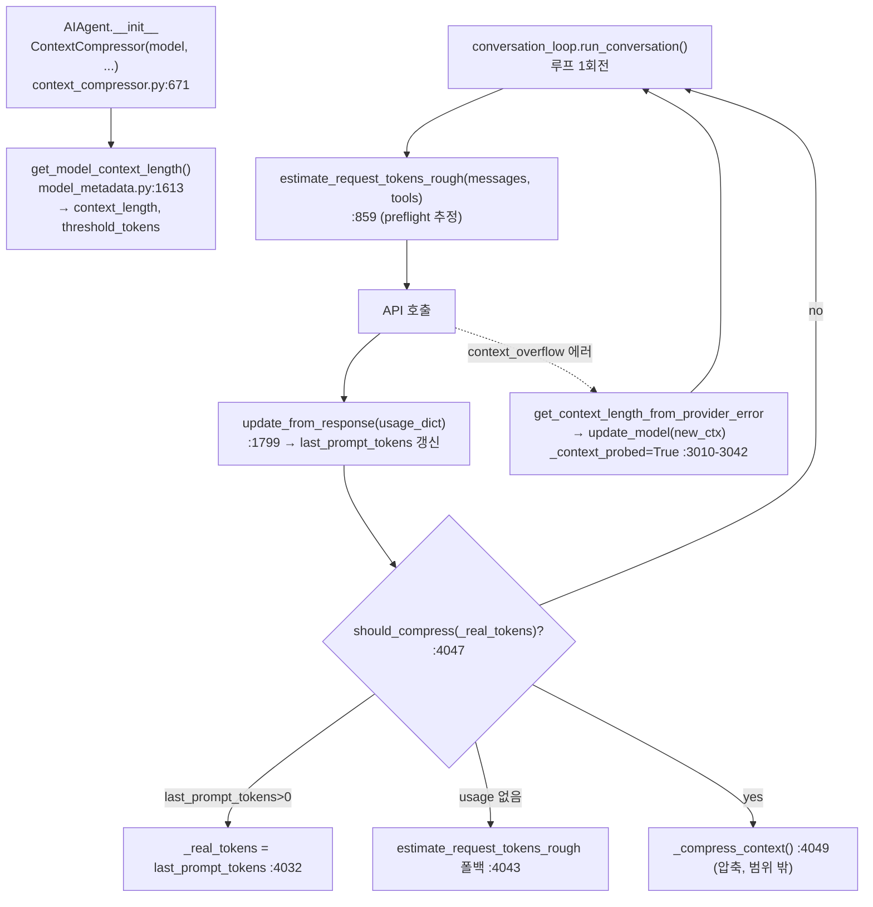

# Hermes Agent ☤ — 컨텍스트 윈도우 추적 및 현황 모듈 분석

> 범위: 이 문서는 **"컨텍스트 윈도우가 지금 얼마나 찼는지" 를 추적·표시하는 부분만** 본다
> (스킬의 "narrow" 모드). **압축(요약) 알고리즘 자체는 범위 밖** — 추적이 산출한 신호의
> *소비자*로만 다룬다. 전체 아키텍처는 [README.md](README.md)의 01~08 챕터 참조.
> 핵심 파일: **`agent/context_compressor.py`**(`ContextCompressor`의 추적 표면),
> **`agent/model_metadata.py`**(컨텍스트 길이 해석·캐시·probe).
> 런타임 결선: `agent/conversation_loop.py`(매 응답 갱신·임계 검사·오버플로 step-down),
> `cli.py`(상태바·`/usage` 표시).
> 모든 주장은 grep/파일 읽기로 확인. 확인 못 한 부분은 명시한다.

---

## 1. 한눈에 보기

"컨텍스트 윈도우 추적"은 두 개의 숫자와 그 둘의 비율로 요약된다:

```
  현재 사용량(last_prompt_tokens)  ÷  창 크기(context_length)  =  현황(%)
        ▲                                    ▲
        │ 매 API 응답마다 갱신                  │ 모델 진입 시 1회 해석 + 오버플로 시 정정
   update_from_response()                get_model_context_length() / update_model()
```

세 가지 설계 결정:

1. **두 관심사를 분리한다.** "창이 얼마나 큰가"(`context_length` 해석)와 "지금 얼마나
   찼는가"(`last_prompt_tokens` 추적)는 별개 메커니즘이다. 전자는 `model_metadata.py`,
   후자는 `context_compressor.py`.
2. **실측(provider usage)을 추정보다 신뢰한다.** `last_prompt_tokens`는 API가 돌려준
   실제 `prompt_tokens`로 갱신되고(`update_from_response`), 그게 없을 때만 rough 추정으로
   폴백한다(`conversation_loop.py:4020-4045`).
3. **창 크기는 "선언"이 아니라 "발견·정정" 대상으로 본다.** 초기엔 추정(기본표/캐시/probe)
   하되, 프로바이더가 오버플로 에러로 진짜 한계를 알려주면 그 값으로 **런타임에 정정**하고
   디스크에 캐시한다(`conversation_loop.py:3010-3042`).

---

## 2. 추적 상태 — `ContextCompressor`의 필드

`agent/context_compressor.py:703-742`. 압축기 객체가 추적 상태를 들고 있다(압축과 추적이
같은 클래스에 동거하지만 역할은 구분된다).

| 필드 | 의미 | 설정 위치 |
|---|---|---|
| `context_length` | 이 모델의 컨텍스트 창 크기(토큰) | `__init__:703` (해석), `update_model:658` (정정) |
| `threshold_tokens` | 압축 발동 임계 = `context_length × threshold_percent` (기본 0.50), 최소 `MINIMUM_CONTEXT_LENGTH`(64K) 바닥 | `__init__:712-715` |
| `last_prompt_tokens` | **가장 최근 API가 보고한 실제 프롬프트 토큰** = 현재 사용량 | `update_from_response:773` |
| `last_real_prompt_tokens` | 0이 아닌 마지막 실측값(폴백 판단용) | `update_from_response:777` |
| `compression_count` | 이 세션 압축 횟수(현황 배지용) | `__init__:716`, 압축 시 증가 |
| `_context_probed` | 오버플로 step-down으로 창 크기를 줄였는가 | `conversation_loop.py:2725, 3040` |
| `_context_probe_persistable` | 그 정정값을 디스크에 캐시해도 되나 | 같은 위치 |

`threshold_percent` 기본값은 `0.50`(`__init__:674`) — 창의 절반을 채우면 압축을 시작한다.
(베이스 `ContextEngine`의 기본은 0.75지만 `context_engine.py:64`, 압축기는 더 보수적인
0.50으로 오버라이드.)

핵심은 `last_prompt_tokens`가 **출력/추론 토큰을 빼고 프롬프트 토큰만** 본다는 점이다.
컨텍스트 창을 점유하는 건 입력측뿐이고, thinking 모델(GLM/QwQ/DeepSeek R1)이 completion에
추론 토큰을 부풀려 조기 압축을 유발하는 걸 막는다(`conversation_loop.py:4026-4032`, #12026).

---

## 3. 창 크기 해석 — `get_model_context_length()` (model_metadata.py:1613)

"이 모델 창이 몇 토큰인가"를 **9단계 폴백**으로 알아낸다(docstring 1621-1644 그대로):

```
0.  명시적 config 오버라이드 (model.context_length / custom_providers)   ← 사용자 최우선
1.  영속 캐시 (이전 probe로 발견해 저장한 값)
1b. AWS Bedrock 정적 표
2.  활성 엔드포인트 /models 메타데이터
3.  로컬 서버 질의
4.  Anthropic /v1/models API (API 키 사용자)
5.  프로바이더별 조회 (Copilot, Nous, Codex OAuth, GMI, Ollama, models.dev)
6.  OpenRouter 라이브 API
7.  하드코딩 기본표 (DEFAULT_CONTEXT_LENGTHS, 최장 키 우선 매칭)
8.  로컬 서버 질의 (최후)
9.  기본 폴백 (256K)
```

기본표 예(`model_metadata.py:191-207`): `claude-opus-4-8 → 1,000,000`,
포괄 키 `claude → 200,000`. longest-key-first로 매칭해(1964) `claude-opus-4-8`이
포괄 `claude`보다 먼저 잡힌다.

### 3.1 Claude의 경우 — 키 종류가 경로를 가른다

Claude에서 위 9단계 중 실제로 관여하는 건 4개뿐이고, **API 키 종류가 결정적**이다.

| 단계 | Claude에서 무엇을 하나 | 근거 |
|---|---|---|
| 0. config 오버라이드 | 사용자가 `model.context_length` 지정 시 무조건 우선 | `1646-1647` |
| 1. 영속 캐시 | `claude-opus-4-8@api.anthropic.com` 키로 디스크 조회 | `get_cached_context_length:951` |
| **4. Anthropic `/v1/models` 라이브 조회** | API에 직접 물어 `max_input_tokens`를 읽음 (권위값) | `_query_anthropic_context_length:1392`, 호출 `1822-1827` |
| 7. 하드코딩 기본표 | `claude-opus-4-8 → 1,000,000`, 포괄 `claude → 200,000` | `DEFAULT_CONTEXT_LENGTHS:198,207` |

4단계가 가장 권위 있는 실값을 주지만 **정규 API 키일 때만** 동작한다:

```python
def _query_anthropic_context_length(model, base_url, api_key):
    if not api_key or api_key.startswith("sk-ant-oat"):
        return None                      # 1398-1399  OAuth 토큰은 /v1/models 401
    ...
    ctx = m.get("max_input_tokens")      # 1415  ← 여기서 진짜 창 크기를 읽음
```

→ 두 경로로 갈린다:

- **정규 Anthropic 키(`sk-ant-api*`)**: 4단계가 Anthropic 서버의 `max_input_tokens`를
  **실시간으로** 받아온다(권위값).
- **Claude Code OAuth 토큰(`sk-ant-oat*`)**: 4단계가 401 → `None` → 폴백이 계속 내려가
  **7단계 하드코딩 표**에 적중 → `claude-opus-4-8 = 1,000,000`. 즉 Claude Code 토큰으로
  돌리면 라이브 조회를 못 해 **코드에 박힌 1M 값**을 쓴다.

그 1M은 "선언"일 뿐이라 §6.3처럼 런타임 정정이 따라온다: ① 1M 티어 미포함 시 429
`long_context_tier` → 200K 축소(`conversation_loop.py:2709-2730`, 정책 한계라 캐시 안 함),
② 오버플로 에러 문구에서 실한계 추출 → `update_model` 정정 + 디스크 캐시(모델 한계라 캐시).
추가로 **Azure 호스팅 Claude**는 1M이 아직 베타 게이트라 별도 처리된다
(`anthropic_adapter.py:549 _base_url_needs_context_1m_beta`).

> 한 줄 요약: Claude 창 크기 = ① 사용자 설정 → ② 디스크 캐시 → ③ **정규 키면** `/v1/models`의
> `max_input_tokens` 실조회 → ④ **OAuth 토큰이면** 하드코딩 표(`claude-opus-4-8=1M`) 순으로
> 결정되고, 이후 429/오버플로 에러로 런타임 정정된다.

### 캐시와 정정

- **저장**: `save_context_length(model, base_url, length)`(930) — 키 `model@base_url`로
  YAML 디스크 캐시에 기록. 같은 모델이라도 프로바이더별로 한계가 다를 수 있어 base_url을
  키에 포함.
- **무효화**: `_invalidate_cached_context_length`(958) — 잘못 캐시된 값 제거.
- **에러에서 추출**: `parse_context_limit_from_error`(982) — `"maximum context length is
  32768 tokens"` 같은 프로바이더 에러 문구에서 정규식 5종으로 실제 한계를 뽑아낸다
  (1024~10,000,000 범위 sanity check).

---

## 4. 현재 사용량 추적 — `update_from_response()` (context_compressor.py:771)

매 API 응답이 들고 온 usage로 사용량을 갱신한다:

```python
def update_from_response(self, usage: Dict[str, Any]):
    self.last_prompt_tokens = usage.get("prompt_tokens", 0)         # 773  ← 현재 사용량
    self.last_completion_tokens = usage.get("completion_tokens", 0)
    self.last_total_tokens = usage.get("total_tokens", ...)
    if self.last_prompt_tokens > 0:
        self.last_real_prompt_tokens = self.last_prompt_tokens      # 777  실측 보존
        ...
    self.awaiting_real_usage_after_compression = False             # 783
```

여기 들어오는 `usage` dict는 [09장](09-비용토큰-계산-모듈.md)의 `normalize_usage()`가
정규화한 토큰 버킷에서 만들어진다(`conversation_loop.py:1789-1799`) — **비용 추적과
컨텍스트 추적이 같은 정규화 토큰을 공유**한다.

### 임계 검사 — `should_compress()` (815)

현황이 임계를 넘었는지 판정:

```python
def should_compress(self, prompt_tokens: int = None) -> bool:
    tokens = prompt_tokens if prompt_tokens is not None else self.last_prompt_tokens
    if tokens < self.threshold_tokens:        # 823  창이 임계 미만이면 압축 안 함
        return False
    if self._ineffective_compression_count >= 2:   # 826  안티-스래싱
        return False
    return True
```

`_ineffective_compression_count >= 2`(직전 두 압축이 각 10% 미만 절감)이면 무한 압축
루프를 막으려 **압축을 건너뛴다**(825-834). 추적이 단순 임계 비교가 아니라 "압축이
효과 있었나"라는 피드백까지 본다.

---

## 5. 런타임 결선

정적 호출 경로(전부 grep로 확인):



런타임 라운드트립:

```mermaid
sequenceDiagram
    participant Loop as conversation_loop
    participant Track as ContextCompressor(추적)
    participant LLM as Provider API
    participant UI as cli 상태바 / usage

    Note over Loop,Track: 진입 시: get_model_context_length()<br/>→ context_length, threshold_tokens 확정
    loop 매 턴
        Loop->>Track: estimate_request_tokens_rough (preflight 추정)
        Loop->>LLM: API 호출
        alt 정상 응답
            LLM-->>Loop: response (+usage)
            Loop->>Track: update_from_response(usage) → last_prompt_tokens
            Loop->>Track: should_compress(real_tokens)?
            Track-->>Loop: tokens ≥ threshold_tokens 면 True
        else context_overflow 에러
            LLM-->>Loop: "max context length is N"
            Loop->>Track: update_model(context_length=N), _context_probed=True
            Note over Track: 창 크기를 런타임 정정 + 디스크 캐시
        end
        Track->>UI: last_prompt_tokens / context_length / compression_count
        Note over UI: 상태바 "120K / 1.0M (12%) 🗜️3"<br/>cli.py:3965-3975, 8298-8341
    end
```

### 호출 지점 정리

| 위치 | 역할 | 근거 |
|---|---|---|
| `context_compressor.py:703` | 진입 시 창 크기 해석 | `get_model_context_length(...)` |
| `conversation_loop.py:1799` | 매 응답 사용량 갱신 | `update_from_response(usage_dict)` |
| `conversation_loop.py:4047` | 임계 검사(현황 ≥ 임계?) | `should_compress(_real_tokens)` |
| `conversation_loop.py:3010-3042` | 오버플로 시 창 크기 정정 + probe 플래그 | `update_model(new_ctx)`, `_context_probed=True` |
| `conversation_loop.py:2709-2730` | Anthropic 1M 티어 미포함 시 200K로 축소 | `update_model(context_length=200000)` |
| `conversation_loop.py:1804-1810` | probe 성공 시 정정값 디스크 캐시 | `save_context_length(...)` |
| `cli.py:3965-3975` | 상태바 스냅샷(토큰/창/%/압축수) | `last_prompt_tokens`, `context_length`, `context_percent` |
| `cli.py:8298-8341` | `/usage` 상세 표시 | `last_prompt`, `ctx_len`, `pct` |

현황 표시(%) 계산은 두 곳 모두 같다:

```python
# cli.py:8300
pct = min(100, (last_prompt / ctx_len * 100)) if ctx_len else 0
# cli.py:3975
snapshot["context_percent"] = max(0, min(100, round((context_tokens / context_length) * 100)))
```

> 주의: 압축 직후 한 턴은 `last_prompt_tokens`가 `-1` 센티넬로 머문다(아직 실측 미도착).
> 상태바는 이를 0으로 클램프해 `-1/200K`, `-1%` 표시를 막는다(`cli.py:3960-3967`).

---

## 6. 예시 — Claude Code(`claude-opus-4-8`) 세션의 컨텍스트 현황 추적

> "클로드코드 에이전트 호출 예시": Claude Code를 구동하는 `claude-opus-4-8`로 세션을 돌릴 때
> 이 모듈이 창 크기를 어떻게 잡고, 매 호출 현황을 어떻게 갱신하며, 1M 티어 미포함 시 어떻게
> 런타임 정정하는지를 **실제 코드 경로와 실제 기본표 숫자**로 재현한다.

### 6.1 진입 — 창 크기 해석

```python
from agent.context_compressor import ContextCompressor

# AIAgent가 모델 진입 시 압축기를 만든다 (context_compressor.py:671)
cc = ContextCompressor(model="claude-opus-4-8", provider="anthropic")

# __init__:703 → get_model_context_length("claude-opus-4-8", ...)
#   9단계 폴백에서 probe가 다 미스하면 7단계 기본표 적중:
#   DEFAULT_CONTEXT_LENGTHS["claude-opus-4-8"] == 1_000_000  (model_metadata.py:198)
cc.context_length      # 1_000_000
cc.threshold_tokens    # 500_000  (= 1_000_000 × 0.50, __init__:712-715)
cc.last_prompt_tokens  # 0  (아직 호출 전)
cc.compression_count   # 0
```

### 6.2 한 턴 호출 후 — 현황 갱신

Claude Code가 한 턴을 호출했고 Anthropic 응답 usage가 `prompt_tokens=120,000` 이라 하자.

```python
# conversation_loop.py:1799 가 매 응답마다 호출
cc.update_from_response({"prompt_tokens": 120_000, "completion_tokens": 1_500,
                         "total_tokens": 121_500})
cc.last_prompt_tokens       # 120_000  ← 현재 사용량
cc.last_real_prompt_tokens  # 120_000  (실측 보존, :777)

# 현황(%) = cli.py:8300 / 3975 와 동일
pct = min(100, 120_000 / cc.context_length * 100)   # 12.0  → 상태바 "120K / 1.0M (12%)"

# 임계 검사 (conversation_loop.py:4047)
cc.should_compress(120_000)   # False  (120_000 < threshold 500_000)  → 압축 안 함
```

### 6.3 1M 티어 미포함 → 런타임 창 정정 (step-down probe)

구독에 1M 컨텍스트 티어가 없으면 Anthropic이 HTTP 429 `long_context_tier`를 던진다.
루프는 이를 **transient 한계가 아니라 정책 한계**로 분류하고 창을 200K로 줄인다
(`conversation_loop.py:2709-2730`):

```python
# 같은 압축기, 1M 티어 거부 발생
cc.update_model(model="claude-opus-4-8", context_length=200_000, provider="anthropic")
cc.context_length     # 200_000   (update_model:658)
cc.threshold_tokens   # 100_000   (= 200_000 × 0.50, :659-662)
cc._context_probed            # True   (:2725)
cc._context_probe_persistable # False  (구독 정책 한계라 캐시 안 함 — 나중에 티어 켜면 복구)

# 이제 같은 120K가 현황 60%로 재해석되고 임계를 넘는다
pct = min(100, 120_000 / 200_000 * 100)   # 60.0  → "120K / 200K (60%)"
cc.should_compress(120_000)               # True   (120_000 ≥ 100_000) → 압축 발동
```

→ 동일한 사용량(120K)이 **창 크기 정정만으로** 12% → 60%로, 압축 불필요 → 압축 발동으로
바뀐다. "현황"이 절대 토큰이 아니라 *창 대비 비율*임을 보여주는 핵심 예.

### 6.4 프로바이더 에러에서 진짜 한계 추출

커스텀/로컬 엔드포인트가 `"max context length is 32768 tokens"` 같은 에러를 주면:

```python
from agent.model_metadata import parse_context_limit_from_error
parse_context_limit_from_error("This model's maximum context length is 32768 tokens")  # 32768
# → conversation_loop.py:3010 이 받아 update_model(context_length=32768),
#   _context_probed=True, _context_probe_persistable=True → save_context_length()로 디스크 캐시
```

→ 다음 세션부터는 9단계 폴백의 **1단계(영속 캐시)** 에서 바로 32768이 잡혀 probe 불필요.

---

## 7. 특장점 (각 항목 코드 근거)

1. **실측 우선 + 추정 폴백** — 현황은 provider가 보고한 실제 `prompt_tokens`로 갱신하고
   (`update_from_response:773`), usage가 없을 때만 rough 추정으로 폴백
   (`conversation_loop.py:4020-4045`, #2153). disconnect 후 무한 성장 방지.
2. **프롬프트 토큰만 카운트** — 출력/추론 토큰을 현황에서 제외해 thinking 모델의 조기
   압축을 차단(`4026-4032`, #12026).
3. **창 크기를 발견·정정 대상으로 취급** — 9단계 폴백 해석(`model_metadata.py:1613`) +
   프로바이더 에러에서 실한계 추출(`parse_context_limit_from_error:982`) + 런타임
   `update_model` 정정 + `model@base_url` 키 디스크 캐시(`save_context_length:930`).
4. **정책 한계 vs 모델 한계 구분** — Anthropic 1M 티어 거부는 `_context_probe_persistable
   =False`로 캐시 안 함(나중 복구 가능), 진짜 모델 한계는 `=True`로 캐시
   (`conversation_loop.py:2730 vs 3041`).
5. **안티-스래싱** — 직전 두 압축이 비효율적이면 임계를 넘어도 압축 보류해 무한 루프 차단
   (`should_compress:826-834`).
6. **압축 직후 센티넬 클램프** — `last_prompt_tokens == -1` 전환 상태를 UI에서 0으로
   클램프해 `-1%` 표시 버그 방지(`cli.py:3960-3967`, 테스트 `test_cli_status_bar.py`).
7. **임계 바닥(floor)** — `MINIMUM_CONTEXT_LENGTH`(64K) 바닥으로 대형 창 모델의 50%
   조기 압축과 소형 모델의 % 왜곡을 동시에 방지(`__init__:708-715`).

---

## 8. 종합 평가 / 한계

- **강점**: "현황"을 절대 토큰이 아니라 *창 대비 비율*로 일관되게 다루고, 창 크기 자체를
  런타임에 발견·정정하는 설계가 견고하다. 비용 추적([09장])과 동일한 정규화 토큰을 공유해
  단일 소스에서 두 현황(비용·컨텍스트)이 파생된다.
- **트레이드오프**: 추적 상태가 `ContextCompressor`에 **압축 로직과 동거**한다 —
  순수 "추적기"로 분리돼 있지 않아 추적만 재사용하려면 압축기 전체를 들고 와야 한다.
  (다만 `update_from_response`/`should_compress`는 순수 메서드라 테스트는 용이.)
- **추정의 한계**: preflight `estimate_request_tokens_rough`는 `chars/4` 휴리스틱
  (`model_metadata.py:2083-2089`, `_CHARS_PER_TOKEN=4`)이라 실제 토크나이저와 차이가 난다.
  코드도 이를 인정해 "스키마 무거운 요청은 의도적 과대추정"이라 명시하고
  (`should_defer_preflight_to_real_usage:785-813`), 실측 도착 시 보정한다.
- **확인 못 한 부분**: 플러그인 컨텍스트 엔진(`toolsets.py:214` `context_engine`)이
  활성일 때의 추적 표면은 이 분석(`ContextCompressor` 기준) 범위 밖 — 플러그인은
  "자체 probe 플래그를 관리한다"고 코드 주석에만 언급됨(`conversation_loop.py:2723`),
  실제 추적 구현은 미확인.

---

### 부록 — 빠른 참조

| 심볼 | 위치 | 역할 |
|---|---|---|
| `context_length` / `threshold_tokens` | `context_compressor.py:703,712` | 창 크기 / 압축 임계 |
| `last_prompt_tokens` | `context_compressor.py:737,773` | 현재 사용량(실측) |
| `update_from_response` | `context_compressor.py:771` | 매 응답 현황 갱신 |
| `should_compress` | `context_compressor.py:815` | 현황 ≥ 임계 판정 + 안티스래싱 |
| `update_model` | `context_compressor.py:643` | 모델 전환/오버플로 시 창 재교정 |
| `get_model_context_length` | `model_metadata.py:1613` | 9단계 창 크기 해석 |
| `save_context_length` / `get_cached_context_length` | `model_metadata.py:930,951` | 발견값 디스크 캐시 |
| `parse_context_limit_from_error` | `model_metadata.py:982` | 에러 문구에서 실한계 추출 |
| `estimate_request_tokens_rough` | `model_metadata.py:2069` | preflight rough 추정(chars/4) |
| 상태바 스냅샷 / `/usage` | `cli.py:3965,8298` | 토큰/창/%/압축수 표시 |
