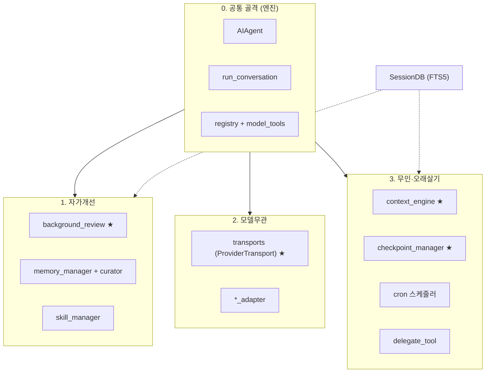

# 11. 비전별 핵심 모듈 분류

[← 10. 컨텍스트윈도우 추적·현황](10-컨텍스트윈도우-추적-현황.md) · [목차](README.md)

> [4. 핵심 모듈](04-핵심-모듈.md)이 모듈을 *책임 단위*로 나열했다면, 이 장은 [7. 비전과 필요조건](07-큰그림-비전과-필요조건.md)이
> 규정한 **비전 3대 축**(자가개선 · 모델무관 · 무인·오래살기)을 기준으로 같은 모듈들을 *재분류*한다.
> 즉 "이 모듈은 어느 비전을 달성하기 위해 존재하는가"의 관점이다.

---

## 11.0 공통 골격 — 엔진 (모든 비전의 토대)

| 모듈 | 역할 |
|---|---|
| `run_agent.py::AIAgent` | 런타임 상태 머신(모델·세션·예산·콜백 보유). 모든 능력의 진입점 |
| `agent/conversation_loop.py::run_conversation` | 턴의 에이전트 루프 — 모델 호출·툴 디스패치·재시도·압축·종료 |
| `tools/registry.py` + `model_tools.py` | 유일한 능력 호출 경계(=시스템콜). ~87개 툴의 등록·디스패치·인자 강제변환 |

> 이 셋은 특정 비전 전용이 아니라, 아래 세 축이 작동하기 위한 *실행 기반*이다.

---

## 11.1 자가개선 (self-improving)

| 모듈 | 비전 기여 |
|---|---|
| `agent/background_review.py` | **핵심.** 턴 종료 후 에이전트를 포크해 "스킬/메모리 갱신?"을 평가, 스토어에 직접 기록 — 본 대화를 오염시키지 않는 격리 학습 |
| `agent/memory_manager.py` + `curator.py` | 큐레이트 메모리(MEMORY.md/USER.md)와 스킬·메모리 수명주기 전이(stale/archive/prune) |
| `tools/skill_manager_tool.py` | 경험에서 스킬을 만들고 대화 중 개선 |
| `hermes_state.py::SessionDB` (FTS5) | cross-session 회상 — 과거를 검색해 누적 학습 |

---

## 11.2 모델무관 (any model, no lock-in)

| 모듈 | 비전 기여 |
|---|---|
| `agent/transports/*` (`ProviderTransport`) | **핵심.** LLM 경계를 단일 호출이 아닌 Strategy 계층으로 추상화 (`convert_messages/tools`, `normalize_response`) |
| `agent/*_adapter.py` | api_mode별 분기 — chat_completions / anthropic_messages / bedrock_converse / codex_responses |

---

## 11.3 무인·오래살기 (runs anywhere, autonomous, long-lived)

| 모듈 | 비전 기여 |
|---|---|
| `agent/context_engine.py` + `context_compressor` | 유한 컨텍스트로 오래 살기 — 임계치(0.75) 초과 시 보조 모델 요약 압축 |
| `tools/checkpoint_manager.py` | 모든 외부 작용을 되돌리기 — 파일변경 전 git 섀도 스냅샷·롤백 |
| `hermes_state.py::SessionDB` | idle 시 hibernate·세션 넘어 누적되는 영속성(SQLite+FTS5) |
| `cron/` 스케줄러 | 자연어 작업의 무인 자동 실행 |
| `tools/delegate_tool.py` | 서브에이전트 스폰 — 병렬 워크스트림, 추적·중단 |
| 방어적 복구·가드레일 (`conversation_loop` 내 시퀀스 수리·fallback, `tools/approval.py`, `path_security.py`) | 무인·약한 모델 내성과 blast radius 제한 |

---

## 11.4 요약

- `SessionDB`는 **자가개선(회상)** 과 **오래살기(영속)** 두 축에 걸친다.
- 엔진 3종(`AIAgent` / `run_conversation` / `registry`)은 모든 축을 떠받친다.
- 각 축의 **핵심(★)** 모듈은 차례로 **`background_review` · `transports` · `context_engine`+`checkpoint_manager`** 이다.
- 한 문장: *엔진(공통) → 자가개선/모델무관/오래살기(비전별)* 의 2단 구조.

---

## 부록

- [11-부록. 메모리·압축 메커니즘](11-부록-메모리와-압축-메커니즘.md) — "MEMORY.md는 뭐가 다른가",
  "압축하면 messages[]의 이전 대화는 어떻게 되나"에 대한 코드 근거 심화.
