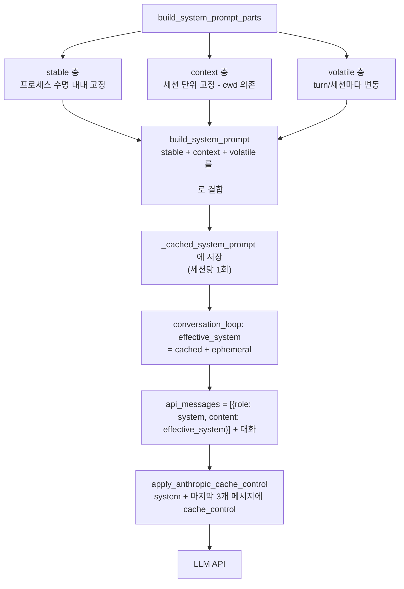

# 12. 시스템 프롬프트 주입 전체 분석

> Hermes 에이전트가 매 세션 LLM에 주입하는 시스템 프롬프트의 **모든 구성요소**, 각각이 **무엇을 / 어떤 조건에서 / 어떤 포맷으로** 들어가는지 전수 분석한다.
>
> 핵심 코드:
> - `agent/system_prompt.py` — 조립 진입점 (`build_system_prompt_parts`, `build_system_prompt`)
> - `agent/prompt_builder.py` — 개별 블록 텍스트 및 환경 힌트/컨텍스트 파일 로더
> - `agent/coding_context.py` — 코딩 포스처 블록 + git/workspace 스냅샷
> - `tools/env_probe.py` — 파이썬 툴체인 프로브
> - `agent/conversation_loop.py` / `agent/chat_completion_helpers.py` — 최종 API 메시지 조립
> - `agent/prompt_caching.py` — Anthropic 캐시 브레이크포인트

---

## 12.1 핵심 불변식 (Invariant)

Hermes 시스템 프롬프트 설계 전체를 지배하는 단 하나의 규칙:

> **시스템 프롬프트는 세션당 딱 한 번 조립되어 `agent._cached_system_prompt`에 캐싱되고, 모든 turn에서 바이트 단위로 동일하게 재사용된다. 오직 컨텍스트 압축(compression) 이벤트만 재빌드를 유발한다.**

이유는 **업스트림 prefix 캐시(Anthropic/OpenRouter prompt cache)를 warm하게 유지**하기 위함이다. 시스템 프롬프트의 앞부분 바이트가 turn마다 바뀌면 캐시 prefix가 무효화되어 입력 토큰 비용이 ~4배로 튄다.

이 불변식에서 파생되는 설계 결정들:

| 결정 | 근거 |
|------|------|
| 분(minute) 단위 타임스탬프 금지, **날짜만** 기록 | 분이 바뀔 때마다 캐시 무효화 (`system_prompt.py:378`) |
| git/workspace 스냅샷은 **한 번만** 찍고 재프로브 안 함 | 프로브 결과가 turn마다 달라지면 캐시 깨짐 (`coding_context.py`) |
| 플러그인 컨텍스트 / 외부 recall은 **user 메시지**에 주입, system엔 안 넣음 | 시스템 프롬프트는 Hermes 내부용으로 예약 (`conversation_loop.py:762`) |
| ephemeral 프롬프트는 캐시 문자열에 **미포함**, API 호출 시점에만 덧붙임 | trajectory/DB에도 저장 안 됨 (`system_prompt.py:337`) |

---

## 12.2 전체 조립 구조 — 3-tier

`build_system_prompt_parts()` (`agent/system_prompt.py:63`)는 프롬프트를 **3개 계층**으로 나눠 dict로 반환하고, `build_system_prompt()` (`:400`)가 `"\n\n"`로 이어붙인다.



세 계층은 **캐시 안정성 순서**로 배치된다: 가장 안 변하는 것(stable) → 세션 고정(context) → 매번 변동(volatile). 변동분을 뒤로 몰아야 앞쪽 캐시 prefix가 최대한 살아남는다.

| 계층 | 저장 위치 | 변동성 | 내용 |
|------|-----------|--------|------|
| **stable** | 캐시됨 | 프로세스 수명 고정 | 정체성, 도구 가이드, 실행환경, 스킬, 플랫폼 힌트 |
| **context** | 캐시됨 | 세션 고정 (cwd 의존) | 프로젝트 컨텍스트 파일 + 호출자 system_message |
| **volatile** | 캐시됨* | turn/세션마다 | 메모리 스냅샷, USER 프로필, 외부 메모리, 타임스탬프 |

\* volatile도 캐시 문자열의 일부로 굳혀지지만, 압축 재빌드 시 갱신된다. ephemeral만 캐시 밖.

---

## 12.3 STABLE 층 — 전체 구성요소 (주입 순서대로)

`stable_parts` 리스트에 순서대로 `append`되는 블록들. 각 블록은 **조건부**로 들어가며, 대부분 `agent/prompt_builder.py`의 상수 텍스트다.

| # | 블록 | 주입 조건 | 소스 | 포맷 |
|---|------|-----------|------|------|
| 1 | **정체성 (SOUL.md 또는 기본)** | 항상 (SOUL.md 우선, 없으면 `DEFAULT_AGENT_IDENTITY`) | `load_soul_md()` / 상수 | 원문 마크다운 |
| 2 | **Hermes 도움말 가이드** | 항상 | `HERMES_AGENT_HELP_GUIDANCE` | 정적 텍스트 |
| 3 | **작업완료/비조작 가이드** | `agent.task_completion_guidance` (기본 True) + 도구 존재 | `TASK_COMPLETION_GUIDANCE` | 정적 텍스트 |
| 4 | **도구별 행동 가이드** | 해당 도구 로드 시 (memory/session_search/skill_manage/kanban) | `MEMORY_GUIDANCE` 등 | 여러 상수를 공백으로 join |
| 5 | **Steer 채널 노트** | 도구 존재 시 | `STEER_CHANNEL_NOTE` | 정적 텍스트 |
| 6 | **Computer-use 가이드** | `computer_use` 도구 존재 (macOS) | `COMPUTER_USE_GUIDANCE` | 멀티 문단 |
| 7 | **Nous 구독 블록** | 구독 도구 존재 시 | `build_nous_subscription_prompt()` | 동적 텍스트 |
| 8 | **도구사용 강제 가이드** | `tool_use_enforcement` 매칭 (auto/true/list) | `TOOL_USE_ENFORCEMENT_GUIDANCE` | 정적 텍스트 |
| 8a | ─ Google 모델 운영 가이드 | 모델명에 `gemini`/`gemma` | `GOOGLE_MODEL_OPERATIONAL_GUIDANCE` | 정적 텍스트 |
| 8b | ─ OpenAI/Grok 실행 규율 | 모델명에 `gpt`/`codex`/`grok` | `OPENAI_MODEL_EXECUTION_GUIDANCE` | 정적 텍스트 |
| 9 | **스킬 인덱스 프롬프트** | 스킬 도구(`skills_list` 등) 존재 시 | `build_skills_system_prompt()` | 스킬명+설명 목록 |
| 10 | **Alibaba 모델명 워크어라운드** | `provider == "alibaba"` | 동적 문자열 | "You are powered by..." |
| 11 | **🌐 실행환경 힌트** | 항상 (내용은 백엔드 의존) | `build_environment_hints()` | 아래 12.3.1 참조 |
| 12 | **🌐 코딩 포스처 블록 + git 스냅샷** | 도구 존재 + 코딩 컨텍스트 | `coding_system_blocks()` | 운영 브리핑 + 워크스페이스 스냅샷 |
| 13 | **🌐 파이썬 툴체인 프로브** | `agent.environment_probe`(기본 True), remote 백엔드면 skip | `get_environment_probe_line()` | 비default일 때만 **한 줄** |
| 14 | **활성 Hermes 프로필 힌트** | 항상 | 동적 문자열 | default/named 프로필 안내 |
| 15 | **🌐 플랫폼 힌트** | `platform` 키가 `PLATFORM_HINTS`에 있거나 플러그인 등록 시 | `PLATFORM_HINTS[key]` / registry | 정적/플러그인 텍스트 |

🌐 = **실행환경을 직접 다루는 블록** (질문 1에서 다룬 부분).

### 12.3.1 실행환경 힌트 상세 (`build_environment_hints`, `prompt_builder.py:832`)

`TERMINAL_ENV` 환경변수로 **local vs remote** 백엔드를 판별해 다른 내용을 낸다.

**Local 백엔드** (호스트에서 도구가 직접 실행됨):
```
Host: WSL (Windows Subsystem for Linux)   # 또는 Windows/macOS/Linux + 버전
User home directory: /home/<user>
Current working directory: <resolve_agent_cwd()>
```
- Windows(비 WSL): "hostname ≠ username" 주의 + "shell은 bash지 PowerShell 아님" 노트 추가
- WSL: `WSL_ENVIRONMENT_HINT` 블록 append
- Hermes 데스크톱 GUI: `HERMES_DESKTOP`/`HERMES_DESKTOP_TERMINAL` env 감지 시 GUI 런타임 힌트

**Remote 백엔드** (docker/singularity/modal/daytona/ssh — 호스트 정보 **은폐**):
```
Terminal backend: docker. Your `terminal`, `read_file`, `write_file`,
`patch`, `search_files` tools all operate inside this docker environment
— NOT on the machine where Hermes itself is running. ...
<백엔드 내부를 실제 probe한 OS/user/$HOME/cwd>
```
- 프로브 실패 시: 정적 fallback 설명 + "직접 `uname -a && whoami && pwd`로 확인하라"

**임베더 커스텀 힌트**: `HERMES_ENVIRONMENT_HINT` env var(우선) 또는 config `agent.environment_hint`를 마지막에 append. 최종적으로 모든 힌트를 `"\n\n"`로 join.

### 12.3.2 코딩 포스처 + git 스냅샷 (`coding_system_blocks`)

`resolve_runtime_mode(...).system_blocks()`가 코딩 워크스페이스일 때 운영 브리핑과 **git/workspace 라이브 스냅샷**을 낸다. 스냅샷은 세션 시작 시 한 번만 `git` 서브프로세스로 찍고(`_git()`, `coding_context.py:590`) 이후 재프로브하지 않는다. 대신 브리핑이 "의존하기 전 git을 다시 확인하라"고 명시해 stale 위험을 상쇄한다.

### 12.3.3 파이썬 툴체인 프로브 (`env_probe.py:215`)

python/pip/uv/PEP-668 상태가 **비default일 때만** 한 줄을 낸다. 깨끗하면 아무것도 안 냄(토큰 절약). remote 백엔드에서는 호스트 파이썬 상태가 무의미하므로 skip.

---

## 12.4 CONTEXT 층 — 프로젝트 컨텍스트 파일

`context_parts` (`system_prompt.py:335`). 캐시되지만 cwd 의존이라 세션마다 다를 수 있다.

1. **호출자 `system_message`** — 있으면 그대로 append.
2. **프로젝트 컨텍스트 파일** — `build_context_files_prompt()` (`prompt_builder.py:1709`). `skip_context_files=False`일 때만.

**우선순위 (첫 매치만 로드 — 하나만 채택)**:
```
1. .hermes.md / HERMES.md   (git 루트까지 탐색)
2. AGENTS.md / agents.md     (cwd만)
3. CLAUDE.md / claude.md     (cwd만)
4. .cursorrules / .cursor/rules/*.mdc  (cwd만)
```
SOUL.md는 별개 — HERMES_HOME에서 로드되며 정체성 슬롯(#1)에 이미 들어갔으면 `skip_soul=True`로 중복 방지.

**포맷**:
```markdown
# Project Context

The following project context files have been loaded and should be followed:

## AGENTS.md

<파일 내용>
```

**보안·안전 처리**:
- `_scan_context_content()` — 주입 전 프롬프트 인젝션/promptware 스캔 (`prompt_builder.py:34`)
- `_truncate_content()` — 캡 초과 시 head 70% + tail 20% 유지, 중간 생략 마커 삽입 (`:1541`). 캡은 모델 컨텍스트 윈도우에 비례해 동적 산정(기본 20,000자, config `context_file_max_chars`가 최우선). 잘리면 경고를 status 채널로 방출(`build_system_prompt:420`).

---

## 12.5 VOLATILE 층 — turn/세션 변동분

`volatile_parts` (`system_prompt.py:353`). 뒤쪽에 배치해 앞 캐시를 보호한다.

| 블록 | 조건 | 소스 |
|------|------|------|
| **메모리 스냅샷** | `_memory_enabled` | `memory_store.format_for_system_prompt("memory")` |
| **USER.md 프로필** | `_user_profile_enabled` (항상 포함) | `format_for_system_prompt("user")` |
| **외부 메모리 제공자 블록** | `_memory_manager` 존재 | `memory_manager.build_system_prompt()` |
| **타임스탬프 라인** | 항상 | 아래 |

**타임스탬프 포맷** (`system_prompt.py:384`):
```
Conversation started: Wednesday, July 01, 2026
Session ID: <id>          # pass_session_id=True일 때만
Model: <model>            # 모델 있을 때
Provider: <provider>      # 프로바이더 있을 때
```
**분·초 없이 날짜만** — 캐시 불변식 준수. 정확한 시각은 도구로 조회하도록 유도.

---

## 12.6 EPHEMERAL 시스템 프롬프트 — 별도 경로

`ephemeral_system_prompt` (생성자 인자, `run_agent.py:362` → `agent_init.py:287`)는 **3-tier 어디에도 포함되지 않는다.** 캐시 문자열(`_cached_system_prompt`)에도, 세션 DB/trajectory에도 저장되지 않는다.

대신 **API 호출 직전**에만 붙인다 (`conversation_loop.py:772`, `chat_completion_helpers.py:1342`):
```python
effective_system = active_system_prompt or ""            # = _cached_system_prompt
if agent.ephemeral_system_prompt:
    effective_system = (effective_system + "\n\n" + agent.ephemeral_system_prompt).strip()
```

용도: 세션에 영구 기록하고 싶지 않은 일회성 시스템 지시.

---

## 12.7 최종 API 메시지 조립 & 캐시 포맷

`conversation_loop.py:757~` 에서 `effective_system`을 **단일 system 메시지**로 대화 앞에 붙인다:

```python
if effective_system:
    api_messages = [{"role": "system", "content": effective_system}] + api_messages
```

주목할 포인트:
- **단일 content 문자열**로 전송 — 바이트 안정성 확보(캐시 warm 유지, `:769`).
- **prefill 메시지**가 있으면 system 바로 뒤·대화 앞에 삽입 (`:780`).
- **플러그인 컨텍스트 / 외부 recall은 system이 아니라 user 메시지에 주입** — 캐시 prefix 보존 (`:762`).

### 캐시 브레이크포인트 (`prompt_caching.py:49`)

Claude 모델 + 캐싱 지원 라우트일 때 `apply_anthropic_cache_control`이 **"system + 마지막 3개 메시지"** 전략으로 최대 4개 `cache_control` 브레이크포인트를 찍는다:
```python
{"role": "system", "content": [..., {"type":"text","text": "...", "cache_control": {"type":"ephemeral"}}]}
```
system 프롬프트에 1개, 나머지 비-system 메시지 뒤쪽 3개에 부여. 멀티턴에서 입력 토큰 비용 ~75% 절감. (Qwen 등 일부 프로바이더는 별도 경로 `run_agent.py:4754`, `:4785`에서 content를 리스트로 정규화 후 마지막 파트에 `cache_control` 부여.)

---

## 12.8 재빌드 & 무효화

- **`invalidate_system_prompt`** (`system_prompt.py:426`) — 캐시를 None으로 리셋. **컨텍스트 압축 이벤트**에서만 호출. 메모리도 디스크에서 재로드.
- **압축 후 재빌드** (`conversation_compression.py:507`) — 새 프롬프트를 `_cached_system_prompt`에 재저장.
- **세션 재개** (`conversation_loop.py:306`) — DB에 저장된 프롬프트를 그대로 복원(재빌드 아님) → 캐시 유지.
- **background review fork** (`background_review.py:543`) — 부모의 캐시된 프롬프트를 **verbatim 상속**.

---

## 12.9 한눈에 보는 요약

```
[정체성] SOUL.md 또는 DEFAULT_AGENT_IDENTITY
   +
[가이드] Hermes도움말 · 작업완료 · 도구별 · Steer · Computer-use ·
         Nous · 도구강제(+모델별) · 스킬인덱스 · Alibaba워크어라운드
   +
[🌐실행환경] 환경힌트(host/cwd 또는 remote백엔드) · 코딩포스처+git스냅샷 ·
             파이썬툴체인프로브 · 프로필힌트 · 플랫폼힌트
   ────────────────────────  ↑ stable (캐시, 고정)
[컨텍스트] system_message + 프로젝트파일(.hermes/AGENTS/CLAUDE/.cursorrules 중 1)
   ────────────────────────  ↑ context (캐시, cwd의존)
[휘발] 메모리 · USER.md · 외부메모리 · 타임스탬프(날짜만)
   ────────────────────────  ↑ volatile (뒤로 배치)
   ══════ "\n\n".join → _cached_system_prompt (세션당 1회) ══════
   + ephemeral_system_prompt (API호출 시점에만, 캐시 밖)
   = {"role":"system", "content": <단일 문자열>} + 대화
   → cache_control 브레이크포인트 (system + 마지막 3메시지)
   → LLM
```

**설계 철학 한 줄 요약**: *"실행환경·정체성·가이드를 세션당 한 번 굳혀 프롬프트 앞에 붙이고, 변동분은 뒤로 몰거나 캐시 밖(ephemeral/user 메시지)으로 빼서, 업스트림 prompt cache를 최대한 오래 warm하게 유지한다."*
