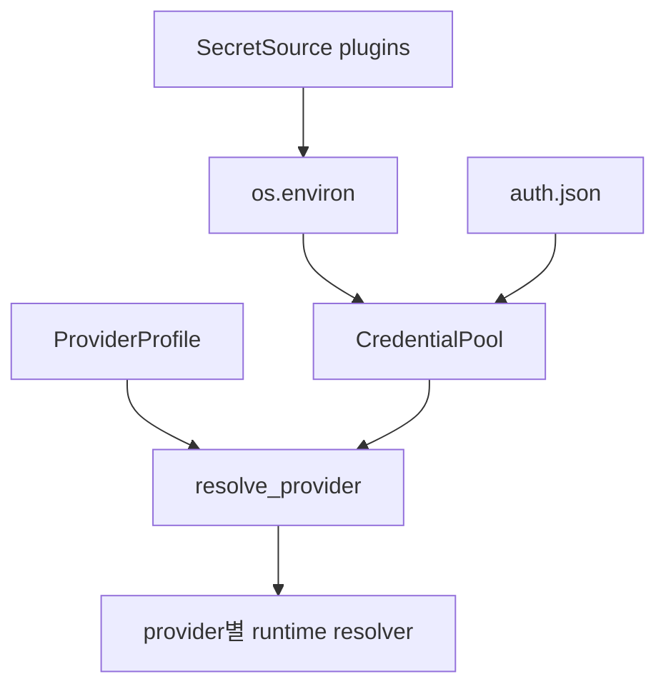

# Hermes Agent 인증 브로커 분석

> 조사일: 2026-07-31
> 대상 저장소: `NousResearch/hermes-agent`
> 기준 브랜치/커밋: `main` / `ce6dd1a65f4b6b20b1f3b31f75184a3e26583488`
> 조사 범위: `auth.json`, multi-credential pool, provider 선택·refresh, model-provider plugin,
> 외부 secret source plugin

## 결론

Hermes Agent는 하나의 작은 인증 브로커가 아니라 **인증 저장소 + 다중 자격증명 풀 +
provider 선택기 + provider별 OAuth 구현 + 외부 secret source**를 겹쳐 만든 시스템이다.
여러 계정의 rate-limit/인증 실패를 구분하고 회전시키는 운영 기능은 세 조사 대상 중 가장
풍부하다.

플러그인화는 두 갈래다. model-provider profile은 주로 선언형 metadata이며 단순 API-key
provider만 `auth.py`에 자동 연결된다. 반면 external secret source는 versioned ABC와 중앙
우선순위·provenance를 가진 명확한 플러그인 계약이다. 다만 secret은 최종적으로 전역
`os.environ`에 주입되고, Hermes 소유 OAuth/API key는 암호화되지 않은 `0600` JSON 또는
`.env`에 남을 수 있다.

## 구조 요약

| 계층 | Hermes 구현 | 책임 |
|---|---|---|
| 저장 | `~/.hermes/auth.json` | provider 상태, OAuth token, credential pool |
| 외부 소스 | `SecretSource` registry | vault/CLI에서 startup-time secret fetch |
| 풀 | `CredentialPool` | 같은 provider의 여러 자격증명 선택·회전·격리 |
| 선택 | `resolve_provider()` | 명시 설정, env, pool, active OAuth 우선순위 |
| 런타임 | `resolve_*_runtime_credentials()` | refresh와 최종 endpoint/token 생성 |
| Backend 선언 | `ProviderProfile` plugin | env 이름, endpoint, 요청 quirks |

## `auth.json` 저장소

[`hermes_cli/auth.py`](https://github.com/NousResearch/hermes-agent/blob/ce6dd1a65f4b6b20b1f3b31f75184a3e26583488/hermes_cli/auth.py#L1-L13)는
`ProviderConfig` registry, `auth.json`, provider 선택기, runtime refresh를 인증 구조의 핵심으로
설명한다.

[`_load_auth_store`](https://github.com/NousResearch/hermes-agent/blob/ce6dd1a65f4b6b20b1f3b31f75184a3e26583488/hermes_cli/auth.py#L1120-L1159)는
JSON을 읽고, 손상 파일을 별도 보존한 뒤 빈 store로 복구한다.
[`_save_auth_store`](https://github.com/NousResearch/hermes-agent/blob/ce6dd1a65f4b6b20b1f3b31f75184a3e26583488/hermes_cli/auth.py#L1162-L1213)는
다음 안전장치를 가진다.

- parent directory를 Unix에서 `0700`으로 강화
- 임시 파일을 `O_EXCL`과 `0600`으로 처음부터 생성해 chmod 전 TOCTOU 창 제거
- file과 directory `fsync` 후 atomic replace
- 별도 cross-process advisory lock

파일 내용 자체는 평문이다. OAuth access/refresh token과 Hermes가 소유하는 수기
credential pool 값은 OS keychain 암호화 없이 저장될 수 있다.

profile별 `HERMES_HOME`을 사용할 때는 profile store가 우선이고, 해당 provider 항목이 없을 때
global store를 read-only fallback으로 본다.
[`read_credential_pool`](https://github.com/NousResearch/hermes-agent/blob/ce6dd1a65f4b6b20b1f3b31f75184a3e26583488/hermes_cli/auth.py#L1414-L1458)가
이 shadow 규칙을 구현한다.

## 다중 자격증명 풀

[`agent/credential_pool.py`](https://github.com/NousResearch/hermes-agent/blob/ce6dd1a65f4b6b20b1f3b31f75184a3e26583488/agent/credential_pool.py#L1)는
같은 provider의 여러 자격증명을 영속 관리한다. 풀은 다음 상태를 다룬다.

| 기능 | 동작 |
|---|---|
| 우선순위 | provider별 entry 순서를 유지하고 현재 entry 선택 |
| 일시 소진 | rate limit/billing 계열 실패를 cooldown 후 재사용 가능 상태로 관리 |
| 영구 폐기 | revoke/invalid grant 같은 terminal 401은 `DEAD`로 격리 |
| 회전 | 실패 entry를 표시하고 다음 사용 가능한 entry로 이동 |
| 동시성 | 프로세스 내 lock + `auth.json` file lock + 최신 상태 merge |
| 외부 동기화 | Claude Code/Codex CLI 등 외부 credential file의 새 token 반영 |

`load_pool`은
[`agent/credential_pool.py`](https://github.com/NousResearch/hermes-agent/blob/ce6dd1a65f4b6b20b1f3b31f75184a3e26583488/agent/credential_pool.py#L2743-L2806)에서
auth store, Hermes-owned OAuth singleton, env/file 출처를 합치고 stale entry를 정리한다.

외부 vault·env에서 빌린 credential은 raw 값을 `auth.json`에 재저장하지 않도록 별도 disk
boundary가 있다.
[`credential_persistence.py`](https://github.com/NousResearch/hermes-agent/blob/ce6dd1a65f4b6b20b1f3b31f75184a3e26583488/agent/credential_persistence.py#L17-L26)는
Hermes가 직접 소유해 저장 가능한 source를 allowlist하고,
[`sanitize_borrowed_credential_payload`](https://github.com/NousResearch/hermes-agent/blob/ce6dd1a65f4b6b20b1f3b31f75184a3e26583488/agent/credential_persistence.py#L151-L174)는
그 밖의 source에서 secret-shaped 필드를 제거하고 비가역 fingerprint만 남긴다.

이는 “외부 secret을 읽었다”와 “그 값을 우리 저장소가 소유한다”를 구분하는 좋은 정책이다.

## provider 선택과 runtime refresh

[`ProviderConfig`](https://github.com/NousResearch/hermes-agent/blob/ce6dd1a65f4b6b20b1f3b31f75184a3e26583488/hermes_cli/auth.py#L159-L174)는
auth type, endpoint, API-key env 이름을 선언한다. OAuth provider와 특수 provider는
`auth.py`의 큰 registry와 전용 resolver에 직접 구현돼 있다.

자동 provider 선택 우선순위는
[`resolve_provider`](https://github.com/NousResearch/hermes-agent/blob/ce6dd1a65f4b6b20b1f3b31f75184a3e26583488/hermes_cli/auth.py#L1858-L1876)에
명시돼 있다.

| 우선순위 | 출처 |
|---|---|
| 1 | 명시 CLI API key/base URL |
| 2 | `config.yaml`의 model provider |
| 3 | OpenAI/OpenRouter env |
| 4 | OpenRouter credential pool |
| 5 | provider별 API key |
| 6 | `auth.json.active_provider` OAuth |
| 7 | AWS credential chain |

일반 API-key provider는
[`_resolve_api_key_provider_secret`](https://github.com/NousResearch/hermes-agent/blob/ce6dd1a65f4b6b20b1f3b31f75184a3e26583488/hermes_cli/auth.py#L587-L628)에서
`.env`/process env를 먼저 보고 credential pool을 fallback으로 사용한다. OAuth는 Codex, xAI,
Nous, Qwen, MiniMax 등 provider별 `resolve_*_runtime_credentials`와 refresh 함수가
`auth.py` 안에 별도로 존재한다.

따라서 선택·pool 공통화는 강하지만, OAuth protocol 구현까지 하나의 확장 계약으로 통일된
구조는 아니다.

## model-provider plugin

[`ProviderProfile`](https://github.com/NousResearch/hermes-agent/blob/ce6dd1a65f4b6b20b1f3b31f75184a3e26583488/providers/base.py#L1-L10)는
스스로를 선언형 profile로 규정하며 client construction·credential rotation은 소유하지 않는다.
profile은 env 이름, base URL, auth type과 요청별 quirks를 제공한다.

[`providers/__init__.py`](https://github.com/NousResearch/hermes-agent/blob/ce6dd1a65f4b6b20b1f3b31f75184a3e26583488/providers/__init__.py#L1-L22)는
bundled와 `$HERMES_HOME/plugins/model-providers`의 사용자 plugin을 lazy discovery한다. 사용자
plugin은 같은 이름의 bundled profile을 last-writer-wins로 대체한다.

[`plugins/model-providers/README.md`](https://github.com/NousResearch/hermes-agent/blob/ce6dd1a65f4b6b20b1f3b31f75184a3e26583488/plugins/model-providers/README.md#L17-L62)는
`__init__.py`에서 `register_provider(profile)`을 호출하고 `plugin.yaml`을 두는 authoring
규약을 설명한다.

단순 API-key profile은
[`auth.py`의 auto-extension](https://github.com/NousResearch/hermes-agent/blob/ce6dd1a65f4b6b20b1f3b31f75184a3e26583488/hermes_cli/auth.py#L466-L498)으로
registry에 추가된다. 다만 bespoke token refresh가 필요한 provider와 OAuth profile은 제외되며
중앙 코드가 필요하다. 즉 model-provider plugin은 전체 인증 플러그인이 아니다.

## external secret source plugin

인증 확장 계약으로 더 완결된 쪽은
[`SecretSource`](https://github.com/NousResearch/hermes-agent/blob/ce6dd1a65f4b6b20b1f3b31f75184a3e26583488/agent/secret_sources/base.py#L1-L34)다.

| 계약 | 정책 |
|---|---|
| 방향 | 외부 vault의 ref를 값으로 해석하는 read-only source |
| 시점 | process startup 1회, 동기 fetch |
| 상호작용 | `fetch()`는 prompt/raise 금지, `FetchResult` 반환 |
| 버전 | `SECRET_SOURCE_API_VERSION` 불일치 시 skip |
| shape | 명시 매핑 `mapped` 또는 bulk import |
| 중앙 책임 | 우선순위, conflict, provenance, 실제 env write |

[`registry.apply_all`](https://github.com/NousResearch/hermes-agent/blob/ce6dd1a65f4b6b20b1f3b31f75184a3e26583488/agent/secret_sources/registry.py#L323-L435)은
기존 env, mapped source, bulk source 우선순위를 적용하고 first-claim-wins 충돌 경고와 provenance를
생성한다.

plugin은
[`PluginContext.register_secret_source`](https://github.com/NousResearch/hermes-agent/blob/ce6dd1a65f4b6b20b1f3b31f75184a3e26583488/hermes_cli/plugins.py#L819-L865)로
source를 등록한다. 단 최초 `.env` load보다 plugin discovery가 늦어, 처음 plugin을 발견한
프로세스의 첫 load에는 적용되지 않고 후속 child process나 cache reset 뒤에 적용되는 timing
제약이 명시돼 있다.

secret manager helper를 실행할 때는
[`run_secret_cli`](https://github.com/NousResearch/hermes-agent/blob/ce6dd1a65f4b6b20b1f3b31f75184a3e26583488/agent/secret_sources/base.py#L259-L317)가
전체 `os.environ`을 넘기지 않고 PATH/HOME/locale과 allowlist된 인증 env만 child에 전달한다.
이는 subprocess credential 격리의 좋은 선례다.

하지만 fetch된 값의 최종 목적지는 전역 `os.environ`이다. 이후 Hermes 프로세스와 일반 child가
환경을 어떻게 상속하는지에 따라 secret 접근 범위가 넓어진다. startup source는 mid-session
lease·refresh API도 제공하지 않는다.

## 평가

| 관점 | 평가 | 근거 |
|---|---|---|
| 다중 credential 운영 | 매우 강함 | 회전, cooldown, DEAD, 외부 file 동기화 |
| 저장 무결성 | 강함 | lock, atomic `0600`, concurrent merge |
| 저장 기밀성 | 제한적 | JSON/.env 평문, OS keychain 미사용 |
| 외부 vault plugin | 강함 | versioned read-only contract, provenance, conflict |
| OAuth plugin화 | 약함 | 큰 `auth.py`의 provider별 전용 코드 |
| 런타임 최소 노출 | 제한적 | secret source 결과가 전역 `os.environ`으로 이동 |

## Orca에 가져갈 것

| 채택 판단 | 항목 | 이유 |
|---|---|---|
| 채택 | 외부 source와 내부 소유 credential 구분 | borrowed secret의 재영속 방지 |
| 채택 | terminal auth failure와 rate limit 분리 | revoke된 token의 무한 재시도 방지 |
| 채택 | source provenance·conflict 보고 | 실제 사용된 credential 출처를 감사 가능 |
| 채택 | helper child의 최소 env allowlist | broker 외 subprocess로 secret 전파 차단 |
| 조건부 채택 | multi-credential pool | 단일 계정 broker 안정화 뒤 별도 단계로 도입 |
| 비채택 | 전역 `os.environ` 주입 | shell/tool child가 불필요한 secret을 상속할 수 있음 |
| 비채택 | OAuth 흐름의 중앙 거대 파일 집중 | 인증 모듈별 acquire/refresh/revoke 계약으로 분리 |
| 비채택 | 평문 `auth.json`/`.env` | Orca safeStorage를 저장 SSOT로 유지 |
