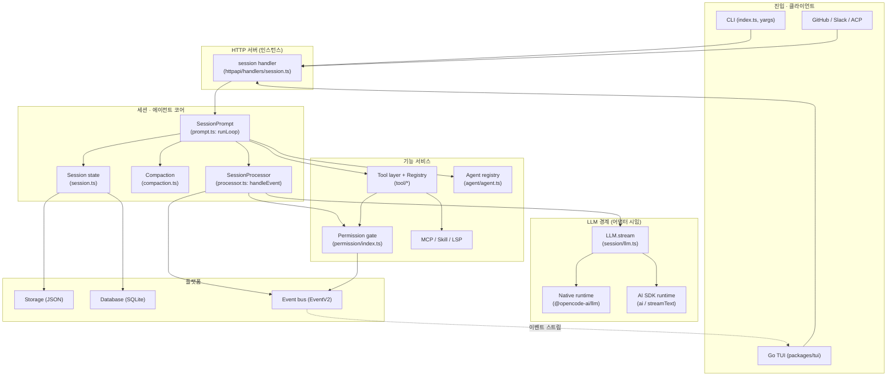
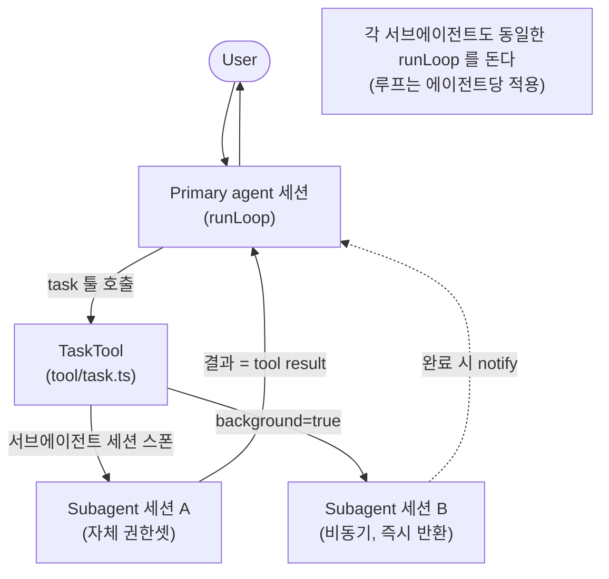

# 2. 전체 아키텍처

## 레이어와 의존성 방향

opencode 는 **클라이언트/서버**로 갈라진다. 어떤 진입점(`run`, `tui`, `serve`, github)도
결국 **HTTP 서버 안의 세션 서비스**에게 프롬프트를 보낸다. 흥미롭게도 단발 `run` 명령조차
내부적으로 `OpencodeClient` SDK 를 통해 서버에 붙는다(`cli/cmd/run.ts` — `sdk.session.prompt`).
즉 "CLI 가 곧 에이전트"가 아니라 "CLI 는 서버의 한 클라이언트"다.

레이어를 위에서 아래로:

1. **진입/클라이언트 계층** — `index.ts`(yargs CLI), Go TUI, GitHub/Slack 어댑터, ACP.
   서버에 HTTP 로 명령을 보내고 이벤트 스트림을 구독한다.
2. **HTTP API 계층** — `server/routes/instance/httpapi/handlers/session.ts`.
   `POST /session/:id/prompt` 등을 `SessionPrompt.Service` 호출로 바인딩.
3. **세션/에이전트 계층 (핵심)** — `session/prompt.ts`(루프), `session/processor.ts`(스트림
   처리·툴 디스패치), `session/compaction.ts`(압축), `session/session.ts`(세션 상태),
   `agent/agent.ts`(에이전트 정의). **여기가 자체 구현 에이전트의 심장.**
4. **기능 서비스 계층** — `tool/*`(툴+레지스트리), `permission/*`(권한 게이트), `mcp/*`(MCP),
   `skill/*`, `lsp/*`, `provider/*`(모델 메타·변환).
5. **LLM 경계 계층** — `session/llm.ts` 가 어댑터 시임(seam). 아래로 **네이티브 런타임**
   (`session/llm/native-runtime.ts` → `@opencode-ai/llm`) 또는 **AI SDK 런타임**(`ai`)으로
   분기. 둘 다 `LLMEvent` 스트림으로 통일.
6. **하부/플랫폼 계층** — `storage/`(JSON), `Database`(SQLite), `bus/`+`EventV2`(이벤트),
   `auth/`, `config/`, `git/`, `snapshot/`.

의존성 방향은 위 → 아래 단방향이며, **Effect 의 Layer/Service DI** 로 묶인다. 각 모듈은
파일 끝에서 `LayerNode.make(layer, [의존노드들])` 로 자신의 의존 그래프를 선언한다
(예: `session/run-state.ts:154`, `tool/registry.ts:418`). 부팅은 이 노드 그래프를 위상
정렬해 레이어를 구성하는 방식이다(7장 부팅 항목 참조).

## 컴포넌트 다이어그램

## 멀티에이전트 토폴로지

오케스트레이션은 단순하다: 메인(primary) 에이전트가 `task` 툴을 호출하면 서브에이전트
**세션**이 만들어지고, 같은 `runLoop` 가 `handleSubtask` 로 그 위임을 처리한다
(`session/prompt.ts:1195-1200`, `:239` `handleSubtask`). 서브에이전트는 자신만의 권한 셋을
부여받는다(`agent/subagent-permissions.ts`, `deriveSubagentSessionPermission`). `task` 툴은
`background=true` 면 비동기로 띄우고 즉시 반환할 수도 있다(`tool/task.ts:60`).

> 즉 "오케스트레이터/서브에이전트"가 별도 코드가 아니라, **같은 루프가 메시지에 박힌
> subtask 파트를 만나면 위임으로 분기**하는 구조다. 토폴로지는 데이터(메시지 파트) 주도다.
