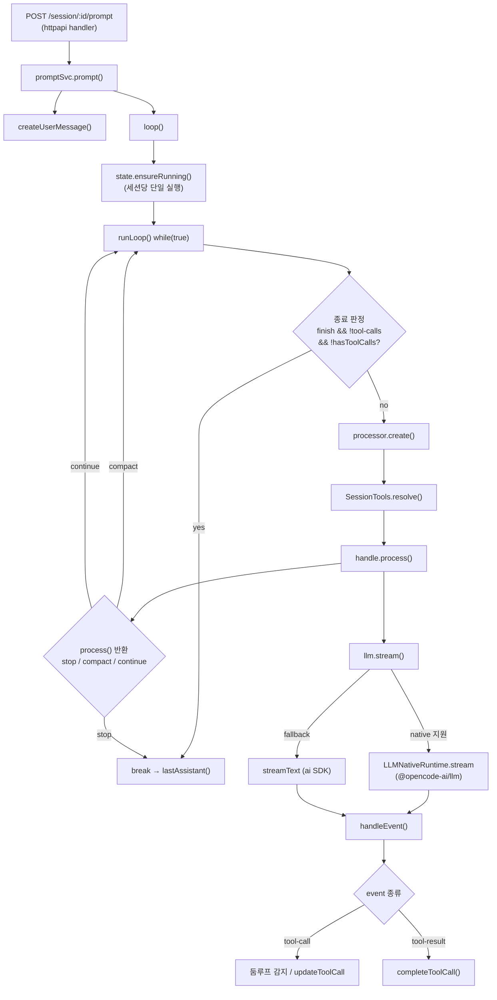
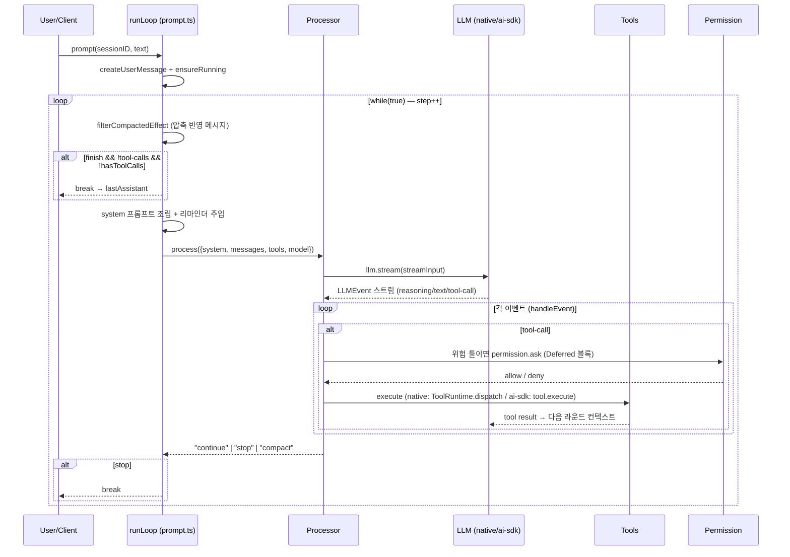

# 3. 콜스택 · 실행 흐름

## 진입점에서 루프까지 (정적 호출 경로)

확인된 호출 경로(모든 함수명은 grep/파일 정독으로 실재 확인):

1. **HTTP**: `POST /session/:id/prompt`
   → `SessionHttpApi.prompt` 핸들러 (`server/.../handlers/session.ts:293`)
   → `promptSvc.prompt({...})` (`:298`)
2. **prompt()** (`session/prompt.ts:1105-1124`)
   → `createUserMessage(input)` 로 사용자 메시지 영속화 (`:1110`)
   → 입력에 담긴 per-prompt 권한 룰 세팅 (`:1113-1120`)
   → `loop({ sessionID })` 반환 (`:1123`)
3. **loop()** (`session/prompt.ts:1386-1390`)
   → `state.ensureRunning(sessionID, lastAssistant(...), runLoop(sessionID))`
   — **세션당 단일 실행(single-flight)** 보장. 이미 busy 면 `BusyError`.
4. **runLoop()** (`session/prompt.ts:1134-1384`) — `while (true)` 에이전트 루프.
   각 반복(step)마다:
   - `MessageV2.filterCompactedEffect(sessionID)` 로 (압축 반영된) 메시지 로드 (`:1145`)
   - **종료 판정** (`:1164-1183`, 아래 별도 절)
   - 첫 step 이면 비동기로 제목 생성 `title(...)` (`:1186-1192`)
   - 서브태스크/압축/오버플로 분기 (`:1197-1221`)
   - 에이전트 조회 + `maxSteps` 산정 (`:1223-1232`)
   - 리마인더 주입 `SessionReminders.apply` (`:1233`)
   - assistant 메시지 골격 생성 후 영속화 (`:1239-1254`)
   - `processor.create({ assistantMessage, sessionID, model })` (`:1266`)
   - 툴 해석 `SessionTools.resolve({...})` (`:1279`)
   - **`handle.process({ user, agent, system, messages, tools, model, ... })`** (`:1318`)
     — 이게 한 라운드의 LLM 왕복.
   - 결과(`"break"`/`"continue"`)로 루프 계속/종료 (`:1377-1378`)
5. **processor.process()** (`session/processor.ts:960-1034`)
   → `const stream = llm.stream(streamInput)` (`:974`)
   → `stream.pipe(Stream.tap(handleEvent), Stream.takeUntil(needsCompaction), runDrain)` (`:976-980`)
   → 재시도 정책 `SessionRetry.policy` 로 감쌈 (`:994-1025`)
   → 반환값: `needsCompaction→"compact"`, `blocked||error→"stop"`, else `"continue"` (`:1030-1032`)
6. **llm.stream()** (`session/llm.ts:357-383`)
   → 네이티브 가능? `LLMNativeRuntime.stream(...)` (`:227`) → 지원 시 네이티브 `LLMEvent` 스트림
   → 아니면 AI SDK `streamText(...)` (`:280`) 결과를 `LLMEvent` 스트림으로 변환 (`:370-382`)
7. **handleEvent()** (`session/processor.ts:371-846`) — 스트림 이벤트 디스패처.
   `reasoning-*`, `tool-input-*`, `tool-call`, `tool-result` 등 케이스 처리.
   - `tool-call` (`:468`): 툴 입력 확정, **둠 루프 감지**(`:522-546`)
   - `tool-result` (`:549`): 결과 정규화(이미지 첨부 리사이즈 등) 후 `completeToolCall` (`:645`)

> **툴 실행 위치의 핵심**: opencode 자신은 `tool-result` *이벤트를 처리*할 뿐, 실제 `execute`
> 호출 주체는 런타임에 따라 다르다.
> - **AI SDK 경로**: `SessionTools.resolve` 가 만든 `tool({ execute })` 를 AI SDK 가 호출
>   (`session/tools.ts:80-114`). execute 는 `EffectBridge` 로 Effect 를 Promise 화.
> - **네이티브 경로**: `@opencode-ai/llm` 의 `ToolRuntime.dispatch(tools, event)` 가 직접
>   호출하고, 그 settlement 들을 `FiberSet` 으로 동시 실행
>   (`session/llm/native-runtime.ts:106-133`).

## 종료 조건 (실제 코드 인용)

루프 종료는 세 군데서 결정된다.

### (1) 루프 상단의 "완료된 assistant" 판정 — `prompt.ts:1164-1183`

```ts
if (
  lastAssistant?.finish &&
  !["tool-calls"].includes(lastAssistant.finish) &&
  !hasToolCalls &&
  lastUser.id < lastAssistant.id
) {
  ...
  yield* Effect.logInfo("exiting loop", { "session.id": sessionID })
  break
}
```

즉 직전 assistant 턴이 `finish` 사유를 갖고(그게 `tool-calls` 가 아니고), 미처리 툴콜이
없고, 그 assistant 가 마지막 user 이후에 나온 것이면 → **루프 탈출**. 바로 위 주석이 핵심:

```ts
// Some providers return "stop" even when the assistant message contains
// tool calls. Keep the loop running so tool results can be sent back to
// the model, but ignore cleanup-marked interrupted orphans.
```

→ 프로바이더가 툴콜이 있는데도 `stop` 을 주는 경우를 `hasToolCalls` 로 보정한다. 이게
"섬세함이 종료 로직에 산다"는 대표 사례.

### (2) process() 반환값 — `processor.ts:1030-1032`

```ts
if (ctx.needsCompaction) return "compact"
if (ctx.blocked || ctx.assistantMessage.error) return "stop"
return "continue"
```

`"stop"` 이면 루프에서 `break` (`prompt.ts:1362`), `"compact"` 면 압축 작업을 큐잉하고
`continue`. `ctx.blocked` 는 권한 거부 시 세팅되는데, 기본은 거부 → 중단이지만
`experimental.continue_loop_on_deny` 옵션이 켜져 있으면 계속 진행한다
(`processor.ts:966`, `:242` `ctx.blocked = ctx.shouldBreak`).

### (3) maxSteps 상한 — `prompt.ts:1231-1232`, `:1325`

```ts
const maxSteps = agent.steps ?? Infinity
const isLastStep = step >= maxSteps
...
messages: [...modelMsgs, ...(isLastStep ? [{ role: "assistant", content: MAX_STEPS }] : [])],
```

기본은 **무한**(`Infinity`)이며, 에이전트가 `steps` 를 지정하면 마지막 step 에서 `MAX_STEPS`
프롬프트(`session/prompt/max-steps.txt`)를 주입해 "툴 쓰지 말고 텍스트로만 마무리하라"고
모델에게 강제한다. 하드 카운터로 죽이는 게 아니라 **프롬프트로 착지**시키는 방식이다.

추가로 구조화 출력 완료 시(`structured !== undefined` → `break`, `:1331-1336`),
content-filter 거부 시(`:1344-1351`)도 종료한다.

## 콜스택 다이어그램 (정적)



## 에이전트 루프 시퀀스 (런타임 왕복)


