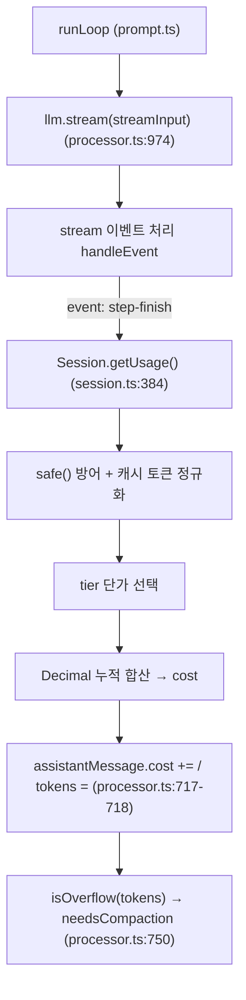

# opencode — 비용(토큰) 계산 모듈 분석

> 범위 한정: 이 문서는 **비용(토큰) 계산 모듈 하나만** 코드 기반으로 분석합니다.
> 핵심 함수는 `Session.getUsage` (`packages/opencode/src/session/session.ts:384-453`)
> 하나이며, 이를 호출하는 에이전트 루프의 호출 지점과 입력 자료구조,
> 그리고 **클로드(Claude) 모델 호출 1회가 이 모듈을 통해 비용으로 환산되는 예시**를
> 끝에 작성했습니다. 모든 주장은 실제 코드 라인에 근거합니다.

---

## 1. 모듈의 위치와 책임

| 항목 | 내용 |
|---|---|
| 함수 | `getUsage(input)` |
| 파일 | `packages/opencode/src/session/session.ts:384` |
| 책임 | LLM 응답의 raw `usage`(토큰 카운트) + `providerMetadata`를 받아 **정규화된 토큰 분해**와 **달러 비용(`number`)**을 계산 |
| 입력 | `{ model: Provider.Model, usage: Usage, metadata?: ProviderMetadata }` |
| 출력 | `{ cost: number, tokens: { total, input, output, reasoning, cache: { read, write } } }` |
| 핵심 의존성 | `decimal.js`의 `Decimal`(부동소수점 누적 오차 방지), `Provider.Model.cost`(모델별 단가표) |

이 모듈은 **순수 함수**다. I/O도, 상태도, Effect도 없다. 입력만으로 출력이 결정되므로
테스트·추론이 쉽다. (`session.ts:8`에서 `import { Decimal } from "decimal.js"`.)

---

## 2. 입력 자료구조

### 2.1 `usage` — 모델이 돌려준 raw 토큰 카운트
`@opencode-ai/llm`의 `Usage` 타입 (`session.ts:9`에서 import). 필드:
`inputTokens`, `outputTokens`, `reasoningTokens`, `cacheReadInputTokens`,
`cacheWriteInputTokens`, `totalTokens`.

### 2.2 `model.cost` — 모델별 단가표 (`ProviderCost`)
스키마는 `packages/opencode/src/provider/provider.ts:998-1010`:

```ts
const ProviderCacheCost = Schema.Struct({ read: Schema.Finite, write: Schema.Finite })  // :983
const ProviderCostTier = Schema.Struct({                                                 // :988
  input, output, cache: ProviderCacheCost,
  tier: Schema.Struct({ type: Schema.Literal("context"), size: Schema.Finite }),
})
const ProviderCost = Schema.Struct({          // :998
  input, output,                              // 백만 토큰당 달러 단가
  cache: ProviderCacheCost,
  tiers: optional(Array(ProviderCostTier)),   // 컨텍스트 길이별 차등 단가
  experimentalOver200K: optional({ input, output, cache }),  // 200K 초과 구간 단가
})
```

단가 단위는 **백만 토큰당 달러**다. 근거: 계산식에서 토큰 수에 단가를 곱한 뒤
`.div(1_000_000)` 하기 때문 (`session.ts:442`). 이 단가표는 models.dev에서 로드된다.

---

## 3. 계산 로직 (단계별)

### 3.1 입력값 방어 — `safe()`
```ts
const safe = (value: number) => {            // session.ts:385
  if (!Number.isFinite(value)) return 0      // NaN / Infinity → 0
  return Math.max(0, value)                  // 음수 → 0
}
```
모든 토큰 수가 이 게이트를 통과한다. 프로바이더가 `undefined`/`NaN`/음수를 보내도
비용이 폭주하지 않는다.

### 3.2 캐시 쓰기 토큰의 멀티-프로바이더 정규화 (`session.ts:394-407`)
`cacheWriteInputTokens`는 프로바이더마다 위치가 다르다. 우선순위 fallback 체인:
```
usage.cacheWriteInputTokens
  ?? metadata.anthropic.cacheCreationInputTokens     // Anthropic / Claude
  ?? metadata.vertex.cacheCreationInputTokens        // google-vertex-anthropic
  ?? metadata.bedrock.usage.cacheWriteInputTokens    // AWS Bedrock
  ?? metadata.venice.usage.cacheCreationInputTokens  // Venice
  ?? 0
```
→ **Claude를 어느 게이트웨이(직접/Vertex/Bedrock)로 부르든 캐시 쓰기 비용이 잡힌다.**

### 3.3 비캐시 입력 토큰 보정 (`session.ts:409-412`)
```ts
// AI SDK v6는 inputTokens에 캐시 토큰을 포함시키도록 정규화했다.
// 캐시 read/write를 빼야 "순수 비캐시 입력" 토큰이 나온다.
const adjustedInputTokens = safe(inputTokens - cacheReadInputTokens - cacheWriteInputTokens)
```
이 보정이 없으면 캐시 토큰이 **입력 단가와 캐시 단가로 이중 청구**된다. 모듈에서
가장 미묘하고 중요한 한 줄.

### 3.4 토큰 분해 (`session.ts:416-425`)
```ts
const tokens = {
  total,
  input:  adjustedInputTokens,
  output: safe(outputTokens - reasoningTokens),  // reasoning을 output에서 분리
  reasoning: reasoningTokens,
  cache: { write: cacheWriteInputTokens, read: cacheReadInputTokens },
}
```

### 3.5 컨텍스트 길이별 단가 선택 (`session.ts:427-434`)
```ts
const contextTokens = inputTokens   // 보정 전 총 입력 = 실제 컨텍스트 점유량
const costInfo =
  model.cost?.tiers
    ?.filter(t => t.tier.type === "context" && contextTokens > t.tier.size)
    .sort((a, b) => b.tier.size - a.tier.size)[0]          // 넘긴 tier 중 가장 큰 것
  ?? (model.cost?.experimentalOver200K && contextTokens > 200_000
        ? model.cost.experimentalOver200K                  // 200K 초과 구간
        : model.cost)                                      // 기본 단가
```
긴 컨텍스트일수록 단가가 오르는 모델(예: Gemini 2.5 Pro의 200K 경계)을 정확히 반영한다.

### 3.6 최종 비용 합산 (`session.ts:436-450`)
두 경로 중 하나:

**(a) GitHub Copilot AIU 경로** — 프로바이더가 직접 AIU를 주면 토큰 단가를 무시:
```ts
const totalNanoAiu = metadata?.copilot?.totalNanoAiu
... totalNanoAiu >= 0
  ? new Decimal(totalNanoAiu).div(100_000_000_000).toNumber()  // nano-AIU → AIU
```

**(b) 일반 토큰 단가 경로** — `Decimal`로 누적(부동소수점 오차 방지):
```ts
cost = Decimal(0)
  .add( Decimal(tokens.input)      .mul(costInfo.input)       .div(1e6) )
  .add( Decimal(tokens.output)     .mul(costInfo.output)      .div(1e6) )
  .add( Decimal(tokens.cache.read) .mul(costInfo.cache.read)  .div(1e6) )
  .add( Decimal(tokens.cache.write).mul(costInfo.cache.write) .div(1e6) )
  .add( Decimal(tokens.reasoning)  .mul(costInfo.output)      .div(1e6) )  // reasoning은 output 단가로 청구
  .toNumber()
```
주석(`session.ts:446-447`)에 명시: *"models.dev에 더 나은 가격 모델이 생기기 전까지,
reasoning 토큰은 output과 같은 단가로 청구"*. 이는 코드에 적힌 **의도된 근사치**다.

---

## 4. 호출 지점 — 에이전트 루프 안에서 언제 불리나

`getUsage`는 LLM 스트림의 **`step-finish` 이벤트**에서 매 스텝 1회 호출된다
(`packages/opencode/src/session/processor.ts:693-728`):

```ts
case "step-finish": {
  const usage = Session.getUsage({              // processor.ts:696
    model: ctx.model,
    usage: value.usage ?? new Usage({}),        // 스트림이 준 raw usage (없으면 빈 객체)
    metadata: value.providerMetadata,
  })
  ...
  ctx.assistantMessage.cost  += usage.cost      // :717  스텝 비용을 메시지에 누적(+=)
  ctx.assistantMessage.tokens = usage.tokens    // :718  토큰은 최신값으로 교체(=)
  yield* session.updatePart({ ..., type: "step-finish", tokens: usage.tokens, cost: usage.cost })  // :719
  ...
  if (isOverflow({ tokens: usage.tokens, model: ctx.model })) ctx.needsCompaction = true  // :750-754
}
```

주목할 두 가지:
- **`cost`는 `+=`(누적), `tokens`는 `=`(교체).** 한 어시스턴트 턴이 여러 스텝(툴 호출 라운드)으로
  나뉘므로 비용은 더해가고, 토큰은 "현재 컨텍스트 점유량"이라 마지막 값으로 덮어쓴다.
- `usage.tokens`가 바로 **컨텍스트 오버플로 판정**(→ compaction 트리거)의 입력이 된다.
  즉 이 모듈은 과금뿐 아니라 **컨텍스트 관리의 센서** 역할도 한다.

스트림 자체는 `processor.ts:974`의 `llm.stream(streamInput)`에서 나오고,
그 `streamInput`은 에이전트 루프(`prompt.ts`)가 모델·메시지·툴을 묶어 만든다.

### 정적 호출 경로


---

## 5. 예시 — 클로드 코드 에이전트 호출 1회의 비용 환산

> 시나리오: 사용자가 opencode에서 `anthropic/claude-...` 모델로 한 번 질문하고,
> 모델이 한 스텝을 끝내(`step-finish`) 아래 raw usage를 돌려줬다고 가정한다.
> (수치는 설명용 예시이며, 단가는 models.dev에서 로드되는 형식과 동일한 "백만 토큰당 달러".)

### 5.1 입력
```ts
// LLM 스트림이 step-finish에서 넘겨준 값 (processor.ts:698-699 의 value)
const usage = {
  inputTokens:           12_000,   // AI SDK v6: 캐시 토큰 포함된 총 입력
  outputTokens:           1_500,
  reasoningTokens:          500,
  cacheReadInputTokens:  10_000,   // 프롬프트 캐시 적중분
  cacheWriteInputTokens:      0,
  totalTokens:           13_500,
}
const providerMetadata = {
  anthropic: { cacheCreationInputTokens: 800 },  // 캐시 '쓰기'는 메타데이터에만 존재
}

// model.cost (Claude 계열 단가 예시, $ / 백만 토큰)
const model = {
  cost: { input: 3.0, output: 15.0, cache: { read: 0.30, write: 3.75 } },
}
```

### 5.2 `getUsage`가 단계별로 하는 일
1. **캐시 쓰기 정규화** (`§3.2`): `usage.cacheWriteInputTokens`는 0(falsy)이라
   fallback → `metadata.anthropic.cacheCreationInputTokens = 800` 채택.
   → `cacheWriteInputTokens = 800`
2. **비캐시 입력 보정** (`§3.3`):
   `adjustedInputTokens = 12_000 − 10_000(read) − 800(write) = 1_200`
3. **토큰 분해** (`§3.4`):
   ```
   input  = 1_200
   output = 1_500 − 500(reasoning) = 1_000
   reasoning = 500
   cache = { read: 10_000, write: 800 }
   ```
4. **tier 선택** (`§3.5`): `contextTokens = 12_000`. tiers·200K 경계 모두 미해당
   → 기본 `model.cost` 사용.
5. **Decimal 합산** (`§3.6 (b)`, 단위 $/Mtok ÷ 1e6):
   ```
   input   :  1_200 × 3.0   / 1e6 = 0.0036
   output  :  1_000 × 15.0  / 1e6 = 0.0150
   cache.read : 10_000 × 0.30 / 1e6 = 0.0030
   cache.write:    800 × 3.75 / 1e6 = 0.0030
   reasoning  :    500 × 15.0 / 1e6 = 0.0075   ← output 단가로 청구
   --------------------------------------------------
   cost = 0.0321  ($0.0321)
   ```

### 5.3 출력
```ts
{
  cost: 0.0321,
  tokens: {
    total: 13_500,
    input: 1_200,
    output: 1_000,
    reasoning: 500,
    cache: { read: 10_000, write: 800 },
  },
}
```

### 5.4 호출 측에서 일어나는 일 (processor.ts)
```ts
ctx.assistantMessage.cost  += 0.0321   // 이전 스텝들 비용에 누적
ctx.assistantMessage.tokens = { total: 13_500, ... }  // 최신값으로 교체
// updatePart(step-finish) 로 TUI/SDK에 스텝별 비용·토큰 전달
// isOverflow(13_500 tokens, model) 검사 → 한계 근접 시 needsCompaction = true
```

### 5.5 이 예시가 보여주는 핵심
- **이중 청구 방지**: 입력 12,000 토큰 중 10,800은 캐시였고, 순수 입력 단가(3.0)는
  보정된 1,200 토큰에만 적용됐다(`§3.3`이 없으면 캐시분이 입력+캐시 양쪽으로 청구).
- **캐시 절감 효과**: 10,000 read 토큰을 캐시로 처리해 입력 단가($3) 대신 캐시 단가
  ($0.30)로 — 1/10 비용.
- **reasoning 근사 청구**: 500 reasoning 토큰이 output 단가로 들어갔다(코드 주석에 명시된
  의도적 근사, `session.ts:446-447`).
- **프로바이더 독립성**: Claude의 캐시 쓰기 토큰이 `usage`가 아니라 `metadata.anthropic`에
  숨어 있었지만 fallback 체인이 정확히 집어냈다.

---

## 6. 단가(model.cost)는 어디서 오는가 — 측정이 아니라 카탈로그

> 핵심: opencode는 모델 단가를 **측정·산정하지 않는다.** 외부 커뮤니티 카탈로그
> **`models.dev`에서 받아오는 정적 값**을 신뢰해 쓴다. 런타임에서 하는 유일한 "측정"은
> `getUsage`의 **토큰 수 × 카탈로그 단가**(`§3.6`)뿐이다.

```
models.dev/api.json  →  디스크 캐시  →  cost() 매핑  →  model.cost  →  getUsage(토큰×단가)
   (외부 카탈로그)        (~/.cache)     provider.ts     (내부 스키마)    session.ts:442
```

### 6.1 데이터 소스 — `models.dev/api.json`
`packages/core/src/models-dev.ts`:
```ts
const source = Flag.OPENCODE_MODELS_URL || "https://models.dev"   // :142
HttpClientRequest.get(`${source}/api.json`)                        // :158
```
- 단가는 models.dev가 관리하는 JSON에 들어 있고 opencode는 그대로 신뢰한다.
- `OPENCODE_MODELS_URL` 환경변수로 소스 교체 가능(사내 미러 등).

### 6.2 캐싱·갱신 정책 (`models-dev.ts`)
- 디스크 캐시: `Global.Path.cache/models.json` (`:143-146`)
- **신선도 TTL 5분** (`:147`, `fresh()`가 파일 mtime 검사)
- **백그라운드 자동 갱신 60분 간격** (`:239`, `Schedule.spaced("60 minutes")`)
- 전송 실패 시 **지수 백오프 2회 재시도** (`:134-138`)
- 오프라인 폴백 3단계 (`:199-213`): 디스크 캐시 → 번들 스냅샷 `OPENCODE_MODELS_DEV`
  → `OPENCODE_DISABLE_MODELS_FETCH`면 빈 `{}`

### 6.3 카탈로그 → 내부 스키마 매핑 — `cost()` (`provider.ts:1138`)
models.dev의 cost 필드를 내부 `Model.cost`로 **옮기기만** 한다(계산 없음):
```ts
input:  c?.input  ?? 0,          // $/백만토큰
output: c?.output ?? 0,
cache: { read: c?.cache_read ?? 0, write: c?.cache_write ?? 0 },
tiers: c?.tiers?.map(...),                 // 컨텍스트 길이별 차등 (→ §3.5)
experimentalOver200K: c?.context_over_200k // 200K 초과 구간 (→ §3.5)
```
→ 이 값들이 `getUsage`의 `costInfo.input/output/cache`로 그대로 들어간다.

### 6.4 사용자 오버라이드
카탈로그 단가는 고정이 아니라 config로 덮어쓸 수 있다:
- experimental modes: `mergeDeep(base.cost, cost(opts.cost))` (`provider.ts:1233`)
- 커스텀/config 프로바이더는 자체 `cost` 지정 가능 (`provider.ts:680`, `:1442-1447`)

### 6.5 예외 — 프로바이더가 사용량을 직접 주는 경우
GitHub Copilot처럼 응답 메타데이터로 사용량(`totalNanoAiu`)을 직접 주면, 카탈로그
단가를 **무시하고** 그 값을 쓴다 (`§3.6 (a)`, `session.ts:435-439`).

| 질문 | 답 |
|---|---|
| 단가를 어떻게 측정? | **측정 안 함** — models.dev 카탈로그의 정적 값 다운로드 |
| 신뢰 출처 | `models.dev/api.json` (env로 교체 가능) |
| 단위 | 백만 토큰당 달러 (`getUsage`에서 `÷ 1_000_000` 환산) |
| 최신성 | 5분 TTL + 60분 자동 갱신 + 디스크 캐시 |
| 런타임 계산 | `getUsage`: `토큰수 × 카탈로그단가 ÷ 1e6` (Decimal 누적) |

---

## 7. 한계 / 코드에서 확인되지 않은 점
- 단가표(`model.cost`)의 실제 수치는 models.dev에서 동적 로드되며(`§6`), 본 문서의 수치는
  형식을 맞춘 **예시값**이다. 특정 Claude 모델의 확정 단가는 이 저장소 코드만으로는
  확정할 수 없다(외부 데이터 의존).
- `tiers`/`experimentalOver200K`를 실제로 채워 보내는 모델 목록은 models.dev 데이터에
  달려 있어 코드 정적 분석으로는 열거 불가.
- Copilot AIU 경로(`§3.6 (a)`)의 `100_000_000_000` 환산 상수의 출처(왜 nano×10^11인지)는
  코드 주석으로 설명되어 있지 않다 — 코드에서 의미를 단정할 수 없는 부분.
