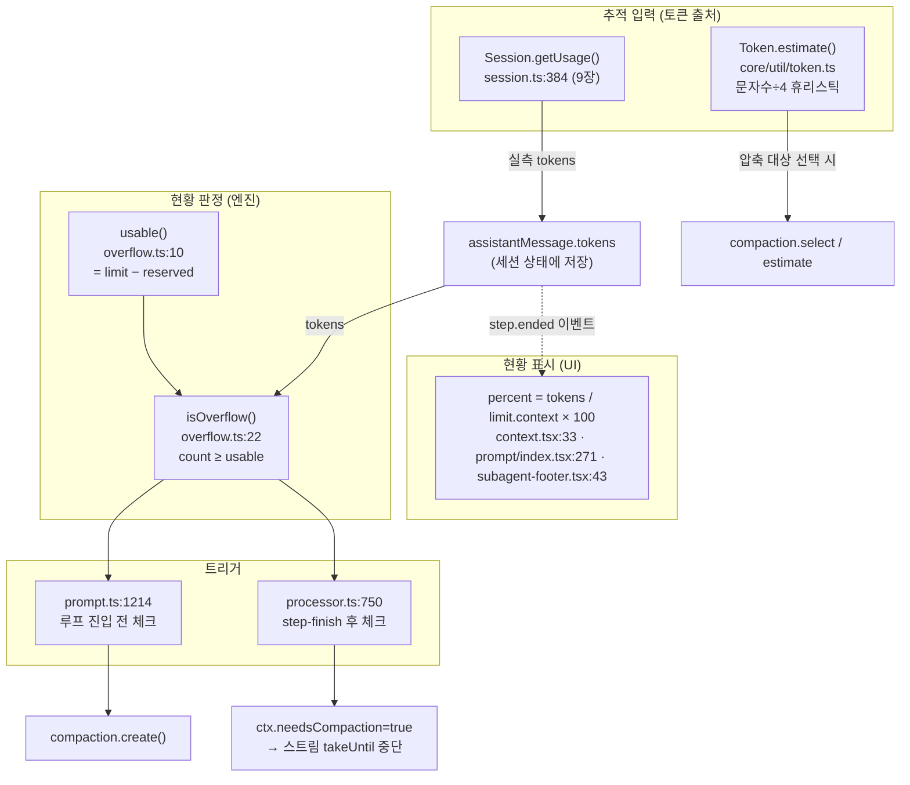
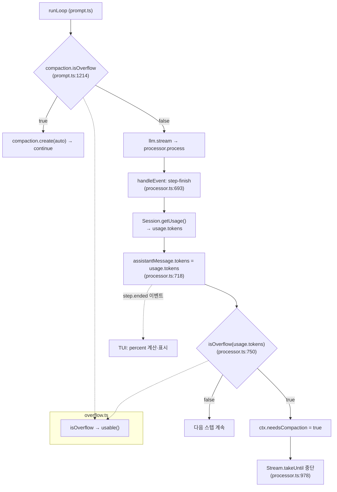
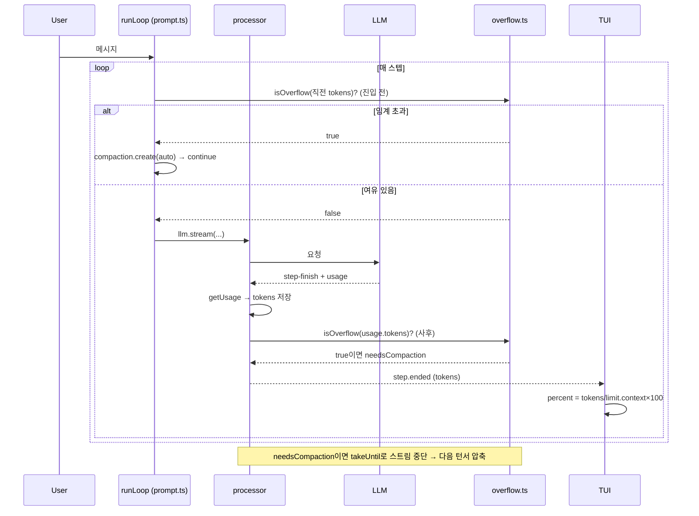

# opencode — 컨텍스트 윈도우 추적 및 현황 모듈 분석

> 범위 한정: 이 문서는 **컨텍스트 윈도우 추적·현황 모듈만** 코드 기반으로 분석한다.
> 핵심은 `packages/opencode/src/session/overflow.ts`(`usable`/`isOverflow`)이며,
> 그 입력이 되는 토큰 출처(`getUsage` → [9장](09-cost-token-module.md)),
> 사전 추정(`Token.estimate`), 사용자에게 보이는 현황 %(TUI), 그리고 현황이
> compaction을 트리거하는 두 지점을 추적한다. 끝에 **클로드(Claude) 호출 1회가
> 컨텍스트 현황으로 환산되는 예시**를 작성했다. 모든 주장은 실제 코드 라인에 근거한다.

분석한 파일:
- `packages/opencode/src/session/overflow.ts` — 임계 판정(`usable`/`isOverflow`)
- `packages/opencode/src/provider/transform.ts:1285` — `maxOutputTokens`, `OUTPUT_TOKEN_MAX`
- `packages/core/src/util/token.ts` — `Token.estimate`(휴리스틱 추정)
- `packages/opencode/src/session/processor.ts:750` / `prompt.ts:1214` — 트리거 2지점
- `packages/tui/src/.../context.tsx`, `component/prompt/index.tsx`, `subagent-footer.tsx` — 현황 % 표시
- `packages/core/src/v1/config/config.ts:146` — 설정 노브

---

## 1. 개요

- **목적**: 세션이 모델의 컨텍스트 윈도우를 얼마나 점유했는지 **추적**하고, 한계에
  근접하면 자동 압축(compaction)을 트리거하며, 사용자에게 현황(%)을 표시한다.
- **기술 스택**: TypeScript / Effect. 추적은 순수 함수, 표시는 SolidJS TUI.
- **구현 형태**: 자체 구현. 외부 토크나이저(tiktoken 등)에 의존하지 않고 **프로바이더가
  돌려준 실측 토큰 + 문자수 휴리스틱**의 두 경로로 추적한다.

핵심 설계: **추적(엔진)과 표시(UI)가 분리**돼 있고, 둘 다 같은 입력 — `getUsage`가
만들어 `assistantMessage.tokens`에 저장한 토큰 분해 — 을 쓰지만 **합산식·분모가 다르다.**

---

## 2. 전체 아키텍처



**의존성 방향**: `getUsage`(과금/토큰 분해) → 세션 상태 → (a) `overflow.ts`가 읽어
압축 트리거, (b) TUI가 이벤트로 받아 % 표시. 추적 모듈 자신은 상태를 갖지 않는
**순수 함수**이고, 토큰 값은 전적으로 외부(프로바이더 실측 or 휴리스틱)에서 온다.

---

## 3. 콜스택 · 실행 흐름

### 3.1 추적 입력 — 토큰은 어디서 오나
두 경로:

1. **실측 경로(주 경로)**: LLM 스트림의 `step-finish`에서 `Session.getUsage`가 프로바이더
   실측 토큰을 분해 → `assistantMessage.tokens`에 저장(`processor.ts:718`). 9장 참조.
2. **추정 경로(보조)**: `Token.estimate`(`core/util/token.ts`) — 순수 휴리스틱.
   ```ts
   const CHARS_PER_TOKEN = 4
   export const estimate = (input) => Math.max(0, Math.round(input.length / CHARS_PER_TOKEN))
   ```
   compaction이 "어떤 메시지를 요약할지" 고를 때 메시지 크기를 가늠하는 데만 쓴다
   (`compaction.ts:195` `estimate`, `:205` `select`). **현황 %나 오버플로 판정에는
   쓰이지 않는다** — 그쪽은 실측 토큰만 본다.

### 3.2 현황 판정 — `usable()` / `isOverflow()` (`overflow.ts`)
```ts
const COMPACTION_BUFFER = 20_000                                   // overflow.ts:8

export function usable(input) {                                    // :10
  const context = input.model.limit.context
  if (context === 0) return 0
  const reserved =
    input.cfg.compaction?.reserved ??
    Math.min(COMPACTION_BUFFER, ProviderTransform.maxOutputTokens(input.model, input.outputTokenMax))
  return input.model.limit.input
    ? Math.max(0, input.model.limit.input - reserved)             // input 한계가 있으면 그것 − 예약
    : Math.max(0, context - ProviderTransform.maxOutputTokens(...)) // 없으면 context − 출력여유
}

export function isOverflow(input) {                                // :22
  if (input.cfg.compaction?.auto === false) return false          // 자동 압축 끄면 항상 false
  if (input.model.limit.context === 0) return false               // 한계 미상이면 추적 불가 → false
  const count =
    input.tokens.total ||                                          // 실측 total 우선
    input.tokens.input + input.tokens.output + input.tokens.cache.read + input.tokens.cache.write
  return count >= usable(input)                                   // 임계 도달 여부
}
```
- **`usable`(가용 예산)** = 컨텍스트 한계에서 **출력용 예약 버퍼**를 뺀 값. 예약은
  설정값(`compaction.reserved`) 우선, 없으면 `min(20_000, maxOutputTokens)`.
  - `maxOutputTokens = min(model.limit.output, OUTPUT_TOKEN_MAX=32_000) || 32_000`
    (`transform.ts:1285`, `:18`).
- **`isOverflow`** = "현재 토큰 ≥ 가용 예산"의 boolean. `tokens.total`이 있으면 그걸,
  없으면 input+output+cache.read+cache.write 합을 쓴다. **reasoning은 합산에서 제외**됨.

### 3.3 트리거 2지점
판정 결과는 두 군데서 소비된다:

**(A) 루프 진입 전 — 선제 체크** (`prompt.ts:1214-1221`):
```ts
if (lastFinished && lastFinished.summary !== true &&
    (yield* compaction.isOverflow({ tokens: lastFinished.tokens, model }))) {
  yield* compaction.create({ sessionID, agent, model, auto: true })  // 압축부터 하고
  continue                                                            // 루프 재시작
}
```
직전 어시스턴트 메시지의 실측 토큰이 임계를 넘었으면, **다음 LLM 호출 전에** 압축한다.

**(B) 스텝 종료 직후 — 사후 체크** (`processor.ts:750-754`):
```ts
if (!ctx.assistantMessage.summary &&
    isOverflow({ cfg: yield* config.get(), tokens: usage.tokens, model: ctx.model })) {
  ctx.needsCompaction = true        // 플래그만 세움
}
```
이 플래그는 스트림 소비를 끊는다 (`processor.ts:978`):
```ts
yield* stream.pipe(Stream.tap(handleEvent), Stream.takeUntil(() => ctx.needsCompaction), Stream.runDrain)
```
→ 멀티스텝 도중 임계 도달 시 **현재 스트림을 즉시 중단**하고 압축 경로로 빠진다.

### 3.4 콜스택 (정적)


### 3.5 런타임 라운드트립 (현황 갱신·트리거)


---

## 4. 핵심 모듈

| 모듈 | 파일 | 책임 | 입력 | 출력 |
|---|---|---|---|---|
| `usable()` | overflow.ts:10 | 가용 토큰 예산 산출(한계−예약) | `cfg, model, outputTokenMax?` | `number` |
| `isOverflow()` | overflow.ts:22 | 임계 도달 여부 판정 | `cfg, tokens, model` | `boolean` |
| `maxOutputTokens()` | transform.ts:1285 | 출력 예약량 계산 | `model, outputTokenMax?` | `number` |
| `Token.estimate()` | core/util/token.ts | 문자수 기반 토큰 추정 | `string` | `number` |
| 현황 % (TUI) | context.tsx:33 등 | 사용자 표시용 점유율 | `tokens, model.limit.context` | `NN%` |
| 트리거 (선제) | prompt.ts:1214 | 호출 전 압축 결정 | `lastFinished.tokens` | compaction.create |
| 트리거 (사후) | processor.ts:750 | 스텝 후 압축 결정 | `usage.tokens` | needsCompaction |

**설정 노브** (`core/src/v1/config/config.ts:146-162`):
- `compaction.auto` (기본 true): false면 `isOverflow`가 항상 false → 추적은 하되 자동 압축 안 함.
- `compaction.reserved`: 출력 예약 버퍼 직접 지정(기본 `min(20_000, maxOutput)`).
- `compaction.tail_turns` (기본 2): 압축 시 원문 보존할 최근 턴 수(현황 추적과는 별개).

---

## 5. 컨텍스트 윈도우 크기(`limit.context`)는 어디서 오는가

> 핵심: opencode는 모델의 윈도우 크기를 **측정·추론하지 않는다.** [9장 §6](09-cost-token-module.md)의
> 단가와 **완전히 같은 파이프라인** — 외부 카탈로그 `models.dev`에서 받아온 정적 값을 그대로
> 쓴다. 추적·현황 계산의 모든 분모(`usable()`, UI percent)가 이 값에 달려 있다.

```
models.dev/api.json → 디스크 캐시 → fromModelsDevModel() → model.limit.context → usable()/percent
   (외부 카탈로그)                   provider.ts:1186-1190
```

### 5.1 카탈로그 스키마 (`core/src/models-dev.ts:64-68`)
```ts
limit: Schema.Struct({
  context: Schema.Finite,            // 필수 — 컨텍스트 윈도우 총 크기(토큰)
  input:   Schema.optional(Finite),  // 선택 — 입력 전용 한계(있는 모델만, usable 분기에 사용)
  output:  Schema.Finite,            // 필수 — 출력 한계(maxOutputTokens에 사용)
}),
```
models.dev가 각 모델의 `context`를 토큰 단위로 직접 명시하고, opencode는 그대로 신뢰한다.

### 5.2 내부 모델로 매핑 (`provider.ts:1186-1190`)
```ts
limit: {
  context: model.limit.context,   // 카탈로그 값 그대로 복사 (계산 없음)
  input:   model.limit.input,
  output:  model.limit.output,
},
```
이 값이 `usable()`(분모: `context − 출력예약`, `overflow.ts:19`)과 UI percent(분모:
`limit.context`, `context.tsx:33`)에 그대로 들어간다.

### 5.3 Claude의 경우
- Anthropic 프로바이더의 각 Claude 모델 엔트리(`anthropic/claude-...`)가 models.dev JSON에
  `limit.context`를 갖고 있고 opencode가 그걸 읽는다.
- **정확한 숫자(예: 200K, 또는 1M beta 변형)는 models.dev 발행값이 유일한 진실원**이라
  이 저장소 코드만으로는 확정할 수 없다(9장 §6과 동일한 외부 의존). 실제 값은
  `opencode models` 출력이나 캐시 파일 `~/.cache/opencode/models.json`에서 확인 가능하다.

### 5.4 폴백·오버라이드 (카탈로그가 유일 출처는 아님)
- **config/라이브 API 병합** (`provider.ts:1451-1455`): 사용자 설정·프로바이더 API가 준
  모델은 `model.limit?.context ?? existingModel?.limit?.context ?? 0`로 카탈로그와 병합.
  어디에도 없으면 **`0`**.
- **커스텀 프로바이더**: GitLab Agent Platform 등은 자체 API 응답의 `m.context`를 직접 씀
  (`provider.ts:681`).
- **`context = 0`(미상)이면 추적 비활성화**: `usable()`이 0 반환(`overflow.ts:12`),
  `isOverflow()`가 항상 false(`overflow.ts:29`) → 자동 압축 안 걸리고, UI %도 표시 안 됨
  (`model.limit.context ? ... : null`, `context.tsx:33`).

| 질문 | 답 |
|---|---|
| 윈도우 크기 어떻게 아나 | **측정 안 함** — `model.limit.context`를 models.dev 카탈로그에서 로드 |
| Claude 값 출처 | models.dev의 `anthropic/claude-*` 엔트리 `limit.context` |
| 코드가 하는 일 | 그대로 복사(`provider.ts:1187`) → `usable`/percent의 분모로 사용 |
| 모르면 | `0`으로 폴백 → 추적·자동압축·% 표시 모두 비활성화 |

---

## 6. 특장점

1. **추적과 표시의 의도적 분리, 그리고 그로 인한 불일치** — 엔진(`isOverflow`)과
   UI(percent)가 **다른 합산식·다른 분모**를 쓴다:
   | | 합산 토큰 | 분모 |
   |---|---|---|
   | `isOverflow` (overflow.ts:31, :17) | `total ‖ in+out+cache` (reasoning 제외) | `usable()` = 한계 − 예약버퍼 |
   | UI percent (context.tsx:28-33) | `in+out+reasoning+cache` (reasoning 포함) | `model.limit.context` (전체) |

   → UI가 "80%"를 보여줘도 엔진은 이미 압축을 발동했을 수 있다(엔진 분모가 더 작음).
   이는 버그가 아니라, **엔진은 "안전하게 출력할 여유가 남았나"를, UI는 "윈도우를 얼마나
   썼나"를 답하는 서로 다른 질문**이기 때문. 코드에 명시된 두 함수의 분모 차이가 근거.

2. **출력 여유를 빼고 추적** (`usable`, overflow.ts:14-19) — 단순히 "입력이 윈도우를
   넘었나"가 아니라 **"다음 응답을 담을 출력 공간(최대 32K)까지 확보되나"**를 본다.
   이게 없으면 입력은 들어가도 응답이 잘리는 사일런트 실패가 난다.

3. **선제 + 사후 이중 트리거** (prompt.ts:1214 / processor.ts:750) — 호출 전(직전 턴
   기준)과 멀티스텝 도중(스텝마다) 둘 다 검사. 긴 툴 연쇄 한 턴 안에서 윈도우가 차도
   `takeUntil`로 즉시 끊어 폭주를 막는다.

4. **토크나이저 무의존** — 실측은 프로바이더가 주는 정확한 토큰을, 추정은 `length/4`
   휴리스틱(`token.ts`)을 쓴다. tiktoken 같은 무거운 의존성 없이 동작. 트레이드오프는
   추정 정확도이지만, **추정은 압축 대상 선택에만 쓰고 과금·임계 판정에는 실측만 쓰므로**
   부정확이 비용/안전에 영향을 주지 않게 격리돼 있다.

---

## 7. 구현 디테일

**`tokens` 자료구조** (현황 추적의 단위, `getUsage` 출력):
```ts
tokens: { total, input, output, reasoning, cache: { read, write } }
```
이 한 객체가 세션 상태(`assistantMessage.tokens`)에 저장되고, 엔진과 UI가 각자 다른
필드 조합으로 읽는다.

**예약 버퍼 계산의 fallback 사슬** (overflow.ts:14-19):
```
reserved = cfg.compaction.reserved
         ?? min(20_000, maxOutputTokens)
usable   = limit.input ? (limit.input − reserved)        // 입력 전용 한계가 있는 모델
                       : (limit.context − maxOutputTokens) // 통합 윈도우 모델
```
모델이 input/output 한계를 따로 광고하는지(`limit.input` 존재 여부)에 따라 분기한다.

**UI 갱신 경로**: 서버가 `session.next.step.ended` 이벤트에 `tokens`를 실어 publish
(`processor.ts:704`) → TUI `data.tsx`가 받아 `currentAssistant.tokens` 갱신
(`data.tsx:243`) → 화면 컴포넌트가 `output > 0`인 마지막 어시스턴트 메시지를 찾아 % 계산
(`context.tsx:20`). 즉 현황 %는 **메시지 단위로 교체**되지 가산되지 않는다.

---

## 8. 예시 — 클로드 코드 에이전트 호출 1회의 현황 환산

> 시나리오: `anthropic/claude-...` 모델(가정: `limit.context = 200_000`,
> `limit.output = 64_000`, `limit.input` 미광고)로 한 턴을 돌렸고, 직전 스텝의
> `step-finish`에서 `getUsage`가 아래 `tokens`를 만들었다(9장 예시와 동일 입력).
> 자동 압축은 기본값(`compaction.auto = true`, `reserved` 미설정).

### 8.1 입력 (getUsage가 만든 tokens)
```ts
tokens = { total: 13_500, input: 1_200, output: 1_000, reasoning: 500,
           cache: { read: 10_000, write: 800 } }
model.limit = { context: 200_000, output: 64_000 }   // limit.input 없음
```

### 8.2 엔진 판정 — `isOverflow`
1. `auto !== false`, `context !== 0` → 판정 진행.
2. `count = tokens.total = 13_500` (total이 있으므로 그대로 사용; reasoning 무관).
3. `usable()`:
   - `reserved = min(20_000, maxOutputTokens)`,
     `maxOutputTokens = min(limit.output 64_000, OUTPUT_TOKEN_MAX 32_000) = 32_000`
     → `reserved = min(20_000, 32_000) = 20_000`
   - `limit.input` 없음 → `usable = context − maxOutputTokens = 200_000 − 32_000 = 168_000`
4. `13_500 ≥ 168_000` → **false. 오버플로 아님 → 압축 안 함.**

### 8.3 UI 현황 — percent
```
tokensUI = input+output+reasoning+cache.read+cache.write
         = 1_200 + 1_000 + 500 + 10_000 + 800 = 13_500
percent  = round(13_500 / 200_000 × 100) = 7%        // 분모는 '전체' 200K
```
사이드바: `13,500 tokens / 7% used`. 입력창 footer: `13,500 (7%)`.

### 8.4 같은 입력이 임계에 다다르는 순간
턴이 길어져 `tokens.total = 170_000`이 됐다고 하면:
- **엔진**: `170_000 ≥ usable(168_000)` → **true.** 다음 호출 전(prompt.ts:1214) 또는
  스텝 직후(processor.ts:750) compaction 발동.
- **UI**: `170_000 / 200_000 = 85%`.

→ **UI가 85%일 때 엔진은 이미 압축을 시작한다.** 사용자 눈엔 "아직 15% 남았는데?"로
보이지만, 그 15%(30K)는 출력용으로 예약된 공간이라 입력엔 못 쓴다. §6-1에서 말한
"분모 차이"가 실제 숫자로 드러나는 지점.

### 8.5 이 예시가 보여주는 핵심
- **현황 추적의 단위는 `getUsage`의 실측 `tokens`** 하나이고, 엔진/UI가 그걸 각자
  다르게 읽을 뿐 별도 카운터는 없다.
- **엔진의 임계는 윈도우 전체가 아니라 "출력 여유를 뺀 가용분"** — Claude의 큰 출력
  한계(64K)도 `OUTPUT_TOKEN_MAX=32_000`으로 캡돼 예약된다.
- **reasoning 토큰은 UI엔 포함, 엔진 임계엔 미포함** — Claude의 thinking 토큰이 현황
  표시는 부풀리지만 압축 판정엔 안 들어간다(코드상 합산식 차이, overflow.ts:31 vs context.tsx:29).

---

## 9. 종합 평가

**강점**: 추적 로직이 두 개의 작은 순수 함수(`usable`/`isOverflow`)로 응축돼 검증이 쉽다.
출력 여유를 예약해 "응답 잘림"을 선제 차단하고, 선제+사후 이중 트리거로 멀티스텝 폭주도
막는다. 토크나이저 의존 없이 실측/추정을 용도별로 분리한 점도 깔끔하다.

**트레이드오프 / 깨질 수 있는 지점**:
- **엔진 vs UI 불일치**가 사용자에겐 혼란일 수 있다(85%인데 압축 시작). 의도된 설계지만
  UX 비용은 실재한다.
- **추정 경로의 부정확성**: `length/4`는 코드/CJK/토큰화 특성을 무시한다. 다만 이 추정은
  압축 *대상 선택*에만 쓰여 안전·과금엔 영향이 격리돼 있다(§6-4).
- **`limit.context === 0`(한계 미상) 모델은 추적 불능** — `isOverflow`가 항상 false라
  자동 압축이 안 걸린다(overflow.ts:29). 카탈로그(models.dev) 데이터 품질에 의존.

**분석 한계 / 코드에서 확인되지 않은 점**:
- 본 예시의 `limit.context/output` 수치는 설명용 가정이다. 특정 Claude 모델의 확정
  한계값은 models.dev 카탈로그에서 동적 로드되므로 이 저장소 코드만으로는 확정 불가
  (9장 §6과 동일한 외부 의존).
- `COMPACTION_BUFFER = 20_000`과 `OUTPUT_TOKEN_MAX = 32_000`의 구체적 산정 근거는
  코드 주석으로 설명돼 있지 않다 — 경험적 상수로 보이나 코드만으론 의도를 단정 불가.
