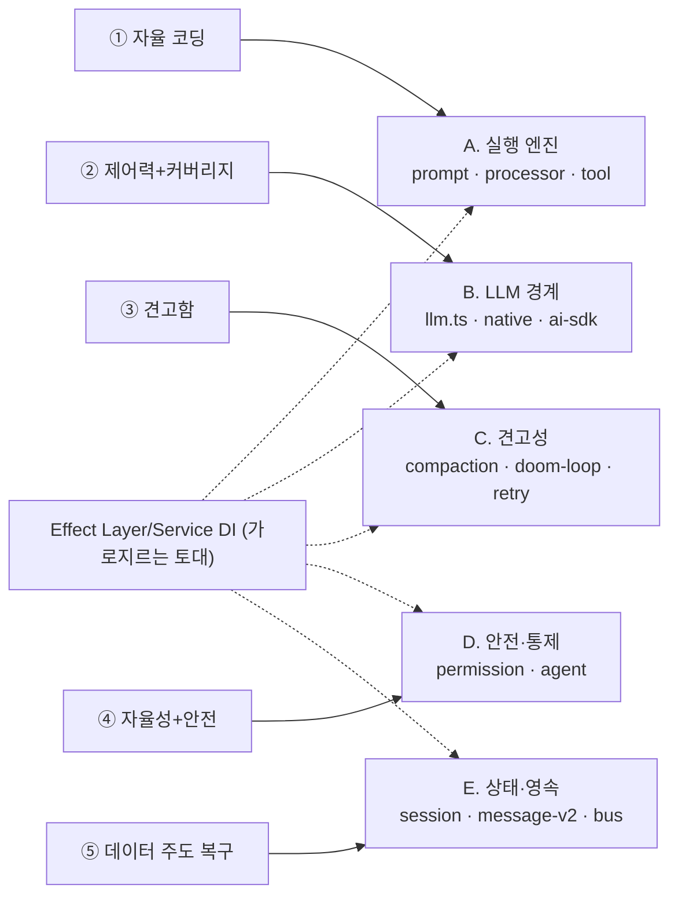

# 11. 비전과 핵심 모듈 분류

opencode 가 "opencode 로서" 추구하는 비전을 정리하고, 그 비전을 달성하기 위한 핵심
모듈을 비전 축별로 분류한다. 모듈 상세는 [04-core-modules.md](04-core-modules.md),
근거는 [05-strengths.md](05-strengths.md) 참조.

## 11.1 비전과 추구하는 바 (요약)

1. **터미널에서 자율적으로 코딩하는 오픈소스 AI 에이전트** — 파일 읽기/쓰기, 셸 실행,
   코드 검색, 서브에이전트 위임까지 사용자의 작업을 끝까지 수행한다.
2. **제어력과 커버리지의 동시 추구** — 자체 wire 프로토콜(`@opencode-ai/llm`)을 기본
   경로로 두어 프로바이더 최신 기능을 직접 제어하고, 미지원 케이스만 AI SDK로 폴백한다.
3. **실전에서 단련된 견고함** — 둠 루프 감지, 프로바이더 종료 보정(`hasToolCalls`),
   3단 컨텍스트 관리(오버플로→요약→프루닝)로 장기 세션의 품질과 비용을 지킨다.
4. **자율성과 안전의 균형** — `Deferred` 기반 권한 게이트와 "위험하면 사람에게 물어보기"로
   자율 실행 중에도 사용자 통제권을 보장한다.
5. **Effect 기반 일관된 구조** — 취소·재시도·자원정리를 이펙트 시스템으로 통일하고,
   멀티에이전트조차 영속 메시지(데이터)로 표현해 복구 가능성을 설계에 내재화한다.

## 11.2 비전 → 핵심 모듈 매핑

각 비전 축(①~⑤)에 1:1로 대응하는 모듈 계열(A~E)로 분류한다.

### A. 자율 실행 엔진 — "끝까지 수행하는 에이전트 루프" (비전 ①)

비전 ①의 심장. 프롬프트 한 번을 받아 모델 호출 → 툴 실행 → 종료 판정 사이클을 돌린다.

| 모듈 | 책임 |
|---|---|
| **SessionPrompt** (`session/prompt.ts`) | 오케스트레이터. `runLoop` 구동, 서브태스크 위임, 압축/오버플로 분기 |
| **SessionProcessor** (`session/processor.ts`) | 한 라운드 스트림 소비, 툴콜 상태머신(`pending→running→completed`), 종료 신호(`continue/stop/compact`) |
| **Tool 레이어** (`tool/*`, `registry.ts`) | 내장 13종 + 커스텀/플러그인/MCP 정의·등록·실행. 모델이 세계와 상호작용하는 손발 |

### B. LLM 경계 — "제어력과 커버리지의 동시 추구" (비전 ②)

프로바이더 차이를 흡수해 하나의 `LLMEvent` 스트림으로 정규화하는 어댑터 시임.

| 모듈 | 책임 |
|---|---|
| **LLM.stream** (`session/llm.ts`) | 네이티브/AI SDK 분기, `LLMEvent` 통일 |
| **Native runtime** (`session/llm/native-runtime.ts` → `@opencode-ai/llm`) | 자체 wire 프로토콜 11종, 기본 경로 |
| **AI SDK runtime** (`session/llm/ai-sdk.ts`) | `streamText` 폴백 경로 |

### C. 견고성 — "실전에서 단련된 장기 세션 품질" (비전 ③)

긴 세션에서 비용·품질 붕괴를 막는 모듈. 일부는 독립 모듈, 일부는 Processor 안의 로직.

| 모듈 | 책임 |
|---|---|
| **Compaction** (`session/compaction.ts`) | 오버플로 감지 → 요약 압축 → 프루닝 3단 컨텍스트 관리 |
| **둠 루프 감지 + 종료 보정** (`processor.ts` 내) | 무한 동일 툴콜 차단, 프로바이더 `stop` 오판 보정(`hasToolCalls`) |
| **재시도/인터럽트 정책** (`SessionRetry`, `run-state.ts`) | 실패 재시도, 중단 시 미완 메시지 마무리 |

> 견고성 심화(실패 모드별 전용 방어 + 코드 근거)는 보조자료 [11a-robustness.md](11a-robustness.md) 참조.

### D. 안전·통제 — "자율성과 안전의 균형" (비전 ④)

누가 무엇을 어디까지 할 수 있는가를 게이트한다.

| 모듈 | 책임 |
|---|---|
| **Permission** (`permission/index.ts`) | `Deferred` 기반 allow/ask/deny 게이트, `once/always/reject` 해소 |
| **Agent** (`agent/agent.ts`) | 에이전트=권한+모델+프롬프트 묶음. `plan`(편집 금지) 등 권한 스코프 정의 |
| **Subagent 권한 파생** (`agent/subagent-permissions.ts`) | 위임받은 서브에이전트의 권한 셋 좁히기 |

### E. 상태·영속·복구 — "데이터 주도 구조" (비전 ⑤)

오케스트레이션 상태조차 메시지에 담아 재시작/복구를 가능케 한다.

| 모듈 | 책임 |
|---|---|
| **Session / Storage / Database** (`session/session.ts`, `storage/*`) | 세션·메시지 CRUD, JSON+SQLite 이중 영속화, fork/revert |
| **메시지 모델** (`session/message-v2.ts`) | 파트 자료구조(text/tool/subtask…), 모델 메시지 직렬화, 압축 반영 필터 |
| **EventV2 버스** (`bus/`) | 권한 요청/응답·진행 이벤트 발행, TUI 구독 |

## 11.3 가로지르는 토대

위 모든 모듈은 **Effect Layer/Service DI** 위에 올라가 있어(`LayerNode.make` 로 의존
그래프 선언) 취소·재시도·자원정리가 구조적으로 통일된다. 이것이 A~E를 하나의 일관된
시스템으로 묶는 비전 ⑤의 기반이다.

요약하면 **A(실행)·B(LLM 경계)·C(견고성)·D(안전)·E(상태/복구)** 5계열이며,
각각 비전의 5개 축과 1:1로 대응한다.
