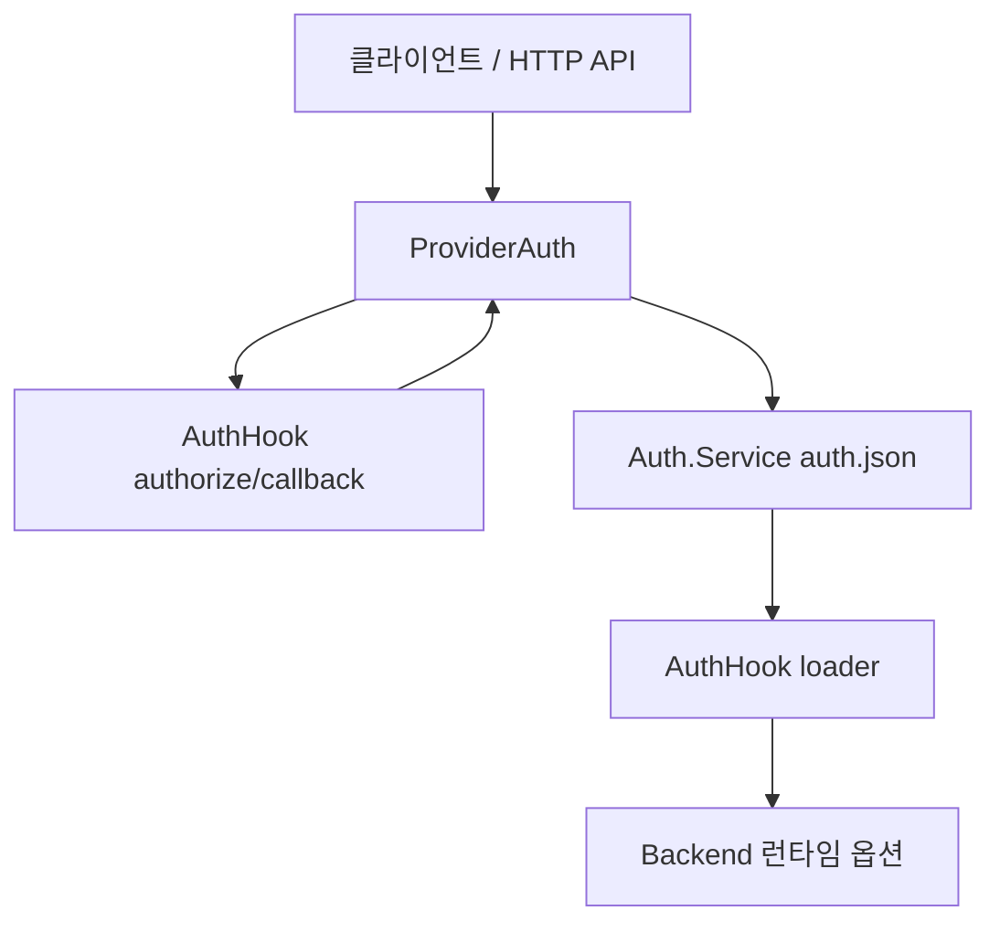

# OpenCode 인증 브로커 분석

> 조사일: 2026-07-31
> 대상 저장소: `anomalyco/opencode`
> 기준 브랜치/커밋: `dev` / `da59457ca4ff55aca0147d4ddb33c495dc72be31`
> 조사 범위: 인증 저장소, 인증 플러그인 계약, OAuth/API key 흐름, 런타임 자격증명 주입, 서버 API

## 결론

OpenCode의 강점은 **인증 방법을 플러그인 계약으로 만들고, 인증 결과를 공통 저장 형식으로
정규화한 뒤, 런타임 로더가 Backend 옵션으로 변환하는 구조**다. 세 조사 대상 중 인증
플로우의 확장 계약이 가장 명확하다.

반면 저장소는 OS keychain이 아니라 권한 `0600`의 평문 `auth.json`이고, 플러그인은 main
프로세스 안에서 원본 자격증명을 읽을 수 있다. 따라서 Orca는 OpenCode의 **계약 분리**는
차용하되, **저장 방식과 플러그인 신뢰 경계**는 그대로 도입하면 안 된다.

## 구조 요약

| 계층 | OpenCode 구현 | 책임 |
|---|---|---|
| 저장 | `Auth.Service` | API key/OAuth 결과의 공통 스키마와 CRUD |
| 획득 | `AuthHook.methods[]` | API key 입력 선언 또는 OAuth 시작·완료 |
| 완료 | `ProviderAuth.authorize/callback` | 대기 중 OAuth 콜백 실행, 결과 정규화·저장 |
| 변환 | `AuthHook.loader()` | 저장된 인증을 Backend SDK 옵션으로 변환 |
| 소비 | `Provider.Service` | env·저장 인증·플러그인 로더·사용자 설정을 합성 |
| 제어면 | HTTP API | 인증 방법 조회, authorize/callback, 직접 set/remove |

## 저장 모델

[`packages/opencode/src/auth/index.ts`](https://github.com/anomalyco/opencode/blob/da59457ca4ff55aca0147d4ddb33c495dc72be31/packages/opencode/src/auth/index.ts#L8-L95)는
세 가지 인증 레코드를 정의한다.

| `type` | 필드 | 의미 |
|---|---|---|
| `api` | `key`, `metadata?` | API key 또는 API key처럼 사용할 수 있는 최종 토큰 |
| `oauth` | `refresh`, `access`, `expires`, 선택 메타 | 갱신 가능한 OAuth 자격증명 |
| `wellknown` | `key`, `token` | 별도 well-known 인증 경로 |

저장 파일은 `Global.Path.data/auth.json`이다. `set`과 `remove`는 provider id의 끝 `/`를
정규화하고 파일을 `0600` 모드로 기록한다. 읽을 때 `OPENCODE_AUTH_CONTENT`가 있으면 파일보다
우선하며, 파일의 각 레코드는 스키마를 통과한 값만 남긴다.

이 모델의 장점은 인증 방법별 결과가 공통 합집합으로 수렴한다는 점이다. 단점은 다음과 같다.

- `0600`은 다른 로컬 사용자 접근만 줄일 뿐, 저장값 자체를 암호화하지 않는다.
- 모든 provider의 access/refresh token이 한 JSON 파일에 모인다.
- 프로세스 환경의 `OPENCODE_AUTH_CONTENT`는 파일 전체를 대체하므로 프로세스 환경 노출 위험을
  함께 가진다.

## 인증 플로우와 정규화

[`packages/opencode/src/provider/auth.ts`](https://github.com/anomalyco/opencode/blob/da59457ca4ff55aca0147d4ddb33c495dc72be31/packages/opencode/src/provider/auth.ts#L41-L227)의
`ProviderAuth`가 플러그인과 저장소 사이의 브로커 역할을 한다.

| 단계 | 코드 동작 | 경계 |
|---|---|---|
| 방법 열거 | 각 `AuthHook.methods`를 `oauth`/`api`, label, prompt로 투영 | UI는 플러그인 구현을 몰라도 됨 |
| 시작 | OAuth 입력 검증 후 `method.authorize(inputs)` 호출 | 플러그인이 URL·설명·`auto`/`code` 콜백을 반환 |
| 대기 | 결과를 `Map<providerID, AuthOAuthResult>`에 저장 | 프로세스 메모리, provider당 1건 |
| 완료 | `auto` 또는 사용자 code로 callback 실행 | 실패를 공통 오류로 변환 |
| 저장 | 성공 결과를 `api` 또는 `oauth` 레코드로 정규화 | 이후 런타임은 인증 UI를 몰라도 됨 |

대기 상태는 영속되지 않으며 provider id 하나당 마지막 흐름만 보관한다. 앱 재시작, 동시 로그인,
다중 창을 견디는 durable transaction 모델은 아니다. OAuth의 PKCE/state 검증 같은
provider별 세부 보안은 공통 브로커가 아니라 각 플러그인의 책임이다.

API key는 HTTP 클라이언트가 prompt 결과를 control API의 `auth.set`으로 직접 저장한다.
[`providers.ts`](https://github.com/anomalyco/opencode/blob/da59457ca4ff55aca0147d4ddb33c495dc72be31/packages/opencode/src/cli/cmd/providers.ts#L172-L207)의
CLI 경로는 `api` method의 optional `authorize`를 호출해 key/metadata를 변환할 수도 있다. 즉
`ProviderAuth.authorize/callback`은 OAuth 브로커이고, 공통 `AuthHook` 계약과 저장소는
API key까지 포함한다.

HTTP 표면도 같은 서비스를 재사용한다.

- [`provider.ts`](https://github.com/anomalyco/opencode/blob/da59457ca4ff55aca0147d4ddb33c495dc72be31/packages/opencode/src/server/routes/instance/httpapi/handlers/provider.ts#L34-L112):
  인증 방법 조회, authorize, callback
- [`control.ts`](https://github.com/anomalyco/opencode/blob/da59457ca4ff55aca0147d4ddb33c495dc72be31/packages/opencode/src/server/routes/instance/httpapi/groups/control.ts#L31-L61):
  정규 인증 레코드의 직접 set/remove

## 플러그인 계약

공개 계약은
[`packages/plugin/src/index.ts`](https://github.com/anomalyco/opencode/blob/da59457ca4ff55aca0147d4ddb33c495dc72be31/packages/plugin/src/index.ts#L88-L230)의
`AuthHook`이다.

| 계약 | 역할 |
|---|---|
| `provider` | 인증 훅이 소유하는 provider id |
| `methods` | API/OAuth 방법과 UI prompt 선언 |
| `authorize` | 입력을 받아 API key 결과 또는 OAuth 대기 객체 생성 |
| `loader(auth, provider)` | 저장된 인증을 SDK 옵션으로 변환 |

내장 인증은
[`packages/opencode/src/plugin/index.ts`](https://github.com/anomalyco/opencode/blob/da59457ca4ff55aca0147d4ddb33c495dc72be31/packages/opencode/src/plugin/index.ts#L65-L83)에
직접 등록되고, 외부 플러그인은 같은 파일의
[외부 로딩 경로](https://github.com/anomalyco/opencode/blob/da59457ca4ff55aca0147d4ddb33c495dc72be31/packages/opencode/src/plugin/index.ts#L168-L240)에서
순차 실행된다. 순차 실행으로 등록 순서가 결정적이며, 사용자 플러그인은 뒤에 로드된다.

같은 provider id가 충돌하면 마지막 훅이 이긴다. 이는
[`auth-override.test.ts`](https://github.com/anomalyco/opencode/blob/da59457ca4ff55aca0147d4ddb33c495dc72be31/packages/opencode/test/plugin/auth-override.test.ts#L40-L86)에서
사용자 `github-copilot` 훅이 내장 훅을 대체하는 동작으로 고정돼 있다.

확장성은 높지만 보안상 플러그인은 신뢰 코드다. `loader`는 원본 인증을 반환하는 함수를 받고,
플러그인 자체도 OpenCode 프로세스 안에서 실행된다. 권한 선언, 프로세스 격리, secret field별
최소 권한은 없다.

## 런타임 주입과 우선순위

[`packages/opencode/src/provider/provider.ts`](https://github.com/anomalyco/opencode/blob/da59457ca4ff55aca0147d4ddb33c495dc72be31/packages/opencode/src/provider/provider.ts#L1522-L1595)는
Backend 정보를 다음 순서로 합성한다.

| 순서 | 출처 | 효과 |
|---|---|---|
| 1 | env | 알려진 env 이름에서 key 탐색 |
| 2 | `Auth.Service`의 `api` 레코드 | 동일 필드를 덮어써 저장 인증이 env보다 우선 |
| 3 | `AuthHook.loader` | OAuth/API 레코드를 SDK별 options로 변환 |
| 4 | 내장 custom loader | provider별 특수 로직 적용 |
| 5 | 사용자 provider config 재적용 | 명시 config option이 최종 우선 |

플러그인의 model hook도
[`provider.ts`](https://github.com/anomalyco/opencode/blob/da59457ca4ff55aca0147d4ddb33c495dc72be31/packages/opencode/src/provider/provider.ts#L1397-L1421)에서
저장 인증을 전달받을 수 있다. 즉 저장·획득·변환은 분리돼 있지만, 비밀값 자체는 여러 플러그인
경계로 전달될 수 있다.

## 평가

| 관점 | 평가 | 근거 |
|---|---|---|
| 인증 방법 확장성 | 강함 | UI prompt부터 callback, runtime loader까지 공개 계약 |
| 저장 안전성 | 제한적 | 평문 JSON + `0600`, OS keychain 미사용 |
| 런타임 최소 노출 | 약함 | 플러그인 loader/model hook이 원본 인증 접근 가능 |
| OAuth 내구성 | 제한적 | pending이 프로세스 메모리이며 provider당 1건 |
| 사용자 확장 | 강함 | 외부 플러그인과 내장 훅이 같은 계약, override 지원 |
| 운영 관측성 | 보통 | 공통 오류는 있으나 lease·감사·secret별 provenance 없음 |

## Orca에 가져갈 것

| 채택 판단 | 항목 | 이유 |
|---|---|---|
| 채택 | `획득 → 정규 CredentialGrant → 저장 → 소비자별 materialize` 분리 | 인증 UI와 Backend 주입을 결합하지 않음 |
| 채택 | API/OAuth 방법과 prompt의 선언형 계약 | 같은 UI/IPC를 여러 인증 모듈에 재사용 가능 |
| 조건부 채택 | 사용자 override | 회사 포크의 컴파일 타임 모듈에만 허용하고 명시적 등록 필요 |
| 비채택 | `auth.json` 평문 저장 | Orca의 safeStorage 불변식보다 약함 |
| 비채택 | 플러그인에 원본 vault 전체 접근 | 네임스페이스·capability가 없는 광범위 권한 |
| 비채택 | 프로세스 메모리 pending만 사용 | 재시작·동시 로그인·취소 처리가 불명확 |
