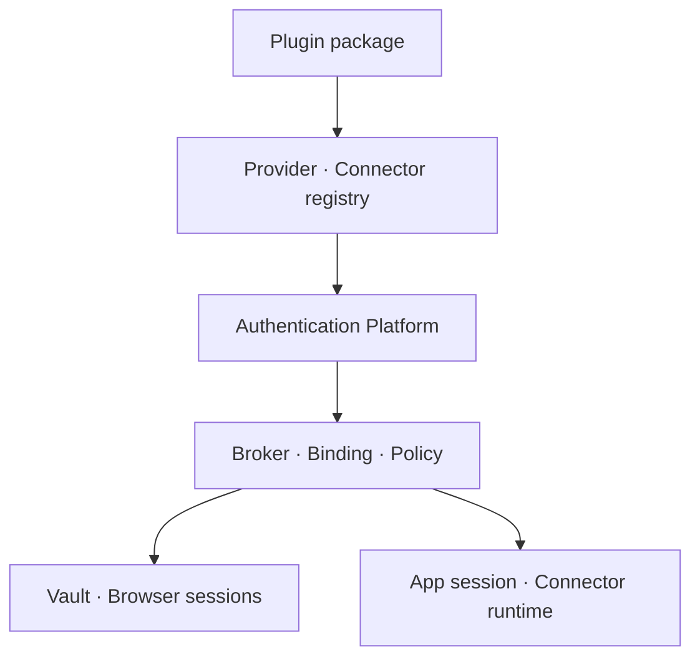

# Orca 인증 플러그인 플랫폼 도입 검토 보고서

> 개정일: 2026-07-31  
> Orca 기준 커밋: `0bb718321f76cd81fea78c527496c1c3765d1beb`  
> 비교 대상: OpenCode `da59457`, goose `6789d4a`, Hermes Agent `ce6dd1a`  
> 문서 성격: 구현 전 아키텍처 제안. 상세 계약과 인수 기준은
> [인증 플러그인 플랫폼 요구명세](auth-plugin-platform-requirements-ko.md)를 따른다.

## 개정 결론

기존 `CredentialBroker + 컴파일 타임 AuthMechanismModule` 제안은 비밀 저장과 주입 경계를
설명하는 기반으로는 유효하지만, 확정된 제품 요구를 충족하기에는 범위가 좁다. Orca의 목표를
다음과 같이 개정한다.

| 축 | 기존 제안 | 개정 제안 |
|---|---|---|
| 제품 범위 | 자격증명 broker | 설치·등록 가능한 Authentication Plugin Platform |
| 인증 대상 | Backend·MCP·main consumer | Orca 앱 로그인과 외부·사내 service connector |
| 확장 방식 | 컴파일 타임 module registry 우선 | 동일 manifest/ABI의 built-in·선언형·격리 code plugin |
| 인증 계약 | method별 acquire/optional refresh/revoke | 모든 provider가 `begin/continue/status/refresh/logout` 구현 |
| 기본 방식 | API key·OAuth 중심 | ADFS/WIA browser session, OAuth, API key, Auth token, PAT |

`CredentialBroker`는 폐기하지 않는다. Authentication Platform 안에서 vault, transaction,
binding, browser session, authenticated fetch를 집행하는 내부 핵심으로 위치를 낮춘다.

## 확정된 제품 정의

> Orca는 복수 인증 플러그인을 추가할 수 있는 플랫폼을 제공한다. 모든 인증 provider는 하나의
> lifecycle 계약을 사용하며, `application`과 `connector`를 인증 대상으로 지원한다. 앱 로그인과
> 서비스 연결의 상태는 별도 binding으로 관리하되 정책에 따라 같은 ADFS browser session을
> 공유할 수 있다. API key·Auth token·PAT를 포함한 실제 자격증명과 cookie는 Orca가 소유하고,
> Agent·Skill·connector에는 인증된 기능 호출만 제공한다.

인증 provider와 connector는 분리된 계약이다. 하나의 ADFS provider를 Orca 앱 로그인,
Confluence, Jira가 함께 사용할 수 있어야 하며, 하나의 connector는 ADFS browser session과 PAT
등 여러 provider를 허용할 수 있어야 한다. 배포 편의를 위해 한 plugin package에 provider와
connector를 함께 넣는 것은 허용한다.

## 비교 연구를 플랫폼 관점에서 재해석

| 축 | OpenCode | goose | Hermes Agent | Orca 결정 |
|---|---|---|---|---|
| 공통 인증 계약 | `AuthHook`의 method/prompt/result가 가장 명확 | `Provider` trait의 OAuth 메서드 | OAuth 구현은 중앙 코드에 집중 | OpenCode식 정규화 + 모든 lifecycle method 의무화 |
| registry·metadata | plugin loader가 hook을 합성 | `ProviderRegistry`와 `ConfigKey`가 강함 | provider profile과 secret source registry | goose식 metadata + 중복 거부 registry |
| 설치형 확장 | runtime plugin 가능하나 raw auth 접근이 넓음 | Rust built-in/선언형 JSON 중심 | Python profile/source plugin | 선언형 우선, code plugin은 별도 host 격리 |
| 비밀 저장 | 평문 `auth.json` | keyring, 실패 시 평문 fallback | 평문 `auth.json`·`.env` | safeStorage 유지, 평문 하향 금지 |
| 외부 secret | env override 중심 | 중앙 Config adapter 선례 | versioned `SecretSource`와 provenance | Hermes식 source contract, 전역 env 주입 금지 |
| 다중 자격증명 | 제한적 | provider별 분산 | pool·cooldown·DEAD 상태가 강함 | 단일 binding 안정화 후 선택 도입 |

세부 코드 근거는 기존 연구 문서에 고정되어 있다.

- [OpenCode 인증 브로커 분석](../opencode/auth-broker-analysis-ko.md)
- [goose 인증 브로커 분석](../goose/auth-broker-analysis-ko.md)
- [Hermes Agent 인증 브로커 분석](../hermes-agent/auth-broker-analysis-ko.md)

세 프로젝트의 구조는 참고할 수 있지만, 어느 하나도 Orca의 앱 로그인과 service connector를
동일 target 계약으로 다루거나 Electron ADFS partition을 공유하는 요구를 완성형으로 제공하지
않는다. `AuthTarget`, binding dependency, browser session capability는 Orca 고유 계층이다.

## 목표 구조



| 구성요소 | 책임 | raw secret/cookie 접근 |
|---|---|---|
| Plugin package | provider·connector·secret source contribution과 manifest 제공 | 없음이 기본; 획득 중 값도 제한 capability로 처리 |
| Auth provider | 공통 lifecycle로 transaction을 진행하고 binding 생성 | arbitrary Vault 접근 없음 |
| Credential broker | credential sealing, binding, refresh/logout, provenance, policy | 있음, Main 내부 전용 |
| Browser session store | session group→Electron `Session` mapping, cookie lifecycle | 있음, Main 내부 전용 |
| Connector runtime | 서비스 기능과 tool surface 제공 | 없음; `authenticatedFetch(bindingId, ...)`만 사용 |
| Plugin host | 설치형 code plugin 실행과 RPC 제한 | manifest가 허용한 capability만 |
| Renderer·Agent·Skill | 로그인 UX 또는 기능 호출 | 저장된 secret/cookie 조회 불가 |

## 앱 로그인과 서비스 연결

앱 로그인과 서비스 연결은 별도 인증 프레임워크가 아니다.

```ts
type AuthTarget =
  | { kind: 'application'; applicationId: 'orca' }
  | { kind: 'connector'; connectorId: string; connectionId: string }
```

동일 `AuthProviderV1`에 target만 바꿔 전달한다. 결과 binding은 대상별로 분리한다. 서비스 binding이
앱 로그인에 의존하면 `parentBindingId`로 관계를 기록한다. 이 구조는 다음을 동시에 만족한다.

- Orca 앱 로그인 없이 독립 PAT로 연결되는 connector를 허용한다.
- 앱의 ADFS 로그인 세션을 이용해 여러 사내 connector를 연결할 수 있다.
- 앱 로그아웃의 종속 연결 종료와 connector 하나의 독립 disconnect를 구분한다.

## ADFS/WIA 폐쇄망 adapter

현재 폐쇄망 구현은 최초 WIA 기반 ADFS 로그인과 후속 서비스 로그인이 같은 Electron
`partition`을 사용한다. 따라서 `corp-adfs-wia` provider가 `application`과 `connector` target을
모두 지원하고, broker가 `sessionGroup='corp-adfs'`를 동일 `Session`으로 해석해야 한다.

동일 partition을 사용하는 대상들은 같은 cookie jar를 직접 공유한다. ADFS SSO cookie는 각
서비스가 ADFS로 redirect될 때 공동으로 재사용된다. 서비스별 cookie도 같은 jar에 저장되지만
domain 규칙 때문에 다른 서비스 요청에 교차 전송되지는 않는다. partition 사이의 cookie 복사는
사용하지 않는다.

| 경계 | 결정 |
|---|---|
| 소유 | Electron Main이 partition과 `Session`을 소유하고 renderer/plugin에는 handle만 제공 |
| 통합 인증 | WIA credential 허용 도메인을 ADFS allowlist로 제한; wildcard 금지 |
| HTTP | 동일 session의 `ses.fetch(..., credentials:'include')` 또는 통제된 WebContents 사용 |
| navigation | login/probe/redirect origin allowlist, popup·download·새 창 통제 |
| disconnect | service binding 해제는 공유 partition 전체를 삭제하지 않음 |
| app logout | root binding과 종속 binding을 종료한 후 ADFS session 정리 정책 수행 |

REST API가 웹 session cookie를 인정하지 않고 PAT·Basic·Bearer만 받는다면 같은 connector에서
static credential provider를 선택한다. ADFS cookie를 PAT로 변환하거나 브라우저 cookie를 Agent
프로세스로 내보내지 않는다.

## 공통 provider lifecycle

```ts
interface AuthProviderV1 {
  readonly descriptor: AuthProviderDescriptor
  begin(ctx: AuthPluginContext, request: AuthRequest): Promise<AuthStep>
  continue(ctx: AuthPluginContext, txId: string, input: AuthInput): Promise<AuthStep>
  status(ctx: AuthPluginContext, bindingId: string): Promise<AuthStatus>
  refresh(ctx: AuthPluginContext, bindingId: string): Promise<AuthRefreshResult>
  logout(ctx: AuthPluginContext, bindingId: string): Promise<AuthLogoutResult>
}
```

모든 provider가 같은 메서드를 구현한다. API key/PAT처럼 자동 refresh가 없는 구현은
`not_supported`를 반환한다. UI는 `descriptor.capabilities`로 가능한 행동을 미리 표현하되,
core는 method 존재 여부로 provider 종류를 추론하지 않는다.

성공 결과인 `AuthBinding`은 `browser_session`, `vault_credential`, `delegated` 중 하나의 handle을
가진다. raw secret, cookie, Electron `Session` 객체를 결과에 넣지 않는다.

## API key·Auth token·PAT

세 값은 모두 static opaque credential로 획득·저장할 수 있지만 같은 것으로 뭉개지 않는다.

| kind | 의미 | 가능한 요청 표현 |
|---|---|---|
| `api_key` | 서비스가 발급한 API 식별·인증 key | 전용 header, 제한적으로 query |
| `auth_token` | 사용자가 직접 입력하는 일반 opaque token | Bearer 또는 전용 header |
| `personal_access_token` | 사용자 계정과 scope에 연결된 장기 token | Bearer, Basic password, 전용 header |

실제 요청 표현은 connector의 `CredentialPresentation`이 선언한다. kind만 보고 무조건 Bearer로
붙이지 않는다. trusted Orca secret prompt가 입력을 수집해 Main으로 전달하고 safeStorage에
봉인한다. 플러그인 UI, connector, Agent, Skill에는 저장값을 다시 반환하지 않는다.

connector는 다음과 같이 binding을 사용한다.

```ts
authenticatedFetch({
  bindingId,
  connectorId: 'confluence',
  method: 'GET',
  path: '/rest/api/content',
})
```

Broker가 connector identity, destination origin, redirect, presentation policy를 확인한 뒤 header나
cookie를 넣는다. 이를 통해 기존 Confluence Skill은 secret을 env로 받지 않고 Orca connector
tool을 호출하는 구조로 유지할 수 있다.

## Orca 현행 기반과 제거 대상

| 현행 요소 | 판단 |
|---|---|
| Electron `safeStorage`와 fail-closed 저장 | `CredentialVault` 구현으로 유지 |
| namespace `SecretFacade` | provider/consumer별 capability의 출발점으로 축소 |
| 기존 SSO module | built-in auth provider로 adapter하고 같은 conformance suite 적용 |
| 중앙 log redaction | auth transaction·binding·connector audit까지 확장 |

| 위험 경로 | 목표 |
|---|---|
| provider secret의 settings 평문 저장·argv 전달 | secret을 settings에서 제거하고 broker binding만 전달 |
| MCP secret의 `dist/.bak` materialize | secret-free proxy/connector descriptor만 배포 |
| broad `process.env` fallback | 명시 source policy와 exact-name allowlist로 교체 |
| raw `SecretStore`의 넓은 주입 | Vault를 broker 내부로 숨기고 consumer capability만 주입 |
| SSO token의 provider settings 기록 | binding/session handle로 교체 |

기존 코드 근거와 migration 대상은 PR #299에서 병합된 보고서의 permalink를 유지한다. 실제 구현
착수 시 최신 코드 SHA로 재검증하고 `security.md`, `provider-runtime.md`, `standardization.md`,
`IPC_CONTRACT.md`, `GLOSSARY.md`를 함께 갱신해야 한다.

## 플러그인 로딩과 신뢰 경계

컴파일 타임 등록만으로는 “몇 개라도 추가 가능한 플러그인” 요구를 충족하지 못한다. 반대로
설치 디렉토리의 JavaScript를 Electron Main에서 직접 `import()`하면 Main·filesystem·cookie·Vault
권한을 사실상 모두 준다. 따라서 확장 경로를 같은 ABI의 두 실행 형태로 나눈다.

| 형태 | 대상 | 실행 방식 |
|---|---|---|
| 선언형 plugin | static credential, 표준 OAuth/browser session, 단순 connector mapping | manifest 검증 후 Orca built-in adapter가 실행 |
| code plugin | 서비스 고유 handshake·protocol·connector logic | 별도 plugin-host process에서 capability RPC로 실행 |

built-in provider도 별도 예외 API를 갖지 않고 같은 manifest, registry, lifecycle conformance를
통과한다. registry는 duplicate id와 incompatible ABI를 거부하며 OpenCode식 last-writer-wins
override를 사용하지 않는다.

plugin-host에는 arbitrary Vault read, Electron `Session`, raw cookie API, unrestricted fetch,
`process.env` 전체를 제공하지 않는다. 허용 origin의 authenticated fetch, transaction UI step,
namespaced temporary state 등 최소 capability만 제공한다.

## 권장 모듈 배치

```text
app/src/main/
├── contracts/
│   ├── auth-plugin.ts
│   └── connector-plugin.ts
├── features/auth-platform/
│   ├── broker.ts
│   ├── registry.ts
│   ├── transactions.ts
│   ├── bindings.ts
│   └── policy.ts
├── features/connectors/
│   ├── registry.ts
│   └── runtime.ts
├── infra/auth/
│   ├── credential-vault.ts
│   ├── browser-session-store.ts
│   ├── authenticated-fetch.ts
│   └── plugin-host.ts
└── app/bootstrap.ts
```

`contracts`는 versioned ABI, `features`는 정책과 lifecycle, `infra`는 Electron/OS adapter,
`app/bootstrap.ts`는 구체 조립만 맡는다. feature 간 concrete import를 만들지 않고 auth·connector
contract를 통해 연결한다.

## 보안 불변식

| 불변식 | 검증 |
|---|---|
| secret은 safeStorage 또는 명시 external source에만 존재 | keychain unavailable fail-closed와 fixture file scan |
| Renderer 조회·Agent·Skill·connector·argv·dist에 raw secret이 없다 | IPC/argv/env/source/dist scan |
| plugin-host가 Main·Vault·Session에 직접 접근하지 못한다 | capability denial integration test |
| credential은 binding의 connector와 allowlisted origin에만 붙는다 | host·redirect·header spoofing test |
| 같은 session group만 cookie jar를 공유한다 | partition identity와 isolation test |
| logout dependency가 service-only와 app-cascade를 구분한다 | end-to-end lifecycle test |
| 모든 provider가 동일 method contract를 지킨다 | provider conformance suite |

## 도입 순서

| 단계 | 범위 | 완료 조건 |
|---|---|---|
| A. 플랫폼 골격 | manifest/registry, 공통 lifecycle, transaction/binding, Vault·Session port | built-in auth도 공통 contract만 사용 |
| B. 기준 adapter | API key/Auth token/PAT, `corp-adfs-wia`, app login, connector binding, authenticated fetch | application·connector E2E와 shared partition 검증 |
| C. 설치형 확장 | 선언형 loader, 격리 plugin-host, connector runtime, migration·audit | 신규 package가 core switch 없이 추가되고 비밀 비노출 gate 통과 |

이 순서에서 OAuth browser/device-code와 external secret source는 ABI에 처음부터 포함한다. 실제
provider 구현 확대는 static credential과 ADFS/WIA의 저장·로그아웃·격리 모델이 안정된 뒤 같은
contract로 진행한다.

## 구현 PR 최소 인수 기준

- 인증 provider를 추가할 때 core의 provider별 분기 수정이 없다.
- built-in, 선언형, code provider가 동일 `AuthProviderV1` conformance suite를 통과한다.
- `application`과 `connector` target이 같은 lifecycle을 사용한다.
- ADFS 앱 로그인과 둘 이상의 서비스 binding이 같은 session group을 재사용한다.
- API key, Auth token, PAT가 kind와 presentation을 보존하며 연결·probe·logout된다.
- connector·Agent·Skill이 raw credential/cookie/partition을 받지 않는다.
- app logout cascade와 connector-only disconnect가 공유 세션을 손상하지 않는다.
- 기존 credential과 SSO 설정에 migration·rollback 계획이 있다.

