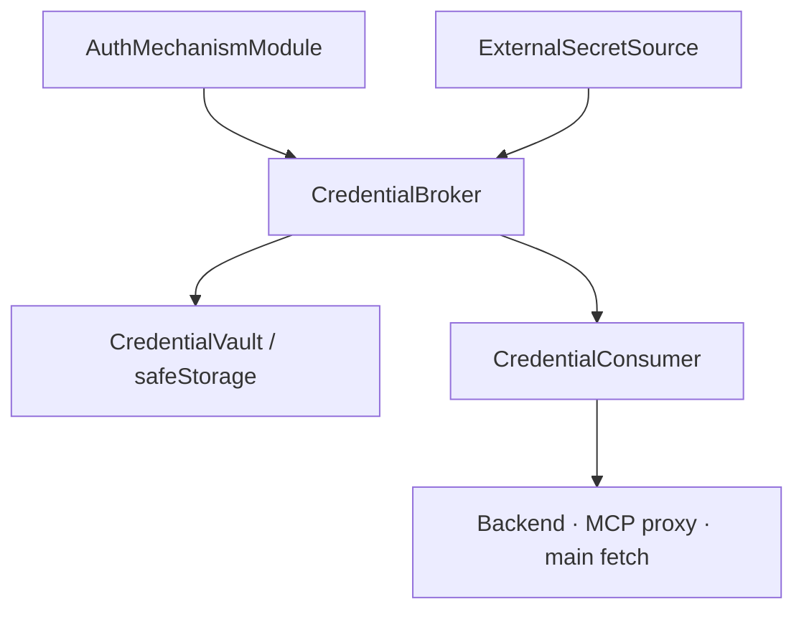

# Orca 인증 브로커 도입 검토 보고서

> 작성일: 2026-07-31
> Orca 기준 커밋: `0ddf31eef55ba0d06d4dbfc16cd916b5fde08d50`
> 비교 대상: OpenCode `da59457`, goose `6789d4a`, Hermes Agent `ce6dd1a`
> 문서 성격: 구현 전 아키텍처 제안. 현행 `security.md`·`provider-runtime.md`를 아직
> supersede하지 않는다.

## 최종 제안

Orca에는 `CredentialBroker`를 도입하되, 다음 세 결정을 함께 적용해야 한다.

| 결정 | 제안 |
|---|---|
| 저장 | 현행 Electron `safeStorage`를 유지하고 raw `SecretStore` 접근을 broker 뒤로 숨김 |
| 확장 | 임의 runtime plugin 대신 현재 SSO와 같은 **컴파일 타임 명시 등록 인증 모듈**부터 시작 |
| 소비 | Backend용 credential, 도구용 credential, main 전용 credential을 서로 다른 노출 등급으로 분리 |

OpenCode의 인증 계약, goose의 secret metadata·cleanup, Hermes의 provenance·실패 분류를
조합하되 세 프로젝트의 평문 fallback·전역 env·raw plugin access는 가져오지 않는다.

가장 중요한 원칙은 다음과 같다.

> **도구용 PAT를 “안전한 env”로 Backend에 주입하지 않는다.** Orca가 소유한
> connector/MCP proxy가 PAT를 보유하고 인증 요청을 대행하며, 모델에는 제한된 tool schema와
> 결과만 제공한다.

## 조사 결과 비교

| 축 | OpenCode | goose | Hermes Agent | Orca 채택 |
|---|---|---|---|---|
| 인증 방법 계약 | `AuthHook`으로 가장 명확 | `Provider` OAuth method | OAuth는 중앙 전용 코드 | OpenCode식 acquire/result 계약 |
| 안전한 저장 | 평문 JSON `0600` | OS keyring, 파일 fallback | 평문 JSON `0600` | 현행 safeStorage 유지 |
| secret field metadata | 제한적 | `ConfigKey.secret` 등 풍부 | source/pool metadata | goose식 선언 |
| 외부 vault | env override 중심 | 없음 | versioned `SecretSource` | Hermes식 read-only source, env write 제외 |
| 다중 계정·회전 | 없음 | provider별 구현 | credential pool이 강함 | v2 이후 선택 도입 |
| plugin 신뢰 경계 | raw auth 접근 가능한 runtime code | 컴파일 타임 Rust/JSON | Python plugin, env 주입 | 컴파일 타임 allowlist |
| 삭제·revoke | 저장 레코드 제거 | cleanup hook 연계 | provider별 logout | module cleanup/revoke 필수 |

세부 근거:

- [OpenCode 인증 브로커 분석](../opencode/auth-broker-analysis-ko.md)
- [goose 인증 브로커 분석](../goose/auth-broker-analysis-ko.md)
- [Hermes Agent 인증 브로커 분석](../hermes-agent/auth-broker-analysis-ko.md)

## Orca 현행 진단

### 유지할 기반

| 현행 요소 | 근거 | 판단 |
|---|---|---|
| safeStorage 암호화 | [`secret-store.ts`](https://github.com/muzaby/orca-skin/blob/0ddf31eef55ba0d06d4dbfc16cd916b5fde08d50/app/src/main/infra/config/secret-store.ts#L1-L30) | 유지 |
| namespace facade | [`secret-facade.ts`](https://github.com/muzaby/orca-skin/blob/0ddf31eef55ba0d06d4dbfc16cd916b5fde08d50/app/src/main/infra/config/secret-facade.ts#L1-L29) | broker capability의 출발점 |
| 컴파일 타임 SSO 모듈 | [`contracts/sso.ts`](https://github.com/muzaby/orca-skin/blob/0ddf31eef55ba0d06d4dbfc16cd916b5fde08d50/app/src/main/contracts/sso.ts#L1-L20) | 인증 모듈 등록 정책에 재사용 |
| fail-closed 암호화 | `safeStorage` 불가 시 저장 거부 | goose의 자동 평문 fallback보다 적합 |
| 중앙 로그 redaction | `infra/log/redact.ts` | broker event에도 의무 적용 |

### 먼저 제거해야 할 노출

| 위험 | 현행 근거 | 영향 | 목표 |
|---|---|---|---|
| provider secret의 settings 평문 저장 | [`claude-settings.ts`](https://github.com/muzaby/orca-skin/blob/0ddf31eef55ba0d06d4dbfc16cd916b5fde08d50/app/src/main/adapters/claude-settings.ts#L1-L10) | 사용자 파일에 token 잔존 | metadata와 secret 분리 |
| provider secret의 argv 노출 | [`adaptSettings`](https://github.com/muzaby/orca-skin/blob/0ddf31eef55ba0d06d4dbfc16cd916b5fde08d50/app/src/main/adapters/claude-adapt.ts#L67-L83) | 같은 사용자의 process list에서 관측 가능 | secret을 `options.settings`에서 제거 |
| MCP secret의 dist/.bak 평문 materialize | [`bootstrap.ts`](https://github.com/muzaby/orca-skin/blob/0ddf31eef55ba0d06d4dbfc16cd916b5fde08d50/app/src/main/app/bootstrap.ts#L146-L157), [`deployer.ts`](https://github.com/muzaby/orca-skin/blob/0ddf31eef55ba0d06d4dbfc16cd916b5fde08d50/app/src/main/features/extensions/deployer.ts#L154-L200) | 파생 파일과 rolling backup에 secret 잔존 | placeholder 또는 broker-owned proxy만 배포 |
| broad `process.env` fallback | [`mcp/resolver.ts`](https://github.com/muzaby/orca-skin/blob/0ddf31eef55ba0d06d4dbfc16cd916b5fde08d50/app/src/main/features/extensions/mcp/resolver.ts#L1-L9) | 출처·소유권·상속 범위 불명확 | 명시 source policy + provenance |
| raw store의 넓은 전달 | [`RouterContext`](https://github.com/muzaby/orca-skin/blob/0ddf31eef55ba0d06d4dbfc16cd916b5fde08d50/app/src/main/app/context.ts#L20-L29) | key 이름을 아는 소비자가 임의 secret 조회 | consumer별 capability facade |
| SSO token의 provider settings 기록 | [`SsoContext.setProviderEnv`](https://github.com/muzaby/orca-skin/blob/0ddf31eef55ba0d06d4dbfc16cd916b5fde08d50/app/src/main/contracts/sso.ts#L45-L60) | SSO가 획득한 token도 평문 settings로 이동 가능 | broker handle 전달 |

MCP 배포 문서에는 과거의 “비밀은 파일에 기록하지 않는다” 설명과 현재
`dist/plugins/orca/.mcp.json` 렌더 동작이 함께 남아 있다. 구현 시에는 코드 기준으로
마이그레이션하고 `security.md`·`standardization.md`를 같은 PR에서 정합화해야 한다.

## 목표 구조



### 책임 분리

| 구성요소 | 책임 | 원본 secret 접근 |
|---|---|---|
| `CredentialVault` | 암호화 저장 CRUD, transaction/batch, key namespace | 있음, 내부 전용 |
| `CredentialBroker` | metadata, acquire/refresh/revoke, 상태, provenance, consumer 권한 | 있음, composition root 전용 |
| `AuthMechanismModule` | API key/OAuth/device-code/사내 login 절차 | 자기 namespace와 획득 중 값만 |
| `ExternalSecretSource` | 외부 vault ref를 read-only로 해석 | 요청된 ref만 |
| `CredentialConsumer` | 특정 target에 필요한 최소 형태로 materialize | 선언된 field만, lease 동안 |
| Renderer | metadata/status와 사용자 입력만 | 없음 |

`SecretStore`는 `CredentialVault`의 Electron 구현으로 남긴다. 기능 slice가 `SecretStore`
concrete를 직접 받지 않고 `CredentialBroker` 또는 좁은 consumer port를 받도록 의존을
뒤집는다.

## credential 노출 등급

모든 credential을 같은 `env`로 다루면 “저장 암호화”는 가능해도 “에이전트 비노출”은
보장할 수 없다. 소비 목적에 따라 다음 등급을 고정한다.

| 등급 | 예 | 허용 경로 | 보안 설명 |
|---|---|---|---|
| A. Backend 실행 자격증명 | Anthropic API key, Bedrock session | host-native login 또는 Backend child의 최소 env | Backend가 실제 값을 알아야 하므로 agent runtime과 완전 분리 보장 불가 |
| B. 도구·서비스 자격증명 | Confluence/GitHub PAT, 사내 API token | Orca-owned connector/MCP proxy가 인증 요청 대행 | Backend child·shell·prompt에 secret을 주지 않음 |
| C. main 전용 자격증명 | usage API, SSO restore token | main의 allowlisted fetch client | renderer·Backend·일반 child에 전달 금지 |

등급 B가 “PAT를 에이전트에게 노출하지 않는다”는 요구를 만족시키는 정식 경로다.
Skill이 `curl`/shell로 REST API를 직접 호출하게 만들면 어떤 broker도 PAT 비노출을 보장할 수
없다. Skill은 connector/MCP tool을 호출하고, proxy가 Authorization header를 붙여야 한다.

## 인증 모듈 계약 초안

초기 버전은 현재 `SsoProviderModule`처럼 컴파일 타임 registry에 명시 등록한다. Electron main
프로세스의 동적 `import(path)`는 secret 접근 권한이 너무 크므로 지원하지 않는다.

```ts
type AuthMethod = 'api_key' | 'oauth_browser' | 'oauth_device_code' | 'external'

interface CredentialFieldSpec {
  name: string
  secret: boolean
  required: boolean
  persist: 'vault' | 'metadata' | 'never'
}

interface AuthMechanismModule {
  key: string
  method: AuthMethod
  fields: readonly CredentialFieldSpec[]
  acquire(ctx: AuthModuleContext): Promise<CredentialGrant>
  refresh?(ctx: AuthRefreshContext): Promise<CredentialGrant>
  revoke?(ctx: AuthRevokeContext): Promise<void>
}
```

계약 정책:

| 정책 | 결정 |
|---|---|
| versioning | v1은 additive optional만, 파괴 변경은 v2 병행 |
| 등록 | `features/credentials/modules/index.ts` 한 줄 opt-in |
| vault 접근 | `credential:<moduleKey>:` namespace facade만 |
| prompt | renderer 입력 spec은 선언형, secret 값은 응답으로 되돌리지 않음 |
| OAuth pending | transaction id, expiry, PKCE/state metadata를 broker가 영속; secret code는 `never` |
| 오류 | `not_configured`, `auth_failed`, `auth_expired`, `cancelled`, `timeout`, `network`, `internal` |
| cleanup | 저장 삭제와 module revoke/sidecar shutdown을 하나의 logout transaction으로 결합 |

OpenCode처럼 `acquire`가 최종 grant를 정규화하되, plugin에 vault의 arbitrary `get(id)`를
제공하지 않는다.

## 저장 모델

metadata는 로컬 DB, secret value는 safeStorage를 사용한다. DB에는 secret 값이나 복호화 가능한
파생값을 넣지 않는다.

```ts
interface CredentialMetadata {
  id: string
  moduleKey: string
  kind: 'api_key' | 'oauth2' | 'basic' | 'session'
  label: string
  secretFields: string[]
  scopes: string[]
  status: 'valid' | 'expired' | 'revoked' | 'unknown'
  source: 'user' | 'oauth' | 'external'
  sourceRef?: string
  expiresAt?: string
  createdAt: string
  updatedAt: string
}
```

Vault key는 env-var 이름이 아니라 immutable credential id와 field를 사용한다.

```text
credential:<credentialId>:<field>
```

이유:

- env 이름 충돌과 Backend 명명 규칙을 저장 identity에서 분리한다.
- 같은 credential을 여러 consumer가 쓰더라도 metadata와 cleanup을 한 항목으로 관리한다.
- env 이름은 materialize target의 일시적인 출력일 뿐 저장 key가 아니다.

외부 vault에서 빌린 credential은 Hermes처럼 `sourceRef`와 fingerprint만 metadata에 보관하고
값은 Orca vault에 재저장하지 않는 선택을 지원한다.

## materialize와 lease

`CredentialConsumer`는 credential id를 받고 target에 필요한 최소 field만 잠시 해석한다.

```ts
type CredentialTarget =
  | { kind: 'backend'; adapter: string; backendKey: string }
  | { kind: 'mcp_proxy'; serverId: string }
  | { kind: 'main_fetch'; service: string }

interface CredentialLease {
  id: string
  credentialId: string
  target: CredentialTarget
  expiresAt: number
  close(): void
}
```

lease는 JavaScript 메모리의 완전한 zeroization을 보장한다는 의미가 아니다. 다음을 강제하는
수명주기·감사 단위다.

- 허용 consumer와 field 확인
- 짧은 TTL과 `AbortSignal`
- 로그·오류 redaction
- child env allowlist
- 사용 종료 후 참조 제거와 sidecar shutdown
- credential id, target, 결과만 audit하고 값은 기록하지 않음

## target별 주입 전략

### Backend

우선순위는 host CLI/native credential 위임, child-only env, unsupported 순이다.

- provider settings의 `env`에 secret을 넣어 `options.settings` argv로 보내는 경로는 폐지한다.
- `options.env`를 사용하더라도 Claude Backend가 실행하는 shell/tool child가 상속할 수 있으므로
  “모델 비노출” 용도로 분류하지 않는다.
- Backend가 secret-free proxy endpoint를 지원하면 proxy credential은 main/sidecar에 남기고
  Backend에는 endpoint와 단기 opaque session만 제공한다.

### MCP·connector

source와 dist에는 secret이 없는 proxy endpoint/command만 둔다.

- Orca가 proxy/connector process를 먼저 시작한다.
- proxy가 broker의 등급 B credential을 사용해 upstream에 Authorization header를 붙인다.
- Claude plugin의 `.mcp.json`은 proxy 연결 정보만 가진다.
- proxy tool은 credential 읽기·환경 dump API를 제공하지 않는다.
- action은 기존 approval/audit 정책을 통과한다.

이 방식이면 model이 proxy tool을 호출할 수는 있지만 PAT 값을 읽을 수는 없다. tool 사용 권한과
secret 열람 권한을 분리한다.

### main 전용 fetch

usage/SSO 같은 consumer는 현재 `SecretFacade` 패턴을 일반화한다.

- `fetch(url, { credentialId, policy })` 형태의 broker-owned client 사용
- destination host allowlist와 redirect 재검증
- header/body logging 전 redaction
- 일반 `process.env`나 child에 값 전달 금지

## 우선순위와 provenance

Hermes의 충돌 보고를 차용해 값별 출처를 명시한다. 암묵적 `safeStorage ?? process.env`는
폐지하고 credential binding에 source policy를 둔다.

| policy | 순서 |
|---|---|
| `managed_only` | 회사 관리 source만, 없으면 실패 |
| `vault_first` | Orca vault → 명시 external source |
| `external_first` | 명시 external source → Orca vault |
| `host_native` | Backend/CLI 자체 credential만, broker가 값 열람하지 않음 |

환경변수를 지원해야 하면 `external source: env`로 명시 등록하고 정확한 이름만 읽는다.
전체 `process.env`를 일반 fallback으로 간주하지 않는다. status와 audit에는 실제 값 대신
`credentialId`, `source`, `sourceRef`, `fingerprint`만 남긴다.

## 보안 불변식

| 불변식 | 검증 방법 |
|---|---|
| renderer IPC 응답에 secret 없음 | schema/contract test와 secret-pattern test |
| DB·sources·dist·backup에 평문 secret 없음 | fixture token을 심고 전체 파일 scan |
| argv에 secret 없음 | spawn 인자 capture test |
| Backend child에 등급 B/C secret 없음 | child env snapshot test |
| module이 자기 namespace 밖을 못 읽음 | capability facade unit test |
| keychain 불가 시 저장 거부 | `isEncryptionAvailable=false` test |
| redirect가 allowlist 밖으로 나가면 header 제거/실패 | main fetch integration test |
| 로그·오류에 secret 없음 | 기존 redactor + broker event corpus test |
| logout 후 vault·metadata·cache·sidecar 잔여 없음 | end-to-end cleanup test |
| OAuth state/PKCE/expiry 검증 | callback replay·mismatch·expired transaction test |

## 도입 순서

| 단계 | 범위 | 완료 조건 |
|---|---|---|
| A. 경계 고정 | credential taxonomy, DB metadata, vault port, broker skeleton | renderer는 metadata만 조회, raw store 직접 주입 신규 금지 |
| B. 기존 경로 이관 | MCP, usage, SSO를 consumer port로 전환 | expanded MCP dist/.bak 및 SSO provider settings 평문 경로 제거 |
| C. 인증 모듈 | API key, browser OAuth, device code 공통 module contract | acquire/refresh/revoke/timeout/cancel contract test |
| D. Backend 이관 | Claude custom Backend secret을 settings argv에서 제거 | argv scan 0건, host-native/child-env 한계 UI 명시 |
| E. 외부 source·회전 | external vault source, 선택적 multi-credential pool | provenance/conflict와 terminal failure 격리 |

단계 A~D가 첫 구현 범위다. Hermes식 다중 credential 자동 회전은 복잡도와 오작동 시 영향이
크므로 broker 단일 credential 수명주기가 안정된 뒤 단계 E에서 도입한다.

## 권장 디렉토리 배치

현행 main layer DAG를 유지하는 배치다.

```text
app/src/main/
├── contracts/
│   └── credentials.ts              # 동결 확장 계약·공유 타입
├── infra/config/
│   ├── secret-store.ts             # safeStorage 구현, broker 내부 전용
│   └── credential-vault.ts         # vault port adapter
├── features/credentials/
│   ├── broker.ts                   # metadata·lifecycle·policy
│   ├── repository.ts               # DB metadata
│   ├── modules/                    # 컴파일 타임 인증 모듈 registry
│   └── consumers/                  # MCP proxy/main fetch 등
└── app/
    └── bootstrap.ts                # concrete 조립
```

`features/credentials`가 다른 feature를 직접 import하지 않고, consumer가 필요한 좁은 port를
`contracts`에 두며, `app/bootstrap.ts`가 MCP·SSO·usage에 주입한다.

## 채택·비채택 결정

| 출처 | 채택 | 비채택 |
|---|---|---|
| OpenCode | 방법/prompt 계약, grant 정규화, acquire와 loader 분리 | 평문 `auth.json`, raw auth plugin 접근, memory-only pending |
| goose | key metadata, batch write, cleanup, 외부 store port adapter | keyring 실패 시 평문 fallback, OAuth cache hardcode |
| Hermes | borrowed secret 비영속, provenance, terminal failure 분리, child env allowlist | 전역 env 주입, 중앙 거대 OAuth 파일, 평문 store |
| Orca 현행 | safeStorage, namespace facade, compile-time SSO module, redaction | settings argv secret, expanded MCP dist, broad env fallback |

## 구현 PR의 최소 인수 기준

- 기존 credential을 읽을 수 있는 migration/rollback 계획이 있다.
- 새 코드 경로에서 secret은 safeStorage 또는 명시 external source에만 존재한다.
- 등급 B/C credential이 Backend env·argv·prompt·renderer·dist에 나타나지 않는다.
- 인증 모듈 하나를 추가할 때 broker/core switch를 수정하지 않고 registry 한 줄로 등록한다.
- revoke/logout가 vault 값, metadata, provider cache, proxy process를 함께 정리한다.
- `security.md`, `provider-runtime.md`, `standardization.md`, `IPC_CONTRACT.md`와 코드가 같은
  PR에서 정합화된다.
