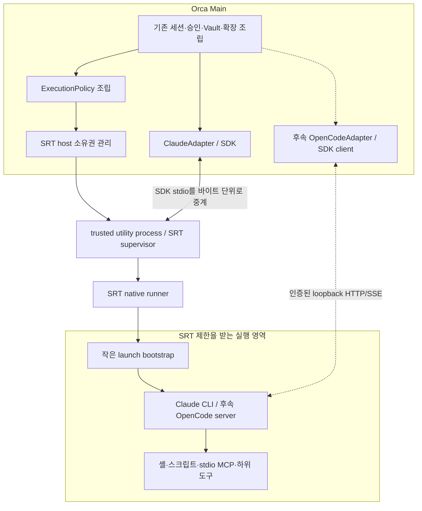

# Orca Windows SRT 도입 제안

> **사용자 결정: Windows 지원이 성숙할 때까지 SRT 도입 보류 (2026-09-08).** 핸드오프 작성·구현을 종료했다.
> 현재 결론과 모든 실행 결과는 [실행 보고서](execution-report.md), 보존한 실험은 [study 안내](README.md)에 둔다. 아래 내용은 당시 설계·실증 기록이며 재개 지시가 아니다.

작성일: 2026-09-07. 상태: **검토용 제안**. 구현 READY plan이나 현재 아키텍처가 아니다.
작성 시점에는 앱 구현·의존성 설치·SRT provisioning·OS 정책 변경을 수행하지 않았다.
이후 P0 실행 전달 검증은 [0219 plan](plans/0219-srt-windows-preflight.md)으로
구체화했다. 보류 결정과 실증 결과는 [실행 보고서](execution-report.md), 재현 절차는
[Windows SRT 사전 검증](windows-preflight-guide.md)을 따른다. P0는 일반 앱의 SRT 연결을 포함하지 않는다.

**2026-09-08 실증 정정:** 공식 Windows binary에서 호출자의 stdin이 대상에 전달되지 않았다.
아래 stdin bootstrap 연결은 필요한 상류 보완을 포함한 설계 조건으로 읽어야 한다.
[실증 결과와 입력 전달 보완안](windows-preflight-findings.md)에 원인·대조 시험·추가 선택을 기록한다.

## 1. 요구와 권고

| 구분 | 내용 |
|---|---|
| 확정 요구 | Windows에서 Anthropic sandbox-runtime(SRT)을 사용한다. WSL·Docker·AppContainer를 도입하지 않는다. |
| 지금 할 일 | 현재 Claude 실행을 SRT에 연결하는 구조와 도입 순서를 설계한다. |
| 후속 | OpenCode adapter와 cowork는 나중에 구현한다. 이번에는 연결에 필요한 공통 계약만 준비한다. |
| 품질 목표 | 도구·플러그인을 추가할 때 공통 실행기를 다시 만들지 않는다. 기존 세션·승인·인증·확장 동작을 보존한다. |
| 설치 조건 | 이 PC의 설치·실증은 후속 사용자 승인으로 진행했다. 제품 전체 자동 관리자 설치 정책은 여전히 미정이다. |
| 보장 수준 | 구조적 확장 가능성과 실제 도구 호환성은 구분한다. 실제 Windows에서 검증한 조합만 지원 완료로 판정한다. |

**권고: SDK는 Main에 유지하고, SRT의 실행 정책·프로세스 수명만 작은 supervisor에 맡긴다.**
supervisor는 기존 Electron의 utility process로 필요할 때 생성한다. Claude 전용 업무 host,
범용 RPC 프레임워크, 새로운 플러그인 시스템은 만들지 않는다.

Windows의 argv·env 전달에는 작은 실행 bootstrap을 둔다. bootstrap은 SRT 안에서 실행되고
정책 판단 없이 승인된 프로그램을 시작한다. SRT만 OS 격리를 담당한다.

이 보조 구성은 단순한 `spawn` 래퍼보다 비용이 들지만, SRT의 전역 상태 충돌과 Windows
환경변수 전달 문제를 어댑터마다 재구현하지 않게 한다. 추가 비용과 검증 조건은 §5·§11에 적었다.

## 2. 확인된 사실과 설계 영향

조사 기준은 저장소 `a52e0d1e`, 설치된 Claude Agent SDK `0.3.220`, OpenCode SDK `1.18.27`,
SRT release `0.0.75`다. 상류 소스 확인과 Windows 배포본의 실제 실행 검증은 구분한다.

| 확인한 사실 | 설계 영향 | 근거 |
|---|---|---|
| Claude SDK에 custom spawn이 있다 | `query()`와 callback을 Main에 둘 수 있다 | [로컬 SDK 타입](../../../../app/node_modules/@anthropic-ai/claude-agent-sdk/sdk.d.ts) |
| Claude 채널은 장수명 입력 스트림이다 | 턴 완료마다 sandbox를 해제하지 않는다 | [Claude adapter](../../../../app/src/main/adapters/claude.ts) |
| OpenCode 기본 helper는 서버를 직접 spawn한다 | 후속 adapter는 SRT로 서버를 시작한 뒤 client만 연결한다 | [OpenCode SDK 조사 §8](../../../opencode-sdk-spec.md#8-설정모델인증mcp프로세스) |
| SRT manager의 config·proxy·정리 상태는 모듈 전역이다 | 서로 다른 정책은 같은 manager를 재초기화하며 공유하지 않는다 | [S1] |
| Windows의 per-exec allowRead/allowWrite는 지원하지 않는다 | 실행 전에 불변 정책을 확정한다 | [S1] |
| Windows wrap 결과의 env는 바깥 broker용이다 | 실제 backend 환경을 별도로 전달해야 한다 | [S1] |
| SDK custom spawn은 동기, SRT wrapping은 비동기다 | 준비 단계와 지연 시작을 지원하는 프로세스 핸들이 필요하다 | 로컬 SDK 타입·[S1] |
| 현재 guard는 Bash를 검사하지 않는다 | guard를 유지해도 OS 격리 부족을 보완했다고 말할 수 없다 | [workspace guard](../../../../app/src/main/adapters/workspace-guard.ts) |
| MCP에는 Main 내부 handler도 있다 | 모든 MCP를 sandbox 자식 프로세스로 취급하지 않는다 | [runtime tools](../../../../app/src/main/adapters/claude-runtime-tools.ts) |

`security.md`의 사용자 settings 상속 설명 일부는 현재 코드와 다르다. 이번 설계는 실제
[adaptSettingSources](../../../../app/src/main/adapters/claude-adapt.ts)의 `['project', 'local']`을 기준으로 한다.
기존 코드에서 Node·Python·uv·Git 전체를 Orca가 관리 배포한다는 근거는 찾지 못했다.
Codex 개발 환경에 설치된 런타임을 Orca 제품 자산으로 간주하지 않는다.

### 첨부 `srt.md`의 평가

첨부 문서는 **보안 원칙은 유용하지만 현행 Orca에 바로 적용할 구현안으로는 보완이 필요**하다.
문서 안의 구현 지시·예시는 검토 대상이며, 사용자의 확정 요구로 간주하지 않았다.

| 원문 항목 | 평가와 최종안 반영 |
|---|---|
| Main에 DB·Vault·승인 유지 (§3·§10·§13) | 유지한다. 실행 자산과 필요한 credential만 경계를 넘어간다. |
| `query()`는 반드시 sandbox 내부 (§3.1) | 필수 조건이 아니다. 현행 custom spawn으로 CLI와 하위 실행을 제한할 수 있다. SDK 자체까지 격리하는 추가 이점은 있지만 현재 경량화 목표에서는 Main에 남긴다. |
| Claude 전용 DTO와 callback RPC (§4–§11) | 장수명 입력·steer·resume·서브태스크·인프로세스 MCP까지 옮기는 비용이 크다. 공통 실행 프로토콜로 범위를 줄인다. |
| 승인 callback 30초 timeout (§12) | 현재 [승인 coordinator](../../../../app/src/main/features/approvals/coordinator.ts)는 사용자 응답에 자동 timeout을 두지 않는다. 연결 단절·프로세스 장애와 사람의 응답 대기를 분리한다. |
| env 정제·홈 비노출·guard 유지 (§13–§16) | 유지하되 Windows child env 전달, backend 상태 이행, guard 경로 주입까지 설계해야 한다. 현재 Bash 미검사 때문에 guard가 SRT의 모든 한계를 보완하지는 못한다. |
| `src/main/sandbox/` 추가 (§8) | 현재 main DAG에 맞춰 infra와 app composition으로 나눈다. |
| workspace별 실행·단일 active workspace 검토 (§22) | 전역 manager와 공유 SID를 구분해야 한다. 순차 실행도 잔여 ACL·자손 프로세스 회수를 검증해야 한다. |
| host/RPC 분리 후 SRT 적용 (§20·§25) | Windows SRT 전달·권한·사내망을 P0에서 먼저 검증한다. SDK 이전을 먼저 확정하지 않는다. |

## 3. 구조 선택

| 접근 | 장점 | 비용·문제 | 판단 |
|---|---|---|---|
| Main에 SRT manager를 직접 두고 모든 채널이 공유 | 초기 코드와 프로세스 추가량이 작다 | 전역 정책 충돌, 허용 경로 합집합, 파일 정책 변경 시 기존 실행과의 조정, Main 안의 추가 네트워크 스택 | 기본안으로 선택하지 않는다 |
| 정책 범위별 작은 SRT supervisor, SDK는 Main | 기존 SDK 기능을 보존하고 SRT 상태·장애·정리를 국소화 | helper 배포 엔트리와 작은 제어 프로토콜 필요 | **권고** |
| SDK까지 agent-host에 이전 | SDK 파서·의존성까지 Main에서 분리 | 승인·MCP·steer·이벤트 순서·세션 API의 RPC 이전과 SDK별 host 구현 필요 | 현재 요구에 비해 변경이 크다 |

supervisor의 분리는 **SRT manager 상태를 분리**한다. 서로 다른 Windows 사용자 SID를
만드는 것은 아니며, workspace 사이의 OS 접근권한 분리를 보장하지 않는다. 이 한계는 §10의 별도 항목이다.

supervisor는 trusted 코드지만 Vault·DB·승인 서비스·범용 파일 API를 받지 않는다.
여기에 plugin 코드를 import하거나 도구 handler를 실행하지 않는다.
승인된 실행용 credential이 전달되는 동안에는 supervisor도 해당 값을 메모리에서 취급한다.
SDK·등록된 Main handler의 취약점까지 SRT로 격리하는 구조는 아니다.

## 4. 모듈 배치와 최소 계약

아래 경로는 **제안 위치**이며 지금 존재한다는 뜻이 아니다. 기존 main DAG를 유지한다.

| 제안 모듈 | 책임 | 갖지 않을 책임 |
|---|---|---|
| `main/infra/sandbox/types.ts` | 정책 snapshot·lease·프로세스·종료 결과의 낮은 수준 계약 | SDK 타입·제품 세션 상태 |
| `main/infra/sandbox/host-pool.ts` | scope별 helper 생성·참조·회수 | 별도 세션 스케줄러 |
| `main/infra/sandbox/host-client.ts` | 실행 제어와 bounded stream 중계 | SDK message 해석 |
| `main/infra/sandbox/srt-owner.ts` | SRT import·initialize·wrap·reset의 유일한 소비 모듈 | 제품 권한 결정 |
| `main/infra/sandbox/policy-key.ts` | 정책 비교와 변경 감지 | raw secret 보관·해시 |
| `main/app/sandbox-host-entry.ts` | utility process 엔트리 조립 | 기존 Main bootstrap 재실행 |
| `main/app/chat-turn/prepare-execution.ts` | 확정된 cwd·확장·환경을 받아 실행 준비 | feature끼리 교차 import |
| `main/adapters/claude-process.ts` | 공통 핸들을 SDK SpawnedProcess로 변환 | 직접 SRT 설정 변경 |
| `app/native/sandbox-launcher/` | 고정 launch frame 해석·제한 토큰으로 대상 실행·stdio 연결 | ACL·계정·WFP·네트워크 정책 구현 |

`features/extensions`는 자원 요구를, `features/harnesses`는 해석된 환경과 실행기 정보를,
`features/sessions`는 채널 수명을 제공한다. 교차 조립은 `app/`이 맡고 infra는 상위 feature를 참조하지 않는다.
작은 순수 함수는 관련 모듈 안에 둔다. 파일당 클래스를 만드는 방식은 사용하지 않는다.

| 계약 | 의미 |
|---|---|
| `acquire(scope, resolvedPolicy, signal) → lease` | 준비 완료된 정책 범위의 실행 소유권 확보 |
| `lease.start(launchSpec) → managedProcess` | 동기 핸들 반환. 실제 실행 완료까지의 준비는 내부에서 진행 가능 |
| `managedProcess.started / exited` | 시작 완료와 실제 종료를 별도로 관측 |
| `managedProcess.stdin/stdout/stderr` | SDK 중립 스트림. 고정 크기 큐와 backpressure |
| `managedProcess.terminate(reason)` | 해당 실행 종료. 다른 세션에 대한 reset 금지 |
| `lease.release() / lease.closed` | 반납 요청과 정리 완료를 구분 |
| `pool.drain(reason)` | 새 실행을 막고 기존 실행·정리 결과를 회수 |

`launchSpec`은 실행 파일 절대경로, argv, cwd, 검증된 env overlay만 가진다.
prompt·model·permission mode·SDK hook 객체를 공통 실행 계약에 넣지 않는다.
공통 실행 계층의 protocol에는 버전·scope·실행 generation·request id가 필요하지만
새 범용 JSON-RPC 라이브러리나 transport plugin registry는 도입하지 않는다.

## 5. Windows 실행 전달: 작지만 빠뜨릴 수 없는 부분

### 5.1 supervisor

Electron `utilityProcess`를 사용하면 supervisor용 Node 실행 파일을 별도 배포하지 않아도 된다.
현재 앱에는 이 엔트리가 없으므로 electron-vite의 별도 엔트리와 packaged 경로 검증이 필요하다.
utility process에는 stdin pipe가 없으므로 Main과의 실행 제어·입력 데이터는 MessagePort로 전송한다.
`stdio:'pipe'`만 지정하면 SDK stdin까지 연결된다고 가정하지 않는다. [S2]

scope는 Orca가 소유권을 부여한 실행 범위다. pool key는 **scope identity + policy revision**이다.
우연히 같은 경로를 쓰는 별도 소유자를 fingerprint 하나로 합치지 않는다. 동일 scope에서
채팅과 제목 생성처럼 정책이 같은 실행만 helper를 빌릴 수 있다.
생성량은 기존 세션 capacity와 SRT proxy 포트 가용 범위 안으로 제한한다. 포트·프로세스 자원이
부족하면 원인을 포함한 시작 실패로 반환하며, 다른 정책과 합치거나 비격리 실행으로 넘어가지 않는다.

### 5.2 argv·env bootstrap

바깥 spawn env에 `ANTHROPIC_*`·`OPENCODE_*`를 넣는 것만으로 Windows 대상 실행에
전달되지 않는다. SRT의 command 문자열에 값들을 붙이면 인용·길이·비밀 노출 문제가 생긴다.

권고하는 bootstrap은 SRT 안에서 다음만 수행하는 작은 네이티브 실행 파일이다.

1. stdin의 길이가 제한된 첫 launch frame을 읽는다.
2. protocol version, frame 길이, 절대경로·환경 필드 형식을 검사한다.
3. SRT가 만든 profile·프록시·CA·Git 환경을 바탕으로 Main이 허용한 overlay를 적용한다.
4. 현재 제한 토큰을 그대로 사용해 대상 executable과 argv를 실행한다. 새 사용자·권한 상승·job breakaway를 사용하지 않고, 상속 handle은 필요한 표준 입출력으로 제한한다.
5. 첫 frame 뒤의 입력을 대상 stdin으로 넘기고 출력·exit를 전달한다. child 종료까지 살아 있어 SRT job 수명을 보존하고 종료 코드를 반환한다.

launch frame은 SDK 입력보다 먼저 완전히 enqueue한다. frame 해석 중 미리 읽은 후속 바이트도
손실 없이 넘기고, stdout에는 ready·진단 메시지를 쓰지 않는다. stderr 진단과 backend stderr도
출처를 구분한다. Windows command-line 인용과 대상 프로그램의 실제 argv parser를 함께 검증한다.
`.cmd`·`.bat`는 일반 exe처럼 취급하지 않고, 필요한 경우 명시적으로 선택한 셸의 인자 계약을 사용한다.

SRT에는 고정 bootstrap 경로와 protocol marker만 넘긴다. 대상 argv/env는 command 문자열·임시 파일에 넣지 않는다.
SRT의 object형 `WindowsBinShell`로 이를 연결하는 방식을 1차 후보로 삼는다.
이 객체형의 일반 executable 전달은 `0.0.75` 상류 코드에서 확인했으며, 채택할 npm 배포본과 native helper의
실제 argv 결과까지 P0에서 확인해야 한다. [S3]

bootstrap의 최초 후보는 Rust였으나, P0는 기존 MSVC·Windows SDK를 사용하는 **C++17/Win32**로
구체화했다([0219 D-005](plans/0219-srt-windows-preflight.md#3-decision-ledger)).
OS sandbox를 재구현하지 않으며 사용자 설치 Node/Python을 bootstrap 의존성으로 삼지 않는다.
native 빌드·CI와 배포 artifact를 관리하는 비용은 남는다.
향후 SRT가 정확한 argv와 child env를 안전한 입력 채널로 지원하면 이 내부 bootstrap을 제거할 수 있다.

대안인 `srt-win exec --env` 직접 전달은 비밀값이 argv에 추가로 남을 수 있고,
고수준 wrapper 결과의 내부 배열 수선은 상류 버전에 결합된다. 초기 정식 경로로 권하지 않는다.
단, P0에서 현행 공개 API만으로 동등한 보존·노출 조건을 충족하면 bootstrap 생략을 다시 평가한다.

bootstrap 자체가 값을 argv에 추가하지 않아도 **SDK가 이미 만드는 settings argv의 비밀 노출**까지
없어지는 것은 아니다. 현행 노출 계약과 새 노출은 별도로 검사한다.

### 5.3 지연 실행 핸들

현재 [SessionRuntime](../../../../app/src/main/features/sessions/session-runtime.ts)의
`canSubmitInitial → sendMessage → commitInitialSubmission` 구간은 동기 제출 구간이다.
비동기 준비는 그 앞에서 수행하고, 완료 후 취소·generation·제출 가능 여부를 다시 확인한다.

custom spawn callback은 Promise 대신 즉시 `SpawnedProcess`에 맞는 proxy를 반환한다.
launch 전 입력은 제한된 큐에서 기다리고, 시작 실패는 error로, 종료는 exit로 전달한다.
취소된 실행을 나중에 시작하지 않는다. stdout은 SDK 프로토콜 전용이며 bootstrap·SRT 진단은
별도 제어 메시지 또는 stderr로 분리한다. byte 경계·UTF-8·backpressure·stderr 종료 꼬리를 검증한다.

## 6. 실행 정책과 환경

최종 정책은 Main이 만든 불변 snapshot이다. plugin이나 repository가 SRT config를 직접 제출하지 않는다.

| 입력 | 확정 방법 |
|---|---|
| 실행 경로 | worktree 준비·복구 후의 실제 execution cwd |
| 추가 경로 | 사용자가 승인한 extraDirs와 접근 모드 |
| 읽기 자산 | 선택된 SDK·plugin·skill·interpreter의 실제 경로 |
| 쓰기 영역 | 작업 경로, 범위를 제한한 상태·임시·cache·staging 경로 |
| 네트워크 | backend와 활성 확장의 endpoint·port, 승인된 다운로드 출처 |
| 환경 | 기존 우선순위로 해석한 결과 중 허용된 키·값 |
| 인증 | grant/source의 식별자와 revision. raw secret은 정책 키·로그에서 제외 |

현재 env 우선순위와 MCP `${VAR}` 해석은 유지하되, 마지막 투영 단계에서 sandbox 예약 키를 보호한다.
SRT proxy·profile·임시 경로를 plugin env가 덮어쓰지 못하게 한다. 사용자 명시 env가 차단되면
조용히 드롭하지 않고 원인을 표시한다. `NODE_OPTIONS` 등 실행을 바꾸는 변수도 일반 텍스트로 취급하지 않는다.
Windows env 키의 대소문자를 정규화해 `PATH`/`Path` 같은 충돌도 같은 규칙으로 검사한다.
정책 비교에는 경로·자산 revision·네트워크·grant revision을 포함하고 기존 env/settings fingerprint를 대체하지 않는다.

profile 경로를 환경변수로 바꾸는 것과 Windows 보안 주체를 바꾸는 것은 다르다.
Claude/OpenCode별 실제 설정·세션·인증·cache 경로를 확인해 sandbox 전용 상태 영역을 지정한다.
사용자 `~/.claude` 전체나 `~/.config/orca` 전체를 허용하는 방식으로 회귀를 피하지 않는다.

backend transcript 등 **영속 상태는 helper·channel generation·policy revision을 넘어 보존**한다.
기존 세션 식별자와 backend/workspace의 안정적인 저장 경로를 연결하고, temp·proxy·lease의 정리와
분리한다. LRU 회수나 SRT reset을 이력 삭제로 연결하지 않는다. 기존 사용자 profile의 CLI 이력은
권한이 확인된 세션에 한해 선택적으로 이관하고 resume/fork를 검증한다. 지원하지 못하는 과거 세션은
재개 제한을 명시하며 이력 전체를 조용히 유실시키거나 사용자 홈 전체를 허용하지 않는다.

동일 `resolvedPolicy`에서 **도구 guard용 경로도 투영·주입**한다. 현재 guard에 하드코딩된 실제
사용자 `.claude` RW·Orca config 읽기 예외를 실행별 state/assets/staging 경로로 대체해야 한다.
그렇지 않으면 SRT가 허용한 계획 파일 Write를 Main hook이 차단한다. 정규화·실경로 검사는 한
정책 해석 단계에서 하고, guard와 OS 정책의 검사 범위 차이는 별도로 유지한다.

linked worktree의 `.git` 포인터·공용 Git metadata·safe.directory와 read/write scope는 별도로 해석한다.
소실된 worktree가 원본 경로로 바뀌면 이전 정책을 그대로 재사용하지 않는다.

### 네트워크 전송의 구분

Main의 인증·connector 요청은 기존 Chromium transport에 남긴다. SRT의 HTTP/SOCKS proxy는
자체 Node 네트워크 구현이며 custom fetch를 넣는 기능으로 대체되지 않는다. supervisor로 옮겨도
사내 PAC·CA·proxy 인증 호환성이 자동으로 생기지는 않는다. [S4]

권고는 **SRT 하위 프로세스용 proxy를 명시적인 별도 전송 경계로 문서화**하는 것이다.
고정 upstream proxy를 배포에서 제공하고 사전 검증한다. proxy 필수 환경에서 설정 오류가 나면
직접 연결로 넘어가지 않는다. PAC·통합 인증·mTLS가 필요한 배포는 실제 통과 전까지 지원 완료로 판정하지 않는다.
새 HTTP proxy를 Orca에서 통째로 재구현하거나 TLS 검증을 끄는 방식은 선택하지 않는다.

원격 MCP·LLM endpoint·패키지 저장소는 필요한 주소만 허용한다. `npx/uvx` 사용이 전체 인터넷
허용을 뜻하지 않는다. backend에서 쓰는 Git/libcurl/Bun/Node/Python이 실제로 SRT proxy를 사용하는지 검사한다.

## 7. 도구·플러그인 확장 계약

기존 `ExtensionBuilder → TurnExtensions → adapter` 구조를 유지한다.
추가하는 것은 실행 위치와 자원 요구다. 다음 필드는 개념 계약이며 새 외부 manifest 표준은 아니다.

| 요구 | 의미 |
|---|---|
| `execution` | sandbox child 또는 등록된 trusted tool |
| `assets` | 읽어야 하는 skill·스크립트·라이브러리 |
| `writableAreas` | session-state·temp·cache·staging 같은 관리 영역 |
| `executables` | 실행 자산의 ID·위치·버전 |
| `network` | 필요한 목적지·port |
| `secretRefs` | Main이 해석할 credential 참조 |

요구는 권한 부여가 아니다. Main이 출처·사용자 승인·배포 정책을 검증해 허용 범위를 확정한다.
실행 파일 catalog도 OS 수준의 자식 executable allowlist가 아니다. 셸을 허용하면서 이 목록만으로
다른 프로그램의 실행을 전부 막는다고 표현하지 않는다.

| 확장 종류 | 실행 위치·도입 시 조정 |
|---|---|
| skill 본문·참조 | 읽기 전용 자산 제공. 현재 사용자 skill junction의 실제 target 검증 |
| skill 스크립트·CLI | SRT의 자식에서 실행. 선택한 interpreter와 cache를 명시 |
| stdio MCP | backend 자식으로 생성되면 같은 SRT 실행 트리. 원격 밖 실행 fallback 금지 |
| HTTP/SSE MCP | 실행기에서 원격 접속하거나 Main의 등록된 도구를 이용. 두 경로의 인증 소유자를 구분 |
| 인프로세스 RuntimeTool | 기존 Main handler 유지. 요청 시 등록된 tool와 현재 세션 권한 재검사 |
| native plugin hook/command | SDK가 실행하는 코드는 SRT 안에서 실행. 설정 파일을 읽는 위치와 추가 런타임 의존성 확인 |
| Main의 Git | 저장소 hooks·filter·textconv 실행 가능 경로를 감사하고, 저장소 코드를 실행하는 동작은 제한 실행 경계로 연결 |

Main의 등록된 도구에 임의 shell·임의 URL fetch·임의 파일 복사 API를 추가하지 않는다.
SDK를 Main에 두므로 기존 Zod schema·handler를 직렬화하거나 MCP RPC proxy로 재작성할 필요가 없다.
출처가 불명확한 제3자 JavaScript plugin을 trusted Main에 동적 import하는 기능은 이번 설계에 포함하지 않는다.

### 기존 다운로드 도구의 호환성

현재 Confluence 도구는 Orca downloads 경로에 파일을 저장해 그 경로를 반환한다.
SRT가 전역 config 디렉터리를 읽지 못하면 **다운로드 성공 후 Read 실패**가 된다.

이번에는 범용 artifact UI 대신 작은 `PublishedFileRef` 계약을 추가하는 것을 권한다.
trusted 도구가 만든 파일만 Main이 검증하고, 해당 실행에 이미 허용된 input/staging 경로로 복사한 뒤
실제로 읽을 수 있는 경로를 반환한다. 실행 중 ACL 전체를 넓히는 방식보다 예측 가능하다.
현재 handler에는 인자만 전달되므로, 검증된 세션·staging capability를 담은 invocation context를
추가하는 조정이 필요하다. 모델이 임의 경로를 제출해서 Main에 읽기·복사를 시킬 수는 없다.

## 8. 현재 수명주기 보존

| 사건 | 제안 동작 |
|---|---|
| 처음 채널 생성 | scope·정책 확정 → helper/lease 준비 → 재검사 → SDK 제출 |
| 같은 세션 후속 턴 | 기존 SDK 채널·lease 재사용 |
| 사용자 턴 중단 | SDK interrupt. 채널·helper는 유지 |
| 서브태스크 중단 | 해당 SDK task 제어. supervisor 전체 종료 금지 |
| 승인 카드 대기 | 사람 대기 중 자동 거부 없음. 연결 liveness와 분리 |
| 정책·경로·env 변경 | 기존 respawn 규칙에 policy revision 비교 추가. 이전 실행 정리 후 새 generation |
| 권한 철회 | 신규 요청 차단, 해당 실행·대기 승인 종료, 잔여 접근 가능 상태 확인 |
| LRU·세션 폐기 | 기존 close 경로에 lease 반납 연결. 마지막 소유자가 사라지면 helper 종료 |
| 제목 생성 | 동일 scope·정책을 잠시 빌리는 one-shot 실행 |
| 앱 종료 | 새 요청 차단 → SDK/child 종료 → SRT 정리 결과 회수 → 앱 자원 해제 |
| 비정상 종료 | 제어 채널 단절을 종료 신호로 처리하고 다음 부팅에서 잔여 상태 탐지 |

현재 idle 채널은 시간만으로 회수하지 않는다. SRT 도입을 이유로 새로운 idle TTL을 넣지 않는다.
[현재 RuntimePool](../../../../app/src/main/features/sessions/runtime-pool.ts)의 수명 규칙을 따른다.
기존 동기 `close()` 요청과 실제 비동기 cleanup 완료는 구분하고, 종료 대기 handle을 supervisor에 모은다.

SRT reset은 정리를 시도한 뒤 실패를 로그로 남길 수 있다. 성공 반환만으로 ACL 회수 완료를
판정하지 않는다. 정리 실패는 해당 scope를 재사용 불가로 표시하고 복구 결과를 확인한다. 공유 SID에
남은 권한의 영향 범위가 확인되기 전에는 새 scope 실행도 막는다. 철회된 권한이 남아 접근할 수 있는
기존 실행은 권한 철회에 준해 처리한다. helper 하나의 장애로만 한정해 보고하지 않는다. [S1]

## 9. 후속 OpenCode와 cowork에 남길 연결점

**OpenCode:** 같은 lease/start/terminate를 사용해 `opencode serve`를 SRT 안에서 시작한다.
SDK 기본 server helper를 Main에서 직접 호출하지 않는다. client·HTTP/SSE·서버 readiness·인증·이벤트
정규화는 후속 adapter에 둔다. 현재 SDK의 root/v2 fetch 차이는 [OpenCode 조사](../../../opencode-sdk-spec.md)를 따른다.
Main→server 제어 채널과 server→외부 통신을 분리하고, 실행기별 설정·인증·cache 경로를 추가하면 된다.

**cowork:** 기존 normalized event·세션 identity를 사용하고 `PublishedFileRef`를 나중에 artifact
등록·출력 목록·미리보기로 확장한다. 지금 Task tile마다 OS sandbox를 만들거나, artifact DB·UI·새 작업
오케스트레이터를 만들지 않는다. [0205](../../../handoff/0205-cowork-study-and-task-tile-suspend/plan.md)는
렌더링 사례 연구이며 sandbox 수명 결정을 갖고 있지 않다. 0205의 Task tile 정지 상태 역시
이후 [0213](../../../handoff/0213-task-tile-resume/plan.md)을 거쳤으므로 현재 상태로 간주하지 않는다.

## 10. SRT만 사용하는 조건에서 남는 실제 한계

이 항목은 다른 기술로 바꾸자는 제안이 아니다. SRT를 쓰면서 보장할 수 있는 범위를 정확히 적는 것이다.

| 항목 | 판단·운영 조건 |
|---|---|
| 최초 설치 | 현재 Windows SRT는 관리자 provisioning이 필요하다. 허용하지 않으면 현행 SRT 설치 요건과 충돌한다. [S5] |
| 임의 외부 경로 | ambient NTFS 권한 문제가 일부 보완됐지만 드라이브 루트 및 상속 트리는 보완 범위 밖이다. 실제 업무 경로를 검사한다. [S6] |
| 동시 scope | supervisor가 달라도 같은 sandbox SID를 사용한다. 동시 grants는 서로 영향을 줄 수 있다. 프로세스 분리를 상호 격리라고 표시하지 않는다. [S7] |
| 순차 전환 | 이전 child·ACL이 남으면 다음 scope에도 영향을 줄 수 있다. 단일 active workspace만으로 해결됐다고 판정하지 않는다. |
| 네트워크 | 직접 연결 통제와 DNS·허용 endpoint를 통한 전송은 다른 문제다. DNS 완전 차단·유출 완전 방지를 약속하지 않는다. [S5] |
| 비밀 | env로 받은 키는 sandbox 내부 코드에 보인다. Main 저장소 보호와 실행 중 키 비노출은 별도 요구다. |

**동시성에 대한 권고:** 기존 다중 세션 구조는 유지하되, SRT가 실제 보장하지 않는 workspace 상호
기밀성을 제품 보장에 넣지 않는다. 사용자에게 허용된 여러 작업 영역이 같은 SRT 보안 주체에
노출될 수 있음을 운영 범위로 명시해야 한다. 이 범위를 수용할지는 제품 결정이며 아직 확정하지 않았다.
서로 배타적인 접근 정책이 필요한 작업을 동시에 실행해야 한다면 현행 상류 SRT만으로 충족했다고
판정할 수 없다. helper 추가·정책 hash·직렬화만으로 해결했다고 보고하지 않는다.

## 11. 경량화와 배포

- supervisor는 실제 채널 준비 시 생성한다. 앱 시작 시 전부 준비하지 않는다.
- SDK·prompt·message mapper를 helper에 복제하지 않는다. SDK stream은 의미를 해석하지 않고 중계한다.
- helper는 scope 안에서 재사용하고 마지막 lease 해제 뒤 정리한다. 예열용 독립 pool·새 scheduler는 만들지 않는다.
- bootstrap은 backend 프로세스 생성 때만 필요하다. 개별 Bash·Read·MCP 호출마다 별도 bootstrap을 만들지 않는다.
- runtime 자산은 선택된 executable과 의존 디렉터리만 확인한다. 매 턴 전체 홈·드라이브를 스캔하거나 workspace를 복제하지 않는다.
- 로그·입력 큐는 상한을 두고 raw credential·launch frame을 기록하지 않는다.
- 최초 제품에는 SRT와 bootstrap만 추가한다. Python·Node·uv·Git 전체 자동 설치 관리자는 만들지 않는다.

SRT npm 버전·native binary·bootstrap·SDK/CLI 호환 버전을 고정한다. 실행 파일은 workspace 밖의
제품 관리 경로에 두고 sandbox 계정의 수정·삭제를 막는다. Electron asar 안의 실행 불가 경로를
피해 패키징한다. 사용자 프로필 아래 설치도 가능하지만 해당 실제 경로의 읽기·실행 권한을 검증해야 한다.
`windows.srtWin.path`에는 배포 후 실제 실행 가능한 절대경로를 명시한다. 해당 버전의 manager는
이 값을 요구하므로 README의 자동 경로 해석 설명만 믿고 생략하지 않는다. [S1]

폐쇄망에서는 검증된 artifact를 함께 배포한다. 앱 실행 중 `npx latest`로 SRT를 구하지 않는다.
설치·업데이트·복구·제거는 실행 lifecycle과 분리한다. SRT 계정/WFP는 다른 SRT 소비자도 사용할 수
있으므로 Orca 제거 시 machine-wide 자원을 무조건 삭제하지 않는다.

성능은 기존 앱과 cold start·warm turn·idle 메모리·helper 수명·CPU·stream 지연·종료 지연을 비교한다.
아직 실측하지 않았으므로 메모리 사용량이나 지연 수치를 보장하지 않는다. 상한은 실측 후 설계 plan에서 정한다.

## 12. 도입 단계와 통과 조건

| 단계 | 산출 | 다음 단계 조건 |
|---|---|---|
| P0 Windows 연결 검증 | 고정 SRT·bootstrap 전달·실행기·proxy의 작은 실험 | argv/env 보존, 사용자 홈 비노출, 정상 실행·종료, 필요한 사내 연결, 실제 정책 제약 확인 |
| P1 공통 실행 기반 | policy·lease·supervisor·프로세스 핸들·패키징 | 두 개의 시험 executable로 SDK 독립 계약 검증, 취소/실패/backpressure/cleanup 통과 |
| P2 Claude 연결 | custom spawn, 일반 채팅·제목 생성, 상태 이행·guard 투영·현행 세션 수명 연결 | 기존 steer·approval·resume/fork·모델/env 변경·서브태스크·worktree·계획 파일 회귀 통과 |
| P3 현재 확장 호환 | 필요한 interpreter 자산 해석, MCP, skill, Confluence 파일 전달, Main Git 경계 정리 | 현재 지원 기능이 성공하거나 승인된 정책 이유로 명확히 거부됨. 비격리 fallback 없음 |
| P4 Windows 배포 판정 | 설치·복구·업데이트·기업망·종료 실기 결과 | 미충족 운영 조건과 제품 결정이 정리된 환경에서 활성화 |
| 후속 | OpenCode adapter·cowork | 각각 별도 handoff. 공통 실행 API 변경은 실제 필요가 생길 때만 |

P0는 SDK 기능을 이전하는 작업보다 먼저 한다. Windows SRT의 실제 전달·권한·네트워크 특성을
모른 채 큰 RPC 이전부터 시작하지 않는다. 실험 코드를 곧바로 제품 완료로 취급하지 않는다.

### 필수 검증 행렬

| 축 | 확인할 것 |
|---|---|
| 전달 | 빈 argv, 공백·따옴표·한글·개행·셸 특수문자, 큰 입력, env 우선순위·예약 키·비밀 로그 |
| 파일 | 승인된 읽기/쓰기 성공, 거부 경로 실패, junction/symlink/재분석 지점, 새 파일·rename/delete, worktree 공용 metadata |
| 도구 | 실제 사용하는 PowerShell/cmd/Git Bash, Git, Node/Python/uv, stdio·HTTP MCP, native hook |
| 동시성 | A/B grants 중첩, 같은 scope 재사용, 다른 scope의 reset, 이전 generation의 승인·출력, proxy 포트 고갈 |
| 네트워크 | 직접 TCP/UDP·IPv4/IPv6·DNS, 승인 endpoint, loopback 제어, proxy/CA/인증, proxy 필수 시 잘못된 설정 |
| 수명 | 턴 interrupt와 채널 dispose 차이, 시작 중 취소, supervisor/Main 강제 종료, 자손 프로세스·ACL 잔존, LRU/정책 변경 후 resume/fork와 기존 이력 이행 |
| 확장 | 다운로드→Read, user skill target, 추가 런타임 cache, credential 갱신·철회, Main Git의 저장소 코드 실행 |
| 미래 계약 | SDK 없는 시험 프로그램의 stdio 모드와 loopback 서버 모드. OpenCode/cowork 제품 구현은 하지 않음 |
| 배포 | 설치 권한, 사용자별 설치 경로, 재부팅·복구·업데이트, 다른 SRT 사용 앱과의 공존 |

공통 실행 단위 테스트·현재 adapter 회귀·Windows native 통합·실제 배포 인수 검증을 분리한다.
fake fetch나 mock spawn 통과를 실제 SRT 격리 통과로 대신하지 않는다.

## 13. 구현 plan에 앞서 확정할 항목

사용자 요구와 이 제안만으로 아래 항목까지 승인됐다고 간주하지 않는다.

| 항목 | 권고 |
|---|---|
| 관리자 설치 | 최초 provisioning에 한해 허용, 평상시 Orca/SDK 실행은 비관리자 |
| 동시 작업 보장 | SRT의 실제 공유 SID 범위를 명시하고, workspace 상호 기밀성은 보장하지 않는 초기 범위를 검토 |
| 추가 artifact | SRT dependency·utility entry·소형 native bootstrap. 새 native CI 비용 수용 여부 확인 |
| 기업망 경계 | Main Chromium 통신 유지 + SRT subprocess proxy 경계 명시. 필수 proxy 오류는 차단 |
| 호환 범위 | 첫 지원 OS/architecture·interpreter·MCP 조합을 실제 배포 환경으로 확정 |

이번 문서는 위 결정을 검토할 수 있는 제안 산출물이다. 결정이 정리된 구현 요청이 오면 저장소
handoff 절차로 별도 plan을 만들고 구현·검증의 기준을 확정한다.

## 14. 근거

- [S1] [SRT v0.0.75 manager 구현](https://raw.githubusercontent.com/anthropics/sandbox-runtime/v0.0.75/src/sandbox/sandbox-manager.ts): 모듈 상태, Windows wrap/환경, 파일 정책 변경, reset.
- [S2] [Electron utilityProcess](https://www.electronjs.org/docs/latest/api/utility-process): Node 실행·MessagePort·stdio 제약. 구현에서는 현재 설치 Electron 타입과 함께 확인한다.
- [S3] [SRT v0.0.75 Windows 실행 구현](https://github.com/anthropics/sandbox-runtime/blob/v0.0.75/src/sandbox/windows-sandbox-utils.ts): object형 WindowsBinShell과 env overlay. Windows 배포본 실기 검증은 별도다.
- [S4] [SRT parent proxy](https://github.com/anthropics/sandbox-runtime/blob/v0.0.75/src/sandbox/parent-proxy.ts) · [HTTP proxy](https://github.com/anthropics/sandbox-runtime/blob/v0.0.75/src/sandbox/http-proxy.ts): SRT 자체 전송 경계.
- [S5] [SRT v0.0.75 Windows 설명](https://github.com/anthropics/sandbox-runtime/tree/v0.0.75#windows-alpha): 설치·보안 모델·Windows 제한.
- [S6] [SRT ambient write 보완 PR](https://github.com/anthropic-experimental/sandbox-runtime/pull/460): 보완 내용과 범위 밖 경로.
- [S7] [SRT Windows token](https://github.com/anthropics/sandbox-runtime/blob/v0.0.75/vendor/srt-win-src/src/token.rs): 제한 토큰의 보안 주체.
- [현재 어댑터 구조](../../../arch/backend/adapters.md) · [Main 레이어 규칙](../../../../app/src/main/AGENTS.md) · [확장 배포](../../../arch/backend/standardization.md).
- [MCP resolver](../../../../app/src/main/features/extensions/mcp/resolver.ts) · [Confluence 파일 저장](../../../../app/src/main/features/plugins/confluence/download-store.ts) · [Main Git 실행](../../../../app/src/main/infra/git/runner.ts).

[S1]: https://raw.githubusercontent.com/anthropics/sandbox-runtime/v0.0.75/src/sandbox/sandbox-manager.ts
[S2]: https://www.electronjs.org/docs/latest/api/utility-process
[S3]: https://github.com/anthropics/sandbox-runtime/blob/v0.0.75/src/sandbox/windows-sandbox-utils.ts
[S4]: https://github.com/anthropics/sandbox-runtime/blob/v0.0.75/src/sandbox/parent-proxy.ts
[S5]: https://github.com/anthropics/sandbox-runtime/tree/v0.0.75#windows-alpha
[S6]: https://github.com/anthropic-experimental/sandbox-runtime/pull/460
[S7]: https://github.com/anthropics/sandbox-runtime/blob/v0.0.75/vendor/srt-win-src/src/token.rs
