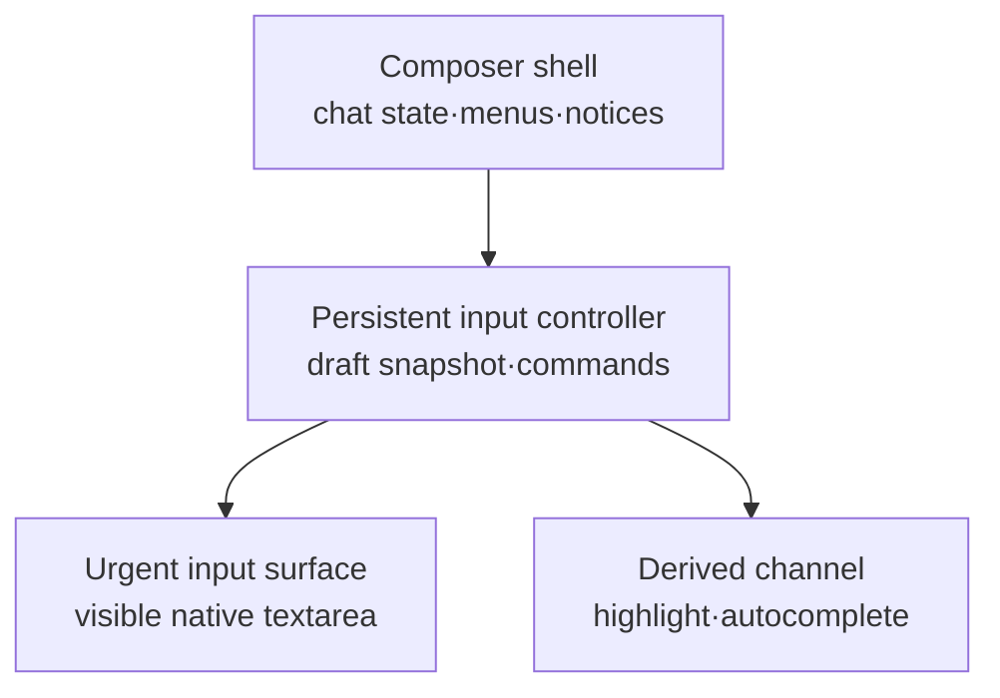

# Plan — 0145-composer-input-architecture

> 기준 브랜치: `main` (`1cf4ad38ffc32271f34b5260036468cc669232e4`).
> 별도 원격 작업 브랜치의 미병합 변경은 전제로 삼지 않는다.

## 메타

| 항목 | 값 |
|---|---|
| slug | `0145-composer-input-architecture` |
| 작성자 | Codex (사용자 직접 요청, 수석 엔지니어 관점 검토) |
| 일자 | 2026-07-23 |
| 매핑 | PR (본 브랜치) |
| 상태 | READY |

## 사용자 의도 / 요구 출처 (Intent & Provenance)

| 구분 | 내용 | 출처 |
|---|---|---|
| 명시 요구 | 입력 병목을 구조적으로 해소하는 최상의 아키텍처와 Composer 재구성안의 장단점·이득·리스크를 제시하고, 이를 구현자가 바로 집행할 수 있는 핸드오프 설계문서와 PR로 만든다. handoff 번호는 `0145`, PR base는 `main`으로 한다. | **라이브 세션 요청**: “구조적 관점에서 입력 병목을 해소하는 최상의 아키텍처…”, “제안대로 핸드오프 설계문서를 만들어서 pr 만들어줘”, “Main에 145로 만들어라” |
| 명시 피드백 | `/` 스킬 및 `@` 참조 하이라이트가 글자 입력마다 깜빡이지 않아야 하며, 한글 IME 입력 중에도 공백·줄바꿈까지 사라져 있지 않아야 한다. 승인된 메시지를 보낸 뒤 입력창이 비워져야 한다. | **구현 후 사용자 피드백**: “글자를 작성할때마다 깜빡이는 플리커”, “글자 작성시 하이라이트 효과가 사라졌다가 공백, 줄바꿈의 상황에서만…”, “보내기버튼 클릭… 입력창에서 메시지가 사라지지 않음” |
| 명시 결정 | 실제 Electron dev 환경에서 체감 개선을 확인했으므로 본 PR은 진행하고, production 정량 성능 측정은 추후 수행한다. 미측정 수치를 통과로 간주하지 않고 비차단 후속으로 보존한다. | **검증 중 사용자 결정**: “체감 개선으로 넘어가겠다 추후 성능 측정 진행하겠다” |
| 추론 의도 | 한글 IME·선언적 상태·기존 전송/복원 의미론은 보존하되, 키 입력의 긴급 경로에서 토큰화·파일 IPC·자동완성 필터·채팅 스트림 갱신에 따른 상위 셸 작업을 제거한다. | 현재 구현이 제어형 textarea와 IME 가드를 사용하고 있음 (`Composer.tsx:368-430`, `HighlightedTextarea.tsx:186-199`) |
| 추론 의도 | 비제어 textarea, `contentEditable`, 별도 `liveStore`, Markdown Worker는 측정 없이 선행 도입하지 않는다. 먼저 되돌리기 쉬운 컴포넌트 경계와 배치 계약을 확립한다. | React 제어형 textarea 계약 및 현재 chat store 결정 (`docs/arch/frontend/state.md:10-18`) |

## Context (왜)

현재 `Composer`는 채팅 상태 구독·메뉴·첨부·초안·캐럿·자동완성·전송을 한 컴포넌트에서 조율한다. 키 입력마다 `draft`와 `caret`이 갱신되며 `Composer` 전체 함수가 다시 실행되고, 가시 텍스트는 실제 textarea가 아니라 전체 초안을 토큰화한 mirror가 그린다. 스트리밍 중에는 rAF 코얼레서가 델타를 시간상 모으기만 할 뿐 각 이벤트를 다시 순회하여 store update를 반복한다.

목표는 “일반 타이핑 시 React 렌더 0회”가 아니다. 제어형 입력의 동기 commit 1회는 유지하되 그 commit의 작업량을 네이티브 textarea의 값·선택영역·조합 상태로 한정한다. 하이라이트, 자동완성, 파일 조회, 채팅 스트림은 입력 revision을 소비하는 별도 채널로 격리한다.

## 자료조사 (Research)

| 발견 / 제약 | 레퍼런스 |
|---|---|
| `Composer`가 20개 안팎의 채팅 selector와 UI 상태를 소유하면서 `draft`, `caret`, 시드/복원, 자동완성까지 함께 처리한다. 초안 변경은 셸 전체 재실행을 유발한다. | 코드 `app/src/renderer/src/features/chat/components/Composer.tsx:73-77,92-148,162-205` |
| 계획 승인 UI가 입력 패널을 조건부로 대체한다. 입력 상태를 추출할 때 컨트롤러까지 이 분기 안으로 옮기면 초안·시드/복원 소비 가드가 unmount 시 사라지는 회귀가 생긴다. | 코드 `app/src/renderer/src/features/chat/components/Composer.tsx:526-564` |
| 현재 textarea는 `text-transparent`이고 mirror가 실제 문자를 그린다. 따라서 mirror에 단순히 `useDeferredValue(draft)`를 적용하면 하이라이트뿐 아니라 사용자가 방금 친 문자도 늦게 보인다. | 코드 `app/src/renderer/src/features/chat/components/composer/HighlightedTextarea.tsx:93-95,142-198` |
| 하이라이트는 매 draft revision에 전체 문자열 정규식 스캔·정렬을 수행한다. | 코드 `app/src/renderer/src/features/chat/components/composer/HighlightedTextarea.tsx:25-64,142-146` |
| 스킬 자동완성은 초안 prefix 추출과 전체 skills 필터를, 파일 자동완성은 토큰 파싱·IPC 디렉터리 조회·경로 집합 갱신을 입력 상태에 직접 결합한다. 파일 응답 취소 가드는 있으나 결과에 draft revision 계약은 없다. | 코드 `app/src/renderer/src/features/chat/hooks/useSkillAutocomplete.ts:21-57`, `app/src/renderer/src/features/chat/hooks/useFileAutocomplete.ts:45-159` |
| 코얼레서는 rAF까지 델타를 보류하지만 flush 때 이벤트마다 `emit`한다. 각 delta는 별도 `patchLive`/`setState`를 일으켜 selector 팬아웃을 반복한다. React 배칭은 commit 수를 줄여도 store selector 실행과 문자열 누적 비용을 없애지 않는다. | 코드 `app/src/renderer/src/features/chat/lib/eventCoalescer.ts:35-60`, `app/src/renderer/src/features/chat/store/chatStore.ts:156-164,349-356,476-482` |
| 스트리밍 Markdown은 stable block을 캐시하지만 tail은 source 변경마다 메인 스레드에서 동기 파싱한다. Composer 경로를 분리해도 프로파일에서 transcript가 지배적이면 별도 후속이 필요하다. | 코드 `app/src/renderer/src/features/chat/components/markdown/StreamingMarkdown.tsx:19-35` |
| chat의 committed state와 transient live buffer는 같은 store의 세션 엔트리에 두기로 한 기존 결정이 있다. 먼저 실제 delta batch를 만들지 않고 store를 분리하면 일관성·순서 비용을 떠안는 과잉 설계가 된다. | 문서 `docs/arch/frontend/state.md:10-18,30-42` |
| 제어형 `<textarea>`는 `value`와 동기 `onChange` 갱신이 필요하며, `useDeferredValue`는 입력 자체가 아니라 느린 파생 UI를 뒤처지게 하는 용도다. | React 공식 문서 [Textarea](https://react.dev/reference/react-dom/components/textarea), [useDeferredValue](https://react.dev/reference/react/useDeferredValue) |

## 인수 기준 (Acceptance Criteria)

1. **Persistent input controller와 상태 수명**
   - `Composer`의 저빈도 셸과 입력 컨트롤러를 분리하고, draft 변경으로 셸의 채팅 selector·상태 팝오버·모델/모드 계산이 재실행되지 않게 한다.
   - 컨트롤러는 `{ revision, text, selectionStart, selectionEnd, composing }`를 소유하고 계획 승인 UI가 입력 패널을 대체하는 동안에도 mount를 유지한다.
   - `initialDraft`와 `restoredDraft.id`는 각각 한 번만 소비되고, 계획 승인 표시/해제·스트리밍·telemetry 재렌더 뒤에도 사용자가 편집한 초안과 선택영역이 보존된다.

2. **긴급 입력 경로와 파생 채널 분리**
   - 가시 텍스트의 SSOT는 제어형 네이티브 textarea다. 각 `onChange`의 동기 경로에는 값·선택·IME 상태·전송 가능 여부 외에 전체 draft 토큰화, skills 전체 필터, 파일 IPC, chat store write가 없어야 한다.
   - 하이라이트와 자동완성 결과는 `revision`을 동반한다. 자동완성은 현재 revision과 일치하는 결과만 표시/적용하고 적용 시 현재 token range를 재검증한다. 장식은 native glyph와 분리된 배경만 그리므로 마지막 완료 결과를 유지하다 최신 deferred 결과로 원자 교체한다. 조합 중에는 파생 요청과 Enter 전송을 보류하고 `compositionend` 후 최신 revision을 발행한다.
   - 기존 스킬/파일 치환, 따옴표 경로, 방향키·Tab·Escape, paste/undo/redo, scroll, placeholder, 스크린리더 label 동작을 보존한다. 하이라이트가 늦거나 실패해도 원문과 caret은 즉시 보인다.

3. **스트리밍 경합 제한과 검증 근거**
   - delta flush는 같은 scheduler window의 델타를 세션·종류별로 결합하고, 비-delta 이벤트 앞의 flush 순서를 보존하면서 store 알림을 **flush당 최대 1회**로 제한한다. text/reasoning의 원래 연결 결과와 멀티세션 라우팅은 바뀌지 않는다.
   - 순수 테스트로 revision 무효화, IME 전이, 시드/복원 1회성, autocomplete 적용 가드, delta batch의 혼합 type·멀티세션·비-delta barrier·dispose를 검증한다.
   - 동일 장비의 production build에서 main과 변경본을 **(a) idle 10k 문자 draft + 한글 IME, (b) 10k 문자 draft + 지속 스트리밍 + 한글 IME**로 분리 비교한다. 각 시나리오의 input event→next paint p95가 16.7ms 이하거나 main 대비 30% 이상 개선되고, draft 입력 때문에 `Composer` 셸 commit이 발생하지 않으며, 50ms 이상 long task의 회귀가 없어야 한다. 수치와 trace 조건을 구현 보고에 남긴다.

> **사용자 승인에 따른 검증 범위 변경(2026-07-23):** Electron dev 실기에서 체감 개선을 확인해 본 handoff의 병합을 승인했다. 위 production 수치·Profiler 조건은 삭제하거나 충족으로 간주하지 않고 **비차단 후속 D1/D2**로 이연한다. 정량 개선율은 측정 전까지 주장하지 않는다.

## 범위 / 비범위

- **범위**: 입력 상태를 항상 mount되는 controller로 추출; visible controlled textarea surface; revision 기반 deferred decoration/autocomplete 채널; 시드·복원·선택·IME 명령 계약; 실제 delta batch/store transaction; 관련 순수 테스트; frontend state/rendering 문서 동기화; production profile 비교.
- **비범위**: uncontrolled textarea 전환, `contentEditable`/CSS Custom Highlight API, broad `ComposerContext`, chat `liveStore` 분리, 33–50ms 고정 throttle, 스트리밍 Markdown plain-tail 정책, Markdown Web Worker, 신규 패키지 도입.
- **후속 조건**: AC3를 통과하지 못하고 trace에서 `StreamingMarkdown` tail parse가 지배적인 경우에만 tail 표시 정책 또는 Worker를 별도 handoff로 연다. 이 handoff에서 범위를 암묵적으로 확대하지 않는다.

## 의존 기술 / 전제 (Dependencies & Assumptions)

- React 19의 controlled textarea, `useDeferredValue`, `memo`, `useLayoutEffect`/ref를 사용한다. `startTransition`으로 textarea의 권위값을 늦추지 않는다.
- Zustand 구조는 유지한다. 바꾸는 것은 live state의 소유 store가 아니라 coalescer→store 경계의 delta batch 계약이다.
- Electron 내장 Chromium의 `field-sizing: content`를 입력 높이의 1순위로 사용한다. 지원/레이아웃 회귀가 확인되면 값 복제 없는 imperative height 측정으로 폴백한다.
- 파일 목록 IPC는 기존 `fileApi.list`와 cwd/dir cache를 재사용한다. 네트워크·DB·IPC 채널 계약 변경은 없다.
- **신규 의존성**: 없음.

## 설계

### 목표 컴포넌트 경계



- `Composer`는 상태/사용량/승인/메뉴를 조율하고 `ComposerInputController`를 **항상** 렌더한다. `pendingPlanReview`일 때 컨트롤러 인스턴스는 유지하되 input panel만 `active=false`로 숨긴다.
- `ComposerInputController`는 draft snapshot, attachments, 시드/복원 소비 id, submit/clear/insert/replace/focus 명령을 소유한다. 초안 변경이 부모로 올라가지 않도록 local state와 안정된 action만 사용한다.
- `ComposerInputSurface`는 입력 전용 leaf다. 동기 입력 경로는 `text`, selection, `composing`, placeholder/send/cancel의 최소 boolean만 처리한다. 현재 경계는 타이핑이 셸로 올라가지 않게 하는 소유권 분리이며 `memo`를 계약으로 요구하지 않는다. 부모 주도 commit이 프로파일에서 유의미하게 확인될 때만 controls/action identity 안정화와 함께 `memo`를 후속 적용한다.
- `ComposerDecorationLayer`와 autocomplete view는 snapshot을 `useDeferredValue`로 소비한다. 파생 계산은 컨트롤러의 urgent render와 분리한다. autocomplete는 current revision만 열고, background-only decoration은 마지막 완료 결과를 유지하다 최신 결과로 교체한다.
- broad Context는 만들지 않는다. 입력 subtree 내부는 명시적 props와 안정된 command object/imperative handle을 사용한다. 세 번째 독립 소비자가 생길 때만 selector 가능한 외부 store/context를 재검토한다.

### DraftSnapshot과 명령 계약

```ts
interface DraftSnapshot {
  revision: number
  text: string
  selectionStart: number
  selectionEnd: number
  composing: boolean
}

interface ComposerInputCommands {
  replaceRange(expectedRevision: number, start: number, end: number, text: string): boolean
  seedOnce(seedKey: string, text: string): void
  restoreOnce(restoreId: number, text: string): void
  clearAfterAcceptedSubmit(expectedRevision: number): void
  focus(selection?: { start: number; end: number }): void
}
```

- 모든 텍스트 변경은 revision을 단조 증가시킨다. selection-only 변경은 text revision을 유지하되 snapshot selection은 즉시 갱신한다.
- 자동완성 결과는 `{ revision, tokenStart, tokenEnd, kind, items }`를 가진다. Enter/Tab 적용 시 revision과 현재 token을 재검증한다. 실패하면 no-op하고 최신 파생을 기다린다.
- submit은 text와 attachments snapshot을 캡처하고 `send`가 수락한 같은 revision일 때만 clear한다. 비동기 attachment view 생성 중 사용자가 더 입력한 내용을 지우지 않는다.
- 시드/복원은 controller 수명 동안 key/id별 1회다. plan review 표시 전후에 controller가 유지되므로 ref replay가 없다.

### DOM과 표시 전략

- textarea 자체가 `text-ink`, 실제 placeholder, 실제 caret을 그린다. 현재의 `text-transparent`/`placeholder:text-transparent` 계약을 제거한다.
- decoration layer는 `aria-hidden`, `pointer-events-none`이다. 일반 글자와 chip 글자는 모두 transparent이고 chip 구간의 배경만 overlay한다. 따라서 deferred 결과가 늦거나 IME 조합 중이어도 마지막 완료 배경을 유지해 ghost glyph 없이 최신 결과로 교체할 수 있다. IME 후보·glyph는 native textarea가 소유하며 decoration은 숨기지 않는다.
- textarea와 decoration은 typography·padding·line-height·word-break·scroll offset을 공유한다. scroll은 ref로 imperative 동기화하되 React state를 갱신하지 않는다.
- 높이는 textarea의 `field-sizing: content`, `min-height`, `max-height`, overflow로 결정해 “가시 문자+레이아웃을 mirror가 소유”하는 구조를 제거한다.
- overlay alignment가 실기에서 안정적이지 않으면 원문 가시성을 우선하고 chip을 배경/밑줄 장식으로 축소한다. transparent textarea로 회귀하지 않는다.

### 파생 파이프라인

- 전체 draft 하이라이트 tokenization은 deferred snapshot에서만 실행한다. `knownSkillNames`와 검증된 파일 경로 set은 stable identity를 유지한다.
- 자동완성 trigger 탐지는 caret 왼쪽의 현재 토큰만 bounded scan하는 저비용 urgent parser로 분리한다. skills filter와 파일 listing/result shaping은 derived channel에서 처리한다.
- 파일 요청은 `{ cwd, dirPath, requestRevision }`를 캡처한다. cwd/dir cache는 유지하되 완료 시 현재 request key와 revision이 다르면 UI 결과를 폐기한다. cache 자체는 같은 cwd에서 재사용 가능하다.
- IME `compositionstart`에서 `composing=true`; 조합 중 keydown Enter는 전송/선택에 쓰지 않는다. `compositionend`의 최종 DOM value를 새 revision으로 발행한 뒤에만 파생을 재개한다.

### Delta batch 계약

- `eventCoalescer`는 scheduler window의 delta를 배열로 넘기고 non-delta가 들어오면 먼저 batch를 동기 flush한 뒤 해당 이벤트를 emit한다.
- `chatStore`의 `receiveDeltaBatch`는 event 순서대로 각 session의 text/reasoning 조각을 연결하고, touched sessions를 한 번 복제하여 단일 `setState` transaction으로 적용한다. 첫 활동 이벤트의 `BEGIN_TURN` 의미도 같은 transaction에서 보존한다.
- 같은 session의 text/reasoning은 별도 필드라 프레임 안에서 각각 연결할 수 있지만, non-delta barrier를 넘어 재정렬하지 않는다. 알 수 없는 session의 늦은 delta 폐기와 새 세션 fallback 규칙은 기존 `receive`와 동일해야 한다.
- 이 단계가 선행된 뒤에도 selector 비용이 profile에서 지배적일 때만 `liveStore` 분리를 재검토한다.

### 대안 평가

| 대안 | 이득 | 비용/리스크 | 결정 |
|---|---|---|---|
| 제어형 native foreground + revisioned deferred decoration | IME·테스트·선언성을 보존하면서 사용자가 보는 문자를 긴급 경로에 둔다. 단계적 도입과 rollback이 쉽다. | overlay 정렬과 revision race를 명시적으로 다뤄야 하고 urgent commit 1회는 남는다. | **채택** |
| uncontrolled textarea + imperative mirror | 일반 타이핑의 React commit을 없앨 수 있다. | seed/restore/자동완성/undo/selection의 이중 진실원과 테스트 난도가 크게 증가한다. | AC3 미달 시에만 후속 검토 |
| `contentEditable` + Highlight API | 단일 rich text surface 가능성이 있다. | 한글 IME, caret, paste, undo, 접근성 회귀 범위가 크다. | 비채택 |
| `liveStore` 분리 / Markdown Worker | 스트림·파싱 팬아웃을 더 강하게 격리한다. | ordering, 직렬화, 렌더러 구현 비용이 크며 현재 coalescer가 실제 batch조차 하지 않는다. | 측정 후 별도 handoff |

## 파생 UX / 엣지케이스 (Derived UX & Edge Cases)

- 계획 승인 카드가 입력을 대체해도 초안·첨부·복원 소비 상태를 보존한다. 다시 입력 패널로 돌아올 때 원래 selection을 복원하되 사용자가 다른 요소를 사용 중이면 강제 focus하지 않는다.
- 새 채팅→세션 승격, active session 전환, cwd 변경에서는 기존 Composer mount/key 수명을 보존한다. 다른 세션의 파일 cache·restore id가 현재 초안에 섞이지 않아야 한다.
- paste, drop, programmatic skill/file insert, undo/redo, 전체선택 치환은 모두 하나의 snapshot update를 거친다. 비동기 submit 완료는 더 최신 revision을 clear하지 않는다.
- 조합 중 autocomplete는 숨기고 한글 후보창의 Enter를 가로채지 않는다. 조합 종료 후 최신 문자열로만 다시 연다.
- decoration 오류/빈 결과는 “원문만 표시”로 강등한다. 정상적인 deferred 갱신 중에는 마지막 완료 배경을 유지하며, 사용자는 항상 native 텍스트와 caret을 보고 입력·전송할 수 있다.
- light/dark/system 테마, 200% 확대, 긴 unbroken path, trailing newline, max-height scroll에서 textarea와 decoration 정렬을 확인한다.
- screen reader는 textarea 하나만 읽고 decoration은 접근성 트리에서 제외한다. autocomplete의 기존 키보드/ARIA 계약은 보존한다.

## 리스크 / 트레이드오프 (Risks & Trade-offs)

| 리스크 / 트레이드오프 | 완화책 / 결정 |
|---|---|
| deferred overlay 배경이 current text를 한 프레임 늦게 따라갈 수 있음 | overlay glyph를 전부 transparent로 유지해 ghost text를 원천 차단하고 마지막 완료 배경을 원자 교체한다. revision마다 hide/show하지 않아 플리커를 피하며 확대/스크롤/긴 토큰 시각 실기를 추가한다. |
| 자동완성 응답과 현재 selection 사이 race | 결과와 적용 명령 모두 expected revision/token range를 검증하고 실패 시 no-op. |
| controller 추출 중 시드·복원·plan review 수명 회귀 | controller를 조건부 panel 밖에 항상 mount하고 1회성 순수 테스트를 먼저 추가. |
| 비동기 attachment view 생성 중 최신 draft를 지울 수 있음 | submit 캡처 revision과 현재 revision이 같을 때만 clear. |
| delta batch가 멀티세션 라우팅 또는 event barrier를 바꿀 수 있음 | non-delta 전 동기 flush, 순서/멀티세션/unknown session/첫 BEGIN_TURN 회귀 테스트. |
| 파생 작업은 여전히 메인 스레드이므로 긴 tail Markdown과 경합 가능 | AC3 production trace로 분리 측정; tail parse 지배 시 별도 handoff. |
| chip 배경이 빠른 입력 중 최신 token보다 잠깐 늦게 따라옴 | 입력 지연과 키별 플리커 방지를 우선한다. glyph/caret은 항상 native 최신값이고 deferred 완료 시 배경만 교체된다. |

- 되돌리기 어려운 결정: 없음. controller/surface/derived 채널과 batch 경계는 파일 단위로 rollback 가능하다.
- **단독 결정 금지 항목(Open Question)**: 없음. 신규 의존성·UX throttle·Worker는 이 handoff에서 금지하고 필요 시 사용자 승인 대상 후속으로 분리한다.

## 영향 받는 파일

- `app/src/renderer/src/features/chat/components/Composer.tsx`
- `app/src/renderer/src/features/chat/components/composer/ComposerInputController.tsx` (신규 예상)
- `app/src/renderer/src/features/chat/components/composer/ComposerInputSurface.tsx` (신규 예상)
- `app/src/renderer/src/features/chat/components/composer/ComposerDecorationLayer.tsx` (신규 예상; 기존 `HighlightedTextarea.tsx` 대체 또는 축소)
- `app/src/renderer/src/features/chat/hooks/useSkillAutocomplete.ts`
- `app/src/renderer/src/features/chat/hooks/useFileAutocomplete.ts`
- `app/src/renderer/src/features/chat/lib/eventCoalescer.ts`
- `app/src/renderer/src/features/chat/lib/eventCoalescer.test.ts`
- `app/src/renderer/src/features/chat/store/chatStore.ts`
- `app/src/renderer/src/features/chat/store/chatStore.test.ts`
- `docs/arch/frontend/state.md`
- `docs/arch/frontend/rendering.md`

## 참고 문서

- `docs/arch/frontend/state.md §1`
- `docs/arch/frontend/rendering.md §1.2`
- React 공식 문서 [Textarea](https://react.dev/reference/react-dom/components/textarea)
- React 공식 문서 [useDeferredValue](https://react.dev/reference/react/useDeferredValue)
- IPC 변경 없음 — `docs/IPC_CONTRACT.md` 변경 불필요.

## 게이트

- 통과 필요: `cd app && npm run lint && npm run typecheck && npm test`.
- 신규 테스트 요구: draft snapshot/revision 순수 변환기; seed/restore/submit-clear 수명; autocomplete expected-revision 적용; IME state transition; delta batch의 연결 순서·혼합 type·멀티세션·barrier·dispose.
- 수동/프로파일 게이트: production build, 10k 문자, 지속 delta, 한글 IME, 계획 승인 표시 왕복, 200% 확대 및 max-height scroll. main/변경본 동일 trace 조건과 AC3 수치를 구현 보고에 기록한다.

## 설계 self-review 체크리스트 (READY 전)

- [x] 사용자 의도 — 명시 요구를 라이브 세션 요청으로 인용했고, 추론은 추론으로 표기했다.
- [x] 자료조사 — 모든 발견에 코드·내부 문서·공식 웹 URL 레퍼런스를 붙였다.
- [x] 인수 기준 — 3개 검증 그룹으로 번호를 매기고 정합성·성능·회귀 조건을 명시했다.
- [x] 의존 기술 — React/Zustand/IPC 전제와 신규 의존성 없음, 금지 범위를 식별했다.
- [x] 파생 UX — plan review, 멀티세션, IME, selection, a11y, 테마/확대/scroll을 펼쳤다.
- [x] 리스크 — overlay/race/batch/비동기 submit/Markdown 경합과 완화책을 기록했고 Open Question이 없음을 확인했다.

---

> **[구현자 기입]** 이하는 구현 턴에서 채운다 (Codex=기능 / Claude=비기능). 설계자는 위쪽을 쓰고, 구현자는 이 블록만 추가한다.

## [구현자 기입] 설계 리뷰 (비판적)

- 동의 / 그대로 진행: native textarea를 foreground 권위 표면으로 두고, persistent controller의 local `DraftSnapshot`과 revision-guarded deferred 파생 채널로 분리하는 end state는 타당하다. delta는 React 자동 배칭에 기대지 않고 store transaction 자체를 1회로 만들어야 한다는 AC3도 그대로 적용했다.
- 이견 / 우려: 사전 비판처럼 controller 추출과 delta batch는 신고 증상의 직접 원인인 visible mirror 제거와 서로 다른 효과를 낸다. 사용자가 최종 구조 전체 구현을 명시 승인했으므로 범위는 유지하되, surface/controller/batch를 독립 파일·순수 테스트 경계로 나눴다. 저장소의 비기능 작업 기본 라우팅은 Claude지만, 이번 구현은 사용자의 “구현까지 진행”이라는 Codex 직접 지시를 명시적 예외 근거로 삼았다. production input-to-paint trace는 Electron 바이너리/GUI를 사용할 수 없는 실행 환경에서 수치를 꾸며내지 않고 검증 대기로 남긴다.

## [구현자 기입] 놓친 잠재 문제 + 대응 (선조치 후보고)

| # | 놓친 문제 | 대응 | 근거 |
|---|---|---|---|
| 1 | attachment view 생성 중 text뿐 아니라 attachments도 바뀔 수 있어 revision만 검사하면 부분 clear가 된다. | `useAttachments.resetIfUnchanged(expectedArray)`를 추가하고 text revision과 attachment identity가 모두 같은 경우에만 둘을 함께 clear한다. | `ComposerInputController.submit`, `useAttachments` |
| 2 | native glyph 위에 색상 glyph를 다시 overlay하면 반투명 배경에서 글자가 겹쳐 보일 수 있다. | decoration은 chip 배경만 그리고 glyph는 항상 native textarea가 그리게 했다. deferred 갱신·IME 조합 중에도 마지막 배경을 유지한다. | `ComposerDecorationLayer.tsx` |
| 3 | `field-sizing` 폴백으로 value mirror를 되살리면 같은 병목이 복귀한다. | Electron 39 Chromium의 `field-sizing: content`를 사용하고, 이 변경에는 value-copy 폴백을 추가하지 않았다. | `ComposerInputSurface.tsx` |
| 4 | stale decoration을 revision마다 숨기는 정책이 모든 키에서 chip 배경을 `opacity-0 → 100`으로 바꿔 플리커를 만든다. | native glyph와 분리된 마지막 완료 배경을 계속 표시하고 최신 deferred 결과로 교체한다. | 사용자 피드백, `ComposerDecorationLayer.tsx` |
| 5 | attachment reset에서 ref와 React state에 서로 다른 빈 배열을 할당해 첫 전송 뒤 identity가 갈라지고, 다음 submit의 `resetIfUnchanged`가 false가 되어 draft clear까지 막는다. | 모든 attachment 변경을 `commitAttachments` 한 경로로 모아 ref/state가 같은 배열 identity를 공유하게 했다. | 사용자 피드백, `useAttachments.ts` |
| 6 | 한글 IME가 공백·줄바꿈까지 `composing=true`를 유지하는 동안 decoration 전체를 숨겨 하이라이트가 장시간 사라진다. | 조합 중에도 background-only decoration을 유지한다. autocomplete 표시·적용과 Enter 전송만 기존 composition guard를 유지한다. | 사용자 피드백, `ComposerDecorationLayer.tsx`, `ComposerInputController.tsx` |

## [구현자 기입] 구현 체크리스트

- [x] Persistent controller와 native urgent surface 추출
- [x] revisioned decoration/autocomplete 및 IME/selection 계약 구현
- [x] delta batch 단일 store transaction 구현
- [x] 테스트·아키텍처 문서 동기화
- [x] 동일 산식의 main/PR trace 비교를 위한 무의존성 분석기와 단위 테스트 추가
- [ ] production trace는 GUI 가능한 검증 환경에서 비차단 후속 수행 대기

## [구현자 기입] 구현 보고

| 항목 | 내용 |
|---|---|
| 변경 파일 | `Composer.tsx`, 신규 `ComposerInputController/Surface/DecorationLayer`·snapshot/tokenizer와 테스트, `useAttachments.ts`·`attachmentState*`, `eventCoalescer*`, `chatStore*`, frontend state/rendering 문서, `scripts/analyze-composer-input-trace.mjs`와 단위 테스트 |
| 실행 명령 | `npm run lint`; `npm run typecheck`; 대상 Vitest 6파일; `npm test`(환경 재실행 포함); `node --test scripts/analyze-composer-input-trace.test.mjs` |
| 게이트 결과 | IME 하이라이트 회귀 수정 후 lint 0 error(기존 TanStack compiler warning 1), typecheck 3종 PASS, 신규/영향 테스트 54/54 PASS, scripts 28/28 PASS(신규 trace analyzer 3/3). 전체 Vitest는 146 suites 중 144 PASS·1159/1160 tests PASS; 잔여 2건은 코드와 무관한 실행환경 제약(Electron binary 미설치 1 suite, read-only `/root`를 쓰는 attachment temp test 1건). Production build preflight도 read-only `/root/.electron-gyp`에서 차단됐다. |
| 블로커 / 역질문 | 구현 블로커 없음. 검증 환경에는 Electron payload·Chromium·Xvfb·`DISPLAY`/Wayland가 없어 production build의 idle/streaming+10k+한글 IME input-to-paint trace를 캡처할 수 없다. 아래 실행 계약으로 GUI 가능한 동일 장비에서 main/PR을 측정해야 한다. |
| 대상 커밋 | `4f59769` (AC3 분석기·계약), `42a108e` (IME 하이라이트 유지), `322fac1` (제출/플리커 수정), `ad9f61c` (기반 구현) |

### [구현자 기입] AC3 재현·측정 계약

코드 리딩으로 성능 PASS를 추정하지 않는다. Chromium DevTools Performance trace의 renderer main thread에서 `EventDispatch(type=input)` 시작부터 같은 thread의 다음 `Paint` 시작까지를 input-to-next-paint로 계산한다. `RunTask >= 50ms`도 같은 입력 표본 구간에서 집계한다. 분석기는 신규 의존성 없이 `npm run analyze:composer-input-trace -- <trace.json> --label <name>`으로 실행한다.

1. 동일 장비·OS·창 크기·배율·provider/model·세션 transcript에서 `git merge-base origin/main HEAD`와 PR HEAD를 각각 production build한다. 각 build를 `./node_modules/.bin/electron --remote-debugging-port=9223 .`로 실행하고 DevTools Performance의 `devtools.timeline` trace를 저장한다.
2. build마다 `main-idle`, `main-streaming`, `pr-idle`, `pr-streaming`을 별도 trace로 캡처한다. textarea에는 동일한 10k seed를 넣고 각 trace에서 최소 100개 실제 `input` event를 기록한다. idle은 inflight가 없는 상태, streaming은 동일 provider 시나리오의 delta가 계속 도착하는 상태다. 한글 IME 조합·공백·줄바꿈을 표본에 포함한다. dev-only `text_streaming` mock trace는 원인 진단 보조자료일 뿐 production AC3 수치를 대신하지 않는다.
3. 네 trace를 같은 분석기로 산출하고 p95/50ms long task를 위 인수 기준과 비교한다. React DevTools의 별도 dev trace로 draft 입력이 `Composer` 셸 commit을 만들지 않는지 확인하며, 실제 브라우저에서 IME 중복·조기 commit, `/`·`@` 배경 지속, 전송 후 clear, caret·scroll·200% 확대를 실기한다.

| trace | 표본 | p50 | p95 | 50ms+ task | 판정 |
|---|---:|---:|---:|---:|---|
| main-idle | GUI 측정 대기 | — | — | — | 미실행 |
| pr-idle | GUI 측정 대기 | — | — | — | 미실행 |
| main-streaming | GUI 측정 대기 | — | — | — | 미실행 |
| pr-streaming | GUI 측정 대기 | — | — | — | 미실행 |

2026-07-23 현재 검증 컨테이너 preflight: `node_modules/.bin/electron` shim은 있으나 `node_modules/electron/path.txt` payload가 없어 `electron --version`부터 실패한다. Chromium/Chrome/Xvfb 실행 파일과 `DISPLAY`/`WAYLAND_DISPLAY`도 없다. 따라서 이 환경에서 수치를 생성하거나 실제 IME를 자동 대체하지 않는다.

---

## [검증자 기입] 파생 이슈 (Derived Issues)

| # | 이슈 | 출처 | 대응 방향 | 상태 |
|---|---|---|---|---|
| D1 | AC3 main/PR production input-to-paint 수치와 50ms+ long task가 없다. | `verify.md` r1 AC3 + 사용자 승인 | GUI 가능한 동일 장비에서 idle/streaming trace 4종을 최소 100 input 표본으로 캡처하고 제공된 분석기로 비교한다. | DEFERRED — 사용자 승인 비차단 후속 |
| D2 | React Profiler의 셸 commit 증거와 IME/caret/scroll/paste/undo/redo/200% 확대 전체 실기가 없다. | `verify.md` r1 AC2·AC3 + 사용자 승인 | dev Profiler와 실제 Electron IME 수동 매트릭스를 실행해 결과를 후속 기록한다. | DEFERRED — 사용자 승인 비차단 후속 |
