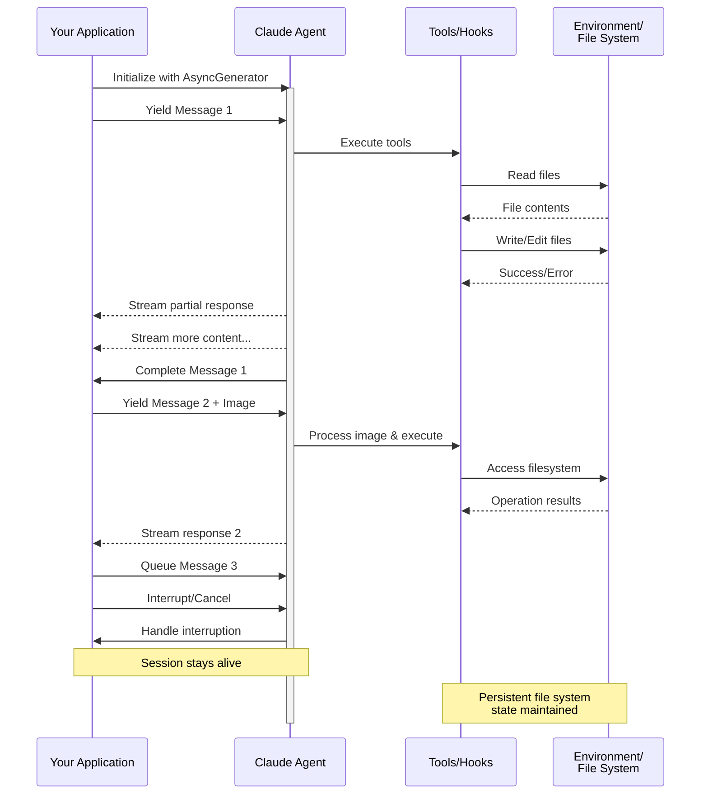

> ## Documentation Index
> Fetch the complete documentation index at: https://code.claude.com/docs/llms.txt
> Use this file to discover all available pages before exploring further.

# 스트리밍 입력

> Claude Agent SDK의 두 가지 입력 모드를 이해하고 각각을 언제 사용할지 알아보기

## 개요

Claude Agent SDK는 에이전트와 상호작용하기 위한 두 가지 서로 다른 입력 모드를 지원합니다:

* **스트리밍 입력 모드** (기본값 및 권장) - 지속적이고 대화형 세션
* **단일 메시지 입력** - 세션 상태를 사용하고 재개하는 일회성 쿼리

이 가이드는 각 모드의 차이점, 이점 및 사용 사례를 설명하여 애플리케이션에 적합한 접근 방식을 선택하는 데 도움을 줍니다.

## 스트리밍 입력 모드 (권장)

스트리밍 입력 모드는 Claude Agent SDK를 사용하는 **선호되는** 방식입니다. 에이전트의 기능에 대한 전체 액세스를 제공하고 풍부하고 대화형의 경험을 가능하게 합니다.

이를 통해 에이전트는 사용자 입력을 받아들이고, 중단을 처리하며, 권한 요청을 표시하고, 세션 관리를 처리하는 장기 실행 프로세스로 작동할 수 있습니다.

### 작동 방식



### 이점

<CardGroup cols={2}>
  <Card title="이미지 업로드" icon="image">
    시각적 분석 및 이해를 위해 메시지에 직접 이미지를 첨부합니다
  </Card>

  <Card title="대기 중인 메시지" icon="stack">
    순차적으로 처리되는 여러 메시지를 보내고 중단할 수 있습니다
  </Card>

  <Card title="도구 통합" icon="wrench">
    세션 중에 모든 도구 및 사용자 정의 MCP 서버에 대한 전체 액세스
  </Card>

  <Card title="Hooks 지원" icon="link">
    라이프사이클 hooks를 사용하여 다양한 지점에서 동작을 사용자 정의합니다
  </Card>

  <Card title="실시간 피드백" icon="lightning">
    최종 결과뿐만 아니라 생성되는 응답을 실시간으로 확인합니다
  </Card>

  <Card title="컨텍스트 지속성" icon="database">
    여러 턴에 걸쳐 자연스럽게 대화 컨텍스트를 유지합니다
  </Card>
</CardGroup>

### 구현 예제

<CodeGroup>
  ```typescript TypeScript theme={null}
  import { query, type SDKUserMessage } from "@anthropic-ai/claude-agent-sdk";
  import { readFile } from "fs/promises";

  async function* generateMessages(): AsyncGenerator<SDKUserMessage> {
    // First message
    yield {
      type: "user",
      message: {
        role: "user",
        content: "Analyze this codebase for security issues"
      },
      parent_tool_use_id: null
    };

    // Wait for conditions or user input
    await new Promise((resolve) => setTimeout(resolve, 2000));

    // Follow-up with image
    yield {
      type: "user",
      message: {
        role: "user",
        content: [
          {
            type: "text",
            text: "Review this architecture diagram"
          },
          {
            type: "image",
            source: {
              type: "base64",
              media_type: "image/png",
              data: await readFile("diagram.png", "base64")
            }
          }
        ]
      },
      parent_tool_use_id: null
    };
  }

  // Process streaming responses
  for await (const message of query({
    prompt: generateMessages(),
    options: {
      maxTurns: 10,
      allowedTools: ["Read", "Grep"]
    }
  })) {
    if (message.type === "result" && message.subtype === "success") {
      console.log(message.result);
    }
  }
  ```

  ```python Python theme={null}
  from claude_agent_sdk import (
      ClaudeSDKClient,
      ClaudeAgentOptions,
      AssistantMessage,
      TextBlock,
  )
  import asyncio
  import base64


  async def streaming_analysis():
      async def message_generator():
          # First message
          yield {
              "type": "user",
              "message": {
                  "role": "user",
                  "content": "Analyze this codebase for security issues",
              },
          }

          # Wait for conditions
          await asyncio.sleep(2)

          # Follow-up with image
          with open("diagram.png", "rb") as f:
              image_data = base64.b64encode(f.read()).decode()

          yield {
              "type": "user",
              "message": {
                  "role": "user",
                  "content": [
                      {"type": "text", "text": "Review this architecture diagram"},
                      {
                          "type": "image",
                          "source": {
                              "type": "base64",
                              "media_type": "image/png",
                              "data": image_data,
                          },
                      },
                  ],
              },
          }

      # Use ClaudeSDKClient for streaming input
      options = ClaudeAgentOptions(max_turns=10, allowed_tools=["Read", "Grep"])

      async with ClaudeSDKClient(options) as client:
          # Send streaming input
          await client.query(message_generator())

          # Process responses
          async for message in client.receive_response():
              if isinstance(message, AssistantMessage):
                  for block in message.content:
                      if isinstance(block, TextBlock):
                          print(block.text)


  asyncio.run(streaming_analysis())
  ```
</CodeGroup>

## 단일 메시지 입력

단일 메시지 입력은 더 간단하지만 더 제한적입니다.

### 단일 메시지 입력을 사용할 때

다음의 경우 단일 메시지 입력을 사용합니다:

* 일회성 응답이 필요한 경우
* 이미지 첨부, hooks 등이 필요하지 않은 경우
* lambda 함수와 같은 상태 비저장 환경에서 작동해야 하는 경우

### 제한 사항

<Warning>
  단일 메시지 입력 모드는 다음을 **지원하지 않습니다**:

  * 메시지의 직접 이미지 첨부
  * 동적 메시지 대기열
  * 실시간 중단
  * Hook 통합
  * 자연스러운 다중 턴 대화
</Warning>

### 구현 예제

<CodeGroup>
  ```typescript TypeScript theme={null}
  import { query } from "@anthropic-ai/claude-agent-sdk";

  // Simple one-shot query
  for await (const message of query({
    prompt: "Explain the authentication flow",
    options: {
      maxTurns: 1,
      allowedTools: ["Read", "Grep"]
    }
  })) {
    if (message.type === "result" && message.subtype === "success") {
      console.log(message.result);
    }
  }

  // Continue conversation with session management
  for await (const message of query({
    prompt: "Now explain the authorization process",
    options: {
      continue: true,
      maxTurns: 1
    }
  })) {
    if (message.type === "result" && message.subtype === "success") {
      console.log(message.result);
    }
  }
  ```

  ```python Python theme={null}
  from claude_agent_sdk import query, ClaudeAgentOptions, ResultMessage
  import asyncio


  async def single_message_example():
      # Simple one-shot query using query() function
      async for message in query(
          prompt="Explain the authentication flow",
          options=ClaudeAgentOptions(max_turns=1, allowed_tools=["Read", "Grep"]),
      ):
          if isinstance(message, ResultMessage):
              print(message.result)

      # Continue conversation with session management
      async for message in query(
          prompt="Now explain the authorization process",
          options=ClaudeAgentOptions(continue_conversation=True, max_turns=1),
      ):
          if isinstance(message, ResultMessage):
              print(message.result)


  asyncio.run(single_message_example())
  ```
</CodeGroup>
